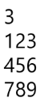

# 03.List2
# 2차원 배열
2차원 배열의 선언
- 1차원 List를 묶어놓은 List
- 2차원 이상의 다차원 List는 차원에 따라 index를 선언
- 2차원 List의 선언 : 세로길이(행의 개수), 가로길이(열의 개수)를 필요로함
- Python에서는 데이터 초기화를 통해 변수선언과 초기화가 가능함

```python
# 2행 4열의 2차원 List
arr = [[0, 1, 2, 3], [4, 5, 6, 7]]
```


```python
N = int(input())
arr = [list(map(int, input().split())) for _ in range(N)]
```



```python
N = int(input())
arr = [list(map(int, input())) for _ in range(N)]
```

배열 순회
- nxm 배열의 n*m개의 모든 원소를 빠짐없이 조사하는 방법

행 우선순회
```python
# i행의 좌표
# j행의 좌표
for i in range(n):
    for j in range(m):
    f(Array[i][j]) # 필요한 연산 수행
```
열 우선순회
```python
# i행의 좌표
# j행의 좌표
for j in range(m):
    for i in range(m):
    f(Array[i][j]) # 필요한 연산 수행
```
지그재그 우선순회
- 홀수행과 짝수행 다르게 순회
- 굳이 이렇게 하기보다 if else로 홀수행 짝수행 나눈 후 정순회 역순회 진행
```python
# i행의 좌표
# j행의 좌표
for i in range(n):
    for j in range(m):
    f(Array[i][j + (m - 1 - 2 * j) * (i % 2)]) 
    # 필요한 연산 수행
```
델타를 이용한 2차 배열 탐색
- 2차 배열의 한 좌표에서 4방향의 인접 배열 요소를 탐색하는 방법
```python
arr[0,...,N-1][0,...,N-1] # N*N 배열
di = [0, 1, 0, -1]
dj = [1, 0, -1, 0]
for i : # 0 -> N-1
    for j : # 0 -> N-1
        for k in range(4):
            # ni <- i +di[k]
            # nj <- j + dj[k]
            if 0 <= ni < N and 0 <= nj <N #유효한 인덱스면
                f(arr[ni][nj])
```
전치행렬
```python
# i : 행의 좌표, len(arr)
# j : 열의 좌표, len(arr[0])
arr = [[1,2,3], [4,5,6], [7,8,9]] # 3*3 행렬

for i in range(3):
    for j in range(3):
        if i < j:
            arr[i][j], arr[j][i] = arr[j][i], arr[i][j]
```

# 부분 집합 합
유한 개의 정수로 이루어진 집합이 있을 때, 이 잡합의 부분집합 중에서
그 집합의 원소를 모두 더한 값이 0이 되는 경우가 있는지를 알아내는 문제

ex) [-7, -3, -2, 5, 8] => [-3, -2, 5] : 부분집합이면서 합이 0!

- 완전검색 기법으로 부분집합 합 문제를 풀기 위해서는, 
  우선 집합의 모든 부분집합을 생성한 후에 각 부분집합의 합을 계산해야한다.
  
## 부분 집합의 수
- 집합의 원소가 n개일 떼, 공집합을 포함한 부분집합이 수는 2^n개 이다.
- {1, 2, 3, 4} => 16가지

각 원소가 부분집합에 포함되었는지를 loop 이용하여 확인하고 부분집합 생성
- for문을 티기고 티기고... 방법

### 비트 연산자
- & 비트 단위로 AND 연산을 한다.
- | 비트 단위로 OR 연산을 한다.
- << 피연산자의 비트 열을 왼쪽으로 이동시킨다.
- \>> 피연산자의 비트 열을 오른쪽으로 이동시킨다.

<< 연산자
- 1 << n : 2^n 즉, 원소가 n개일 경우의 모든 부분집합의 수를 의미하낟.

& 연산자
- i & (1 << j): i의 j번쨰 비트가 1인지 아닌지를 검사한다.

### 비트 연산이란?
3 | 5 -> 7 : 011 | 101 -> 111   
3 << 1 -> 6 : 011 -> 0110   
3 << 2 -> 12 : 011 -> 01100   

비트 연산자를 활용하여 간결하게 작성
```python
arr = [3, 6, 7, 1, 5, 4]

n = len(arr) # n : 원소의 개수

for i in range(1 << n): # 1 << n: 2^n 부분집합의 개수
    for j in range(n): # 원소의 수만큼 비트를 비교함
        if i & (1 << j): # i의 j번 비트가 1인 경우 : 그 자리에 있냐 !!!!!
            print(arr[j], end = ', ') # j번 원소 출력
    print()
print()
```
