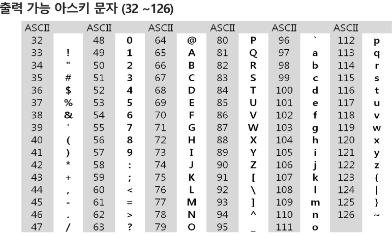
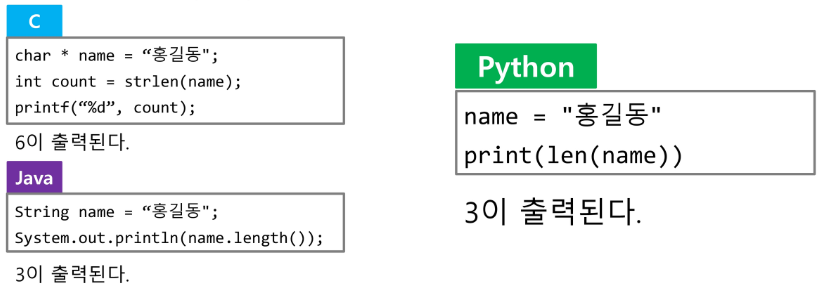

# 3. 문자열(string)

# 문자의 표현
- 각 문자에 대해서 대응되는 숫자를 정해 놓고 이것을 메모리에 저장하는 방법
- 영어는 대소문자 합쳐서 52이므로 6(64가지)비트면 모두 표현할 수 있다.
- 코드 체계 !
    - 000000 -> 'a'  000001 ->'b
    
## ASCII : 문자 인코딩 표준
7bit 인코딩으로 128문자를 표현
- 33개(출력 불가능한 제어 문자들) +95개 (출력 가능한 문자, 공백포함)
- 네트워크의 발전으로 인해 발생하는 혼동을 피아기 위함
  


## 확장 아스키
표준 문자 이외의 악센트 문자, 도형 문자, 특수 문자, 특수 기호 등 부가적인 문자를 128개 추가할 수 있게 하는 부호
- 8bit사용으로 추가적인 문자 표현 가능
- 확장 부호는 서로 다른 프로그램이나 컴퓨터 사이에 교환되지 않는다.
- 표준 아스키는 마이크로컴퓨터 하드웨어 및 소프트웨어 사이에서 세계적으로 통용되는 데 비해, 확장 아스키는 프로그램이나 컴퓨터 또는 프린터가 그것을 해독할 수 있도록 설계되어있어야만 올바로 해독될 수 있다.

### 유니코드
대부분의 컴퓨터는 문자를 읽고 쓰는데 ASCII형식 사용  
각 국가들은 자국의 문자를 표현하기 위하여 코드체계를 만들어서 사용
다국어 처리 표준

- character Set으로 분류
  - USC-2(Universal Character Set 2)
  - USC-4(Universal Character Set 4)
  - 유니코드를 저장하는 변수의 크기를 정의
  - 바이트 순서에 대해서 표준화하지 못했음
  - 유니코드의 적당한 외부 인코딩 필요
  
리틀엔디안 : 메모리 순서대로 정방향
빅 엔디안 : 정방향대로

네트워크로 진행 빅엔디안 일반적으로 진행 리틀엔디안 체계..?!
  
### 유니코드 인코딩(UTF : Unicode Transformation Format)
- UTF-8 (in web)
    - MIN : 8bit, MAX: 32bit (1 Byte * 4)
- UTF-16 (in windows, java)
    - MIN : 16bit, MAX: 32bit (2 Byte * 2)
- UTF-32 (in unix)
    - MIN : 32bit, MAX: 32bit (4 Byte * 1)
    
### Python 인코딩
- 2.x 버전 - ASCII : 첫줄에 utf 명시
- 3.x 버전 - 유니코드 UTF-8 -> 생략 가능
- 다른 인코딩 방식으로 처리 시 첫 줄에 작성하는 위 항목에 원하는 인코딩 방식 지정

# 문자열
java에서 String 클래스에 대한 메모리 배치 예
- java.lang.String 클래스에는 기본적인 객체 메타 데이터 외에도 네가지 필드들이 포함되어 있다.
- hash값(hash), 문자열의 길이(count), 문자열 데이터의 시작점(offset), 실제 문자열 배열에 대한 참조(value)

C언어에서 문자열 처리
- 문자열은 문자들의 배열 형태로 구현된 응용 자료형
- 문자배열에 문자열을 저장할 때는 항상 마지막에 끝을 표시하는 널문자('\0')를 넣어줘야 한다.
```python
char ary[] = {'a', 'b', 'c', '\0'}; // char ary[] = "abc";
```
- strlen(), strcpy(), strcmp()

JAVA(객체지형 언어)에서 문자열 처리
- 문자열 데이터를 저장, 처리해주는 클래스를 제공한다.
- String 클래스를 사용한다.
```python
String str = 'abc'; //또는 String str = new String("abc")
```
- 문자열 처리에 필요한 연산을 연산자, 메소드 형태로 제공한다
- +, length(), replace(), substring()
- 보다 풍부한 연산을 제공

pythton에서의 문자열 처리
```python
import sys
sys.getsizeof('') # 49 : 공백이지만 문자열에 대한 메타데이터
sys.getsizeof('a') # 50
sys.getsizeof('ab') # 51
```
- char 타입 없음
- 텍스트 데이터의 취급방법이 통일되어 있음

- 문자열 기호
- '' , "", ''' . """
- \+ 연결(Concatenation)
    - 문자열 + 문자열 : 이어 붙여주는 역할
- \* 반복
    - 문자열 * 수 : 수만큼 문자열이 반복
    
- 문자열은 시퀀스 자료형으로 분류, 시퀀스 자료형에서 사요할 수 있는 인덱싱, 슬라이싱 연산들을 사용할 수 있음
- 문자열 클래스에서 제공되는 메소드
    - replace(), split(), isalpha(), find()
    
- 문자열은 튜플과 같이 요소값을 변경할 수 없음(immutable)

C와 JAVA의 String 처리의 기본적인 차이점
- c는 아스키 코드로 저장한다.
- java는 유니코드(UTF16, 2byte)로 저장한다.
- 파이썬은 유니토드(UTF8)로 저장

  
# 문자열 뒤집기
자기 문자열에서 뒤집는 바업이 있고 새로운 빈 문자열을 만들어 소스의 뒤에서부터 읽어서 타겟에 쓰는 방법이 있다.

파이썬에서는 == 연산자와 is 연산자를 제공한다.
- == 연산자는 내부적으로 \_\_eq_\_\()를 호출