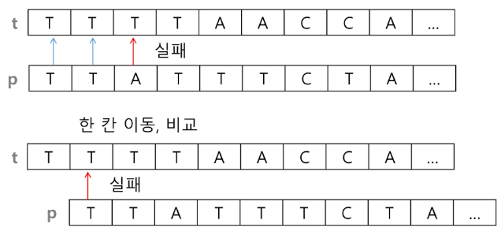
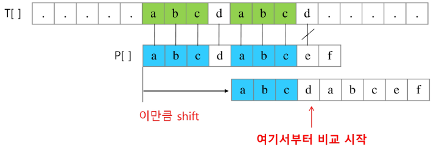
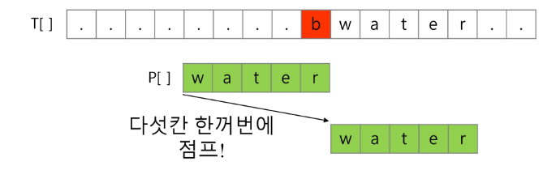
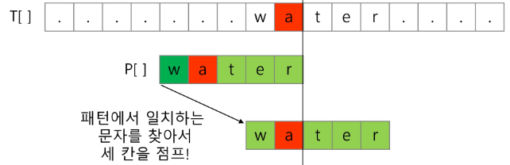
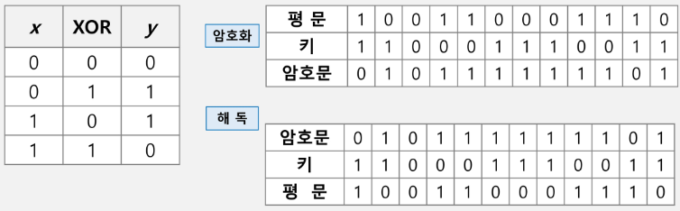

# 07.String

# 패턴매핑
패턴 매칭에 사용되는 알고리즘들
- 고지식한 패턴 검색 알고리즘
- 카프-라빈 알고리즘
- KMP 알고리즘
- 보이어-무어 알고리즘
  
## 고지식한 알고리즘(Brute Force)
본문 문자열을 처음부터 끝까지 차례대로 순회하면서 패턴 내의 문자들을 일일이 비교하는 방식으로 동작
- 시간은 좀 걸릴 수 있으나 잘 찾을 수 있음
- target과 pattern 인덱스 비교



## for / while로 한 번씩 해보자
``` python

# i는 그대로 두고 더해주는 연산
- 불일치하면 i를 증가시켜주면 된다

for i # 0 -> N - M :시작 인덱스
    for j # M-1 : pattern 인덱스
        if[i + j] != p[j]
            break
            
flag = 1
for i # 0 -> N - M :시작 인덱스
    for j # M-1 : pattern 인덱스
        if[i + j] != p[j]
            falg = 0
            break
    if flag: ~~            
```

```python
p = "is" # 찾을 패턴
t = "This i a book~!" # 전체 텍스트
M = len(p) # 찾을 패턴의 길이
N = len(t) # 전체 텍스트의 길이

def BruteForce(p,t): # i와 j 동시에 증가
    i = 0 # t의 인덱스
    j = 0 # p의 인덱스
    while j < M and i < N:
        if t[i] != p[j]: 
            i = i - j # 실패하면 자연스럽게 첫 시작보다 한칸 이동
            j = - 1 # 처음으로 돌아가기
        i = i + 1
        j = j + 1
    if j == M :
        return i - M # 검색성공 : 검색 길이 만큼 빼주기
    else:
        return -1 # 검색 실패
```

고지식한 패턴 검색 알고리즘의 시간 복잡도
- 최악의 경우 : O(MN)

# KMP 알고리즘
불일치가 발생한 텍스트 스트링의 앞 부분에 
어떤 문자가 있는지를 미리 알고 있으므로, 
불일치가 발생한 앞 부분에 대하여 다시 비교하지 않고 
매칭을 수행

- 패턴을 전처리 -> next[M](불일치 발생 시 이동할 다음 위치)을 구해 잘못된 시작을 최소화
- 시간 복잡도 : O(M + N)



패턴에 접두사 접미사가 동일한 경우...?!


매칭이 실패했을 때 돌아갈 곳을 계산한다.

자리를 돌아가면서 동일하지 않으면 0
연속되게 일치하면 글자의 누적합...?!
문자열 패턴 길이만큼 뛰어넘을 수 있음...

## 보이어-무어 알고리즘
오른쪽에서 왼쪽으로 비교  
패턴에 오른쪽 끝에 있는 문자가 불일치 하고 이 문자가 패턴 내에 존재하지 않는 경우, 이동거리는 무려 패턴의 길이만큼이 된다.
- 대부분의 사용 소프트웨어에서 채택하고 있는 알고리즘





- 고지식은 구현할 줄 알아야 한다!

문자열 매칭 알고리즘 비교 : 오메가 기호 차이?!
- 찾고자 하는 문자열의 패턴의 길이 m, 총 문자열 길이 n
- 고지식한 패턴 검색 알고리즘: 수행시간 O(mn)
- 카프-라빈 알고리즘 : 수행시간 Θ(n)
- KMP 알고리즘 : 수행시간 Θ(N)
  
보이어-무어 알고리즘
- 앞의 두 매칭 알고리즘들의 공통점은 텍스트 문자열의 문자를 적어도 한번씩 훑는다는 것 : 최선의 경우에도 Ω(n)
- 보이어-무어 알고리즘은 텍스트 문자를 다 보지 않아도 된다.
- 최악의 경우 수행시간 : Θ(mn)
- 입력에 따라 다르지만 일반적으로 Θ(n)보다 시간이 덜 든다

# 참고
## 문자열 암호화
시저 암호(Caesar cipher)
- 알파벳을 일정한 수만큼 [평행이동] 시킴

문자 변환표를 이용한 암호화(단일 치환 암호)
- 단순한 카이사르 암호화보다 훨씬 강력한 암호화 기법
- 복호화하기 위해서는 모든 키의 조합(key space)가 필요
    - 모든 키 조사 하는 방법이 없을까?!
    
bit열의 암호화
- 배타적 논리압(exclusive-or) 연산 사용



## 문자열 압축
Run-length encoding 알고리즘
- 같은 값이 몇 번 반복되는 가를 나타냄으로써 압춥
A B B B B B B B B A
  -> A 1 B 8 A 1
- 늘어날 수도 있음...
- 더 효율적인 방법으로는 허프만 코딩 알고리즘이 있다 !

Run-length를 보면 반복되는 걸 길이로 표현하는 ~~ 거구나?! 
    
+) 시간복잡도 표기법 : 그냥 빅오로 보는 게 좋을 수도
- Big-O(빅오 표기법): 시간의 상한을 표기한 방법으로, 특정 알고리즘의 최악의 경우 시간 복잡도를 나타냅니다. 
- Big-Ω(빅오메가 표기법): 시간의 하한을 표기한 방법으로, 특정 알고리즘의 최선의 경우 시간 복잡도를 나타냅니다. 
- Big-Θ(빅세타 표기법): 시간의 상한과 하한을 동시에 표기한 방법으로, 특정 알고리즘의 평균의 경우 시간 복잡도를 나타냅니다. 