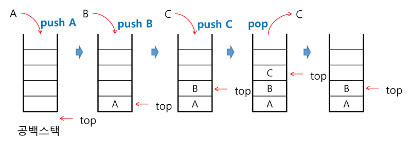
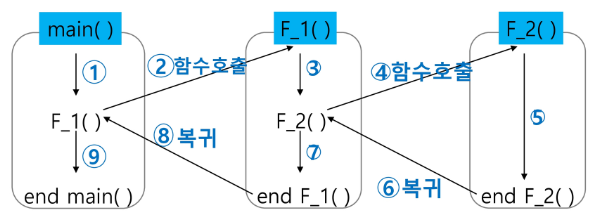
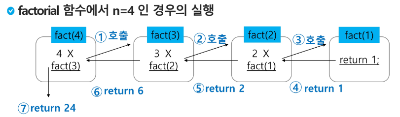

# 08.Stack
# 스택(Stack)
## 스택(stack)의 특성
- 물건을 쌓아 올리듯 자료를 쌓아 올린 형태의 자료 구조 이다.
- 스택에 저장된 자료는 **선형 구조**를 갖는다
    - 선형 구조 : 자료 간의 관계가 1대1의 관계를 갖는다.
    - 비선형구조: 자료 간의 관계가 1대N의 관계를 갖는다(ex:트리)
- 스택에 자료를 삽입하거나 자료를 꺼낼 수 있다.
- **후입선출(LIFO, Last-In_First-Out)**
    - 스택에 1 2 3 순으로 자료 삽입 후 3 2 1 로 꺼낼 수 있다.

+) 큐 : First-In First-Out  

## 스택의 구현
스택을 프로그램에서 구현하기 위해서 필요한 자료구조와 연산

자료구조 : 자료를 선형으로 저장할 저장소
- 배열(리스트 : 정적인 크기를 가지고 있음)을 사용할 수 있다.
- 저장소 자체를 스택이라 부르기도 한다.
- 스택에서 마지막 삽입된 원소의 위치를 top이라 부른다. : sp(stack pointer)

연산
- 삽입(push): 저장소에 자료를 저장
- 삭제(pop): 저장소에서 자료를 꺼낸다. 삽힙한 자료의 역순으로!
- isEmpty: 스택이 공백인지 아닌지를 확인하는 연산 : 꺼내기 전에 하는 연산
    - isNotEmpty
- peek : 스택의 sp(top)에 있는 item(원소)를 반환하는 연산

스택의 삽입/삭제 과정
- 빈 스택에 원소 A,B,C를 차례로 삽입 후 한번 삭제하는 과정, 확인하는 정도의 연산



스택의 push 알고리즘
- append 메소드를 통해 리스트의 마지막에 데이터를 삽입
```python
# 좀 느립니다!
def puch(item):
    s.append(item)
```
```python
def push(item, size):
    global top
    top += 1 # top을 증가
    if top == size:
        print('overflow!') # 디버깅 목적
    else:
        stack[top] = item # top이 가리키는 곳에 저장
```

스택의 pop 알고리즘
- 포인트는 top(sp)를 한 칸 내려주는 것임
```python
def pop():
    if len(s) == 0 :
        # underflow
    else:
        return s.pop() # s.pop(-1)
```
```python
# pop
def pop():
    global top
    if top == -1 :
        print('underflow') # 디버깅용 출력
        return 0
    else:
        top -= 1 # 먼저 top을 내려주고
        return stack[top+1] # 아까 내 있던 자리 가져가라!

print(pop())
```

### 스택 구현 고려사향
- 1차원 배열 사용
  - 장점: 구현이 용이하다
  - 단점 : 스택의 크기를 변경하기 어렵다는 단점
  
저장소를 동적으로 할당하여 스택을 구현하는 방법이 있다!
- 동적 연결리스트를 이용하여 구현하는 방법을 의미
  - 장점: 메모리를 효율적으로 사용한다
  - 단점 : 구현이 복잡하다
  
## 스택의 응용
### function call
프로그램에서의 함수 호출과 복귀에 따른 수행 순서를 관리
  - 가장 마지막에 호출된 함수가 가장 먼저 실행을 완료하고 복귀하는 후입선출 구조!
    - 스택을 이용하여 수행순서 관리
  - 함수 호출이 발생 -> 호출한 함수 수행에 필요한 지역변수, 매개변수 및 수행 후 복귀할 주소 등의 정보를 스택 프레임(stack frame)에 저장하여 시스템 스택에 삽입
  - 함수의 실행이 끝나면 시스템 스택의 top 원소(스택 프레임) 삭제하면서 프레임에 저장되어 있던 복귀주소를 확인하고 복귀
  - 함수 호출과 복귀에 따라 이 과정 반복하여 전체 프로그램 수행이 졸료되면 시스템 스택은 공백 스택이 된다.

함수 호출과 복귀에 따른 전체 프로그램의 수행 순서



간단하게 함수가 실행되면 해당 정보를 스택에 저장!  
근데 그 안에 함수가 있다? 그러면 또 스택에 쌓아 ~
근데 또 그안에 함수가 있다??? 그럼 또 스택에 쌓아 ~~~
그래서 실행중이던 함수가 종료되면 pop~
그렇게 함수 모두 종료될 때까지 pop 하는거다 ~~

# 재귀호출
자기 자신을 호출하여 순환 수행되는 것  
함수에서 실행해야하는 작업의 특성에 따라 일반적인 호출방싣보다 프로그램의 크기를 줄이고 간단하게 작성 가능  
시스템호출 ! 
ex) factorial



호출될때마다 메모리 영역이 나눠진다 !
파이썬은 호출의 깊이 제한이 있다! 대략 1000번(pypl를 2000번)

응용 : 피보나치
0과 1로 시작하고 이전의 두 수 합을 다음 항으로 하는 수열  
F_0 = 0, F_1 = 1
F_i = F_i-1 + F_i-2 for i >= 2

```python
def fibo(n):
  if n < 2: # 기전 조건
      return n
  else:
      return fibo(n-1) + fibo(n-2)
```

# Memoization
컴퓨터 프로그램을 실행할 때 이전에 계산한 값을 메모리에 저장해서 매번 다시 계산하지 않도록 하여 전체적인 실행속도를 빠르게 하는 기술  
- 동적 계획법의 핵심이 되는 기술 !!  
- 엄청난 중복호출을 줄이기 위하여

피보나치 수열에서 단순 재귀호출의 시간복잡도 O(n^2)를 O(n)으로 줄일 수 있다.
```python
# memo를 위한 배열을 할당하고, 모두 0으로 초기화 한다.
# memo[0]을 0으로 memo[1]는 1로 초기화 한다.

def fibo1(n):
  global memo
  if n >= 2 and memo[n] == 0:
    memo[n] = (fibo1(n-1) + fibo1(n-2))
  return memo[n]

memo = [0] * (n+1)
memo[0] = 0
memo[1] = 1
```

```python
# 보통은!
memo = [0] * 1001

def fibo1(n):
    global memo
    # 기저조건
    if n > 2:
        return n
    if memo[n] != 0:
        return memo[n]

    memo[n] = fibo1(n - 1) + fibo1(n - 2)
    return memo[n]
```