# 09. Stack
# DP(Dynamic Programmming)
동적 계획 알고리즘 == 메모이제이션  
**최적화 문제**를 해결하는 알고리즘

동적 계획 알고리즘은 먼저 입력 크기가 작은부분 문제들을 모두 해결한 후에 그 해들을 이용하여 보다 큰 크기의 부분 문제드를 해결하여, 최종적으로 원래 주어진 입력의문젤르 해결하는 알고리즘이다.

점화식 형태 bottom-up
fibo(n) = fio(n-1) + fibo(n-2)
memo[n] = memo[n-1] + memo[n-2]

### 피보나치 수 DP 적용 알고리즘
부분 문제의 답을 부터 본 문제의 답을 얻을 수 있으므로 최적 부분 구조로 이루어져 있다.
1. fibo(n)은 fibo(n-1), fibo(n-2),...,fibo(2), fibo(1), fibo(0)의 부분집합으로 나뉜다.
2. 부분 문제로 나누는 일을 끝냈으면 가장 작은 부분 문제부터 해를 구한다.
3. 그 결과는 테이블에 저장하고, 테이블에 저장된 부분 문제의 해를 이용하여 상위 문제의 해를 구한다.

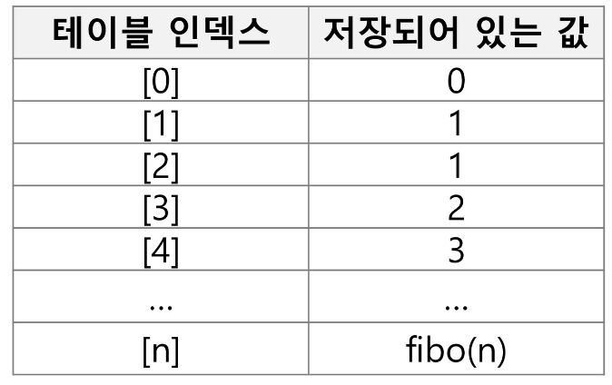

```python
def fibo2(n):
    f = [0] * (n + 1)
    f[0] = 0
    f[1] = 1
    for i in range(2, n + 1):
        f[i] = f[n-1] +f[n-2]
    return f[n]
```


### DP의 구현 방식
- recursive 방식
```python
memo = [0] * 1001

def fibo1(n):
    global memo
    # 기저조건
    if n > 2:
        return n
    if memo[n] != 0:
        return memo[n]

    memo[n] = fibo1(n - 1) + fibo1(n - 2)
    return memo[n]
```
- iterative 방식
```python
def fibo2(n):
    f = [0] * (n + 1)
    f[0] = 0
    f[1] = 1
    for i in range(2, n + 1):
        f[i] = f[n-1] +f[n-2]
    return f[n]
```
- memoization을 재귀적 구조에 사용하는 것보다 **반복적 구조**로 DP를 구현한 것이 성능면에서 보다 효율적이다.

- 재귀적 구조는 내부에 시스템 호출 스택을 사용하는 오버헤드가 발생하기 때문이다.

# DFS (깊이 우선 탐색)
비선형 구조인 그래프 구조는 그래프로 표현된 모든 자료를 빠짐없이 검색하는 것이 중요함.

두가지 방법 (완전 탐색)
- 깊이 우선 탐색 (Depth First Search, DFS) : 갈림길을 만나면 갈림길로 돌아가서 다시 진행
- 너비 우선 탐색 (Breadth First Search, BFS)

시작 정점의 한 방향으로 갈 수 있는 경로가 있는 곳까지 깊이 탐색해 가다가
더 이상 갈 곳이 없게되면, 가장 마지막에 만났던 갈림길 간선이 있는 정점으로 되돌아아와서
다른 방향을 정점으로 탐색을 계속 반복하여 모든 정점을 방문하는 순회 방법

- 가장 마지막에 만났던 갈림길의 정점으로 되돌아가서 다시 깊이 우선 탐색 반복해야하므로 후입선출 구조의 스택 사용!

## DFS 알고리즘
1. 시작 정점 V를 결정하여 방문한다.
2. 정점 V에 인접한 정점 중에서
   1. 방문하지 않은 정점 w가 있으면, 정점 v를 스택에 push하고 정점 w를 방문한다. 그리고 w를 v로 하여 다시 해당 과정을 반복한다.
   2. 방문하지 않은 정점이 없으면, 탐색의 방향을 바꾸기 위해서 스택을 pop하여 받은 가장 마지막 방문 정점을 v로 하여 다시 해당 과정을 반복한다.
3. 스택이 공백이 될 때가지 2를 반복한다. -> 더 이상 남은 갈림길이 없도록

목표!
1. 빠짐 없이, 중복없이

```
# 잘 기억해두기
visited[], stack[] 초기화
DFS(V)
    시작점 v 방문
    visited[v] <- True
    while {
        if (v의 인접 정점 중 방문 안한 정점 w가 있으면)
            push(v)
            v = w (w에 방문)
            visited[w] <- true
        else
            if (스택이 비어 있지 않으면)
                v  <- pop(Stack)
            else
                break
    }
```

### DFS 예
초기 상태 : 배열 visited를 False로 초기화하고, 공백 스택을 생성

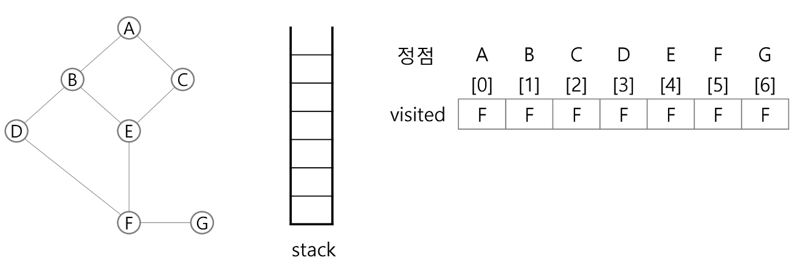

1) 정점 A를 시작으로 깊이 우선 탐색을 시작
```python
A 방문
visitied[A] <- True
```
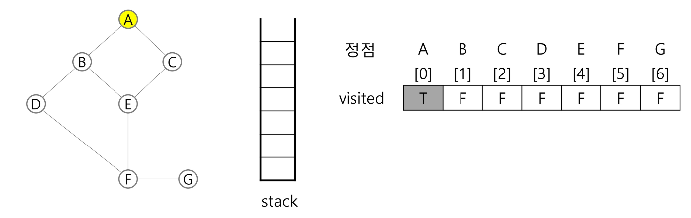

2) 정점 A에 방문하지 않은 정점 B, C가 있으므로 A를 스택에 push 하고, 인접정점 B와 C 중에서 오름차순에 따라 B를 선택하여 탐색을 계속한다.
```python
push(A)
B 방문
visitied[B] <- True
```
3) 정점 B에 방문하지 않은 정점 D, E가 있으므로 B를 스택에 push 하고, 인접 정점 D와 E중에서 오름차순에 따라 D를 선택하여 탐색을 계속한다.
```python
push(B)
D 방문
visitied[D] <- True
```
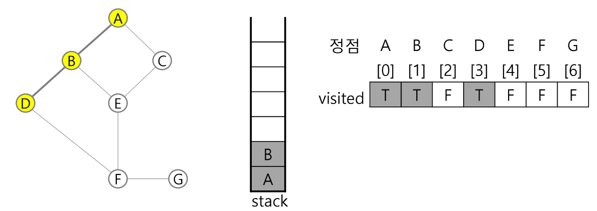

4) 정점 D에 방문하지 않음 정점 F가 있으므로 D를 스택에 push하고, 인접정점 F를 선택하여 탐색을 계속한다.
```python
push(D)
F 방문
visitied[F] <- True
```
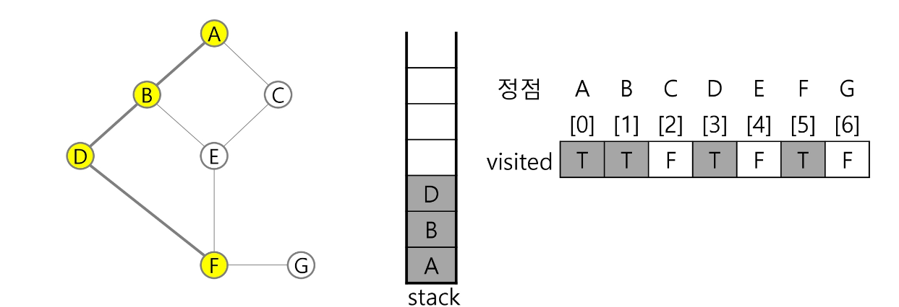

5) 정점 F에 방문하지 않은 정점 E, G가 있으므로 F를 스택에 push하고, 인접정점 E와 G중에서 오름차순에 따라 E를 선택하여 탐색을 계속한다.
```python
push(F)
E 방문
visitied[E] <- True
```
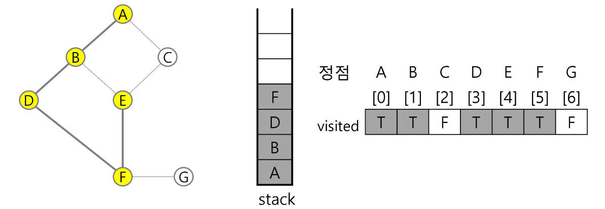

6) 정점 E에 방문하지 않은 정점 C가 있으므로 E를 스택에 push하고, 인접정점 C를선택하여 탐색을 계속한다.
```python
push(E)
C 방문
visitied[C] <- True
```
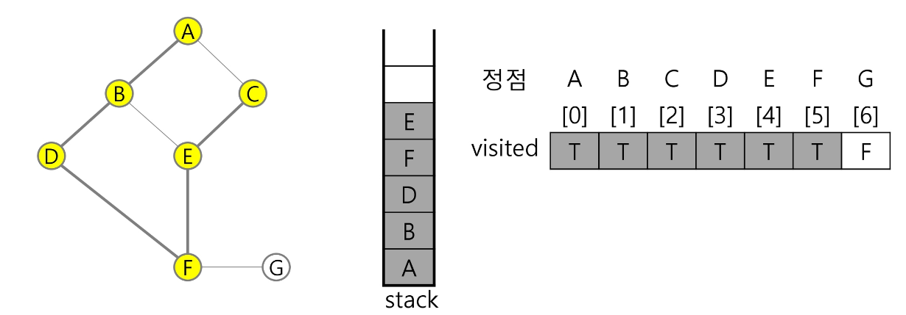

7) 정정 C에서 방문하지 않은 인접정점이 없으므로, 마지막 정점으로 돌아가기 위해 스택을 pop하여 정점 E에 대해서 방문하지 않은 인접정점이 있는지 확인한다.
```python
pop(stack)
```
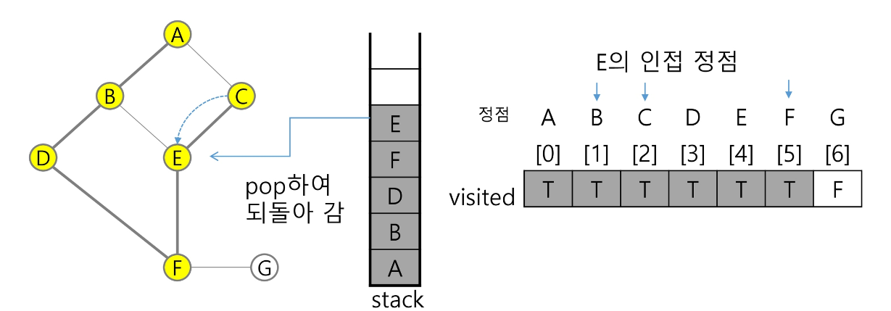

8) 정점 E에 방문하지 않은 인접정점이 없으므로, 다시 스택을 pop하여 받은 정점 F에 대해서 인접정점이 있는지 확인한다.
```python
pop(stack)
```
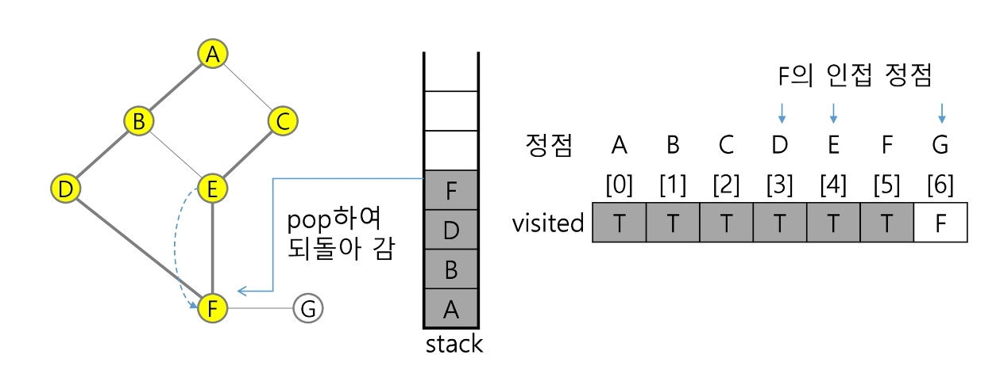

9) 정접 F에 방문하지 않은 정점 G가 있으므로 F를 스택에 push하고, 인접정점 G를 선택하여 탐색을 계속한다.
```python
push(F)
G 방문
visited[G] <- True
```
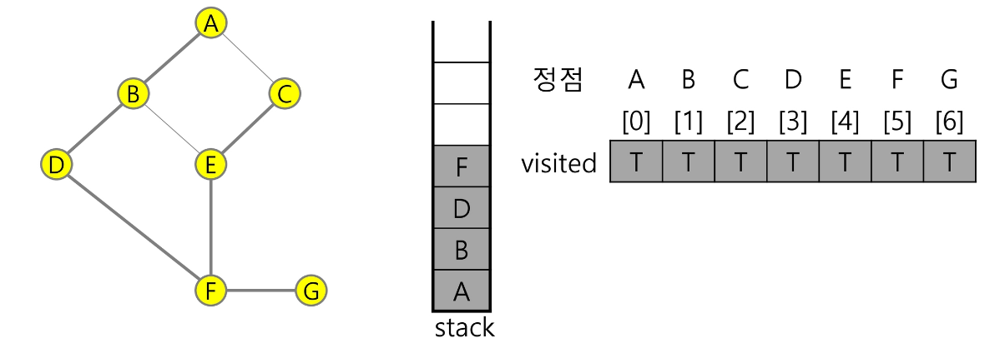

10) 정점 G에 방문하지 않은 인접정점이 없으므로, 마지막 정점으로 돌아가기 위해 스택을 pop하여 받은 정점 F에 대해서 인접정점이 있는지 확인한다.
```python
pop(stack)
```
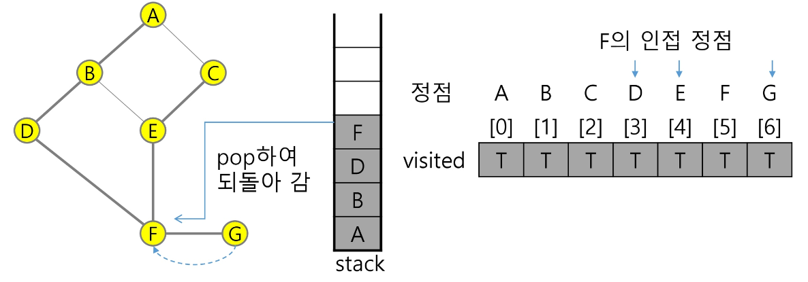

11) 정점 F에 방문하지 않은 인접정점이 없으므로, 다시 마지막 정점으로 돌아가기 위해 스택을 pop하여 받은 정점 D에 대해서 인접정점이 있는지 확인한다.
```python
pop(stack)
```
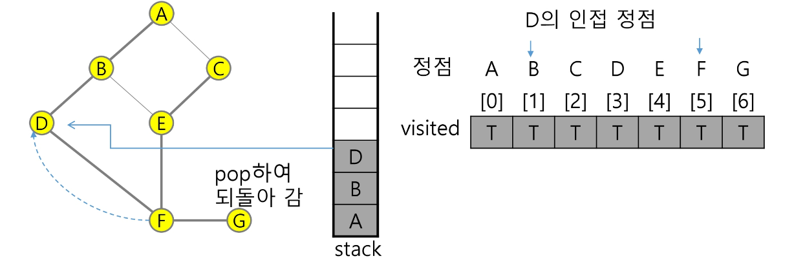

12) 정점 F에 방문하지 않은 인접정점이 없으므로, 다시 마지막 정점으로 돌아가기 위해 스택을 pop하여 받은 정점 B에 대해서 인접정점이 있는지 확인한다.
```python
pop(stack)
```
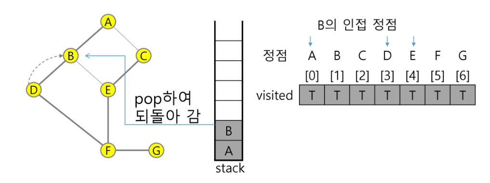

13) 정점 B에 방문하지 않은 인접정점이 없으므로, 다시 마지막 정점으로 돌아가기 위해 스택을 pop하여 받은 정점 A에 대해서 인접정점이 있는지 확인한다.
```python
pop(stack)
```
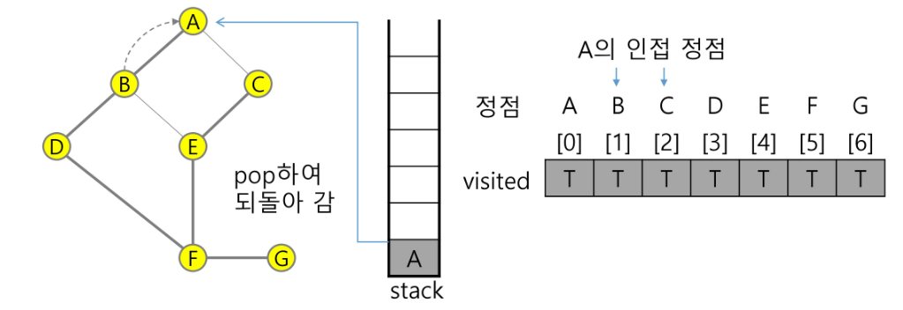

14) 현재 정점 A에서 방문하지 않은 인접 정점이 없으므로 마지막 정점으로 돌아가기 위해 스택을 pop하는데, 스택이 공백이므로 깊이 우선 탐색을 종료한다.

- 깉이 우선 탐색 경러로
: A-B-D-F-E-C-G
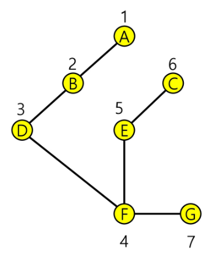
- 
### 연습문제 ⭐⭐⭐⭐⭐
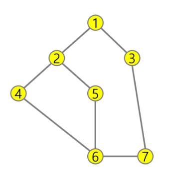
두 개의 정점 사이의 간선을 순서대로 나열해 놓은 것, 싶이 우선 탐색하여 깊이 우선 탐색 경로를 출력하기

인접리스트 : 갈 수 있는 위치 작성
인접 행렬 : 행렬로 위치시키기