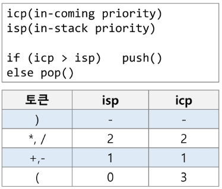
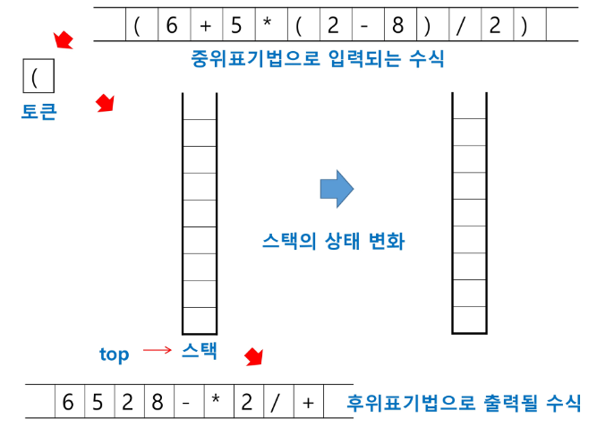
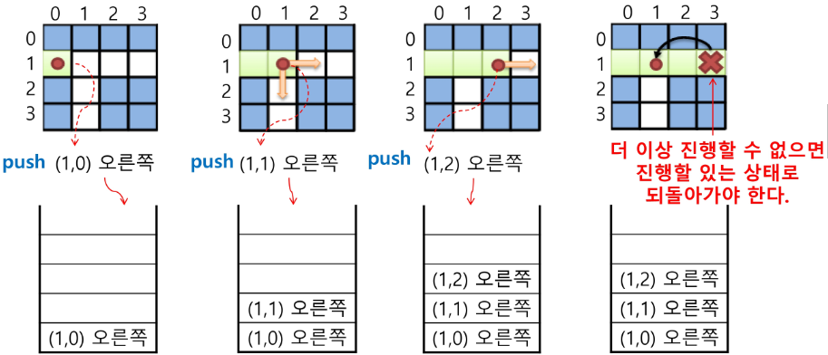
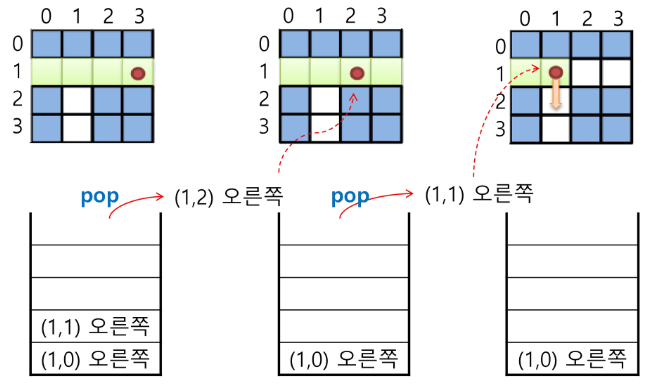
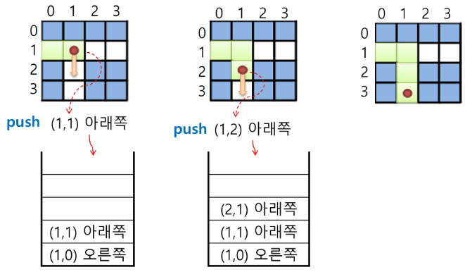
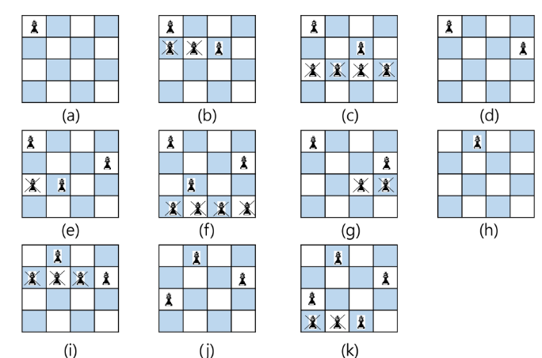
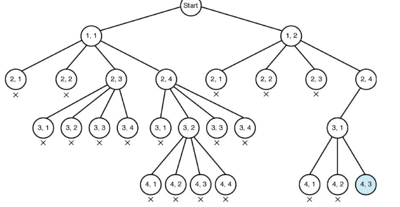
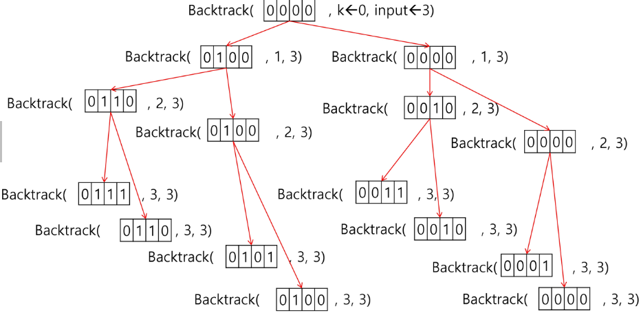

# 11. Stack2
# 계산기1
문자열로 된 계산식이 주어질 때, 스택을 이용하여 이 계산식의 값을 계산할 수 있다.

문자열 수식계산의 일반적 방법
1) 중위 표기법의 수식을 후위 표기법으로 변경 (스택이용)
2) 후위 표기법의 수식을 스택을 이용하여 계산하다.
- 중위표기법(infix notation)
    - 연산자를 피연산자의 가운데 표기하는 방법  A+B
- 후위표기법(postfix notation)
    - 연산자를 피연산자 뒤에 표기하는 방법 AB+
    
### step1) 중위표기식의 후위 표기식 변환 방법 1
- 수식의 각 연산자에 대해서 우선순위에 따라 괄호를 사용하여 다시 표현한다.
- 각 연산자를 그에 대응하는 오른쪽 괄호의 뒤로 이동시킨다.
- 괄호를 제거한다.

### step1) 중위표기식의 후위 표기식 변환 알고리즘(스택 이용)2
1. 입력 받은 중위 표기식에서 토큰을 읽는다.
2. 토큰이 피연산자이면 토큰을 출력한다.
3. 토큰이 연산자(괄호포함)일 때, 이 토큰이 스택의 top에 저장되어 있는 연산자보다 우선순위가 높으면 스택에 push하고, 그렇지 않다면 스택 top의 연산자의 우선순위가 토큰의 우선순위보다 작을때까지 스택에서 pop한 후 토큰의 연산자를 push한다. 만약 top에 연산자가 없으면 push한다.
4. 토큰이 오른쪽 괄호 ')'이면 스택 top에 왼쪽 괄호 '(' 올 때까지 스택에 pop 연산을 수행하고 pop한 연산자를 출력한다. 왼쪽 괄호를 만나면 pop만하고 출력하지는 않는다.
5. 증위 표기식에 더 읽을 것이 없다면 중지하고, 더 읽을 것이 있다면 1부터 다시 반복한다.
6. 스택에 남아 있는 연산자를 모두 pop하여 출력한다.
    - 스택 밖의 왼쪽 괄호는 우선 순위가 가장 높으며, 스택 안의 왼쪽 괄호는 우선 순위가 가장 낮다.

+) 간단하게 정리 
- 연산자이면 스택 top(isp)과 자신(icp)의 우선 순위를 비교함 
    - isp<icp이면 push, isp>=icp이면 pop하고 출력함
    - isp = in stack precedence / icp = incoming precedence






# 계산기 2
### step2) 흐위 표기법의 수식을 스택을 이용하여 계산
1. 피연산자를 만나면 스택에 push한다.
2. 연산자를 만나면 필요한 만큼의 피연산자를 스택에서 pop하여 연산하고, 연산결과를 다시 스택에 push한다.
3. 수식이 끝나면, 마지막으로 스택을 pop하여 출력한다.

# 백트래킹(Backtracking)
DFS + 가지치기  
해를 찾는 도중에 **막히면** (즉, 해가 아니면) 되돌아가서 다시 해를 찾아 가는 기법
- 최적화(optimization) 문제와 결정(decision) 문제를 해결할수 있다.
- 결정 문제: 문제의 조건을 만족하는 해가 존재하는지의 여부를 'yes' 또는 'no'가 답하는 문제
    - 미로찾기
    - n-Queen
    - Map coloring
    - 부분 집합의 합(Subset Sum) 문제 등
    
## 백트래킹 : 미로찾기
입구와 출구가 주어진 미로에서 입구부터 출구까지의 경로를 찾는 문제  
이동할 수 있는 방향은 4방향으로 제한



스택을 이용하여 지나온 경로를 역으로 되돌아간다.



스택을 이용하여 다시 경로를 찾는다.



## 백트래킹고 깊이우선탐색과의 차이
가망이 없으면 가지치기로 버려라 !
- 어떤 노드에서 출발하는 경로가 해결책으로 이어질 것 같지 않으면, 더 이상 그 경로를 딸가가지 않음으로써 시도 횟수를 줄임(Prunning 가지치기)
- 깊이우선탐색이 모든 경우를 추적하는데 비해 백트래킹은 불필요한 경로를 조기에 차단.
- 깊이우선탐색을 가하기에는 경우의 수가 너무 많음, N!가지의 경우의 수를 가진 문제에 대해 깊이우선탐색을 가하면 당연히 처리 불가능한 문제
- 백트래킹 알고리즘을 적용하면 일반적으로 경우의 수가 줄어들지만 이 역시 최악의 경우에는 여전히 지수함수 시간(Exponential Time)을 요하므로 처리 불가능

## 백트래킹 기법
유망하지 않음  == 가능성 0% : 자칫하면 저격케이스에 걸릴 수 있..
- 어떤 노드의 유망성을 점검한 후 유망(promising)하지 않다고 결정되면 그 노드의 부모로 되돌아가(backtracking) 다음 자식 노드로 감
- 어떤 노드를 방문하엿을 때 그 노드를 포함한 경로가 해답이 될 수 없으면 그 노드는 유망하지 않다고 하며, 반대로 해답의 가능성이 있으면 유망하다고한다.
- 가지치기(pruning) : 유망하지 않는 노드가 포함되는 경로는 더 이상 고려하지 않는다.

## 백트래킹 이용한 알고리즘
1. 상태 공간 트리의 깊이 우선 검색을 실시한다.
2. 각 노드가 유망한지를 점검한다. : 인접해있나? 
3. 만일 그 노드가 유망하지 않으면, 그 노드의 부모 노드로 돌아가서 검색을 계속한다.

일반 백트래킹 알고리즘
```python
def checknode(v) : # node
    if promising(v):
        if there is a soultion at v:
                write the solution
        else:
            for u in each child of v:
                checknode(u)
```
## n_Queen : 서로 공격하지 않는 퀸을 몇개 놓을 수 있는가?
- 첫 시도에서 잘 안되던 친구들을 제외한다..




# 부분집합 구하기
powerset : 어떤 집합의 공집합고 자기자신을 포함한 모든 부분집합  
어떤 집합의 원소 개수가 n일 경우, 부분집합의 개수는 2^n개

백트래킹 디법으로 powerset 구하기
- 일반적인 백트래킹 접근 방법 이용
- 2^n개의 부분집합을 만들 때는, true 또는 false 값을 가지는 항목들로 구성된 n개의 배열을 만드는 방법을 이용
- 여기서 배열의 i번째 항복은 i번째의 원소가 부분집합의 값인지 아닌지를 나타내는 값이다.



powerset을 구하는 백트래킹 알고리즘
def backretrack(a, k, input)

