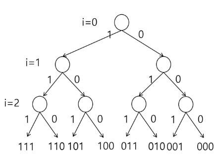
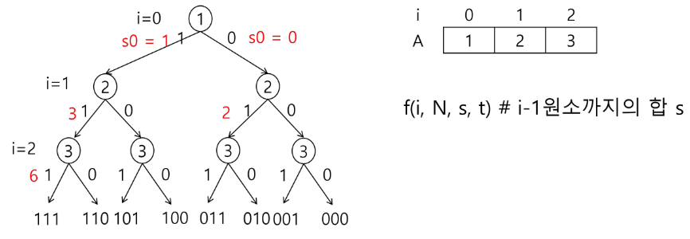
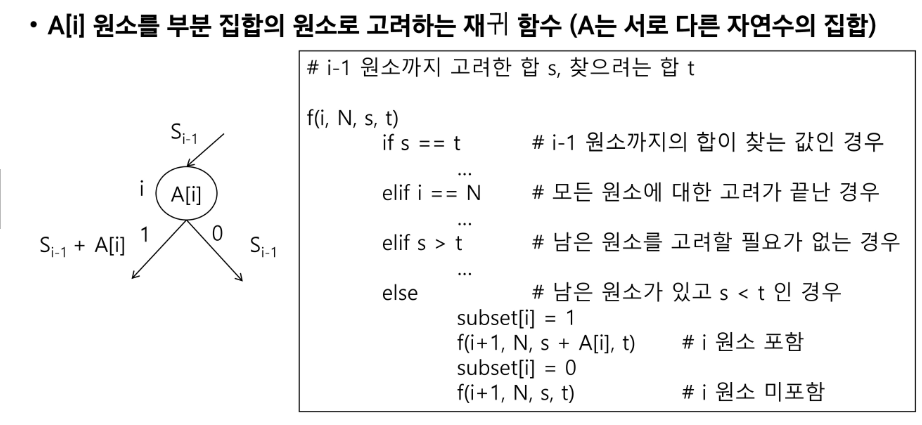
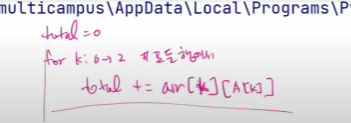
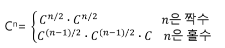

# 11. Stack2
# 부분 집합의 합
집합 {1, 2, 3}의 원소에 대해 각 부분집합에서의 포함 여부를 트리로 표현



- i 원소의 포함 여부를 결정하면 i까지의 부분 집합의 합 s_i를 결정할 수 있음
- s_i-1이 찾고자 하는 부분집합의 합보다 크면 남은 원소를 고려할 필요가 없음






추가 고려사항
고려한 구간의 합 S - S > T이면 중단  
남은 구간의 합 RS - s + RS < T  
: 남은 원소의 합을 다 더해도 찾는 값 T 미만인 경우 중단

# 순열
A[1, 2, 3]의 모든 원소를 사용한 순열  
123, 132, 213, 231, 312, 321



# 분할 정복 알고리즘
## 설계 전략
- 분할(Divides) : 해결한 문제를 여러 개의 작은 부분으로 나눈다,
- 정복(Conquer) : 나눈 작은 문제를 각각 해결한다.
- 통합(Combine) : (필요하다면) 헤결된 해답을 모은다.

거듭제곱(Ecponentaion) : O(n)
C^2 = CxC
...
C^n = CxCx...xC

분할 정복 기반의 알고리즘 :  O(log_2 n)



# 퀵정렬
주어진 배열을 두개로 분할하고, 각각을 정렬한다.
기준 아이템(pivot item) 중심으로, 이보다 작은 것은 왼편, 큰 것은 오른편에 위치시킨다.
추가적인 메모리가 사용되지 않는다는 장점
```python
def quickSort(a, begin, end):
    if begin < end:
        p = partition(a, begin, end)
        quickSort(a, begin, end-1)
        quickSort(a, p+1, end)
```
```python
# 정복에 해당하는 코드
def partition(a, begin, end):
    pivot = (begin + end) // 2
    L = begin
    R = end
    while L < R:
        while(L < R and a[L] < a[pivot]) : L += 1
        while(L < R and a[R] > a[pivot]) : R -= 1
        if L < R:
            if L == pivot: pivot = R
            a[L], a[R], = a[R], a[L]
    a[pivot], a[R] = a[R], a[pivot]
    return R
```
