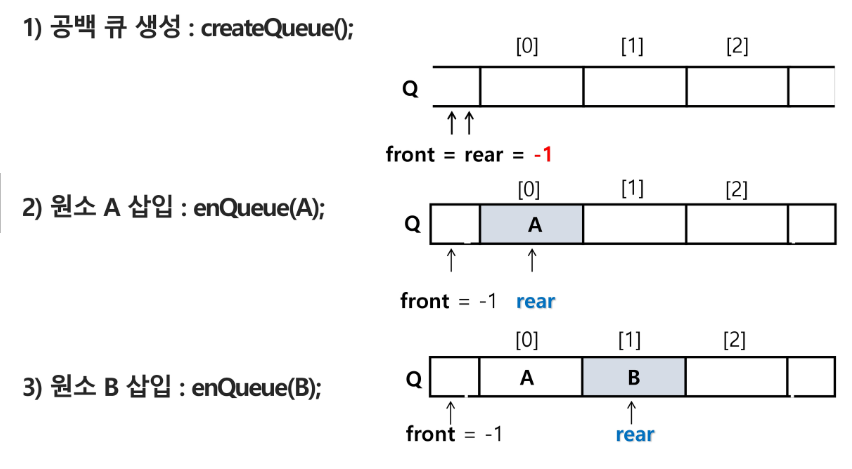

# 13. Queue
# 큐 : Queue
### 스택의 틍성
스택과 마찬가지로 삽입과 삭제의 위치가 제한적인 자료구조
- 큐의 뒤에서는 삽입만 하고, 큐의 앞에서는 삭제만 이루어지는 구조
- 선입선출구조(FIFO : First In First Out)
    - 큐에 삽입한 순서대로 원소가 저장되어, 가장 먼저 삽입된 원소는 가장 먼저 삭제된다.

### 큐의 선입선출 구조


머리(Front) : 저장된 원소 중 첫 번째 원소 (또는 삭제된 위치)
꼬리(Rear) : 저장된 원소 중 마지막 원소

### 큐의 주요 연산
- enQueue : 큐의 뒤쪽(Rear 다음)에 원소를 **삽입**하는 연산
- deQueue : 큐의 앞족(front)에서 원소를 삭제하고 반환하는 연산
- createQueue() : 공백 상태의 큐를 생성하는 연산
- isEmpty : 큐가 공백상태인지를 확인하는 연산
- isFull() : 큐가 포화상태인지를 확인하는 연산
- Qpeek() : 큐의 앞족(front)에서 원소를 삭제 없이 반환하는 연산

### 큐의 연산과정


1) 공백 큐 생성 : createQueue()
   ```python
   # ver1
   Q = [0] * 100
   front = -1 
   rear = -1
   
   # ver2
   Q = []
   ```
2) 원소 A 삽입 : enQueue(A)
      ```python
   # ver1
   rear += 1
   Q[rear] = A
   
   # ver2
   Q.append(A)
   ```
3) 원소 B 삽입 : enQueue(B)
      ```python
   # ver1
   rear += 1
   Q[rear] = B
   
   # ver2
   Q.append(B)
   ```
4) 원소 반환/삭제 : deQueue()
   ```python
   # ver1
   front += 1
   tmp = [front]
   
   # ver2
   tmp = Q.pop(0)
   

    ```

5) 원소 C 삽입: enQueue(C)
```python
   # ver1
   rear += 1
   Q[rear] = C
   
   # ver2
   Q.append(C)
   ```
6) 원소 반환/삭제
7) 원소 반환/삭제

## 큐의 구현
### 선형큐
1차원 배열을 이용한 큐
- 큐의 크기 = 배열의 크기
- front : 저장된 첫 번재 원소의 인덱스
- rear : 저장된 마지막 원소의 인덱스

상태표현
- 초기상태 : front = rear = -1
- 공백 상태 : front == rear
- 포화 상태 : rear == n-1 (n: 배열의 크기, n-1: 배열의 마지막 인덱스)

초기 공백 큐 생성
- 크기 n인 1차원 배열 생성
- front와 rear를 -1로 초기화

### 삽입 : enQueue(item)
마지막 원소 뒤에서 새로운 원소를 삽입하기 위헤
1) rear 값을 하나 증가시켜 새로운 원소를 삽입할 자리를 마려
2) 그 인덱스에 해당하는 배열원소 Q[rear]에 item을 저장
```python
def enQ(data):
    global rear
    if rear == Qsize - 1:
        print('Q is Full')

    else:
        rear += 1
        Q[rear] = data

```
### 삭제 :deQueue()
가장 앞에 있는 원소를 삭제하기 위해
1) front 값을 하나 증가시켜 큐에 남아있게 될 첫 번째 원소 이동
2) 새로운 첫 번째 원소를 리턴 함으로써 삭제와 동일한 기능함
```python
def deQ():
    global front
    if front == rear: # 비어있으면
        print('큐가 비어있음')
        return -1
    front += 1
    return Q[front]
```

### 공백상태 및 포화상태 검사 : isEmpty(), isFull()
- 공백 상태 : front == rear
- 포화 상채 : rear = n-1 (n 배열의 크기, n-1: 배열의 마지막 인덱스)
```python
def isEmpty():
    return front == rear
def Full():
    return rear == len(Q) - 1
```

### 검색 : Qpeek()
- 가장 앞에 있는 원소를 검색하여 반환하는 연산
- 현재 front의 한자리 뒤(front+1)에 있는 원소, 즉 큐의 첫 번째에 있는 원소를 반환
```python
def Qpeek():
  if isEmpty() : print('Queue_Empty')
  else: return Q[front+1]
  ```

## 선형 큐 이용시의 문제점
잘못된 포화상태 인식
- 선형큐를 이용하여 원소의 삽입과 삭제를 계속할 경우, 배열의 앞부분에 활용할 수 있는 공간이 있음에도 불구하고, rear = n-1인 상태 즉, 포화상태로 인식하여 더 이상의 삽입을 수행하지 않게됨


해결방법
- 매 연산이 이루어질 때마가 저장된 원소들을 배열의 앞부분으로 모두 이동싵ㅁ
- 원소 이동에 많은 시간이 소요되어 큐의 효율성이 급격히 떨어짐
  


해결방법 2
- 1차원 배열을 사용하되, 논리적으로는 배열의 처음과 끝이 연결되어 워형형태의 큐를 이룬다고 가정하고 사용
- 원형 큐의 논리적 구조


### 원형 큐의 구조
초기 공백 상태
- front = rear = 0

Index의 순환 
- front와 rear의 위치가 배열의 마지막 인덱스인 n-1를 가리킨 후, 그 다음에는 논리적 순환을 이루어 배열의 처음 인덱스인 0으로 이동해야하ㅏㅁ
- 이를 위해 나머지 연산자 mod를 사용함

front 변수
- 공백 상태와 포화 상태 구분을 쉽게 하기 위해 front가 있는 자리는 사용하지 않고 항상 빈자리로 둠

삽입 위치 및 삭제 위치

| |삽입 위치|삭제 위치|
|------|---|---|
|선형큐| rear = rear + 1|front =  front + 1|
|원형큐| rear = (rear + 1)  mod n|front = (front + 1) mon d|

### 원형 큐의 연산과정


### 원형 큐의 구현
초기 공백 큐 생성
공백 상태 및 포화상태 검사
삽입
삭제

# 우선순위 큐(Prority Queue)
### 우선순위 큐의 특성
- 수선순위를 가진 항목들을 저장하는 큐
- FIFO 순서가 아니라 우선순위가 높은 순서대로 먼저 나가게 된다.

우선순위 큐의 적용 분야
- 시뮬레이션 시스템 /네트워크 트래픽 제어 / 운영체제의 테스크 스케줄링

우선순위 큐의 구현
- 배열을 이용한 우선수위 큐
- 리스트를 이용한 우선순위 큐


# 연결 큐의 구조
단순 연결 시스트(Linked List)를 이용한 큐
- 큐의 원소: 단순 연결 리스트의 노드
- 큐의 원소 순서 : 노드의 연결 순서. 링크로 연결되어 있음
- front : 첫 번째 노드를 가리키는 링크
- rear : 마지막 노드를 가리키는 링크


  
  

데크 -> 링크드리스트 양방향
deque 사용해보면 좋겠다

# 큐의 활용 : 버퍼(Buffer)
## 버퍼
- 데이터를 한곳에서 다른 한 곳으로 정송하는 동안 일시적으로 그 데이터를 보관하는 메모리의 영역
- 버퍼링 : 버퍼를 활용하는 방식 또는 버퍼를 채우는 동작을 의미한다.

버퍼의 자료구조
- 버퍼는 일반적으로 입출력 및 네트워크와 관련된 기능에서 이용된다.
- 순서대로 입력/출력/전달되어야 하므로 FIFO방식의 자료구조인 큐가 활용