# 14. Queue
# BFS (Breadth Eirst Search)
탐색 시작점의 **인접한 정점**들을 먼저 모두 차례로 방문한 후에, 
방문했던 정점을 시작점으로 다시 **인접한 정점**들을 차례로 방문하는 방식
- 인접한 정점들에 대해 탐색을 한 후, 차례로 다시 너비우선탐색을 진행해야 하므로, 선입선추 형태의 자료구조인 큐를 활용함

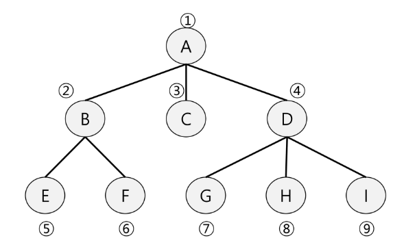

```python
# 입력 파라미터 : 그래프 G 와 탐색 시작점 V
def BFS(G, v): # 그래프 G 와 탐색 시작점 V
    visited = [0] *(n+1)        # n: 정점의 개수
    queue = []                  # 큐 생성
    queue.append(v)             # 시작점 v를 큐에 삽입
    while queue:                # 큐가 비어있지 않은 경우
        t = queue.pop(0)        # 큐의 첫번째 원소 반환
        if not visited[t]:      # 방문되지 않은 곳이라면
            visited[t] = True   # 방문한 것으로 푯;
            visit(t)            # 정점 t에서 할 일
            for i in G[t]       # t와 연결된 모든 정점에 대해
                if not visited[i]:  # 방문되지 않은 곳이라면
                    queue.append(i) # 큐에 넣기
```
## BFS 예제
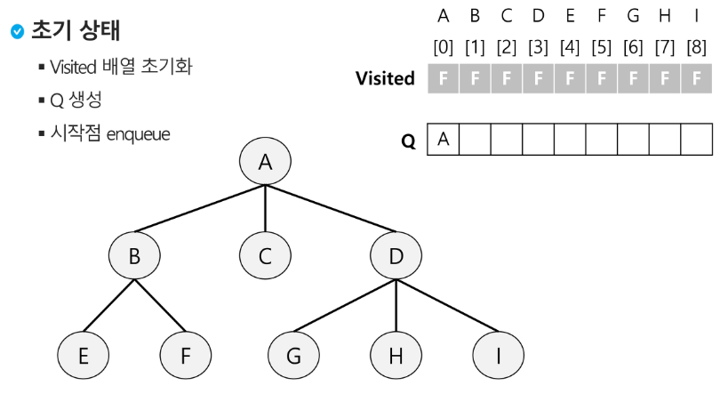
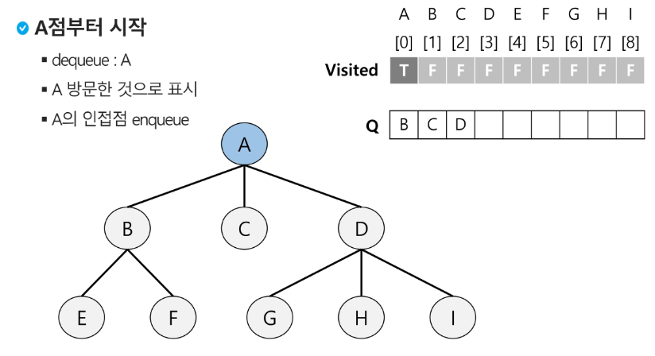
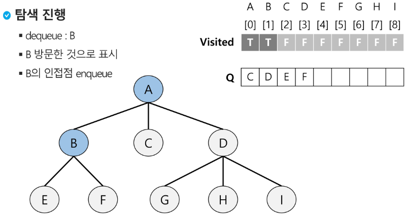
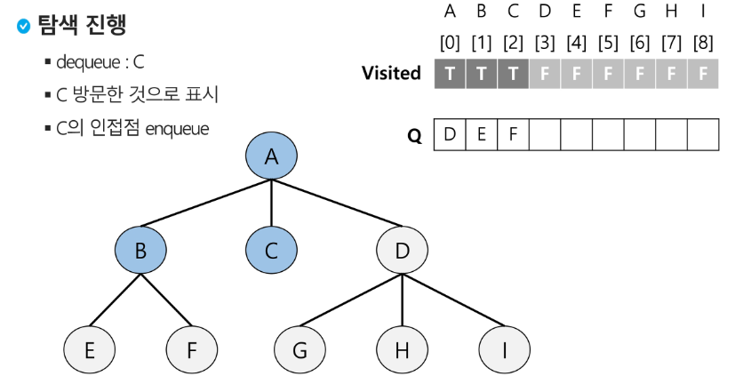
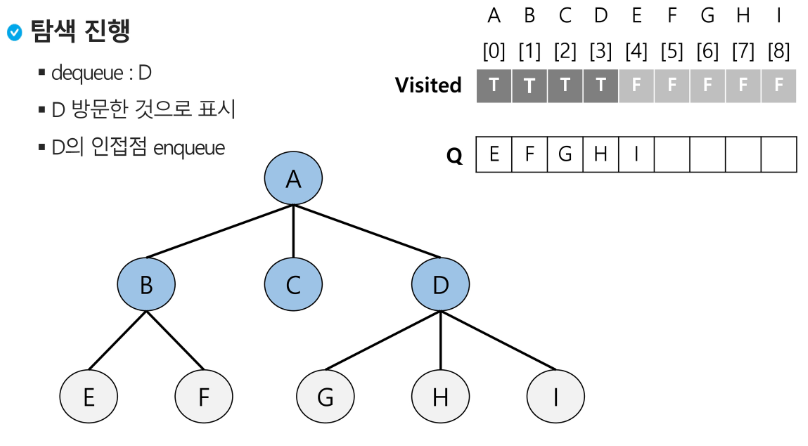
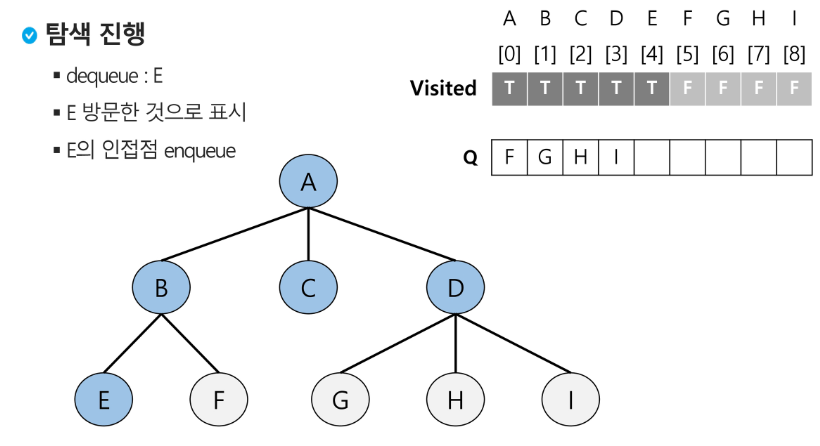
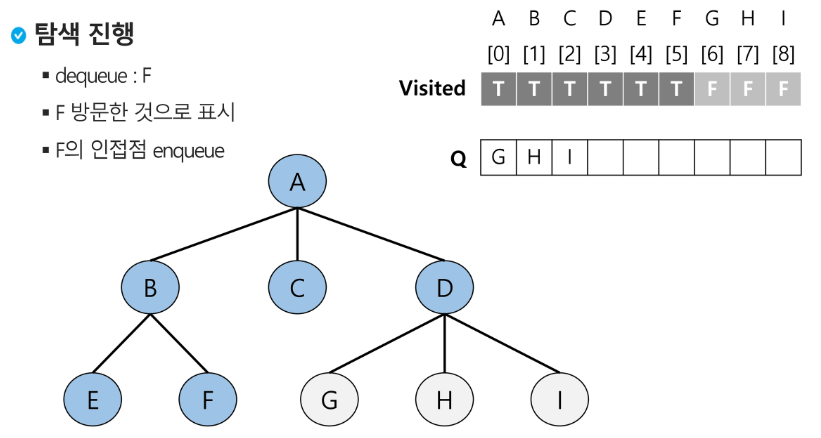
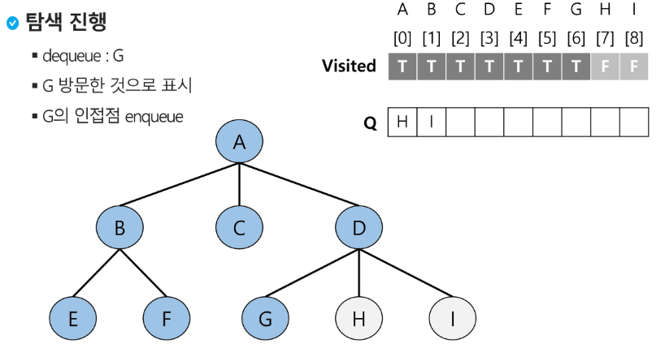
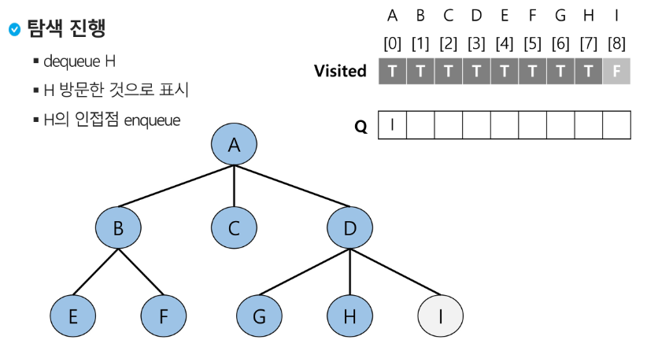
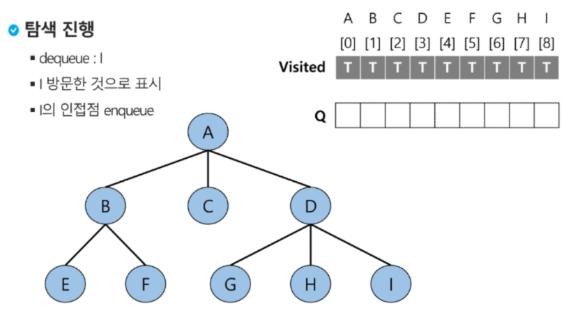
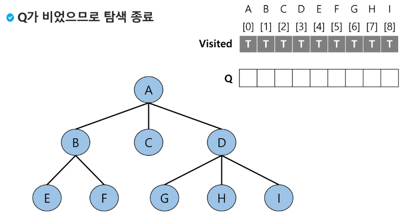

## BFS예제 2 : 노드간 연결이 추가
줄을 세웠으면  visited  =  True
이전에는 방문하면 visitied = True 해주는 형식이었음

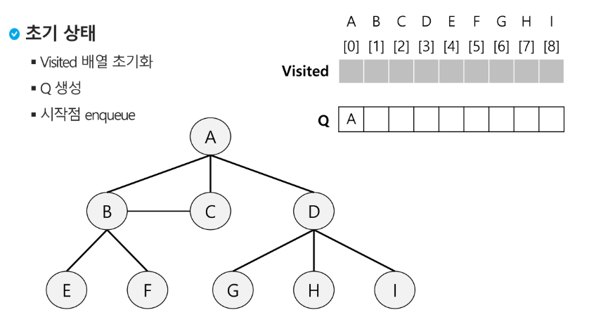

```python
def bfs(G, v, n) : # 그래프 G, 탐색 시작점 v
    visited = [0] * (n-1)       # n : 정점의 개수
    queue = []                  # 큐 생성
    queue.append(v)             # 시작점 v를 큐에 삽입
    visited[v] = 1
    while queue:                # 큐가 비어있지 않은 경우
        t = queue.pop(0)        # 큐의 첫번재 원소 반환
        visit(t)
        for i in G[t]:           # t와 연결된 모든 정점에 대해
            if not visited[i]:   # 방문되지 않은 곳이라면
                queue.append(i)  # 큐에 넣기
                visited[i] = visited[t] + 1 # n으로부터 1만큼 이동
```
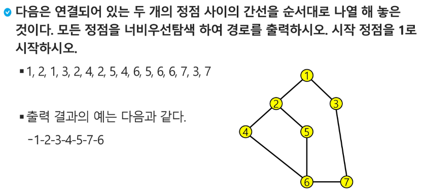

```python
'''
7 8
1 2 1 3 2 4 3 5 4 6 5 6 6 7 3 7
'''
def bfs(s, v): # 시작점 s 마지막 정점 v
    visited = [0] * (v+1) # visited 생성
    que = []       # 큐 생성
    que.append(s)   # 시작점 인큐
    visited[s] = 1  # 시작점 방문표시
    while que:        # 뮤에 정점이 남아있으면 front != rear
        t = que.pop(0) # 디큐
        print(t)    # 방문한 정점에서 할 일
        for w in adj_l[t]: # 인접한 정점 중 인큐되지 않은 정점 w가 있으면
            if visited[w] == 0: # w 인큐, 인큐 되었음을 표시
                que.append(w)
                visited[w] = visited[t] + 1

v, e = map(int, input().split())
arr = list(map(int, input().split()))

# 인접리스트
adj_l =[[] for _ in range(v+1)]
for i in range(e):
    v1, v2 = arr[i*2], arr[i*2+1]
    adj_l[v1].append(v2)
    adj_l[v2].append(v1)

bfs(1, 7)
```
```python
# 인접행렬로 해보기
def bfs(s, v): # 시작점 s 마지막 정점 v
    visited = [0] * (v+1) # visited 생성
    que = []       # 큐 생성
    que.append(s)   # 시작점 인큐
    visited[s] = 1  # 시작점 방문표시
    while que:        # 뮤에 정점이 남아있으면 front != rear
        t = que.pop(0) # 디큐
        print(t)    # 방문한 정점에서 할 일
        for w in range(1, v+1): # 인접한 정점 중 인큐되지 않은 정점 w가 있으면
            if adj_m[t][w] == 1 and visited[w] == 0: # w 인큐, 인큐 되었음을 표시
                que.append(w)
                visited[w] = visited[t] + 1

v, e = map(int, input().split())
arr = list(map(int, input().split()))
# 인접행렬
adj_m =[[0] * (v+1) for _ in range(v+1)]
for i in range(e):
    v1, v2 = arr[i*2], arr[i*2+1]
    adj_m[v1][v2] = 1
    adj_m[v2][v1] = 1

bfs(1, v)
```