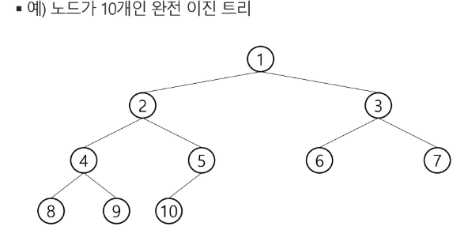
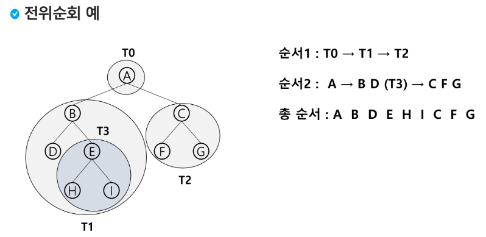

# 15.Tree
# 트리
## 트리의 개념
- 비선형 구조
- 원소들 간에 1:n 관계를 가지는 자료 구조
- 원소들 간에 계층관계를 가지는 계층형 자료구조
- 상위원소에서 하위원소로 내려가면서 확장되는 트리(나무)모양의 구조

## 정의  
한 개 이상의 노드로 이루어진 유한 집합
- 노드 중 최상위 노드를 루트(root)라 한다.
- 나머지 노드들은 n(>=0)개의 분리 집합 T1,...,TN으로 분리될 수 있다.

T1, .., TN은 각각 하나의 트리가 되면(재귀적 정의)루트의 부 투리(sub tree)라 한다.


## 용어 정리
- 노드(node) - 트리의 원소
    - 트리 T의 노드 - A,B,C,D,E,F,G,H,I,J,K
- 간선(edge) - 노드를 연결하는 선. 부모 노드와 자식 노드를 연결
- 루트 노드(root node) - 트리의 시작 노드
    - 트리 T의 루트노드 - A
- 형제 노드(sibling node) - 같은 부모 노드의 자식 노드들
    - B, C, D는 형제도느
- 조상 노드 - 간선을 따라 루트 노드까지 이르는 경로에 있는 모든 노드들
    - K의 종상 노드 : F,B,A
- **서브트리(subtree)** - 부모 노드와 연결된 간선을 끊었을 때 생성되는 트리
- 자손 노드 - 서브트리에 있는 하위 레벨의 노드들
    - B의 자손 노드 - E,F,K
- 차수(degree)
    - 노드의 차수 : 노드에 연결된 자식 노드의 수
        - B의 차수 = 2, C의 차수 = 1
    - 트리의 차수 : 트리에 있는 노드의 차수 중에서 가장 큰 값
        - 트리 T의 차수 = 3
    - 단말 노드(리프 노드): 차수가 0인 노드. 자식 노드가 없는 노드
- 높이(레벨)
    - 노드의 높이: 루트에서 노들에 이르는 간선의 수. 노드의 레벨
        - B의 높이 = 1, F의 높이 = 2
    - 트리의 높이: 트리에 있는 노드의 높이 중에서 가장 큰 값, 최대 레벨
        - 트리 T의 높이 = 3
          
    

# 이진트리
차수 max = 2인 트리, 자식 노드 갯수가 최대 2인 트리  
모든 노드들이 2개인 서브트리를 갖는 특별한 형태의 트리  
각 노드가 자식 노드를 최대한 2개까지만 가질 수 있는 트리
- 왼쪽 자식 노드(left child node)
- 오른쪽 자식 노드(right child node)


## 특성
- 레벨 i에서의 노드의 최대 개수는 2^i개
- 높이가 h인 이진 트리가 가질 수 있는 노드의 최소 개수는 (h+1)개가 되며, 최대 개수는 (2^(h+1)-1)개가 된다.


## 종류
- 포화 이진 트리 (Full Binary Tree) ⭐
    - 모든 레벨에 노드가 포화상태로 차 있는 이진 트리
    - 높이가 h일 때, 최대의 노드 개수인 (2^(h+1)-1)의 노드를 가진 이진 트리
        - 높이가 3일 때 2^(3+1) - 1 = 15개의 노드
    - 루트를 1번으로 하여 2^(h+1)=1까지 정해진 위치에 대한 노드 번호를 가짐
    
- 완전 이진 트리(Complete Binary Tree)
    - 높이가 h이고 노드 수가 n개일 떼 (단, 2^h <= n <= 2^(h+1)-1), 포화 이진 트리의 노드 번호 **1번부터 n번까지 빈 자리가 없는 이진트리**
    


- 편향 이진 트리(Skewed Binary Tree) ⭐
    - 높이 h에 대한 최소 개수의 노드를 가지면서 한쪽 방향의 자식 노드만을 가진 이진 트리
        - 왼족 편향 이진 트리
        - 오른쪽 편향 이진트리
    - 트리로서 장점이 없어진다.   

    
  
## 순회(traversal)
**트리의 노드들을 체계적으로 방문하는 것**  
트리의 각 노드를 중복되지 않게 전부 방문(visit)하는 것을 말하는데 트리는 비선형 구조이기 떼문에, 선형구조에서와 같이 선후 연결 관계를 알 수 없다.
- 특별한 방법 필요

### 3가지의 기본적인 순회 방법


- 전위순회(preorder traversal) : VLR
  -  부모노드 방문 후, 자식노드를 좌, 우 순서로 방문한다.
- 중위순회(inorder traversal): LVR
  - 왼쪽 자식노드. 부모노드, 오른쪽 자식노드 순으로 방문한다.
- 후위순회(postorder traversal) : LRV
    - 자식노드를 좌우 순서로 방문한 후, 부모노드로 방문한다.
    
### 전위 순회(preorder travsal)
수행 방법
1) 현재 노드 n을 방문하여 처리한다 -> V
2) 현재 노드 n의 왼쪽 서브트리로 이동한다 -> L
3) 현재 노드 n의 오른쪽 서브트리로 이동한다. -> R

서브 트리 내에서 순회를 한다면 그냥 서브트리만큼 잘려 있는 것이기 때문에 올라가지 않음

알고리즘
```python
def preorder_traverse(T): # 전위 순회
    if T : # T is not None
        visit(T) # print(T.item)
        preorder_traverse(T.left)
        preorder_traverse(T.right)
```


DFS와 유사해보임, 트리에서는 '전위순회'

### 중위 순회(inorder traversal)
수행 방법
1) 현재 노드 n의 왼쪽 서브트리로 이동한다 -> L
2) 현재 노드 n을 방문하여 처리한다 -> V
3) 현재 노드 n의 오른쪽 서브트리로 이동한다. -> R

왼족이 있으면 쭉쭉 내려감. 갔는데 없으면 해당 노드 처리
```python
def inorder_traverse(T): # 중위 순회
    if T : # T is not None
        inorder_traverse(T.left)
        visit(T) # print(T.item)
        inorder_traverse(T.right)
```


### 후위 순횐(postorder traversal)
수행 방법
1) 현재 노드 n의 왼쪽 서브트리로 이동한다 -> L
2) 현재 노드 n의 오른쪽 서브트리로 이동한다. -> R
3) 현재 노드 n을 방문하여 처리한다 -> V
```python
def postorder_traverse(T): # 후위 순회
    if T : # T is not None
        postorder_traverse(T.left)
        postorder_traverse(T.right)
        visit(T) # print(T.item)
```


이진트리 - 순회 연습문제 ⭐⭐⭐⭐⭐


전위 : A B D H I E J C F K G L M   
중위 : H D I B J E A F K C L G M  
후위 : H I D J E B K F L M G C A  

## 이진트리의 표현
배열을 이용한 이진 트리의 표현
- 이진 트리에 각 노드 번호를 다음과 같이 부여
- 루트의 번호를 1로함
- 레벨 n에 있는 노드에 대하여 왼쪽부터 오른쪽으로 2^n부터 2^(n+1)-1까지 번호를 차레로 부여


### 이진트리의 표현 - 배열


노드 번호의 성질
- 노드 번호가 i인 노드의 부모 노드 번호? i//2
- 노드 번호가 i인 노드의 왼쪽 자식 노드 번호? 2*i
- 노드 번호가 i인 노드의 오른쪽 바식 노드 번호? 2*i+1
- 레벨 n의 노드 번호 시작 번호는 2^n

노드 번호를 배열의 인덱스로 사용
높이가 h인 이진 트리를 위한 배열의 크기는?
- 레벨 i의 최대 노드 수는? 2^i
- 따라서 1+2+4+5+...+2^i = 2^(h+1)-1

  
배열을 이용한 이진 트리의 표현의 단점
- 편향 이진 트리의 경우에 사용하지 않는 배열 원소에 대한 메모리 공간 낭비 발생
- 트리의 중간에 새로운 노드를 삽입하거나 시존의 노드를 삭제할 경우 배열의 크기 변경 어려워 비효율적

# [참고] 이진트리의 저장
부모 번호를 인덱스로 자식 번호를 저장

```python
for i in range(1,N+1):
    p, c
    if c1[p] == 0:
        c1[p] = c
    else:
        c2[p] = c
```

```python
for i in range(1, N+1):
    p, c
    par[c] = p
```

```python
c= 5
while a[c] != 0 # 루트인지 확인
    c = a[c]
    anc.append(c) # 조상 목록
root = c
```
간선보다 정점이 하나 많다!!
이진트리이니까 2개까지 저장할 수 있도록2칸 미리 설정!
포화 이진 트리나 완전 이진 트리가 아니라면 노드 1이 루트는 확정은 아니다 !


### 트리의 표현 - 연결 리스트
배열을 이용한 이진 트리의 표현의 단점을 보완하기 위해 연결리스트를 이용하여 트리를 표현할 수 있다.
연결 자료구조를 이용한 이진트리의 표현
- 이진 트리의 모든 노드는 최대 2개의 자식 노드를 가지므로 일정한 구조의 단순 연결 리스트 노드를 사용하여 구현


연습문제
```python
'''
연습문제
13
1 2 1 3 2 4 3 5 3 6 4 7 5 8 5 9 6 10 6 11 7 12 11 13

루트찾기
5
3 1 3 2 2 5 2 4
'''
def preorder(n):
    if n:       # 존재하는 정점이라면
        print(n)    # visit(n)
        preorder(ch1[n])  # 왼쪽 서브트리로 이동
        preorder(ch2[n])  # 오른쪽 서브트리로 이동


V = int(input()) # 정점 수 =  마지막 정점 번호
E = V-1         # tree의 간선 수 = 정점 수 -1
arr = list(map(int, input().split()))
# 부모를 인덱스로 자식을 저장
# 자식을 인덱스로 부모 저장
ch1 = [0] * (V+1)
ch2 = [0] * (V+1)
par = [0] * (V+1)
for i in range(E):
    p, c = arr[i*2], arr[i*2+1]
    if ch1[p] == 0: # 자식 1이 아직 없으면
        ch1[p] = c
    else:
        ch2[p] = c
    par[c] = p      # 자식을 인덱스로 부모 저장


# 실제 루트 찾기
root = 1
while par[root] != 0:
    root += 1

preorder(root)
```