# 16.tree
1:N - 트리 / M:N 그래프
# 수식 트리
수식을 표현하는 이진트리 (수식 이진 트리 : Expression Binary Tree)  
- 연산자는 루트 노드이거나 가지 노드  
- 피연산자는 모두 잎노드

수식 트리의 순회
- 중위 순회 : A / B * C * D + E (식의 중위 표기법)
- 후위 순회 : A B / C * D * E + (식의 후위 표기법)
- 전위 순회 : + * * / A B C D E (식의 전위 표기법)

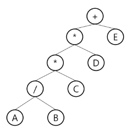
  
# 이진 탐색 트리
탐색 작업을 효율적으로 하기 위한 자료 구조
- 모든 원소는 서로 다른 유일한 키를 갖는다.
- key(왼쪽 서브트리) < key(루트 노드) < key(오른쪽 서브 트리)
- 왼쪽 서브틀와 오른쪽 서브트리도 이진 탐색 트리
- 중위 순회 하면 오름차순으로 정렬된 같은 얻을 수 있다.
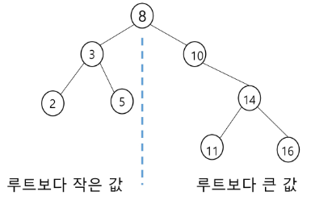
  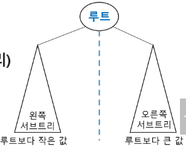
  
## 이진 탐색 트리 - 연산
### 탐색 연산
- 루트에서 시작한다.
- 탐색할 키 값 x를 루트 노드의 키 값과 비교한다.
  - (키 값 x = 루트노드의 키 값)인 경우 : 원하는 원소를 찾았으므로 탐색 연산 수행
  - (키 값 x < 루트노드의 키 값)인 경우 : 루트노드의 왼족 서브트리에 대해서 탐색연산 수행
  - (키 값 x > 루트노드의 키 값)인 경우 : 루트노드의 오른족 서브트리에 대해서 탐색연산 수행
    
- 서브트리에 대해서 순환적으로 탐색 연산을 반복한다.

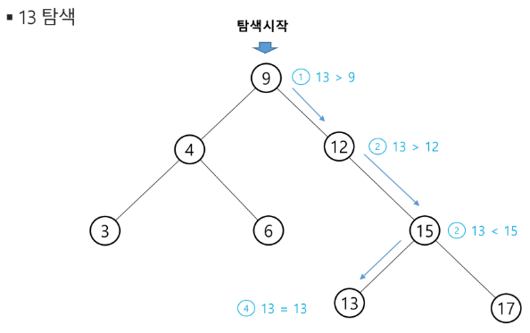

### 삽입 연산
1. 먼저 탐색 연산을 수행
- 삽입할 원소와 같은 원소가 트리에 있으면 삽입할 수 없으므로, 같은 원소가 트리에 있는지 탐색하여 확인한다.
- 탐색에서 탐색 실패가 결정되는 위치가 삽입 위치가 된다.
2. 탐색 실패한 위치에 원소를 삽입한다.

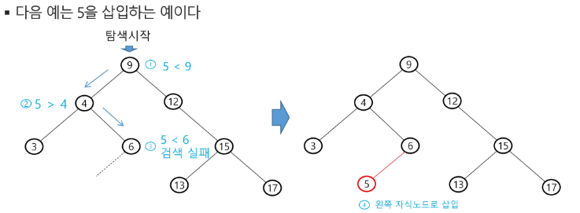

## 이진 탐색 트리 - 성능
탐색(searching), 삽입(insertion), 삭제(deletion) 시간은 트리의 높이 만큼 시간이 걸린다.
- O(h), h : BST의 깉이(height)  

평균의 경우
- 이진트리가 균현적으로 생성되어 있는 경우
- O(log n)   

최악의 경우
- 한쪽으로 치우친 경사 이진트리의 경우(편향트리)
- O(n)
- 순차탐색과 시간복잡도가 같다.

검색 알고리즘의 비교
- 배열에서의 순차 검색: O(N)
- 정렬된 배열에서의 순차 검색: O(N)
- 정렬된 배열에서의 이진탐색 : O(logN)
    - 고정 배열 크기와 삽입, 삭제 시 추가 연산 필요
- 이진 탐색 트리에서의 평균: O(logN)
    - 최악의 경우 : O(N)
    - 완전 이진 트리 또는 균형트리로 바꿀 수 있다면 최악의 경우를 없앨 수 있다.
        - 새로운 원소를 삽입할 때 삽입 시간을 줄인다.
        - 평균과 최악의 시간이 같다. O(logn)
- 해쉬 검색 : O(1)
  - 추가 저장 공간이 필요
    
이진 탐색 트리 - 연산 연습
삭제 연산 
- 리프 노드면 그냥 삭제
13 삭제
  
- 리프 노드가 아닌 경우 : 해당 노드 삭제 후 연결 시켜줌
12 삭제 후 9와 15를 연결  
9 삭제 후 6을 9 자리에 올림  

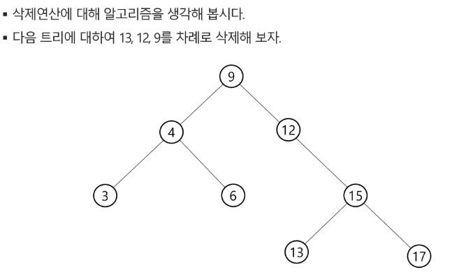

# 힙 (heap)
**완전 이진 트리**에 있는 노드 중에서 키값이 가장 큰 노드나 키값이 가장 작은 노드를 찾기 위해서 만든 자료구조  
- 우선순위 큐 : 우선순위가 높은 값 먼저 나오는 자료구조

최대 힙(max heap)
- 키값이 가장 작은 노드를 찾기 위한 **완전 이진 트리**
- {부모노드의 키값 > 자식노드의 키갑}
- 루트 노트 : 키값이 가장 큰 노드

최소 힙(min heap)
- 키값이 가장 작은 노드를 찾기 위한 **완전 이진 트리**
- {부모노드의 키값 > 자식노드의 키값}
- 루트 노드 : 키값이 가장 작은 노드

heapify
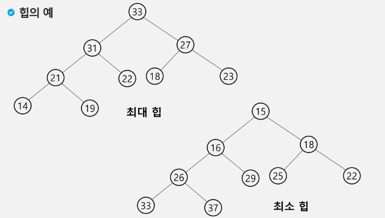

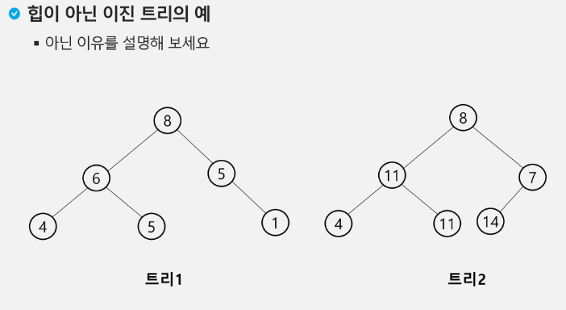

- 트리1 : 완전 이진 트리가 아님
- 트리2 : 일관성이 없음

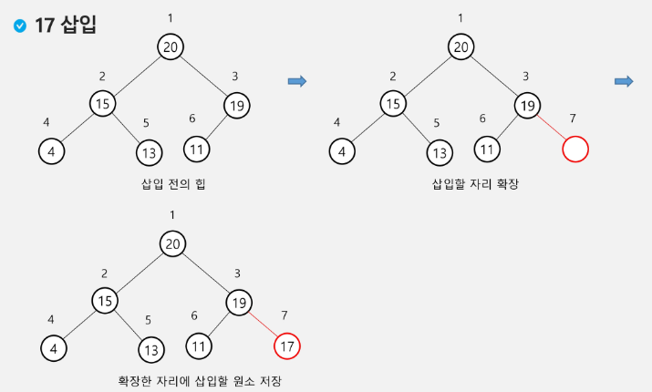
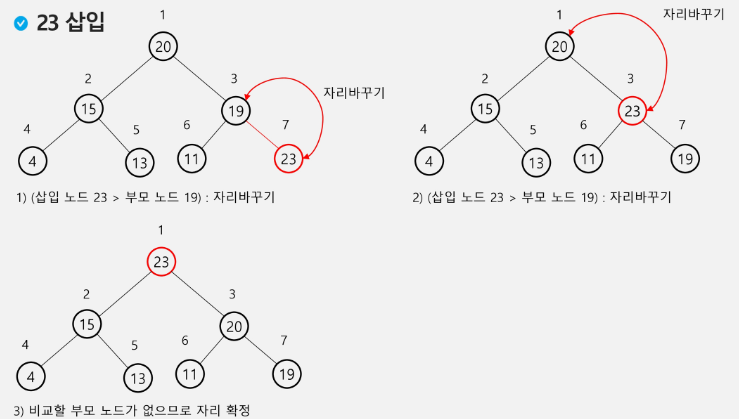

힙 연산 - 삭제
- 힙에서는 루트 노드의 원소만을 삭제할 수 있다.
- 루트 노드의 원소를 삭제하여 반환한다.
- 힙의 종류에 따라 최대값 또는 최소값을 구할 수 있다.
- 최대 힙인 경우에는 자식 노드 중 더 큰 값과 변경하기..

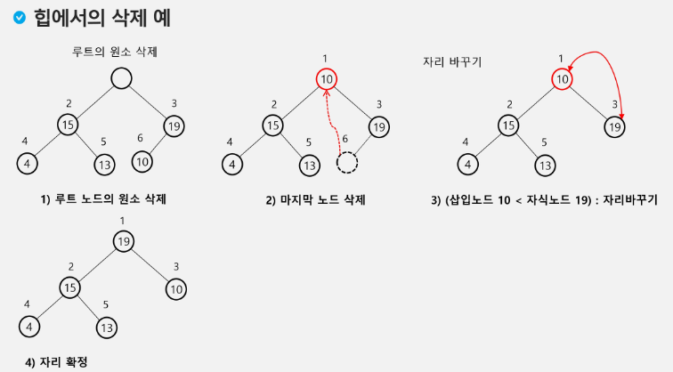
   
```python
# 1. 완전이진트리
top = h[1]
h[1] = h[last]
last -= 1

# 2. 최대힙 유지 (부모>자식)

# 자식이 업석나 부모가 크면 비교 종료
```

힙을 이용한 우선순위 큐  
힙(heap)
- 완전 이진트리로 구현된 자료구조로서, 키 값이 가장 큰 노드나 가장 작은 노드를 찾기에 용이한 자료구조
- 최소 힙(Min heap), 가장 작은 키값을 가진 노드가 항상 루트에 위치
