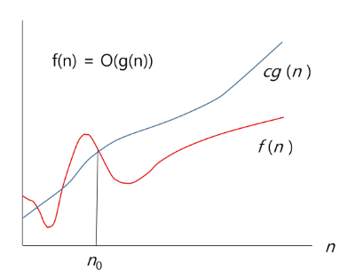
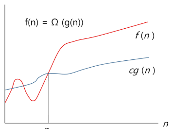
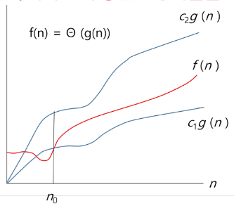

# 17. Start
# 복잡도 분석
## 알고리즘
유한한 단계를 통해 문제를 해결하기 위한 절차나 방법  
컴퓨터가 어떤 일을 수행하기 위한 단계적 방법

## 알고리즘의 효율
- 공간적 효율성고 시간적 효율성
    - 공간적 효율성은 연산량 대비 얼마나 적은 메모리 공가는 요하는 가를 말한다.
    - 시간적 효율성은 연산량 대비 얼마나 적은 시간을 요하는 가를 말한다.
    - 효율성 <-> 복잡도(Complexity) : 복잡도 높을수록 효율성은 저하


- 시간적 복잡도 분석
    - 하드위에 환경에 따라 처리 시간이 달라진다.
        - 부동소수 처리 프로세서 존재유무, 나눗셈 가속기능 유무
        - 입출력 장비의 성능, 공유 여부
    - 소프트 웨어 환경에 따라 처리시간이 달라진다.
        - 프로그램 언어의 종류
        - 운영체제, 컴파일러의 종류
    - 이러한 환경적 차이로 인해 분석이 어렵다.
    

## 복잡도의 점근적 표기
- 시간 (또는 공간)복잡도는 입력 크기에 대한 합수로 표기한는데, 주로 여러개의 항을 가지는 다항식
- 단순하기 표현하기 위한 **점근적 표기 (Asymptotic Notation**를 사용한다.
- 입력 크기 n이 무한대로 커질 때의 복잡도를 간단히 표현하기 위해 사용하는 표기법이다.
    - O(Big-Oh)표기
    - Ω(Big-Omega)표기
    - θ(Big-Theta)표기
    
## O(Big-Oh)-표기
- O-표기는 복잡도의 **점근적 상한**을 나타낸다.
- 복잡도가 f(n) = 2n^2-7n+4라면, O-표기는 O(n^2)이다.
- f(n)의 단순화된 표현은 n^2
- cn^2여도 n^2 (c > 0)

> 단순히 **"실행시간이 n^2에 비례"** 하는 알고리즘 이라고 말함.

복잡도 f(n)과 O-표기를 그래프로 나타내고 있다.
n이 증가함에 따라 O(g(n))이 점근적 상한이라는 것 (즉, g(n)이 n_0보다 큰 모든 n에 대해서 항상 f(n)보다 크다는 것)을 보여준다.



## Ω(Big-Omega)-표기
- 복잡도의 **점근적 하한**을 의미한다.
- f(n) = 2n^2 - 7n + 4의 Ω-표기는 Ω(n^2)이다.
- f(n) = Ω(n^2)은 "n이 증가함에 따라 2n^2 - 7n + 4이 cn^2보다 작을 수 없다"라는 의미이다. 상수 c=1로 놓으면 된다.
- Ω-표기도 복잡도 다항시의 최고차항만 게수 없이 취하면 된다.
- **최소한 이만한 시간은 걸린다.**

복잡도 f(n)과 O-표기를 그래프로 나타내고 있다.
n이 증가함에 따라 Ω(g(n))이 점근적 상한이라는 것 (즉, g(n)이 n_0보다 큰 모든 n에 대해서 항상 f(n)보다 작다는 것)을 보여준다.


## θ(Big-Theta)-표기
- O-표기와 Ω-표기가 같은 경우에 사용한다
- f(n) = 2n^2 + 8n + 3 = O(n^2)이므로, f(n) = θ(n^2)이다.
- f(n)은 n이 증가함에 따라 **n^2과 동일한 증가율을 가진다"라는 의미이다.

  
자주 사용하는 O-표기
O(1)     상수 시간(Constant time)
O(logn)  로그(대수) 시간 (Logarithmic time)
O(n)     선형시간 (Linear time)
O(nlogn) 로그 선형시간 (Log-linear time)
O(n^2)   제곱시간 (Quadratic time)
O(n^3)   세제곱시간 (Cubic time)
O(2^n)   지수 시간 (Exponential time)

# 표준 입출력 방법
입력
- Raw값 입력 : input()
    - 받은 입력값을 문자열로 취급
- Evaluated된 값 입력 : eval(input()
    - 받은 입력값을 평가된 데이터 형으로 취급
    
출력
- print() : 마지막에 개행 문자 포함
- print('text' , end = ''') : 마지막에 개행 문자 제외

파일의 내용을 표준 입력으로 읽어오븝 방법
```python
import sys
sys.stdin = open('a.txt','r')
```

# 비트 연산
## 비트 연산자
& : 비트단위로 AND 연산을 한다.  
| : 비트단위로 OR 연산을 한다.  
^ : 비트단위로 XOR 연산을 한다. (같으면 0 다르면 1)  
~ : 단항 연산자로서 피연산자의 모든 비트를 반전시킨다.  
<<: 피연산자의 비트 열을 왼쪽으로 이동시킨다.  
\>>: 피연산자의 비트 열울 오른쪽으로 이동시킨다.

### 1 << n
- 2^n의 값을 갖는다.
- 원소가 n개일 경우의 모든 부분집합의 수를 의미한다.
- Power set(모든 부분 집합)
    - 공집합과 자기 자신을 포함한 모든 부분집합
    - 각 원소가 포함되거나 포함되지 않는 2가지 경우의 수를 계산하면 모든 부분집합의 수가 계산된다.
    
### I & (1<<j)
- 계산 결과는 i의 j번째 비트가 1인지 아닌지를 의미한다.