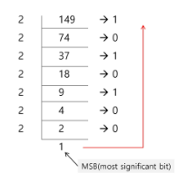
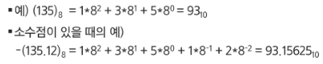
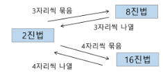
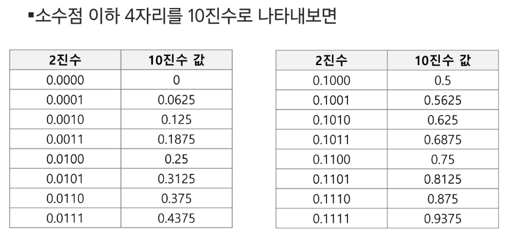
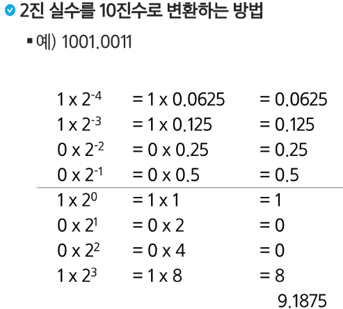
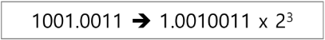

18. Start
# 비트연산
```python
# 비트 연산 예제 1 : 이진수로 표현하기
def Bbit_print(i):
    output = ""
    for j in range(7, -1, -1):
        output += '1' if i & (1 << j) else '0'
    print(output)

for i in range(-5, 6):
    print("%d = " % i, end='')
    Bbit_print(i)
```

```python
# 비트 연산 예제 2
def Bbit_print(i):
    output = ""
    for j in range(7, -1, -1):
        output += '1' if i & (1 << j) else '0'
    print(output, end = ' ')

a = 0x10 # 16
x = 0x01020304
print("%d = " % a, end = '')
Bbit_print(a)
print()

output = ''
for j in range(31, -1, -1):
    output += '1' if x & (1 << j) else '0'
print(output)

print("0%X = " % x, end = '')
for i in range(0, 4):
    Bbit_print((x >> i * 8) & 0xff)
```

엔디안(Endianness)
- 컴퓨터의 메모리와 같은 1차원 공간에 여러 개의 연속된 대상을 배열하는 방법을 의미, HW 아키텍처마다 다르다.
- 주의 : 속도 향상을 위해 바티으 단위와 워드 단위를 변환하여 연산할 때 올바로 이해하지 않으면 오류를 발생시킬 수 있다.

빅엔디안(Big-endian)
- 보통 큰 단위가 앞에 나옴. 네트워크

리틀엔디안(Little-endian
- 작은 단위가 앞에 나옴. 대다수 데스크탑 컴퓨터.

|종류|0x1234의 표현|0x12345678의 표현|
|------|---|---|
|빅 엔디안|12 34|12 34 56 78|
|리틀 엔디안|34 12|78 56 34 12|

엔디안 확인 코드
```python
import sys
print(sys.byteorder)
```
# 진수
2진수, 8진수, 10진수, 16진수

### 10진수 -> 타진수로 변환
- 원하는 타진법의 수로 나눈 뒤 나머지를 거꾸로 읽는다.



### 타 진수 -> 10진수로 변환


### 2진수, 8진수, 16진수간 변환


### 컴퓨터에서의 음의 정수 표현 방법
- 1의 보수 : 부호와 절대값으로 표현된 값을 부호 비트를 제외한 나머지 비트들을 0은 1로, 1은 0으로 변환한다.   
  - 모두 거꾸로 뒤집음  
  -6: 1 0 0 0 0 0 0 0 0 0 0 0 0 0 0 1 1 0 : 1  
  -6: 1 1 1 1 1 1 1 1 1 1 1 1 1 0 0 1 : 1의 보수 표현
  
- 2의 보수 : 1의 보수방법으로 표현된 값의 최하위 비트에 1을 더한다.  
  - 앞쪽부터 1로 채워져있으면 음수다 ~ 생각하기  
  - 2의 보수 표현에서는 -6에 6 더해주면 00000 출력  
-6: 1 1 1 1 1 1 1 1 1 1 1 1 1 0 1 0: 2의 보수표현
    
# 실수



## 실수의 표현
- 컴퓨터는 실수를 표현하기 위해 부동 소수점(floating-point 표기법을 사용
- 부동 소수점 표기 방법은 소수점의 위치를 고정시켜 표현하는 방식이다.
- 소수점의 위치를 왼쪽의 가장 유효한 숫자 다을으로 고정시키고 밑수의 지수승으로 표현
