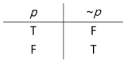
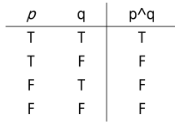
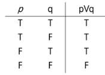
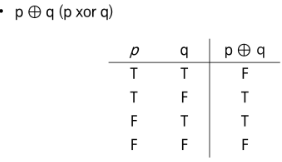
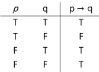
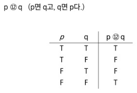
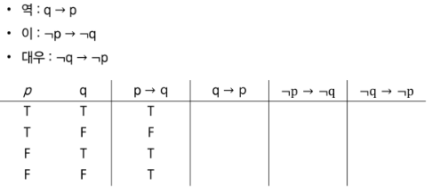
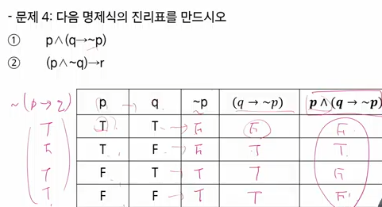
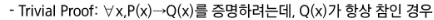
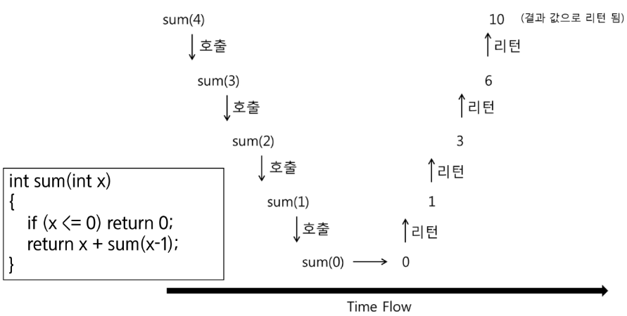

# 19. Computational Thinking
# 0. 서론 - 프로그래밍과 논리/수학
프로그래밍의 어려운 점 두 가지
- 프로그래밍 언어 문법과 라이브러리 사용
- 논리 (Hard Logic)

## 논리 (Hard Logic)
- Hard VS Soft

### 카드문제  
사실 : 모든 카드의 한쪽에는 알파벳이, 다른 쪽에는 숫자가 써 있음  
  주장 : 만약 한 쪽이 D이면 반대쪽은 3
- 주장이 사실인지 확인하기 위해 다음 카드 중 뒤집어 보아야하는 것은 몇개인가?

- 답은 D와 7
- 3 뒤에 D가 있든 없든 주장이 사실인지 여부에 영향이 없음
- 7 뒤에 D가 있으면 주장이 성립하지 않게됨

### 멕주집 문제
규칙: 20세 이하인 사람은 맥주를 마실 수 없음
- 나이 혹은 마시고 있는 것을 표시한 다음 4명 중 확인이 필요한 사람은 몇명이고 누구인가?

- 답은 17세와 맥주
- 카드 문제와 논리적 구성이 완전히 동일함

Hard VS Soft Logic
- 맥주집 문제를 풀 때는 직관을 사용
- 직관은 논리적인 느낌을 주는 것
- 직관은 빠르지만 정확하지 않음

프로그래밍은 Hard Logic을 사용
- 사용되는 수 많은 알고리즘들을 이해하기 위해서는 Hard Logic이 필요
- Soft Logic으로 알고리즘을 이해하려고 하면 어려움이 있다.

# 참고
- 명제
  - 참이나 거짓을 알 수 있는 식이나 문자
  - p q r 로 표현
  
- 진릿값
  - 참이나 거짓을 표현
  - T, F 또는 1, 0
  
연산 (결합)
- 부정 NOT
  - p 가 명제일 일때, 명제의 진리값이 반대
  - ~p (not p 또는 p의 부정으로 읽음)  
  
    
- 논리곱 AND
  - p, q가 명제일 떄, p, q 모두 참일 때만 참이 되는 명제
  - p ^ q ( p and q, p 그리고 q)
  
    
- 논리합 OR
  - p, q가 명제일 떄, p, q 모두 거짓일 때만 거짓이 되는 명제
  - p V q ( p and q, p 또는 q)  
  
    
- 배타적 논리합 XOR
  - p, q가 명제일 떄, p, q 하나만 참일 때 참이 되는 명제
  
    
합성
- 연산자 우선순위⭐⭐⭐⭐⭐
  - 
  - not > or, and > -> <- (조건 명제)
- 항진명제 : 진리값이 항상 참
- 모순명제 : 진릿값이 항상 거짓
- 사건 명제 : 항진명제도 모순명제도 아닌 명제
- 조건 명제
  - p,q가 명제일 떼, 명제 p가 조건(또는 원인), q가 결론(또는 결과)로 제시되는 명제
  - p -> q (p이면 q이다.)  
  
    
- 쌍방 조건 명제
  - p,q가 명제일 떼, 명제 p와 q가 모두 조건이면서 결론인 명제  
    
    
- 조건 명제의 역, 이 대우

  
논리 연습
- p이면 q이다에서 p가 거짓이라면 q의 진리 여부와 상관 없이 모순 명제이다.  

  
증명
- 증명은 정확한 명제식으로 표현할 수 있는 것이라야함
- 근본적으로 명제식으로 바꿀 수 있음

수학적 귀납법 : P(1)이 참이고, P(n) -> P(n+1)이 참이면 P(n)은 모든 자연수 n에 대해서 참이다
수학적 귀납법에서는 P(n) -> P(n+1)이 참임을 보이는 것일 분이므로, P(n)이 정말로 참일 필요는 없음

증명 방법  

# 4. 기초 수식 ⭐⭐⭐⭐⭐
- 알고리즘의 시간 복잡도를 표현할 수 있는 다양한 수식들이 존재
- 풀이법을 익혀 두어야 알고리즘의 시간 복잡도를 계산할 수 있고, 알고리즘이 시간이 얼마나 걸릴지 예측할 수 있다.

# 5. 재귀
자기 자신을 호출하는 함수
기저 조건을 통해 함수를 종료할 수 있도록 함

수학적 귀납법 증명에 사용이 가능하다.
- n이 0일 때 문제를 풀 수 있음
- n-1에서 문제를 풀 수 있으면 n에서도 문제를 풀 수 있다.  
위 두 가지가 사실이면 모든 가능한 n에 대해 문제를 풀 수 있다는 것이 사실
  

- 문제 해결 과정에서 부분 문제가 동일한 문제인 경우!

# 6. 동적 프로그래밍
- 재귀 함수에서 동일한 입력의 함수 호출이 반복적으로 일어날 때 그 결과 값을 저장해두고 불러 쓰는 것이다.(Memoization)
- 최초 입력에서 파생되는 모든 가능한 입력에 대한 답을 모두 저장할 수 있는 메모리가 있어야 한다.
- 단순히 재귀에서 저장된 값을 찾아보는 것으로도 가능하지만, 결과 값을 순서를 정해서 계산할 수도 있다, (Dynamic Programming)

3의 배수 증명
진릿값 시간복잡도