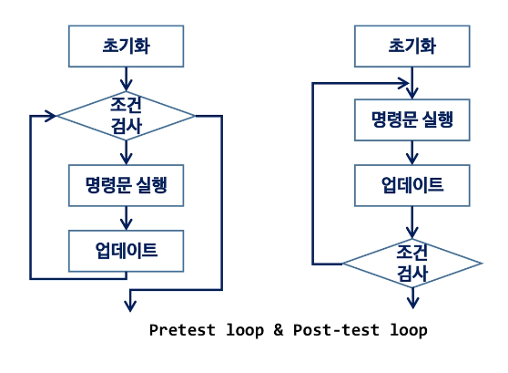
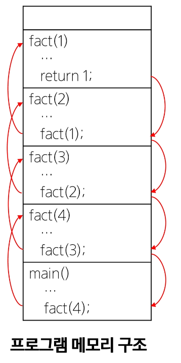
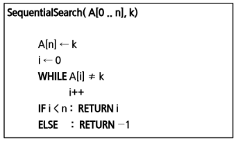
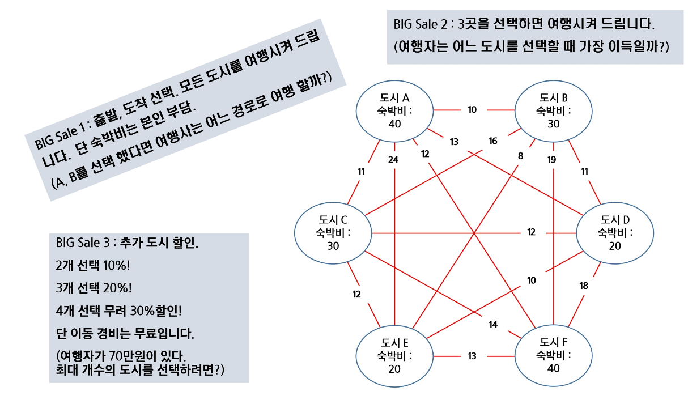
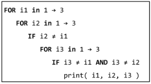
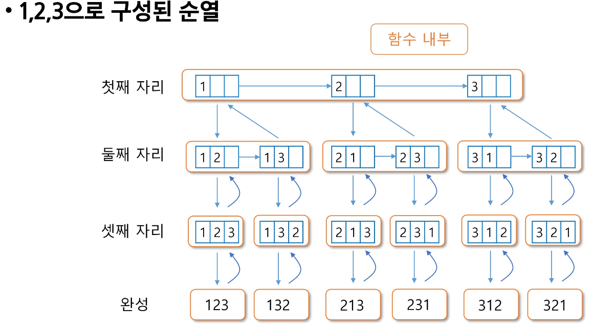
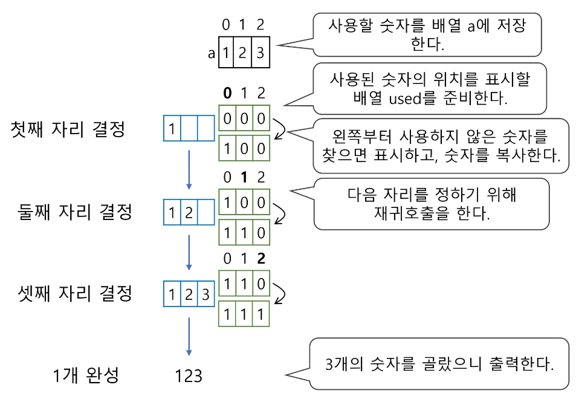
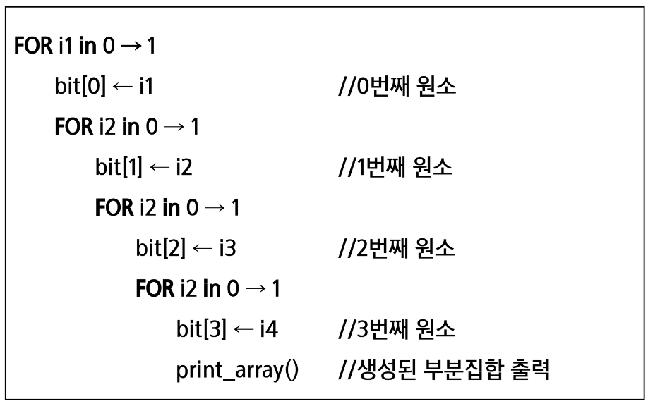
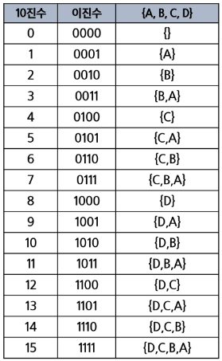

# 20. 완전 검색 & 그리디
# 반복(Iteration)과 재귀(Recursion)
반복은 숭행하는 작업이 완료될 때가지 계속 반복
- 루프 (for, while)

재귀는 주어진 문제의 해를 구하기 위해 동일하면서 더 작은 문제의 래를 이용하는 방법
- 하나의 큰 문제를 해결할 수 있는(해결하기 쉬운) 더 작은 문제로 쪼개고 결과들을 결합한다.
- 재귀 함수로 구현

## 반복구조
- 초기화
    - 반복되는 명령무늘 실행하기 전에(한번만) 조건 검사에 사용할 변수의 초기값 설정
  
- 조건 검사 (check contril expression)
- 반복할 명령문 실행 (action)
- 업데이트 (loop update)
    - 무한 루프(infinite loop)가 되지 않게 조건이 거짓(false)이 되게 한다.
    


### 반복을 이용한 선택 정렬
```python
def SelectionSort(A):
    n = len(A)
    for i in range(0, n-1):
        mini = i
        for j in range(i+1, n):
            if A[j] < A[mini]:
                mini = j
        A[mini], A[i] = A[i],A[mini]
```

## 재귀적 알고리즘
재귀의 정의는 두 부분으로 나뉜다.
1. 하나 또는 그 이상 기본 경우(basis case or rule)
    - 집합에 포함되어 있는 원소로 induction을 생성하기 위한 시드(seed) 역할
2. 하나 또는 그 이상이 유도된 경우(inductive case or rule)
    - 새로운 집합의 원소를 생성하기 위해 결합되어지는 방법
    
## 재귀 함수 (recursive function)
- 함수 내부에서 직접 혹은 간접적으로 자기 자신을 호출하는 함수
- 일반벅으로 재귀적 정의를 이용해서 재귀 함수를 구혆난다.
- 기본 부분(basis part)와 유도 부분(inductive part)로 구성
- 재귀적 프로그램을 작성하는 것은 반복 구조에 비해 간결하고 이해하기 쉽다.
- 함수 호출은 프로그램 메모리 구조에서 스택을 사용한다. 따라서 재귀 호출은 반복적인 스택의 사용을 의미하며 메모리 및 속도에서 성능저하가 발생한다.

### 팩초리어 재귀 함수
- 재귀적 정의
```    
Basis rule:
    N <= 1 경우, n = 1
Inductive rule:
    N > 1, n! = n * (n-1)!
  ```
- n!에 대한 재귀함수
```python
def fact(n):
    if n <= 1:
        return 1        // Basis part
    ekse:
        return n * fact(n-1)    // Inductive part
  ```


## 반복 또는 재귀?
- 해결할 문제를 고려해서 반복이나 재귀의 방법을 선택
- 재귀는 문제 해결을 위한 알고리즘 설계가 간단하고 자연스럽다.
    - 추상 자료형 (List, tree 등)의 알고리즘은 재귀적 구현이 간단하고 자연스러운 경우
    
- 일반적으로, 재귀적 알고리즘은 반복(Iterative) 알고리즘보다 더 많은 메모리와 연산을 필요로 하낟.
- **입력 값 n이 커질수록 재귀 알고리즘은 반복에 비해 비효율적일 수 있다.**

## 반복과 재귀의 비교
| |재귀|반복|
|:-----:|:-----:|:-----:|
|종료|재귀 함수 호출이 종료되는 베이스 케이스(base case)|반복문의 종료 조건|
|수행 시간|(상대적) 느림|빠름|
|메모리 공간|(상대적) 많이 사용|빠름|
|소스 코드 길이|짧고 간결|적게 사용|
|소스 코드 형태|선택 구조(if...else)|반복 구조(for, while|
|무한 반복사|스택 오버플로우|CPU를 반복해서 점유|

### 2^k 연산에 대한 재귀와 반복
재귀
```python
def power_of_2(k):
    if k == 0:
        return 1
    else:
        return 2 * power_of_2(k -1)
```

반복
```python
def power_of_2(k):
    i = 9
    power = 1
    while i < k:
        power = power * 2
    i = i + 1
    return power
```

# 문제 : Baby gin
설명
- 0~9 사이의 숫자 카드에서 임의의 카드 6장을 뽑았을 때, 3장의 카드가 연속적인 번호를 갖는 경우를 run이라고 하고, 3장의 카드가 동일한 번호를 갖는 경우를 triplet 이라고 한다.
- 6장의 카드가 run과 triplet로만 구성된 경우를 baby-gin으로 부른다
- 6자리 숫자를 입력 받아 baby gin 여부를 판단하는 프로그램을 작성하라.

## 고지식한 방법(brute force)
- brute-force는 문제를 해결하기 위한 간단하고 쉬운 접근법이다.
- 대부분의 문제에 적용 가능
- 상대적으로 빠른 시간에 문제 해결(알고리즘 설계)할 수 있음
- 문제에 포함된 자료(요소, 인스턴스)의 크기가 작다면 유용함
- 학술적 또는 교육적 목적을 위해 알고리즘 효율성을 판단하기 위한 척도로 사용된다.

Brute-force 탐색(sequential search)
- 자료들의 리스트에서 키 값을 찾기 위해 첫 번재 자료부터 비교하면서 진행한다.
- 결과 : 탐색 성공 / 탐색 실패

  
## 완전 검색으로 시작하라.
- 모든 경우의 수를 생성하고 쳄스트하기 때문에 수행 속도는 느리지만, 해답을 찾아내지 못할 확률이 작음
    - 완전 검색은 입력의 크기를 작게 해서 간편하고 빠르게 답을 구하는 프로그램을 작성
    
- 이를 기반으로 그리디 기법이나 동적 계획법을 이용해서 효율적인 알고리즘을 찾을 수 있다.
- **우선 완전 점색으로 접근하여 해답을 도출한 후, 성능 개선을 위해 다른 알고리즘을 사용하고 해답을 확인하는 것이 바람직하다.**

### 완전 검색을 통한 Baby-gin 접근
- 고려할 수 있는 모든 경우의 수 생성하기
    - 6개의 숫자로 만들 수 있는 모든 숫자 나열(중복 포함)
    
- 해답 테스트하기
    - 앞자리 3자리와 뒤의 2자리를 잘라, run와 triplet 여부를 테스트하고 최종적으로 baby-gin을 ㅠ
    
## 완전 검색
- 많은 졸유의 문제들이 특정 조건을 만족하는 경우나 요소를 찾는 것이다.
- 또한, 이들은 전형적으로 순열(permutation), 조합(combination), 그리고 부분 집합(subsets)과 같은 조합적 문제들(combinatorial problems)과 연관 된다.
- 완전 검색은 조합적 문제에 대한 brute force 방법이다.

# 여행사 BiG sale


# 순열 (Permutation)
- 서로 다른 것들 중 몇개를 뽑아서 한줄로 나열하는 것
- 서로 다른 n개 중 r개를 택하는 순열은 아래와 같이 표현한다.  
nPr
  
- nPr의 수식
    -  nPr = n x (n-1) x (n-2) x ... x (n-r+1)
    
- nPn = n! : Factorial
  - n! = n x (n-1) x (n-2) x .. x 2 x 1
    
- 다수의 알고리즘 문제들은 수선화된 연소들의 집합에서 최선의 방ㅂㅂ을 찾는 것과 관련 있다.
- N개의 요소들에 대해서 n!개의 순열들이 존재한다.
    - n > 12인 경우, 시간 복잡도 폭발적으로 높아짐
    
### 단순하게 순열을 생성하는 방법
예) [1, 2, 3]을 포함하는 모든 순열을 생성하는 함수
- 동일한 숫자가 포함되지 않았을 때, 각 자리 수 별로 loop을 아용해 아래와 같이 구현할 수 있다.

  
- 사전적 순서(Lexicographuc-Order)
    - [1, 2, 3], n = 3인 경우 다음과 같이 생성된다.
    - [1 2 3] [1 3 2] [2 1 3] [2 3 1] [3 1 2] [3 2 1]
    
- 최소 변경을 통한 방법(Minimum-exchange requirement)
    - 각각의 순열들은 이전의 상태에서 단지 두 개의 요소들 교환을 통해 생성
    
## 재귀 호출을 통한 순열 생성
```python
# p[] : 데이터가 저장된 배열
# k : 원소의 개수, n: 선택된 원소의 수
def perm(i, k):
    if i == k:
        print(array) # 원하는 작업 수행
    else:
        for j in range(i, k):
            p[i], p[j] = p[j], p[i]
            perm(i + 1, k)
            p[i], p[j] = p[j], p[i]
```



```python
# p[] : 데이터가 저장된 배열
# k : 원소의 개수, n: 선택된 원소의 수
# used[n-1] : 사용여부, p: 결과 정장 배열
def perm(i, k):
    if i == k:
        print(array) # 원하는 작업 수행
    else:
        for j in range(0, k): # 모든 원소에 대하여
            if not used[j] # 사용된 적이 없으면
                p[i] = arr[j] # 순열에 사용
                used[j] = True # 사용된으로 표시
                perm(i+1, k)
                used[j] = False # 다른 자리에서 사용 가능
```

# 부분 집합
- 집합에 포함된 원소들을 선택하는 것이다.
- 다수의 중요 알고리즘들이 원소들의 그룹에서 최적의 부분 집합을 찾는 것이다.
- N개의 원소를 포함한 집합
  - 자기 자신과 공집합 포함한 모든 부분집합(power set)의 개수는 2^n 개
  - 원소의 수가 증가하면 ㅂ분집합의 개수는 지수적으로 증가
  
### 단순하게 모든 부분 집합 생성하는 방법
4개 원소를 포함한 집합에 대한 power set 구하기


바이너리 카운팅을 통한 사전적 순서(Lexicographic Order)
- 부분집합을 생성하기 위한 가장 자연스로운 방법이다.
- 바이너리 카운팅(Binary Counting)은 사전적 순서로 생성하기 위한 가장 간단한 방법이다.

바이너리 카운팅(Binary Counting)
- 원소 수에 해당하는 N개의 비트열을 이용한다.
- n번째 비트값이 1이면 n번째 원소가 포함되었음을 의미한다.

  
바이너리 카운팅을 통한 부분집합 생성 코드 예
```python
arr = [3, 6, 7, 1, 5, 4]
n = len(arr)

for i in range(0, (1 << n)) # 1 << n : 부분집합의 새ㅜ
    for j in range(0, n)    # 원소의 수만큼 비트를 비교함
        if i % (1 << j) # i와 j 번째 비트가 1이면 j 번재 원소 출력
            print('%d'%arr[j], end = '')
    print()
```