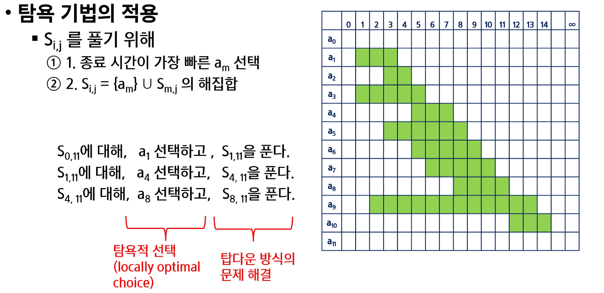
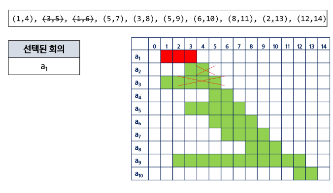

# 21. Greedy
# 조합
- 서로 다른 n개의 원소 중 r개를 순서 없이 골라낸 것을 조합(combination)이라고 부른다.

  
재귀 호출을 이용한 조합 생성 알고리즘
```python
# an[] : n개의 원소를 가지고 있는 배열
# tr[] : r개의 크기의 배열, 조합이 임시저장될 배열
def comb(n, r):
    if r == 0:
        print_arr()
    elif n < r:
        return
    else:
        tr[r-1] = an[n-1] # 미리 선택
        comb(n-1, r-1) # 선택한 것을 포함
        comb(n-1, r) # 선택한 것을 포함시키지 안흔 ㄴ것
```


10개의 원소중 3개를 고르는 조합
- i < j < k라고 하면,


```python
for i in range(8): # j, k로 선택될 원소를 남김
    for j in range(i+1,9) # k로 선택될 원소를 남김
        for k in range(j+1, 10)
             f(a[i], a[j], a[k])
```

n개에서 r개를 고르는 조합

```python
def nCr(n, r, s) # n개에서 r개를 고르는 조합, s 선택할 수 있는 구간의 시작
if r == 0:
    print(*comb)
else:
    for i in range(s, n-r+1):
    comb[r-1] = A[i]
    nCr(n, r-1, i+1)
```

# 탐욕 알고리즘 (Greedy)
- 최적해를 구하는 데 사용되는 근시안적인 방법
- 일반적으로, 머리속에 떠오르는 생각을 검증없이 구현하면 Greedy 접근
- 여러 경우 중 하나를 선택할 때마다 그 순간에 최적이라고 생각되는 것을 선택해 나가는 방식으로 진행하여 최종적인 해답에 도달한다.
- 각 선택 시점에서 이루어지는 결정은 지역적으로 최적이지만, 그 선택들을 계속 수집하여 최종적인 해답을 만들었다고 하여, **그것이 최적이라는 보장은 없다.**
- 한 번 선택된 것은 반복하지 X, 이런 특성 때문에 대부분의 탐욕 알고리즘은 단순하며 제한적인 문제에 적용
- **최적화 문제(optimization)란 가능한 해들 중에서 가장 좋은(최대 또는 최소) 해를 찾는 문제이다.**

## 탐욕 알고리즘의 동작 과정
1) 해 선택 : 현재 상태에서 부분 문제의 최적 해를 구한 두;, 이를 부분해 집합(Solution Set)에 추가한다.
2) 실행 가능성 검사: 새로운 부분 해 집합이 실행 가능하지를 확인한다. 곧 문제의 제약 조건을 위반하지 않는 지를 검사한다.
3) 해 검사: 새로운 부분 해 집합이 문제의 해가 되는지를 확인한다. 아직 전체 문제의 해가 완성되지 않았다면 1의 해 선택부터 다시 시작한다.

### 거스름돈 줄이기 with Greedy
1) 해 선택: 단위가 가장 큰 동전으로만 거스름 돈을 만들면 동전의 개수가 줄어들므로 현재 고를 수 있는 가장 단위가 큰 동전을 하나 골라 거스름돈에 추가한다.
2) 실행 가능성 검사 : 거스름돈이 손님에게 내드려야 할 액수를 초과하는지 학인한다. 초과한다면 마지막에 추가한 동전을 거스름 돈에서 빼고, 1로 돌아가서 현재보다 한 단계 자근 단위의 동전을 추가한다.
3) 해 검사: 거스름돈 문제의 해는 거스름돈이 손님에게 내드려야 하는 액수와 일치하는 셈이다. 더 드려고, 덜 드려도 안되기 때문에 거스름돈을 확인해서 액수에 모자라면 다시 1로 돌아가서 거스름돈에 추가할 동전을 고른다.

최적해를 반드시 구한다는 보장이 없다.


### 배낭 짐싸기(Knapsack)
- 도둑이 훔친 물건을 배낭에 담아오려고 한다. 배남은 담을 수 있는 물건의 총 무게(W)가 정해져 있다.
- 창고에는 여러 개(n개)의 물건들이 있고 각각의 물건에는 무게와 값이 정해져 있다.
- 수용 가능한 무게를 초과하지 않으면서, 값이 최대가 되는 물건들을 담자

  
### Knapsack 문제 유형
0-1 Knapsack
- 배만에 물건을 통째로 다마야 하는 문제
- 물건을 쪼갤 수 없는 경우

Fractional Knapsack
- 물건을 부분적으로 담는 것이 허용되는 문제
- 물건을 쪼갤 수 있는 경우

0-1 Knapsack에 대한 완전 검색 방법


0-1 Knapsack에 대한 탐욕적 방법 1


0-1 Knapsack에 대한 탐욕적 방법 2


0-1 Knapsack에 대한 탐욕적 방법 3


Fractional Knapsack문제


## 활동 선택(Activity-selection) 문제
### 회의실 배정하기
- 회의실 사용 신청 처리하는 업무, 사용 가능 회의실은 하나, 다수의 회의가 신청된 상태
- 회의는 시작 시간과 종료 시간이 있으며, 회의 시간이 겹치는 회의들은 동시에 열릴 수 없다.
- 가능한 많은 회의가 열리기 위해서는 어떠헥 배정해야 할까?
- 입력 예 : 회의 개수 / (시작시간, 종료 시간)
```
10
1 4 1 6  6 10 5 7 3 8 5 9 3 5 8 11 2 13 12 14
```








```
A : 정렬된 활동들의 집합
S : 선택된 활동(회의)들의 집합
si: 시작시간, fi: 종료시간, 0 <= i < n+1

Recusive_Selection(i, j)
    m <- i + 1
    
    WHILE m < j AND sm < fi // 종료 시간이 가장 빠른 활동 선택
        m < m + 1
    IF m <j : RETURN {am} U Recursive_Selection(m,j)
    ELSE : RETURN{} // 공집합
 ```

## 탐욕적 알고리즘의 필수 요소
탐욕적 선택 속성(greedy choice property)
- 탐욕적 선택은 최적해로 갈 수 있음을 보여라
        - 즉, 탐욕적 선택은 항상 안전하다.
  
최적 부분 구조(optimal substructure property)
- 최적화 문제를 정형화하라
    - 하나의 선택을 하면 풀어야 할 하나의 하위 문제가 남는다
    
**[원문제의 치적해 = 탐요적 선태 + 하위 문제의 최적해] **

탐욕 기법과 동적 계회법의 비교

|탐욕 기법|동적 계획법|
|:------:|:---:|
|매 단계에서, 가장 좋게 보이는 것을 빠르게 선택한다. -> 지역 최적 선택(local optimal choice)|매 단계 선택은 해결한 하위 문제의 해를 기반으로 한다.|
|하위 문제를 풀기 전에 (탐욕적) 선택이 먼저 이루어진다.|하위 문제가 우선 해결된다.|
|Top-down 방식|Bottom-up 방식|
|일반적으로, 빠르고 간결하다.|좀 더 느리고, 복잡하다.|

