# 01. HTML/CSS
# 웹 소개

## World Wide Web
인터넷으로 연결된 컴퓨터들이 정보를 공유하는 거대한 정보 공간

Web
- web site, web application 등을 통해 사용자들이 정보를 검색하고 상호 작용하는 기술

Web site
- 인터넷에서 여러개의 **Web page**가 모인 것으로, 사용자들에게 정보나 서비스를 제공하는 공간

Web page
- HTML, CSS 등의 웹 기술을 이용하여 만들어진, **"Web site"를 구성하는 하나의 요소**

Web page 구성 요소
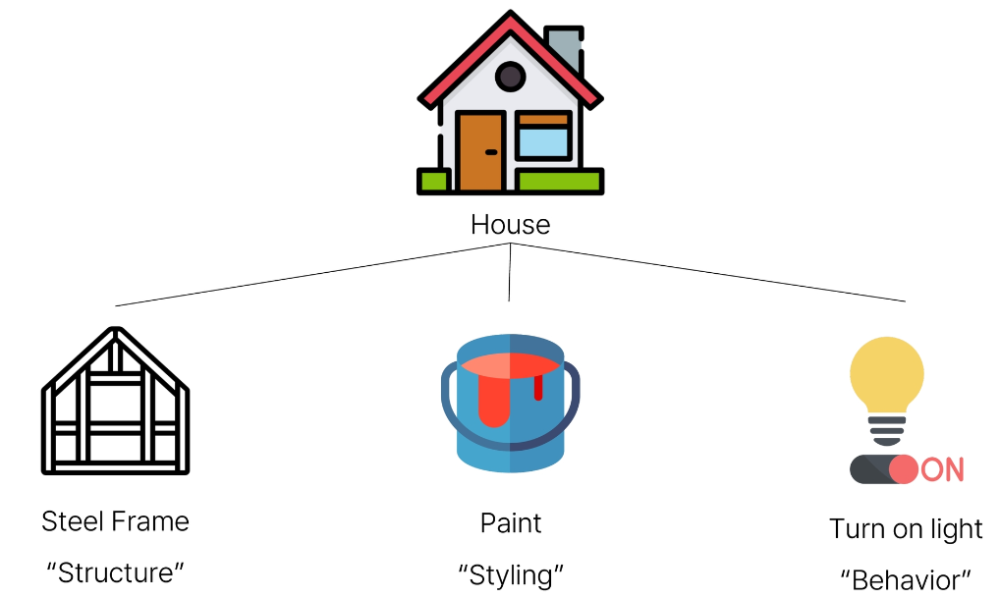  
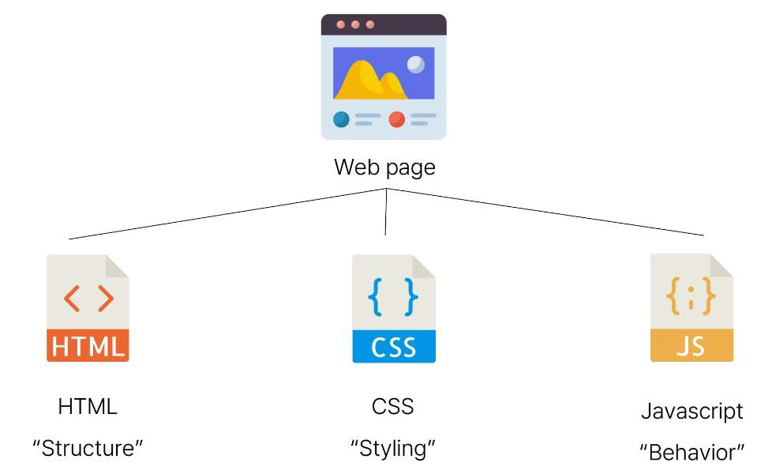

html -  구조  
css - 스타일링  
js - 동작

# 웹 구조화
## HTML : HyperText Markup Language
웹 페이지의 의미와 **구조(뼈대)**를 정의하는 언어

Hypertext
- 웹 페이지를 다른 페이지로 연결하는 링크
- 참조를 통해 사용자가 한 문서에서 다른 문서로 즉시 접근할 수 있는 텍스트

Markup Language
- 태그 등을 이용하여 문서나 데이터의 구조를 명시하는 언어
- ex) HTML, Markdown

Markup Language 예시
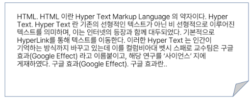  
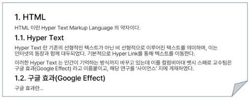  
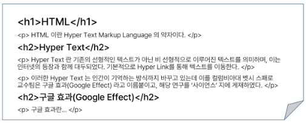  
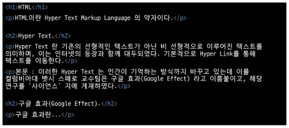  

## Structure of HTML
```html
<!-- 저장 후 alt + b : 웹페이지로 확인 가능-->
<!DOCTYPE html>
 <html lang='en'> <!--어떤 언어로 읽혀야 하는지 -->
 <head>
    <meta charset="UTF-8"> <!-- 닫힌 태그가 없는 것 -->
    <title>My page</title>
</head>
<body>
    <p>This is my page</p>
</body>
</html>
```

태그들 사이에 상하관계가 존재한다.
- <\!DOCTYPE html>
    - 해당 문서가 html로 문서라는 것을 나타냄
- <html></html>
    - 열린 태그와 닫힌 태그
    - 전체 페이지의 콘텐츠를 포함
- <title></title>
    - 브라우저 탭 및 즐겨찾기 시 표시되는 제목으로 사용
- <head></head>
    - HTML 문서에 관련된 설명, 설정 등
    - 사용자에게 보이지 않음
    - 문서정보, 메타정보 입력 위치
    - 제목, 스타일, 외부파일로드
        - title, link, meta 등의 태그
- <body></body>
    - 페이지에 표시되는 모든 콘텐츠


### HTML Element(요소)
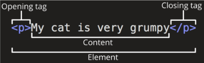

하나의 요소는 여는 태그와 닫는 태그 그리고 그 안의 내용으로 구성됨  
닫는태그는 태그 이름 앞에 슬래시가 포함되며 닫는 태그가 없는 태그도 존재

### HTML Attributes(속성)
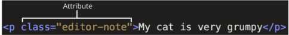

속성명="속성값" : 공백은 NO  
- 속성을 통해 태그의 부가적인 정보를 설정할 수 있음  
- 요소는 속성을 가질 수 있으며, 경로나 크기와 같은 추가적인 정보를 제공  
- 요소의 시작 태그에 작성하며 보통 이름과 값이 하나의 쌍으로 존재
- 태그와 상괎업이 사용가능한 속성(HTML Global Attribute)들도 있음


HTML Global Attribute
- 모든 HTML 요소가 공통으로 사용할 수 있는 대표적인 속성 (몇몇 요소에는 아무 효과가 없을 수 있음)
    - id : 문서 전체에서 유일한 고유 식별자 지정
    - class : 공백으로 구분된 해당 요소의 클래스의 목록(CSS, JS에서 요소를 선택하거나 접근)
    - style: inline 스타일

규칙
- 속성은 요소 이름과 속성 사이에 공백이 있어햐함
- 하나 이상의 속성들이 있는 경우엔 속성 사이에 공백으로 구분 함
- 속성 값은 열고 다는 따옴포료 감사야 함

목적
- 나타내고 싶지 않지만 **추가적인 기능, 내용**을 담고 싶을 때 사용
- CSS에서 해당 **요소를 선택**하기 위한 값으로 활용됨

```html
<!-- 저장 후 alt + b : 웹페이지로 확인 가능-->
<!DOCTYPE html>
 <html lang='en'> <!--어떤 언어로 읽혀야 하는지 -->
 <head>
    <meta charset="UTF-8"> <!-- 닫힌 태그가 없는 것 -->
    <title>My page</title>
</head>
<body>
    <p>This is my page</p> <!-- 기본 속성이 없는 태크 -->
    <a href="https://www.google.co.kr">Google</a> <!-- a 태그에 href을 입력 -->
     <!-- 이미지 주소 입력 : 로컬, 인터넷 모두 가능 -->
     <!-- 스크린 읽기에서 alt 값을 읽음 -->
</body>
</html>
```

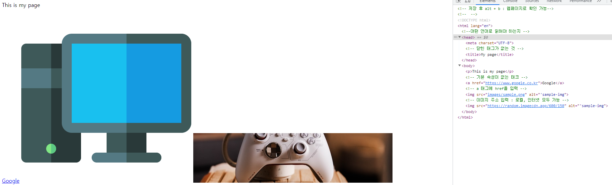

## TEXT Strucutre
HTML TEXT Structure
- HTML의 주요 목적 중 하나는 **텍스트 구조와 의미**를 제공하는 것

HTML : HyperText Markup Language
- 웹 페이지의 **의미**와 구조를 정의하는 언어

\<h1>Heading\</h1>
- 예를 들어 h1 요소는 단순히 텍스트를 크게만 만드는 것이 아닌 현재 **문서의 최상위 제목**이라는 의미를 부여하는 것


### 대표적인 HTML Text structure
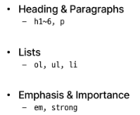

- h1 : 제목 , p: anseks
- list : ol, ul, li
- em : 기울임 strong : 볼드
 
+) 시멘틱 태그와 논시맨틱 태그
- 시맨틱 태그 :  의미를 가지는 태그
    - h1, .. head, html, a, b, i, em
- 논시멘틱 태그 : 의미를 가지지 않는 태그
    - ex) div(블럭 컨테이너), span(인라인 컨테이너)

그룹 컨텐트
<p></p> 하나의 문단 (paragraph)
<hr> 주제를 분리하기 위한 수평선(A Hptizontal Rule)
<div></div> 의미없는 블럭 컨테이너

form 태그 : 정보 -> 서버 제출
<form>은 사용자의 정보(데이터)를 제출하기 위한 영역

input label
- 초점을 맞추거나 활성화 시킬 수 있음

input의 유형
- text: 일반 텍스트 입력
- password: 입력 시 값이 보이지 않고 문자를 특수기호(*)로 표현
- email: 이메일 형식이 아닌 경우 form 제출 불가
- number: min, max, step 속성을 활용하여 숫자 범위 설정 가능
- file: accept 속성을 활용하여 파일 타입 지정 가능
- checkbox: 다중 선택
    - 동일한 범주에 속하는 항목들은 name을 통일
- radion : 단일 선택

구조
- header
- section
- footer : <footer></footer>

HTML Text structure 예시
```html
<!DOCTYPE html>
<html lang = 'en'>
    <meta charset='UTF-8'> 
    <meta name="viewport" content="width=devixe-width, initia">
    <title>Document</title>
</html>
<body>
    <h1>main heading</h1>
    <h2>sub heading</h2>
    <p>this is my page</p>
    <!-- em : 기울임체 / strong : 볼드체 -->
    <p>this is <em>empahsis</em></p>
    <p>Hi my <strong>name is</strong> air</p>
    <ol> 
        <!-- ol(orderd list) : 정렬된 리스트여서 숫자가 붙어나옴
        <-> ul(unorderd list) : 정렬되지 않은 리스트 -->
        <li>파이썬</li>
        <li>알고리즘</li>
        <li>웹</li>
    </ol>
</body>
```
웹 특성상 디버깅이 어렵다 ! 출력되지 않음을 보고 수정해야한다.

# 웹스타일링
# CSS : Cascading Style Sheet
웹 페이지의 **디자인**과 **레이아웃**을 구성하는 언어  
스타일을 지정하기 위한 언어  
HTML요소를 선택하고, 스타일을 지정한다.

- CSS 구문은 섵개자를 통해 스타일을 지정할 HTML요소를 선택
- **중괄호 안에서는 속성고 값**, 하나의 쌍으로 이루어진 선언을 진행
- 각 쌍은 선택한 요소의 속성, 속성에 부여할 값을 의미
    - 속성(Property) : 어떤 스타일 기능을 변경할지 결정
    - 값(Value) : 어떻게 스타일 기능을 변경할지 결정

css를 적용하지 않은 웹 사이트 모습
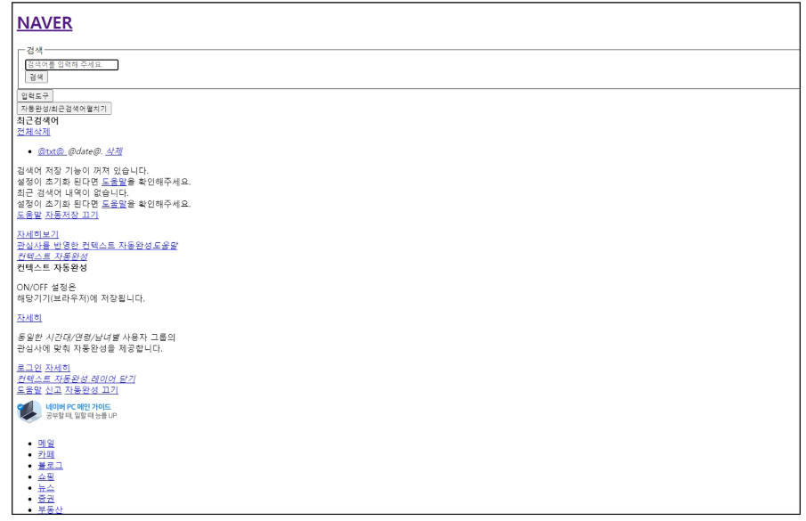


CSS 구문
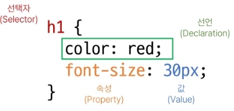

선언 마침을 나타내는 세미콜론(;)이 필요

CSS 적용 방법
1. 인라인(inline) 스타일
    - HTML 요소 안에 style 속성 값으로 작성

    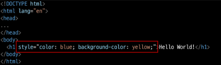

2. 내부(Internal) 스타일 시트
    - head 태그 안에 style 태그에 작성

    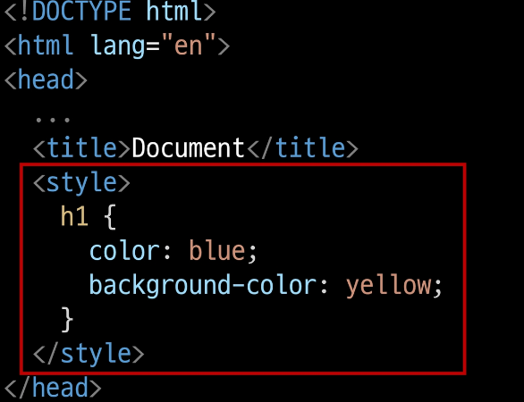

3. 외부(External) 스타일 시트
    - 별도의 CSS 파일 생성 후 HTML link 태그를 사용해 불러오기
    - 가장 권장! 재사용성이 높음

    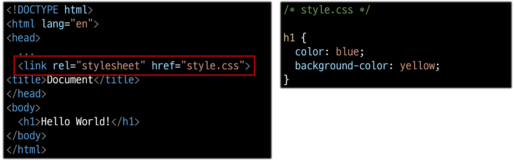

## CSS with 개발자 도구
- styles : 해당 요소에 선언된 모든 CSS
- computed : 해당 요소에 최종 계산된 CSS
    

## CSS Selectors(CSS 선택자)
HTML 요소를 선택하여 스타일을 적용할 수 있도록 하는 선택자

### CSS Selectors 종류
- 기본 선택자
    - 전체(*) 선택자
    - 요소(tag) 선택자
    - 클래스(class) 선택자
    - 아이디(id) 선택자
    - 속성(attr) 선택장 등
- 결합자 (Combinators)
    - 자손 결합자(" " (space))
    - 자식 결합자(>)

### CSS Selectors 특징
- 전체(*) 선택자
    - HTML 모든 요소를 선택
- 요소(tag) 선택자
    - 지정한 모든 태그를 선택
- 클래스(class) 선택자('.' (dot))
    - 주어진 클래스 속성을 가진 모든 요소를 선택
- 아이디 선택자('#')
    - 주어진 아이디 속성을 가진 모든 요소를 선택
    - 문서에는 주어진 아이디를 가진 요소가 하나만 있어야함
- 자손 결합자(" " (space))
    - 첫번째 요소의 자손 요소를 선택
    - 예) p span은 <p>안에 있는 모든 <span>를 선택 (하위 레벨 상관 없이)
- 자식 결합자(>)
    - 첫 번째 요소의 직계 자식만 선택
    - 예> ul > li은 <ul> 안에 있는 모든 <li>를 선택 (한 단계 아래 자식들만)

### CSS Selectors 정리
- 요소 선택자
    - HTML 태그를 직접 선택
- 클레스(class) 선택자
    - 마침표(.) 문자로 시작하면, 해당 클래스가 적용된 항목을 선택
- 아이디(id) 선택자
    - /# 문자로 시작하며, 해당 아이디가 적용된 항목을 선택
    - 일반적으로 하나의 문서에 1번만 사용. 여러 번 사용해도 동작하지만, 단일 id를 사용하는 것을 권장

## 우선순위 : Specificity
동일한 요소에 적용 가능한 같은 스타일 두 가지 이상 작성했을 때 어떤 규칙이 적용되는지 결정하는 것

Cascade: 계단식
- 동일한 우선순위를 갖는 규칙이 적용될 때 css에서 마지막에 나오는 규칙이 사용됨

### cascade 예시
h1 태그 내용의 색은 purple이 적용됨
```html
h1 {
    color: red;
}

h1 {
    color: purple;
}
```

### Specificity 예시
동일한 h1 태그에 다음과 같이 스타일이 작성됨다면 h1 내용의 색은 purple이 적용됨
```html
.make-red {
    color: red;
}

h1 {
    color: purple;
}
```

### 우선순위가 높은 순
-  인라인 > id > class > 요소
1. Importance
    - !important
2. inline 스타일
3. 선택자
    - id > class > 요소
4. 소스 코드 순서

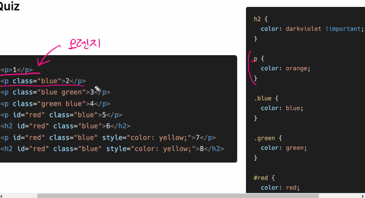
```
정의 부분의 순서가 중요! 클래스명 순서는 상관이 없다
오렌지 > 파랑 > 초록 > 초록 > 빨강 > 다크바이올렛 > 노랑 > 다크바이올렛
```

### !important
다른 우선순위 규칙보다 우선하여 적용하는 키워드
**Cascade의 구조를 무시하고 강제로 스타일을 적용하는 방식이므로 사용을 권장하지 않음**

# 상속
CSS는 상속을 통해 부모 요소의 속성을 자식에게 상속하여 재사용성을 높인다.
- 속성(프로퍼티) 중에는 상속이 되는 것과 되지 않는 것들이 있다.
- 상속 되는 것
    - 예) Text 관련 요소 (font, colot, text-align)m opacity, visibilty 등
- 상속 되지 않는 것
    - 예) Box model 관련 요소(width, height, margin, padding, border, box-sizing ...)
    - position 관련 요소(position, top/right/bottom/left/z-index) 등

# 참고
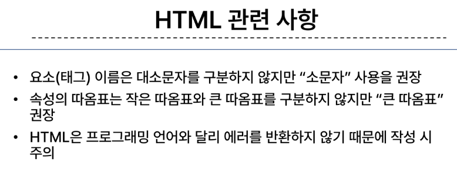  
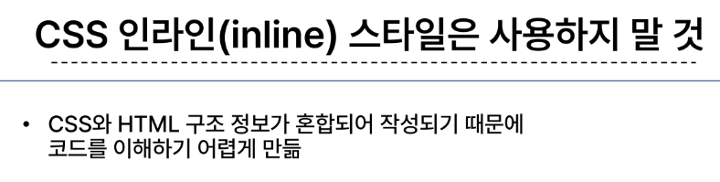  
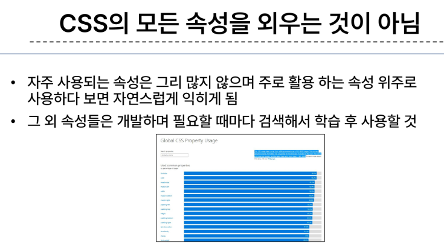  
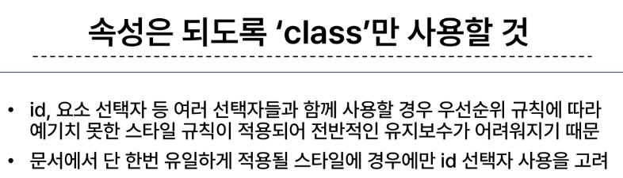  

# 조언
검색이 mdn 키워드 포함  
많이 타이핑해보고 많이 보기!