# 02. CSS Layout
# CSS Box Model
모든 HTML 요소를 사각형 박스로 표현하는 개념

박스 요소들로 구조화된 웹 페이지

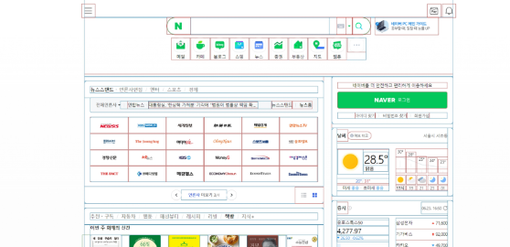

## 구성요소
CSS Box Model : 모든 HTML 요소를 사각형 박스로 표현하는 개념  
-> **내용(content), 안쪽 여백(padding), 테두리(border), 외부 간격(margin)으로 구성되는 개념**

### Box 구성 요소  

Content : 콘텐츠가 표시되는 영역
Padding : 콘텐츠 주위에 위치하는 공백 영역
Border :  콘텐츠와 패딩을 감싸는 테두리 영역
Margin : 이 박스와 다른 요소 사이의 공백, 가장 바깥쪽 영역  

### Box 구성의 방향별 명칭  
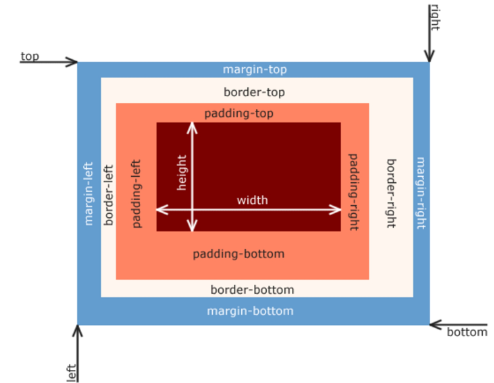

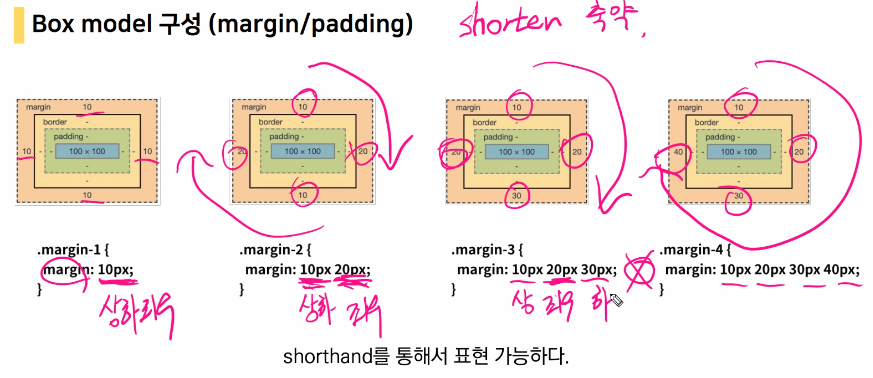

### Box 구성 요소 예시

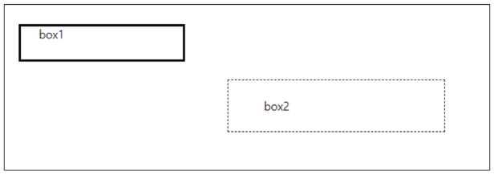

```html
  <style>
    .box1 {
      width: 200px;
      /* 박스 내 패딩 값 조정을 통해 박스의 이동 없이 cotent 위치 조정 */
      padding-left: 25px;
      padding-bottom: 25px;
      /* 가장 바깥쪽 영역을 조정하여 박스 옮기기 */
      margin-left: 25px;
      margin-top: 50px;
      /* 박스의 테두리 생성 */
      border-width: 3px;
      border-style: solid;
      border-color: black;
    }

    .box2 {
      width: 200px;
      /* border에 한 번에 width, style, color 입력 */
      border: 1px dashed black;
      /* 가운데 정렬
      margin-left: auto;
      margin-right: auto; */
      /* 상하좌우 */
      margin: 100px auto;
      padding: 25px 50px;
    }
  </style>
```

### width & height 속성
요소의 너비와 높이를 지정.  
이때 지정되는 요소의 너비와 높이는 콘텐츠 영역을 대상으로 함

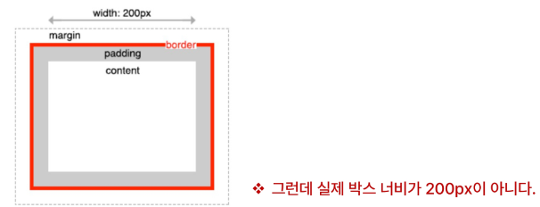

### CSS가 width 값을 계산하는 기준
CSS는 border가 아닌 content의 크기를 width 값으로 지정

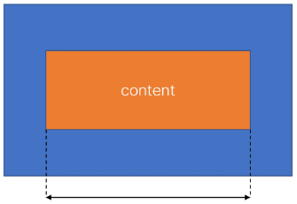

box-sizing 속성
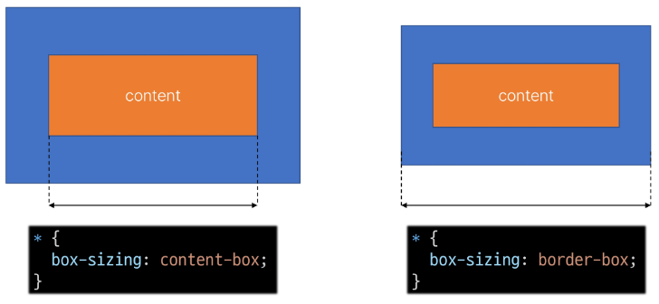

### box-sizing 예시
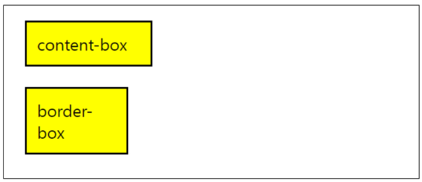
```html
  <style>
    .box {
      width: 100px;
      border: 2px solid black;
      padding: 10px;
      margin: 20px;
      background-color: yellow;
    }

    .content-box {
      /* 기본값 */
      box-sizing: content-box;
    }

    .border-box {
      /* border 박스 기준으로 생성 예정 */
      box-sizing: border-box;
    }
  </style>
```

### CSS 원칙
1. 모든 요소들은 '박스'이다.
2. 배치는 촤측 상단부터!
3. display에 따라 크기와 배치가 달라진다.

## 박스 타입
Block & Inline  

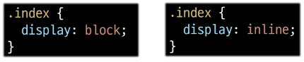

### Normal flow
CSS를 적용하지 않았을 경우 웹페이지 요소가 기본적으로 배치되는 방향

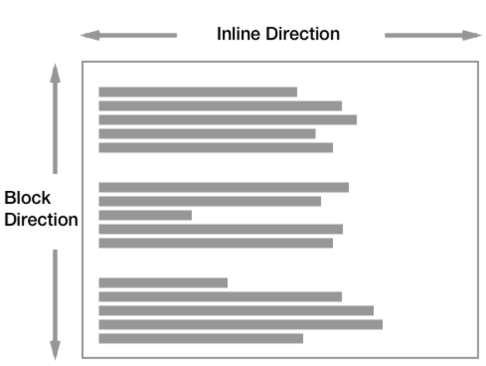

### 박스 타입 예시
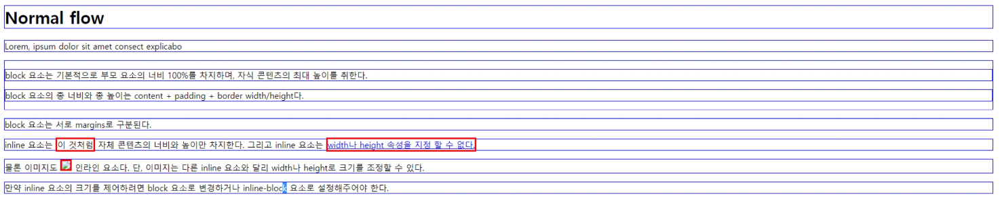

```html
<head>
  <style>
    a,
    span,
    img {
      border: 3px solid red;
    }

    h1,
    p,
    div {
      border: 1px solid blue;
    }
  </style>
</head>

<body>
  <h1>Normal flow</h1>
  <p>Lorem, ipsum dolor sit amet consect explicabo</p>
  <div>
    <p>block 요소는 기본적으로 부모 요소의 너비 100%를 차지하며, 자식 콘텐츠의 최대 높이를 취한다.</p>
    <p>block 요소의 총 너비와 총 높이는 content + padding + border width/height다.</p>
  </div>
  <p>block 요소는 서로 margins로 구분된다.</p>
  <p>inline 요소는 <span>이 것처럼</span> 자체 콘텐츠의 너비와 높이만 차지한다.
    그리고 inline 요소는 <a href="#">width나 height 속성을 지정 할 수 없다.</a>
  </p>
  <p>
    물론 이미지도  인라인 요소다.
    단, 이미지는 다른 inline 요소와 달리 width나 height로 크기를 조정할 수 있다.
  </p>
  <p>
    만약 inline 요소의 크기를 제어하려면 block 요소로 변경하거나 inline-block 요소로 설정해주어야 한다.
  </p>
</body>
```

### block 타입 특징
- 항상 새로운 행으로 나뉨(줄바꿈이 일어나는 요소. 다른 elem를 밀어낸다.)
- width와 height 속성을 사용하여 너비와 높이를 지정할 수 있음
- 기본적으로 width 속성을 지정하지 않으면 박스는 **inline 방향으로 사용 가능한 공간을 모두 차지함** (너비를 사용가능한 공간의 100%로 채우는 것)
- 블록 레벨 요소 안에 인라인 레벨 요소가 들어갈 수 있음
- 대표적인 block 타입 태크
    - h1~6, p, div

### inline 타입 특징
- 새로운 행으로 나뉘지 않음
- **width와 height, margin-top. margin-bottom 속성을 사용할 수 없음**
- 상하 여백은 line-height로 지정한다.
- content를 마크업 하고 있는 만큼만 가로 폭을 차지함
- 수직 방향
    - padding, margins, borders가 적용되지만 다른 요소를 밀어낼 수는 없음
- 수평 방향
    - padding, margins, borders가 적용되어 다른 요소를 밀어낼 수 있음
- 대표적인 inline 타입 태그
    - a, img, span

### 속성에 따른 수평 정렬
inline이 정렬하는게 아닌 부모가(block) 정렬해주는 것!  
부모에서 여백을 만들고 text-align을 지정함

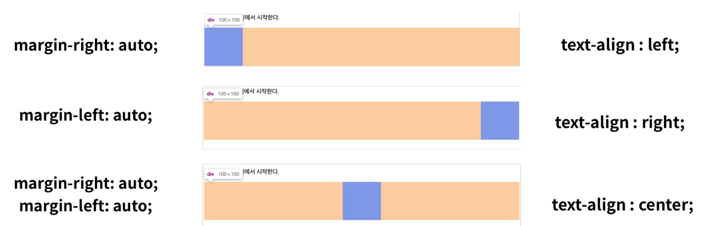

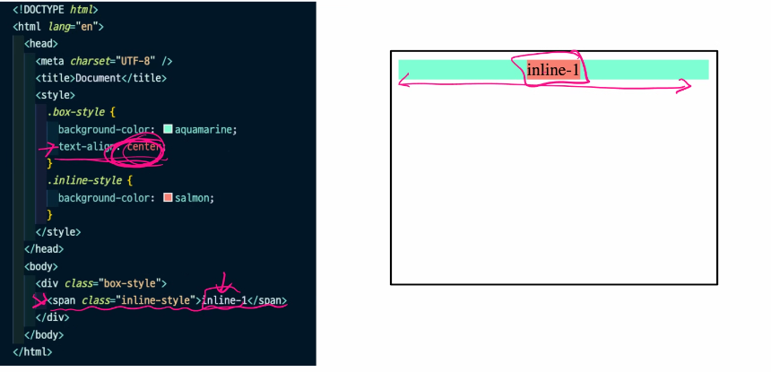

### 기타 display 속성
1. 'inline-block'
- inline과 block 요소 사이의 중간 지점을 제공하는 display 값
- block 요소의 특징을 가짐
    - width 및 height, margin 속성 사용가능
    - padding, margin 및 border로 인헤 다른 요소가 밀려남  
    - inline처럼 한 줄에 표시 가능

- 요소가 줄 바꿈 되는 것을 원하지 않으면서 너비와 높이를 적용하고 싶은 경우에 사용

예시
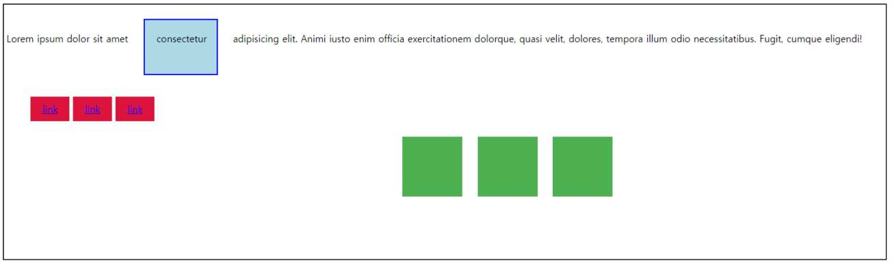
```html
  <style>
    span {
      margin: 20px;
      padding: 20px;
      width: 80px;
      height: 50px;
      background-color: lightblue;
      border: 2px solid blue;
      display: inline-block;
    }

    ul>li {
      background-color: crimson;
      padding: 10px 20px;
      display: inline-block;
    }

    .container {
      text-align: center;
    }

    .box {
      display: inline-block;
      width: 100px;
      height: 100px;
      background-color: #4CAF50;
      margin: 10px;
    }
  </style>
```

2. 'none'
- 요소를 화면에 표시하지 않고, 공간조차 부여되지 않음
- visiblity:hidden와 화면에 표시되지 않는다는 점이 유사하나 공간을 가지고 있다는 점에서 차이가 있다.

예시코드
```html
<style>
.none {
      display: none;
    }
</style>
```

# CSS Layout
각 요소의 **위치**와 **크기를 조정**하여 웹페이지의 디자인을 결정하는 것  
ex) Display, Position, Float, Flex box 등

## CSS Layout Position
요소를 Normal Flow에서 제거하야 디른 위치로 배치하는 것  
-> 다른 요소 위에 올리기, 화면의 특정 위치에 고정시키기 등

### Position 이동 방향
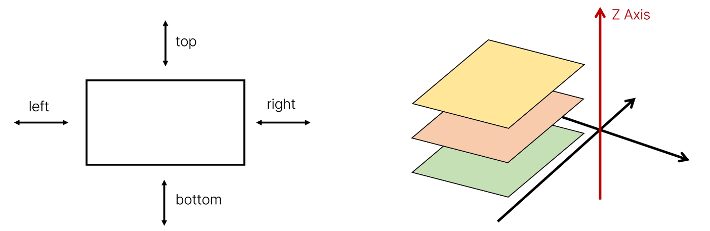

### Position 유형
1. static
2. relative
3. absoulte
4. fixed
5. sticky

### Position 예시
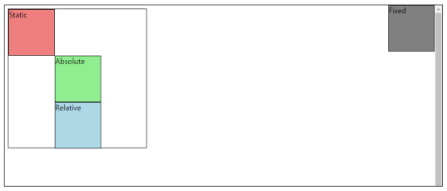
```html
<style>
        .container {
      /* 상대 위치 */
      /* absoulte의 기준이 되어 준다. */
      position: relative;
      height: 300px;
      width: 300px;
      border: 1px solid black;
    }

    .box {
      height: 100px;
      width: 100px;
      border: 1px solid black;
    }

    .static {
      /* 기본값 */
      position: static;
      background-color: lightcoral;
    }

    .absolute {
      /* 절대 위치 */
      /* 본인의 static을 버림 -> 이에따라 relative가 영향을 받음 */
      position: absolute;
      background-color: lightgreen;
      top: 100px;
      left: 100px;
    }

    .relative {
      /* 상대 위치 : 본인의 static 위치 기준*/
      /* 본인의 과거 영역을 가지고 있음 */
      position: relative;
      background-color: lightblue;
      /* 아래로, 오른족으로 */
      top: 100px;
      left: 100px;
    }
    .fixed {
    position: fixed;
    background-color: gray;
    top: 0;
    right: 0;
    }
</style>
```

### Position 예시 - sticky
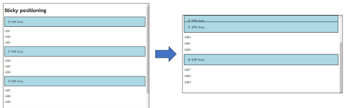
```html
<style>
body {
    height: 1500px;
}

.sticky {
    /* top : 임계점
    임계점에 도달하면 fixed와 동일하게 작동*/
    position: sticky;
    top: 0;
    background-color: lightblue;
    padding: 20px;
    border: 2px solid black;
}
</style>
```

# Position 유형별 특징
1. static
- 기본값
- 요소를 Normal Flow에 따라 배치
2. relative : 상대 위치
- 요소를 Normal Flow에 따라 배치
- 자기 자신의 static위치를 기준으로 이동
- 요소가 차지하는 공간은 static 일 때와 같음
3. absolute : 절대 위치
- 요소를 Normal flow에서 제거
- 가장 가까운 relative 부모 요소를 기준으로 이동(없는 경우 body)
- 문서에서 요소가 차지하는 공간이 없어짐
4. fixed : 고정 위치
- 요소를 Normal Flow에서 제거
- 현재 화면영역(viewpoint)을 기준으로 이동
- 문서에서 요소가 차지하는 공간이 없어짐
- 스크롤 시에도 항상 같은 곳에 위치함
5. sticky
- 요소를 Normal Flow에 따라 배치
- 요소가 일반적인 문서 흐름에 따라 배치되다가 스크롤이 특정 임계점에 도달하면 그 위치에서 고정됨(fixed)
- 만약 다음 sticky 요소가 나오면 다음 sticky 요소가 이전의 sticky 요소의 자리를 대체
    - 이전 stick 요소가 고정되어 있던 위치와 다음 sticky 요소가 고정되어야 할 위치가 겹치게 되기 때문

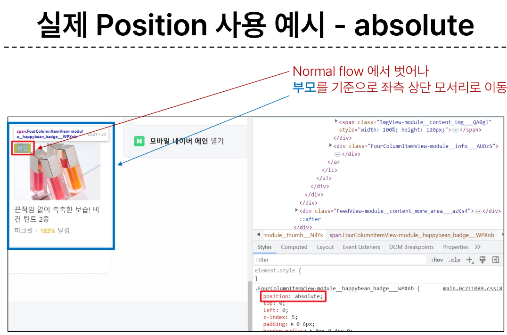  
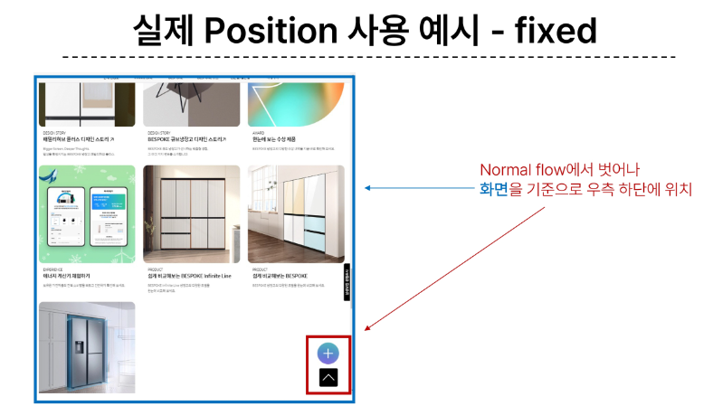  
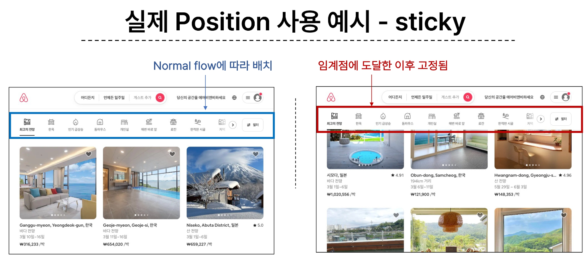  

### absolute 예시
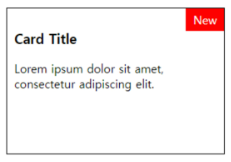

```html
<style>
.card {
    /* 부모 상대위치? 생성 */
    position: relative;
    width: 300px;
    height: 200px;
    border: 1px solid black;
}

.card-content {
    padding: 10px;
}

.badge {
    /* card를 기준으로 한 absolute */
    position: absolute;
    top: 0;
    right: 0;
    background-color: red;
    color: white;
    padding: 5px 10px;
}
</style>
```

### z-index
요소가 겹쳤을 때 어떤 요소 순으로 위에 나타낼지 결정
- 정수 값을 사용해 z축 순서를 지정
- 더 큰 값을 가진 요소가 작은 값의 요소를 덮음

### z-index 예시
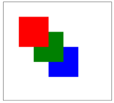

```html
<style>
.container {
    position: relative;
}

.box {
    position: absolute;
    width: 100px;
    height: 100px;
}

.red {
    background-color: red;
    top: 50px;
    left: 50px;
    z-index: 3;
}

.green {
    background-color: green;
    top: 100px;
    left: 100px;
    z-index: 2;
}

.blue {
    background-color: blue;
    top: 150px;
    left: 150px;
    z-index: 1;
}
</style>
```

### CSS 원칙
1. 모든 요소는 네모(박스모델), 좌측상단에 배치
2. display에 따라 크기와 배치가 달라짐
3. position으로 위치의 기준을 변경
    - relative: 본인의 원래 위치
    - absolute: 특정 부모의 위치
    - fixed: 화면의 위치


# Float
- 박스를 왼쪽 혹은 오른쪽으로 이동시켜 텍스트를 포함 인라인 요소들이 주변을  wrapping 하도록 함
- 요소가 Normal flow를 벗어나도록 함

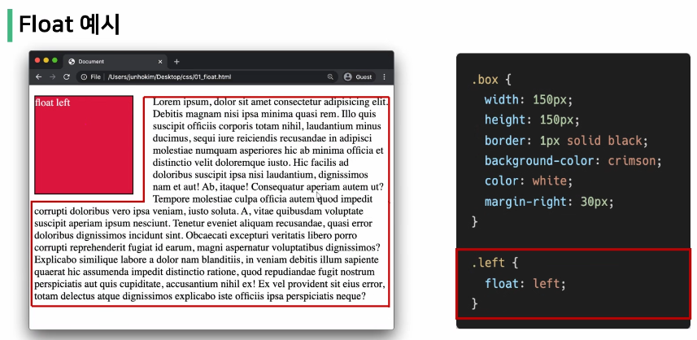
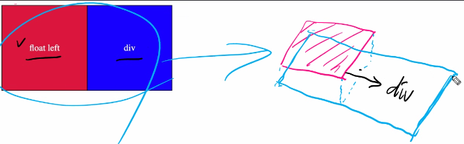

속성
- none: 기본값
- left: 요소를 왼쪽으로 띄움
- right: 요소를 오른쪽으로 띄움

정리
- 레이아웃을 구성하기 위해 필수적으로 활용되었으나, 최근 Flexbox. Grid 등장과 함께 사용도가 낮아짐
- Float 활용 전략 - Normal Flow에서 벗어난 레이아웃 구성
    - 원하는 요소들을 Float로 지정하여 배치

# CSS Layout Flexbox
### CSS Flexbox
요소를 행과 열 형태로 배치하는 1차원 레이아웃 방식  
-> '공간 배열' & '정렬'

## 구성요소
요소를 행과 열 형태로 배치하는 **1차원** 레이아웃 방식  
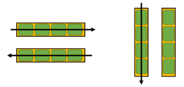

Flexbox 기본 사항  
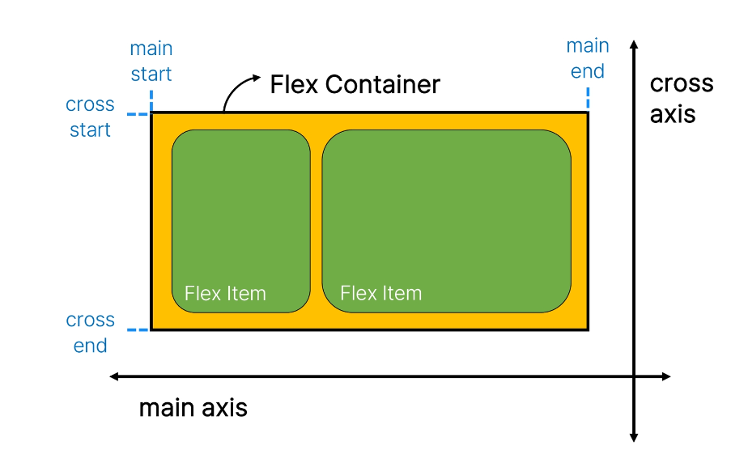

main axis (주 축)
- flex item들이 배치되는 기본 축
- main start에서 시작하여 main end 방향으로 배치

cross axis (교차 축)
- main axis에 수직인 축
- cross start에서 시작하여 cross end 방향으로 배치

Flex Container(부모 요소)
- flexbox 레이아웃을 형성하는 가장 기본적인 모델
- Flex Item들이 놓여있는 영역
- display: flex; 혹은 display: inline-flex;가 설정된 부모 요소
- 이 컨테이너의 1차 자식 요소들이 Flex item이 됨
- flexbox 속성 값들을 사용하여 자식 요소 Flex item들을 배치

Flex Item(자식 요소)
- Flex Container 내부에 레이아웃이 되는 항목(컨텐츠)

## Flex 속성
배치 설정
- flex-direction : 아이템 배치 방향 (row, row-reverse, column, column-reverse)
- flex-wrap : 컨테이너를 벗어나는 경우 요소가 짤려서 보이지 않게끔! (nowrap, wrap, wrap-reverse)

공간 나누기
- justify-content (main-axis)
- align-content (cross- axis)

정렬
- align-items (모든 아이템을 cross axis 기준으로)
- align-self (개별 아이템)

## 레이아웃 구성
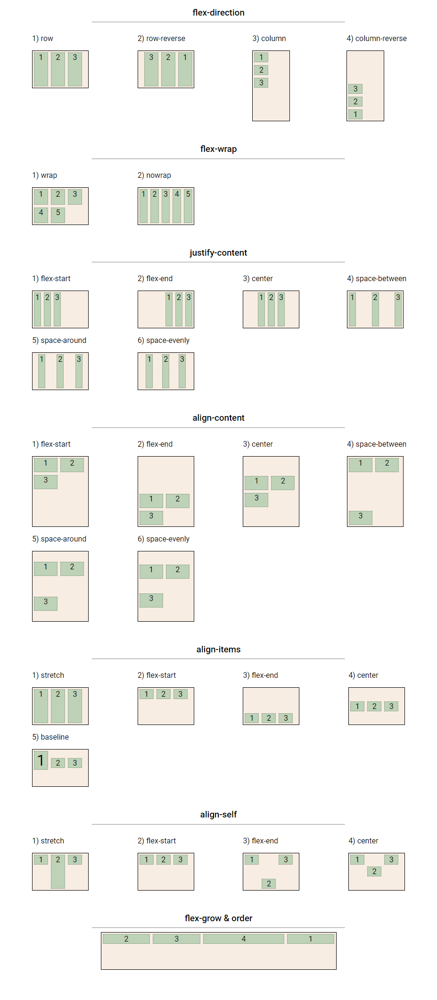
1. Flex Conatiner 지정
- flex item은 기본적으로 행으로 나열
- flex item은 주축의 시작 선에서 시작
- flex item은 교차축의 크기를 채우기 위해 늘어남

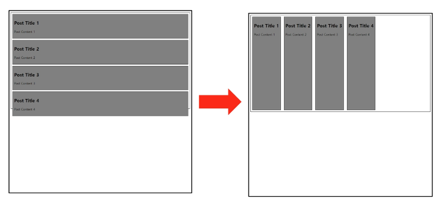

2. flex-direction 지정
- flex item이 나열되는 방향을 지정
- column으로 지정할 경우 주 축이 변경됨
- -reverse로 지정하면서 시작 선과 끝 선이 서로 바뀜

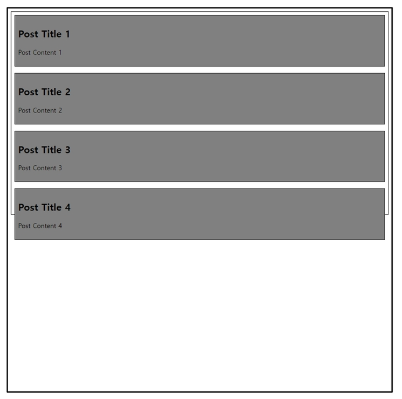

3. flex-wrap
- flex item 목록이 flex container의 하나의 행에 들어가지 않을 경우 다른 행에 배치할지 여부 설정
- 기본적으로 컨체이너 영역을 벗어나지 않도록 함
- 줄 넘김 여부를 묻는 것

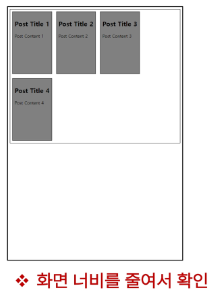

+) flex-flow  
- flex-direction과 flex-wrap의 shorthand
- flex-direction과 flex-wrap에 대한 설정 값을 차례로 작성
- ex) flex-flow: row nowrap;

4. justify-content
- 주 축을 따라 flex item과 주위에 공간을 분배
- flex-start / flex-end / center : 좌측 정렬, 우측 정렬, 중앙 정렬
- space-between : item 사이의 공백을 동일하게
- space-around : 각 item 양 옆의 공백이 동일하도록
- space-evenly : 양 끝과 item 사이의 공백이 모두 동일하도록

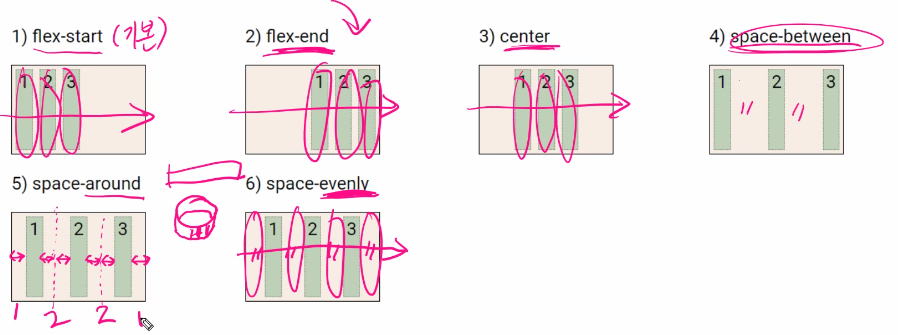

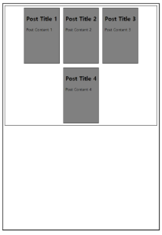

5. align-content
- 교차 축을 따라 flex item과 주위에 공간을 분배
    - flex-wrap이 wrap 또는 wrap-revers로 설정된 여러 행에만 적용됨
    - 한 줄 짜리 행에는 (flex-wrap이 nowrap으로 설정된 경우) 효과 없음
- flex-start / flex-end / center : 상단 정렬, 하단 정렬, 중앙 정렬
- space-between : item 사이의 공백을 동일하게
- space-around : 각 item 양 옆의 공백이 동일하도록
- space-evenly : 양 끝과 item 사이의 공백이 모두 동일하도록

공간 배분
- flex-start : 아이템들을 axis 시작점으로
- flex-end : 아이템들을 axis 끝쪽으로
- center : 아이템들을 axis 중앙으로
- space-between : 아이템 사이의 간격을 균일하게 분배
- space-around : 아이템을 둘러싼 영역을 균일하게 분배 (가질 수 있는 영역을 반으로 나눠서 양쪽에)
- space-evenly : 전체 영역에서 아이템 간 간격을 균일하게 분배

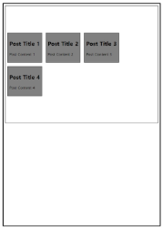

6. align-items
- 교차 축을 따라 flex item 행을 정렬

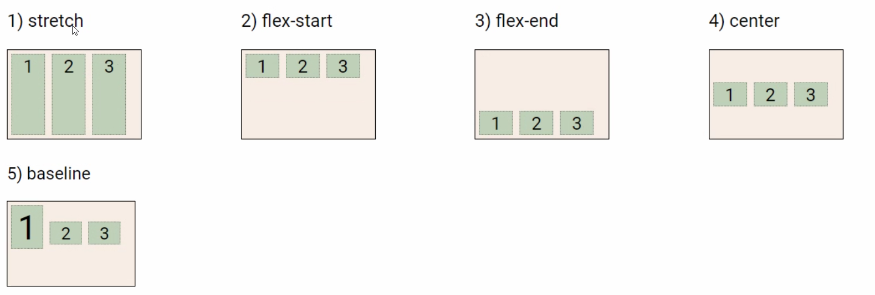

- stretch : 해당된 영역의 끝까지

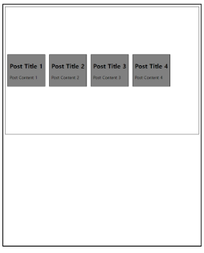

7. align-self
- 교차 축으로 따라 개별 flex item을 정렬

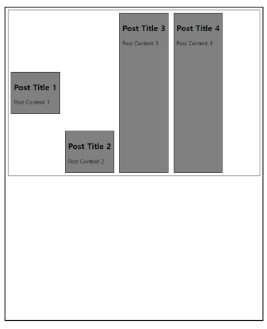

### Flexbox 속성
- Flex Container 관련 속성
    - display, flex-direction, flex-wrap, justify-content, align-items, align-content

- Flex Item 관련 속성
    - align-self, flex-grow, flex-basis, order

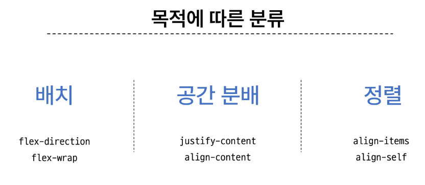

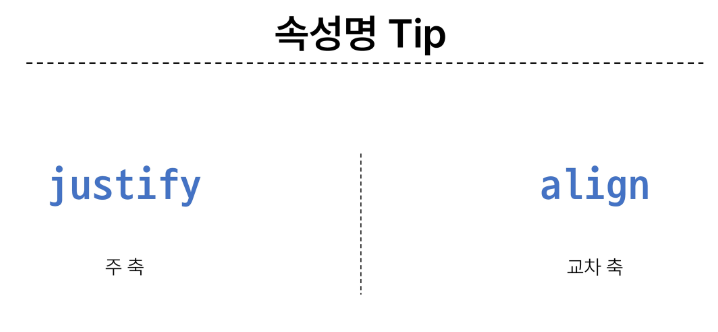

8. flwx-grow
- 남는 행 여백을 비율에 따라 각 flex item에 분배
    - 아이템이 컨테이너 내에서 확장하는 비율을 지정
- flex-grow의 반대는 flex-shrink

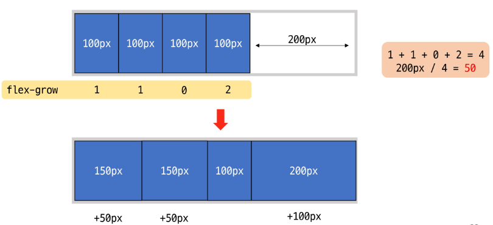