# 03. BootStrap
# Bootstrap
CSS 프론트엔드 프레임워크(Tookit)
- 미리 만들어진 다양한 디자인 요소들을 제공하여 웹사이트를 빠르고 쉽게 개발할 수 있도록 함
- 모든 스타일링은 class 속성으로 진행, 세세한 크기 조정시에는 예외적으로 CSS

## Bootstrap 기본 사용법
```html
<p class="mt-5">Hello, world</p>
```
mt-5 : {property}{sides}-{size}  
- margin-top-5

mx-auto : 수평 중앙정렬

### Bootsrtap에서 클래스 이름으로 Spacing을 표현하는 방법
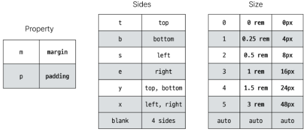
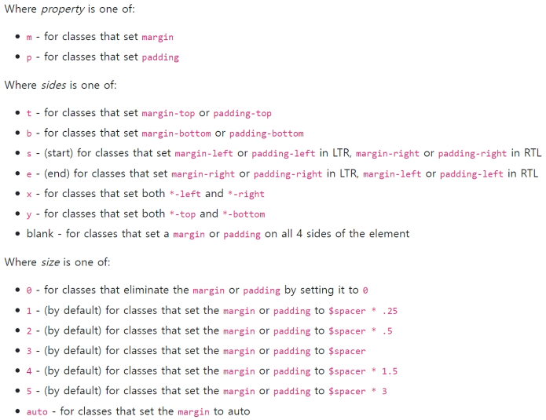

**Bootstrap에는 특정한 규칙이 있는 클래스 이름으로 이미 스타일 및 레이아웃이 작성되어 있음**

## Typography
제목, 본문 텍스트, 목록 등

### Displaly headings
기존 Heading보다 더 눈에 띄는 제목이 필요한 경우 ( 더 크고 약간 다른 스타일)

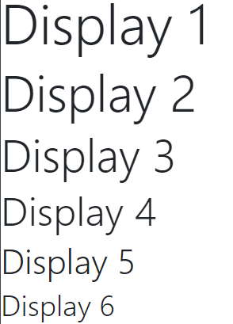

```html
  <!-- display heading -->
  <h1 class="display-2">Display 2</h1>
  <h1 class="display-3">Display 3</h1>
  <h1 class="display-4">Display 4</h1>
  <h1 class="display-5">Display 5</h1>
  <h1 class="display-6">Display 6</h1>
```
### Inline text elements
HTML inline 요소에 대한 스타일

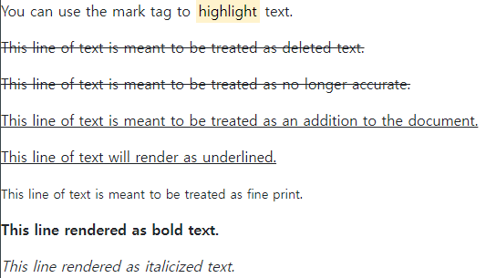

```html
  <!-- inlint text element -->
  <p>You can use the mark tag to <mark>highlight</mark> text.</p>
  <p><del>This line of text is meant to be treated as deleted text.</del></p>
  <p><s>This line of text is meant to be treated as no longer accurate.</s></p>
  <p><ins>This line of text is meant to be treated as an addition to the document.</ins></p>
  <p><u>This line of text will render as underlined.</u></p>
  <p><small>This line of text is meant to be treated as fine print.</small></p>
  <p><strong>This line rendered as bold text.</strong></p>
  <p><em>This line rendered as italicized text.</em></p>
```

### Lists
HTML list 요소에 대한 스타일

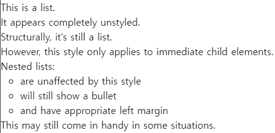

```html
  <ul class="list-unstyled">
    <li>This is a list.</li>
    <li>It appears completely unstyled.</li>
    <li>Structurally, it's still a list.</li>
    <li>However, this style only applies to immediate child elements.</li>
    <li>Nested lists:
      <ul>
        <li>are unaffected by this style</li>
        <li>will still show a bullet</li>
        <li>and have appropriate left margin</li>
      </ul>
    </li>
    <li>This may still come in handy in some situations.</li>
  </ul>
```

## Colors
### Bootstrap Color system  
Bootstrap이 지정하고 제공하는 색상 시스템

### Colors
Text, border, Background 및 다양한 요소에 사용하는 Boorstrap의 색상 키워드

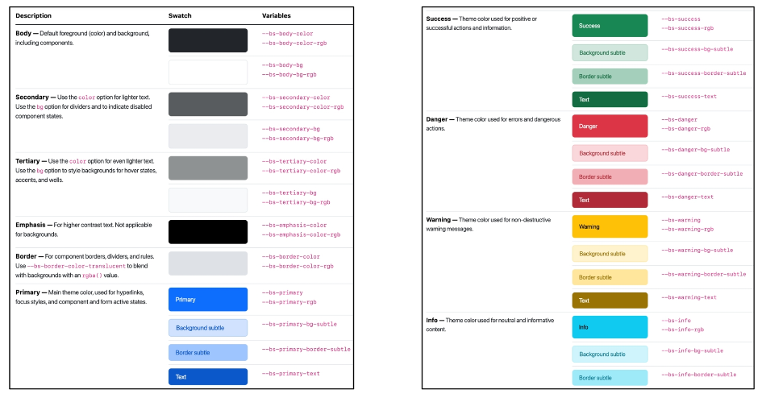

### Text colors

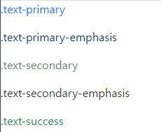

```html
<p class="text-primary">.text-primary</p>
<p class="text-primary-emphasis">.text-primary-emphasis</p>
<p class="text-secondary">.text-secondary</p>
<p class="text-secondary-emphasis">.text-secondary-emphasis</p>
<p class="text-success">.text-success</p>
```
### Background colors

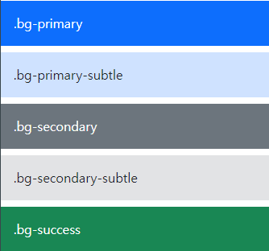

```html
<div class="p-3 mb-2 bg-primary text-white">.bg-primary</div>
<div class="p-3 mb-2 bg-primary-subtle text-emphasis-primary">.bg-primary-subtle</div>
<div class="p-3 mb-2 bg-secondary text-white">.bg-secondary</div>
<div class="p-3 mb-2 bg-secondary-subtle text-emphasis-secondary">.bg-secondary-subtle</div>
<div class="p-3 mb-2 bg-success text-white">.bg-success</div>
<div class="p-3 mb-2 bg-success-subtle text-emphasis-success">.bg-success-subtle</div>
```

### Bootstrap 실습
너비와 높이가 각각 200px인 정사각형 작성하기  
(너비와 높이를 제외한 스타일은 모두 bootstrap으로 작성)

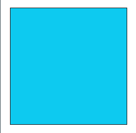

```html
  <div class="box border border-dark bg-info m-3"></div>
```
## Component
### Bootstrap Component
Bootstrap에서 제공하는 **UI 관련 요소**
- **버튼, 네비게이션 바, 카드, 폼, 드롭다운 등**

### 대표 Component
- Alerts
- Badges
- Buttons
- Cards
- Navbar

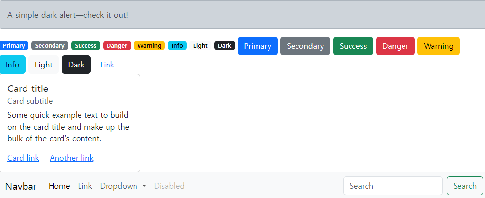

```html
  <!-- Alerts -->
  <div class="alert alert-dark" role="alert">
    A simple dark alert—check it out!
  </div>

  <!-- Badges -->
  <span class="badge text-bg-primary">Primary</span>
  <span class="badge text-bg-secondary">Secondary</span>

  <!-- Buttons -->
  <button type="button" class="btn btn-primary">Primary</button>
  <button type="button" class="btn btn-secondary">Secondary</button>
  <button type="button" class="btn btn-success">Success</button>

    <!-- cards -->
  <div class="card" style="width: 18rem;">
    <div class="card-body">
      <h5 class="card-title">Card title</h5>
      <h6 class="card-subtitle mb-2 text-body-secondary">Card subtitle</h6>
      <p class="card-text">Some quick example text to build on the card title and make up the bulk of the card's content.</p>
      <a href="#" class="card-link">Card link</a>
      <a href="#" class="card-link">Another link</a>
    </div>
  </div>

    <!-- Navbar -->
  <nav class="navbar navbar-expand-lg bg-body-tertiary" >
    <div class="container-fluid">
      <a class="navbar-brand" href="#">Navbar</a>
      <button class="navbar-toggler" type="button" data-bs-toggle="collapse" data-bs-target="#navbarSupportedContent" aria-controls="navbarSupportedContent" aria-expanded="false" aria-label="Toggle navigation">
        <span class="navbar-toggler-icon"></span>
      </button>
      <div class="collapse navbar-collapse" id="navbarSupportedContent">
        <ul class="navbar-nav me-auto mb-2 mb-lg-0">
          <li class="nav-item">
            <a class="nav-link active" aria-current="page" href="#">Home</a>
          </li>
          <li class="nav-item">
            <a class="nav-link" href="#">Link</a>
          </li>
          <li class="nav-item dropdown">
            <a class="nav-link dropdown-toggle" href="#" role="button" data-bs-toggle="dropdown" aria-expanded="false">
              Dropdown
            </a>
            <ul class="dropdown-menu">
              <li><a class="dropdown-item" href="#">Action</a></li>
              <li><a class="dropdown-item" href="#">Another action</a></li>
              <li><hr class="dropdown-divider"></li>
              <li><a class="dropdown-item" href="#">Something else here</a></li>
            </ul>
          </li>
          <li class="nav-item">
            <a class="nav-link disabled" aria-disabled="true">Disabled</a>
          </li>
        </ul>
        <form class="d-flex" role="search">
          <input class="form-control me-2" type="search" placeholder="Search" aria-label="Search">
          <button class="btn btn-outline-success" type="submit">Search</button>
        </form>
      </div>
    </div>
  </nav>
```
### Component 이점
일관된 디자인을 제공하여 웹 사이트의 구성 요소를 구축하는 데 유용하게 활용

# Semantic Web
웹 데이터를 의미론적으로 구조화된 형태로 표현하는 방식

이 요소가 시작적으로 어덯게 보여질까? -> 이 요소가 가진 목적과 역할은 무엇일까?

## Semantic in HTML
h1 : 문서의 최상위 제목 의미를 제공하는 semantic 요소
- 브라우저에 의해 제목처럼 보이도록 스타일이 지정됨

### HTML Semantic Element
기본적인 모양과 기능 이외에 의미를 가지는 HTML 요소
- 검색엔진 및 개발자가 웹 페이지 콘텐츠를 이해하기 쉽도록

### semantic element
- header
- nav
- main
- article
- sectiond
- aside
- footer

div와 기능상에서는 큰 차이가 없지만 이를 통해 의미를 이해하기 쉬워짐

### Semantic Element 예시
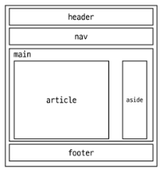

## Semantic in CSS
### OOCSS(object Oriented CSS)  
객체 지향적 접근법을 적용하여 CSS를 구성하는 방법론

### CSS 방법론
CSS를 효율적이고 유지 보수가 용이하게 작성하기 위한 일련의 가이드라인

### OOCSS 기본 원칙
1. 구조와 스킨을 스킨을 분리
- 구조와 스킨을 분리함으로써 재사용 가능성을 높임
모든 버튼의 공통 구조를 정의 + 각각의 스킨(배경색과 폰트 색상)을 정의

2. 컨테이너와 콘텐츠를 분리
- 객체에 직접 적용하는 대신 객체를 둘러싸는 컨체이너에 스타일을 적용
- 스타일을 정의할 때 위치에 의존적인 스타일을 사용하지 않도록 함
- 콘텐츠를 다른 컨테이너로 이동시키거나 재배치할 때 스타일이 깨지는 것을 방지
.header와 .footer 클래스가 폰트 크기와 색 둘 다 영향을 줌

# 참고
## CDN (Content Delivery Network)
지리적 제약 없이 빠르고 안전하게 콘첸츠를 전송할 수 있는 전송 기술
- 서버와 사용자의 물리적인 거리를 줄여 콘텐츠 로딩에 소요되는 시간을 최소화(웹 페이지 로드 속도를 높임)
- 지리적을 사용자와 가까운 CDN 서버에 콘텐츠를 저장해서 사용자에게 전달

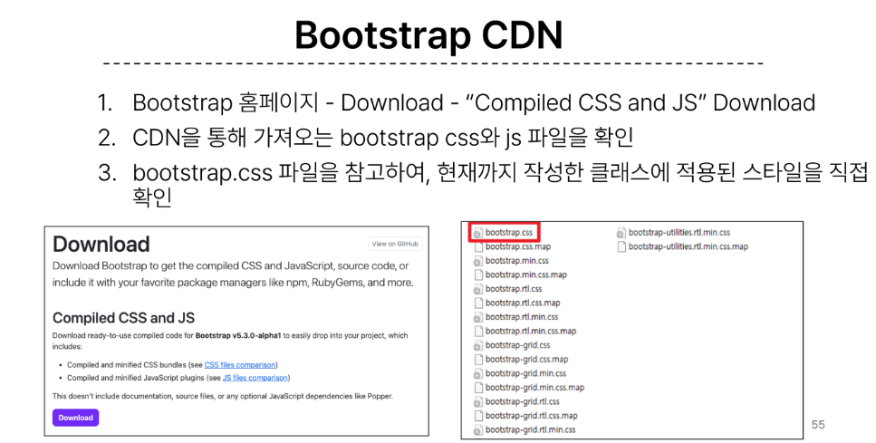

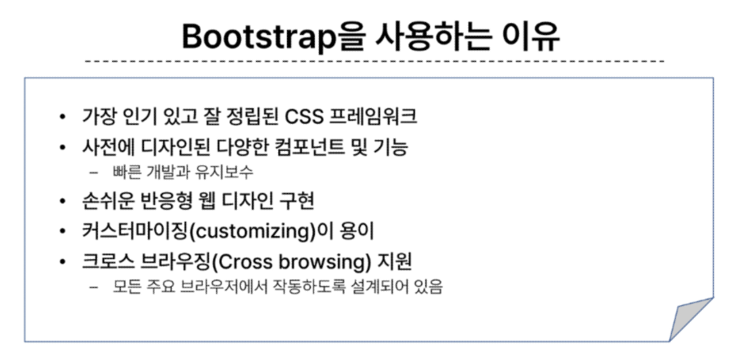

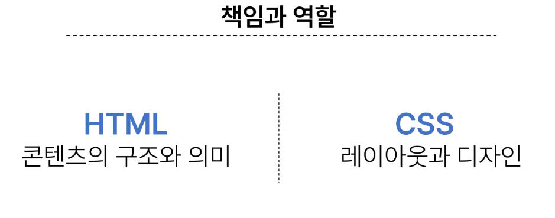

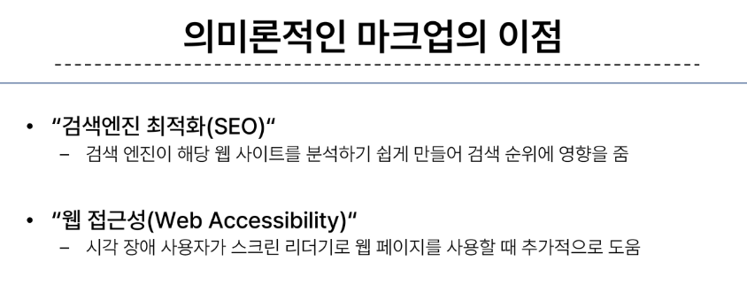