# 04. Bootstrap Grid system
유용한 사이트 추천 : emmet cheat sheet
# Bootstrap Grid system
웹 페이지의 레이아웃을 조정하는 데 사용되는 **12개의 컬럼**으로 구성된 시스템

목적
- 반응형 디자인을 지원해 웹 페이지를 모바일, 태블릿, 데스크탑 등 다양한 기기에서 적절하게 표시할 수 있도록 도움

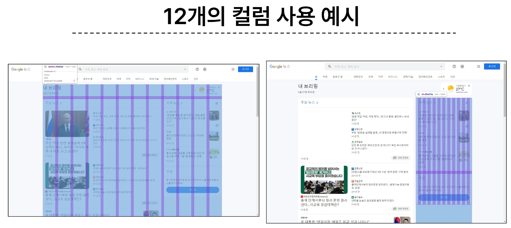

## Grid system 클래스와 기본 구조
### Grid system 기본 요소
1. Container : Column들을 담고 있는 공간
2. Column : 실제 컨첸프를 포함하는 부분
3. Gutter : 컬럼과 컬럼 사이의 여백 영역

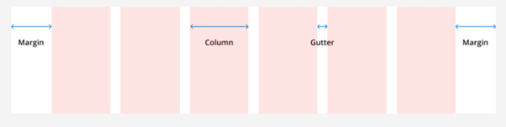


1개의 row안에 12칸의 column 영역이 구성, 각 요소는 12칸 중 몇개를 차지할 것인지 지정됨

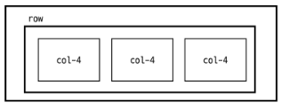

```html
    <div class="container">
        <div class="row">
            <div class="col-4"></div>
            <div class="col-4"></div>
            <div class="col-4"></div>
        </div>
    </div>
```
### Grid system 실습 - 기본
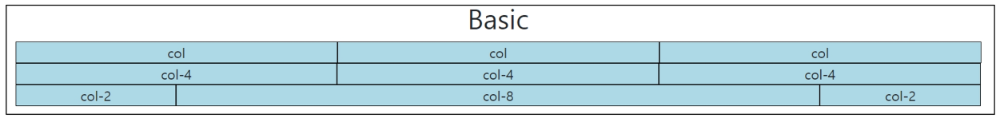

```html
  <div class="container">
    <div class="row">
      <!-- 따로 지정해주지 않으면 12/요소 크기 (권장하지 않음) -->
      <div class="box col">col</div>
      <div class="box col">col</div>
      <div class="box col">col</div>
    </div>
    <div class="row">
      <!-- 열을 4칸씩 나누기 -->
      <div class="box col-4">col-4</div>
      <div class="box col-4">col-4</div>
      <div class="box col-4">col-4</div>
    </div>
    <div class="row">
      <!-- 열을 2 / 8 / 2로 나누기 -->
      <div class="box col-2">col-2</div>
      <div class="box col-8">col-8</div>
      <div class="box col-2">col-2</div>
    </div>
  </div>
```

### Grid system 실습 - 중첩(Nesting)
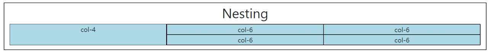

```html
  <div class="container">
    <!-- 가장 바깥 영역을 4 : 8 로 나눔 -->
    <div class="row">
      <div class="box col-4">col-4</div>
      <!-- 8 내에 중첩하여 입력 -->
      <div class="box col-8">
        <div class="row">
          <div class="box col-6">col-6</div>
          <div class="box col-6">col-6</div>
          <div class="box col-6">col-6</div>
          <div class="box col-6">col-6</div>
        </div>
      </div>
    </div>
  </div>
```

### Grid system 실습 - 상쇄(Offset)
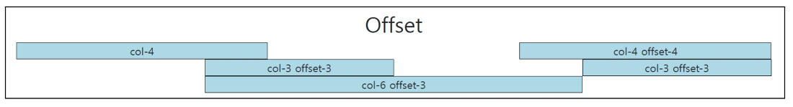

```html
  <div class="container">
    <!-- 주어진 offset만큼 상쇄한 후 칸을 나눔 -->
    <!-- 4 / 상쇄 4 / 4 -->
    <div class="row">
      <div class="box col-4">col-4</div>
      <div class="box col-4 offset-4">col-4 offset-4</div>
    </div>
    <div class="row">
      <!-- 상쇄 3 / 3 / 상쇄 3 / 3 -->
      <div class="box col-3 offset-3">col-3 offset-3</div>
      <div class="box col-3 offset-3">col-3 offset-3</div>
    </div>
    <div class="row">
      <!-- 상쇄 3 / 6 -->
      <div class="box col-6 offset-3">col-6 offset-3</div>
    </div>
  </div>
```

### Gutters
Grid system에서 column 사이에 여백 영역  
x축은 padding(내부여백), y축은 margin(외부여백)으로 여백 생성
- 상대적으로 x축의 공간이 한정적이기 때문에 padding을 통하여 스스로의 몸집을 조절한다.

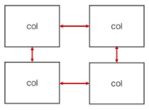

### Grid system 실습 - Gutters
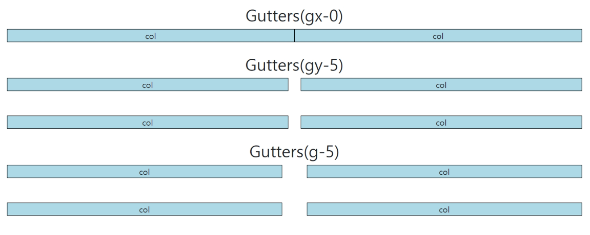

```html
  <div class="container">
    <!-- 컬럼간의 간격 -->
    <div class="row gx-0">
      <div class="col-6">
        <div class="box">col</div>
      </div>
      <div class="col-6">
        <div class="box">col</div>
      </div>
    </div>
  </div>

    <div class="container">
    <!-- 행간의 간격 -->
    <div class="row gy-5">
      <div class="col-6">
        <div class="box">col</div>
      </div>
      <div class="col-6">
        <div class="box">col</div>
      </div>
      <div class="col-6">
        <div class="box">col</div>
      </div>
      <div class="col-6">
        <div class="box">col</div>
      </div>
    </div>
  </div>

  <div class="container">
    <!-- x축과 y축의 간격 -->
    <div class="row g-5">
      <div class="col-6">
        <div class="box">col</div>
      </div>
      <div class="col-6">
        <div class="box">col</div>
      </div>
      <div class="col-6">
        <div class="box">col</div>
      </div>
      <div class="col-6">
        <div class="box">col</div>
      </div>
    </div>
  </div>
```

# Grid system for responsible web
### Responsive Web Design : 반응형 웹 디자인

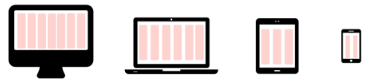

- 디바이스 종류나 화면 크기에 상관없이, 어디서든 일관된 레이아웃 및 사용자 경험을 제공하는 디자인 기술
- 반응형 레이아웃 작성에 도움이 되는 사례들의 모음 등을 기술하는데 사용되는 용어
- Bootstrap grid system에서는 12개 column과 6개 breakpoints를 사용하여 반응형 웹 디자인을 구현

## Grid system Breakpoints
웹 페이지를 다양한 화면 크기에서 적절하게 배치하기 위한 분기점
- 화면 너비에 따라 6개의 분기점 제공(xs, sm, md, lgm xl, xxl)

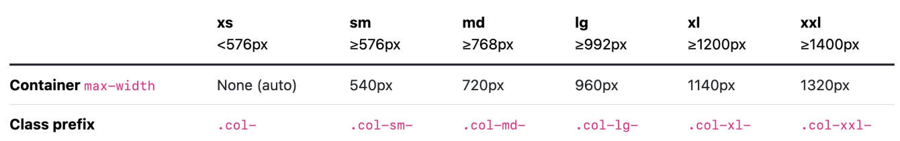

- 각 breakpoints 마다 설정된 최대 너비 값이 **이상으로** 화면이 커지면 grid system 동작이 변경됨
- col-sm-4 : 576px 이상 768px 미만일 때 4칸 차지

### Breakpoints 실습
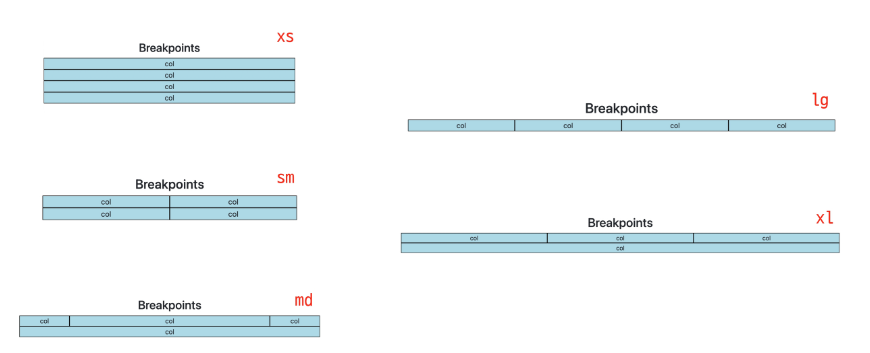

```html
  <h2 class="text-center">Breakpoints</h2>
  <div class="container">
    <div class="row">
      <div class="box col-12 col-sm-6 col-md-2 col-lg-3 col-xl-4">
        col
      </div>
      <div class="box col-12 col-sm-6 col-md-8 col-lg-3 col-xl-4">
        col
      </div>
      <div class="box col-12 col-sm-6 col-md-2 col-lg-3 col-xl-4">
        col
      </div>
      <div class="box col-12 col-sm-6 col-md-12 col-lg-3 col-xl-12">
        col
      </div>
    </div>
```

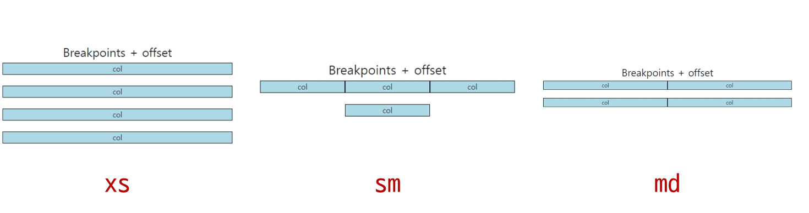

```html
    <h2 class="text-center">Breakpoints + offset</h2>
    <div class="row g-4">
      <div class="box col-12 col-sm-4 col-md-6">
        col
      </div>
      <div class="box col-12 col-sm-4 col-md-6">
        col
      </div>
      <div class="box col-12 col-sm-4 col-md-6">
        col
      </div>
      <div class="box col-12 col-sm-4  col-md-6 offset-sm-4 offset-md-0">
        col
      </div>
    </div>
  </div>
```

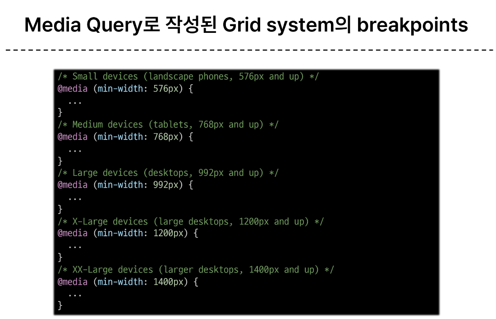

## CSS Layout 정리
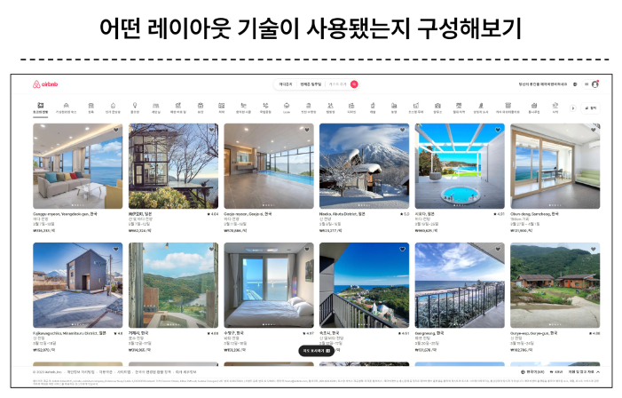  
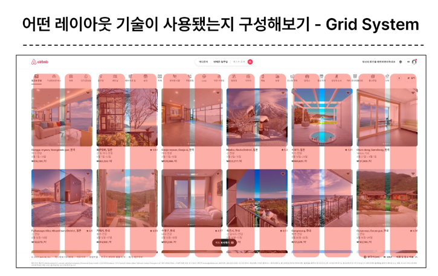  
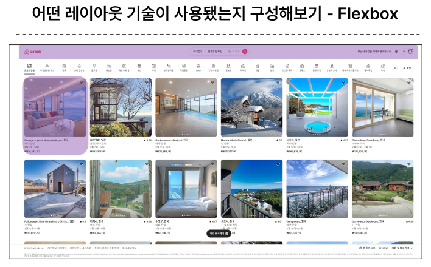  
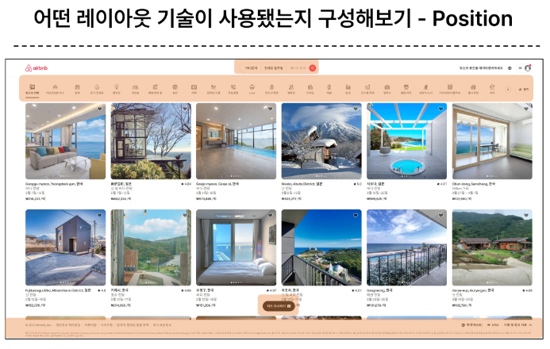


각각의 기술은 용도와 장단점이 있음!  
각 기술은 독립적인 용도를 가지지 않으며, 어떤 기술이 적합한 도구가 될지는 특성 상황에 따라 다름  
이를 파악하기 위해서는 충분한 개발 경험 필요

# 참고
## The Grid System
- CSS가 아닌 편집 디자인에서 나온 개념으로 구성요소를 잘 배치해서 시각적으로 좋은 결과물을 만들기 위함
- 가장 기본적으로 안쪽에 있는 요소들의 오와 열을 맞추는 것에서 기인
- 정보 구조와 배열을 체계적으로 작성하여 정보의 질서를 부여하는 시스템

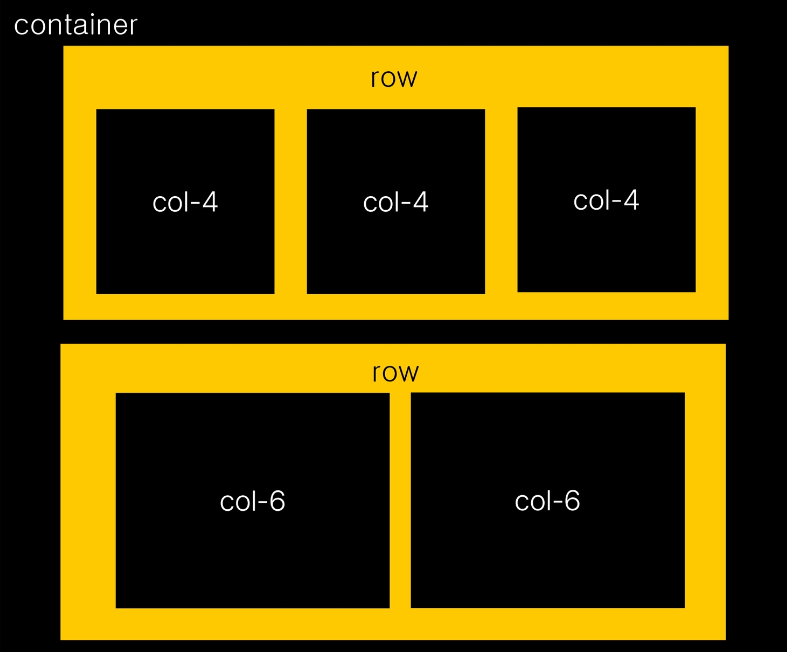

## Grid cards
row-cols 클래스를 사용하여 행당 표시할 열(카드) 수를 손쉽게 제어할 수 있음
