# 05. Intro & Design Pattern
# Intro & Design Pattern
## Framework
웹 어플리케이션을 빠르게 개발할 수 있도록 도와주는 도구 (개발에 필요한 기본 구조, 규칙, 라이브러리 등을 제공)  
서비스 개발에 필요한 기능등을 미리 구현해서 모아 놓은 것 
- Frame(뼈대, 틀) + Work(일하다) : 제공받은 도구들과 뼈대, 규약을 가지고 무언가를 만드는 일
- <=> 라이브러리 : 핵심 기능과 함수만 존재 

프리임 워크를 사용하는 이유
- 기본적인 구조, 도구, 규칙 등을 제공하기 때문에 핵심 개발에만 집중할 수 있음
- 여러 라이브러리를 제공해 개발 속도를 빠르게 할 수 있음 (생산성)
- 유지보수와 확장에 용이해 소프트웨어의 품질을 높임

## Django framework
Django : python 기반의 대표적인 웹 프레임 워크  
검증된 웹 프레임워크로 대규모 서비스에서도 안정적인 서비스 제공


## 클라이언트와 서버
### 웹의 동작 방식
'클라이언트-서버' 구조 (1 request 2 respone)

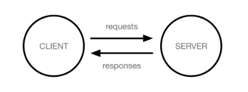

Client(클라이언트)
- 서비스를 요청하는 주체 (웹 사용자의 인터넷이 연결된 장치. 웹 브라우저)

Server(서버)
- 클라이언트의 요청에 응답하는 주체(웹 페이지, 앱을 저장하는 컴퓨터)

우리가 웹 페이이지를 보게되는 과정

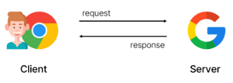

1. 웹 브라우저(클라이언트)에서 'google.com'을 입력
2. 브라우저는 인터넷에 연결된 전세계 어딘 가에 있는 구글 컴퓨터(서버)에게 'Google 홈페이지.html' 파일을 달라고 요청
3. 요청을 받은 구글 컴퓨터는 데이터베이스에서 'Google 홈페이지.html'파일을 찾아 응답
4. 전달받은 'Google 홈페이지.html' 파일을 웹 브라우저가 사람이 볼 수 있도록 해석해주면서 사용자는 구글의 메인 페이지를 보게 됨

Django를 사용해서 서버를 구현할 것

## 프로젝트 및 가상환경
### 가상환경
Python 애플리케이션과 그에 따른 패키지들을 격리하여 관리 할 수 있는 **독립적인** 실행환경
- 같은 패키지이지만 다른 버전을 사용해야하는 경우
- 함께 사용하면 충동일 일어나는 패키지를 사용해야하는 경우

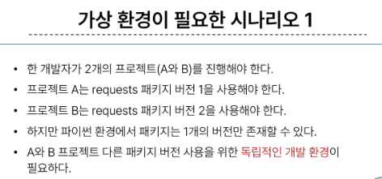

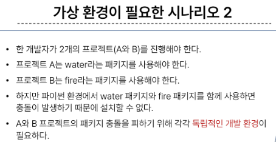

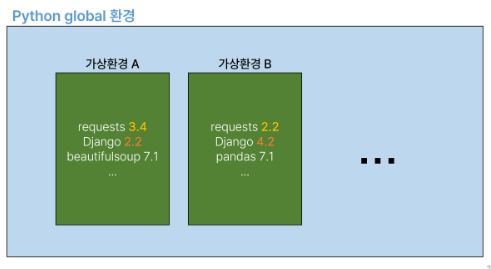

가상환경 venve 생성
```bash
$ python -m venv venv
```

가상환경 활성화
```bash
$ source venv/Sripts/activate
```
```
<!-- 가상환경 활성화 표시 -->
(venv)
```

가상환경 비활성화
```bash
$ deactivate
```

환경에 설치된 패키지 목록 확인
```bash
$ pip list
```

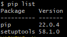

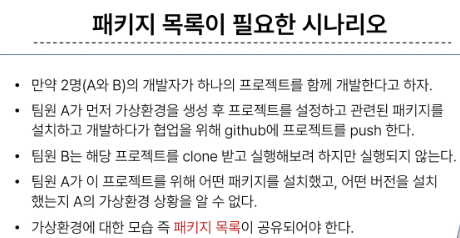
- 가상환경에 대한 모습 즉 **패키지 목록**이 공유되어야 한다.

의존성 패키지
- 한 소프트웨어 패키지가 다른 패키지의 기능이나 코드를 사요앟기 때문에 그 패키지가 존재해야만 제대로 작동하는 관계
- 사용하려는 패키지가 설치되지 않았거나, 호환되는 버전이 아니면 오류가 발생하거나 예상치 못한 동작을 볼 수 있음

ex) requests 설치 후 설치되는 패키지 목록 변환 (1개만 설치되는 것이 아님)  

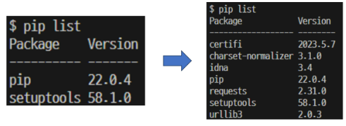

의존성 패키지 관리의 중요성
- 개발 환경에서는 각각의 프로젝트가 사용하는 패키지와 그 버전을 정확히 관리하는 것이 중요

** 가상 환경 & 의존성 패키지 관리**

의존성 패키지 목록 생성
```bash
$ pip freeze > requirements.txt
```
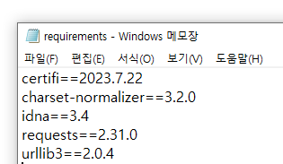

의존성 패키지 목록으로 패키지 설치
```bash
$ pip install -r requirements.txt
```

### Django 프로젝트 생성 전 루틴
```bash
# 1. 가상환경 생성
$ python -m venv venv

# 2. 가상환경 활성화
$ source venv/Scripts/activate

# 3. Django 설치
$ pip install Django

# 4. 의존성 파일 생성 (패키지 설치시마다 진행)
$ pip freeze > requirements.txt
```

### Django 프로젝트 생성
```bash
$ django-admin startproject firstpjt
```
- firstpjt 라는 이름의 프로젝트를 생성

### Django 서버 실행
```bash
$ python manage.py runserver
```
- manage.py와 동일한 경로에서 명령어 진행

ctrl + c 로 서버 종료해두기

### Django 프로젝트 생성 루틴 정리 + 햣
1. 가상환경 생성
2. 가상환경 활성화
3. Django 설치
4. 의존성 파일 생성(패키지 설치시마다 진행)
5. .gitignore 파일 생성 (첫 add 전)
6. git 저장소 생성
7. Django 프로젝스 생성

### 가상환경을 사용하는 이유
의존성 관리
- 라이브러리 및 패키지를 각 프로젝트마다 독립접으로 사용 가능
팀 프로젝트 협헙
- 모든 팀원이 동일한 환경과 의존성 위에서 작업하여 버전간 충돌을 방지

### LTS(Long-Term Support)
- 프레임워크나 라이브러리 등의 소프트웨어에서 장기간 지원되는 안정적인 버전을 의미할 떄 사용
- 기업이나 대규모 프로젝트에서는 소프트웨어 업그레이드에 많은 비용과 시간이 필요하기 때문에 안정적이고 장기간 지원되는 버전이 필요

# Django Design Pattern
## Django 프로젝트와 앱
### Django project 
애플리케이션의 집합 (DB 설정, URL 연결, 전체 앱 설정 등을 처리)

### Django appplication
독립적으로 작동하는 기능 단위 모듈 (각자 특정한 기능을 담당하며 다른 앱들과 함게 하나의 프로젝트를 구성)

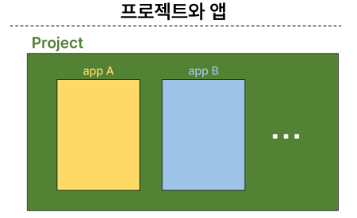

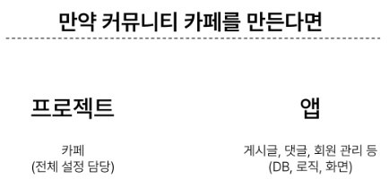

### 앱 사용 과정
앱(App) == 하나의 큰 기능 단위
- 정해진 규칙은 없으며 개발자가 판단해서 앱 생성
- 여러개의 앱이 아닌 단일 앱으로 개발해도 괜찮음

1. 앱 생성
- 앱의 이름은 '복수형' 으로 지정하는 것을 권장
- 게시판 기능을 하는 앱 생성 (CRUD)
```bash
$ python manage.py startapp articles
```
2. 앱 등록
- 반드시 앱을 생성한 후에 등록해야함
- 등록 후 생성은 불가능

settings.py > install_apps 에 저장

## Django 디자인 패턴
### 디자인 패턴
소프트웨어 설계에서 발생하는 문제를 해결하기 위한 일반적인 해결책  
(공통적인 문제를 해결하는데 쓰이는 형식화 된 관행)

### MVC  디자인 패턴 (Model : DB, Viesw : 화면, Controller) : 내부조건
애플리케이션을 구조화하는 대표적인 패턴 ( 데이터, 사용자 인터페이스, 비즈니스 로직을 분리)
- 시사적 요소와 뒤에서 실행되는 로직을 서로 영향 없이, 독립적이고 십게 유지 보수할 수 있는 애플리케이션을 만들기 위해
- Model : 데이터 + 로직
- View : UI (시각적)
- Controller : 입력

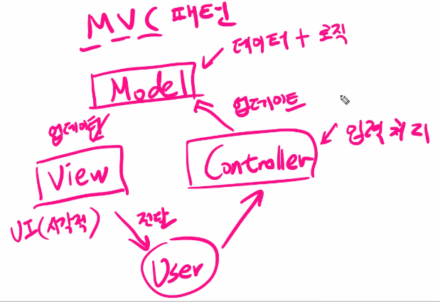

### MTV 디자인 패턴 (Model, Template, View)
Django에서 애플리케이션을 구조화하는 패턴 (기존 MVC 패천과 동일하나 명칭을 다르게 정의한 것)

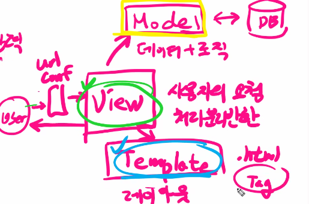
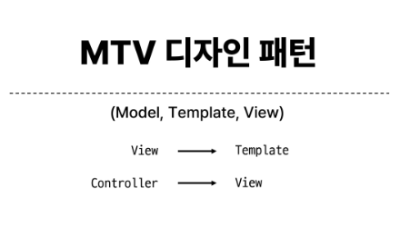

### 프로젝트 구조
settings.py
- 프로젝트의 모든 설정을 관리

urls.py
- URL과 이에 해당하는 적절한 views를 연결
- 테이블 형태로 url <-> view

\_\_init\_\_.py
- 해당 폴더를 패키지로 인식하도록 설정

asgi.py
- 비동기식 웹 서버와의 연결 및 소통 관련 설정
- 추후 배포 시에 사용하며 지금은 수정하지 않음

wsgl.py
- 웹 서버와 연결 관련 설정
- 추후 배포 시에 사용하며 지금은 수정하지 않음

manage.py
- Django 프로젝트와 다양한 방법으로 상호작용하는 커맨드라인 유틸리티
- 수업 과정에서 수정할 일 없음

### 앱 구조
admin.py
- 관리자용 페이지 설정
- 모니터링, 더미 데이터...

models.py
- DB와 관련된 Model을 정의 (데이터 로직과 실질적인 연관)
- MTV 패턴의 M

views.py
- view 함수들이 정의되는 곳
- HTTP 요청울 처리하고 해당 요총에 대한 응답을 반환(url, model, temlate와 연계)
- MTV 패턴의 V

이 아래는 수업 과정에서 수정할 일 없읍
apps.py
- 메타 정보를 담기 위해 사용
- 앱의 정보가 작성된 곳

tests.py
- 프로젝트 테스트 코드를 작성하는 곳

## Project & Application
Project
- collection of apps
- 프로젝트는 앱의 집합
- 프로젝트에는 여러 맵이 포함될 수 있음
- 앱은 여러 프로젝트에 있을 수 있음

Applitcation
- 앱은 실제 요청을 처리하고 페이지를 보여주는 등의 역할을 담당
- 앱은 하나의 역할 및 기능 다위로 작성하는 것을 권장함

## 요청과 응답

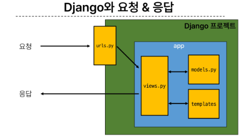

### URLs
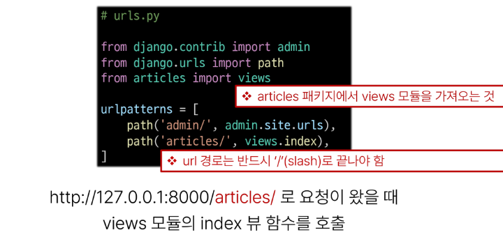

### View
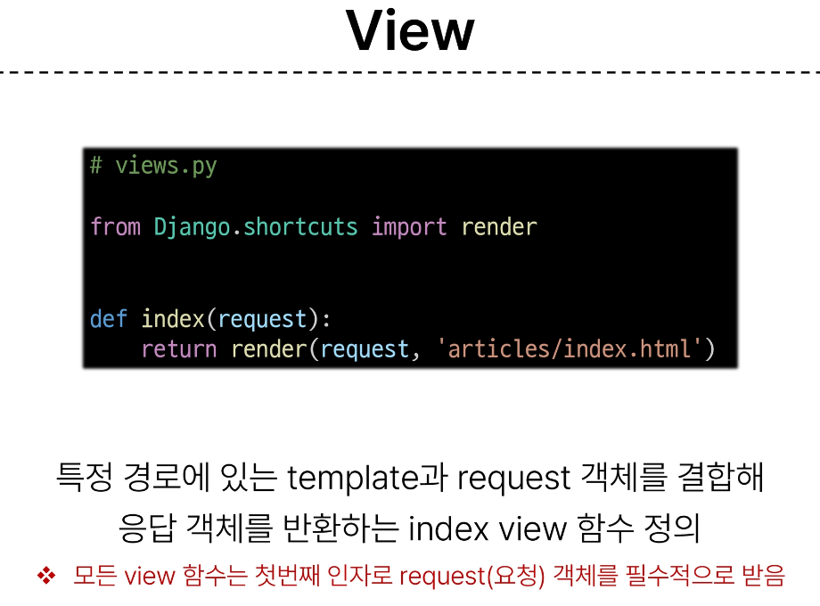

### Template
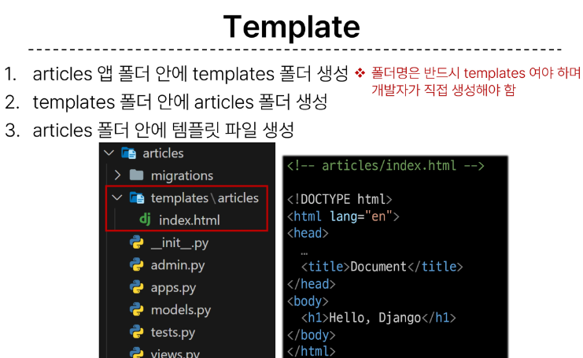

### Django에서 template을 인식하는 경로 규칙
app폴더/templates/articles/index.html  
app폴더/templates/example.html

app폴더/templates/ <- 이 지점가지 기본 경로로 인식하기 대문에 이 지점 이후의 template 경로를 작성해야함

### 데이터 흐름에 따른 코드 작성
UTLs -> View -> Template  
URLs    
```
path('articles/', view.index),
```

View  
```
def index(request):
    return render(request, 'articles/index.html')
```  

Template
```
articles/templates/articles/index.html
```

### render()
> render(request, template_name, context)

주어진 템플릿을 주어진 컨텍스트 데이터와 결합하고 렌더링된 텍스트와 함께 HttpResponse(응답) 객체를 반환하는 함수
1. request
- 응답을 생성하는 데 사용되는 요청 객체
2. template_name
- 템플릿의 전체 이름 또는 템플릿 이름의 경로
3. context
- 템플릿에서 사용할 데이터(딕셔너리 타입으로 작성)