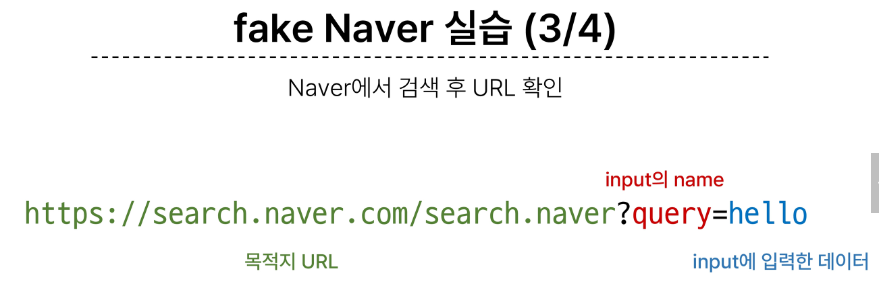
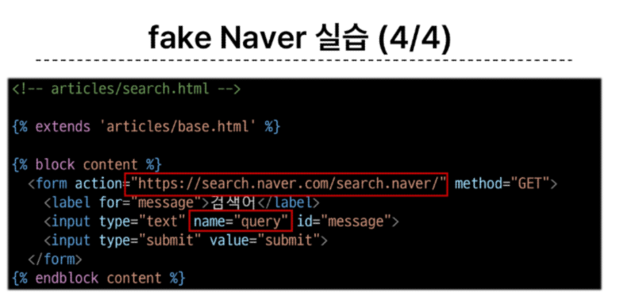
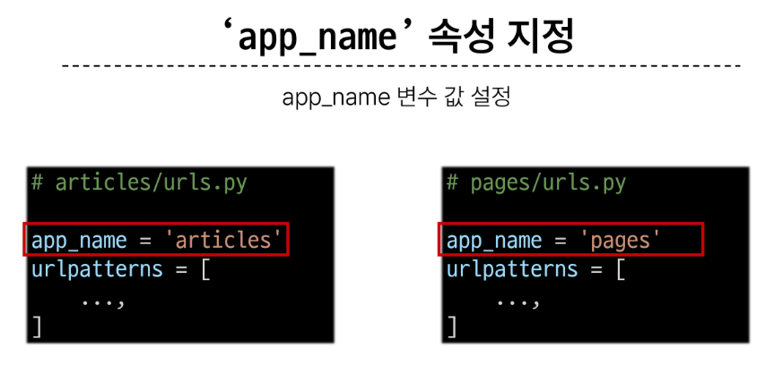

# 02. Django Template & URLs
# Template System
### Django Template System  
- 데이터 **표현**을 제어하면서, **표현**과 관련된 부분을 담당
- Django Template을 이용한 HTML 정적 부분과 동적 컨텐츠 삽입
- Template System의 기본 목표를 숙지

HTML의 콘텐츠를 변수 값에 따라 바꾸고 싶다면?  


### Django Template Language(DTL)
- Django template에서 사용하는 built-in template system
- Template에서 조건, 반복, 변수 등의 프로그래밍적 기능을 제공하는 시스템
    - python처럼 일부 프로그래밍 구조(if, for) 등을 사용할 수 있지만 **Python 코드로 실행되는 것이 아님**
- 프로그래밍적 로직이 아니라 프레젠테이션을 표햔하기 위한 것임을 명심


1. 변수 출력 (Variable Output)
중괄호로 변수를 감싸서 출력하는 방법
- 예) {{ variable }} <- variable이라는 변수를 출력할 수 있다.

뷰 함수를 작성할 때에
```
def index(request):
    context = {'variable' : 20}
    return render(request, "apppname/index.html", context)
```

2. 템플릿 태그(Template Tags)
if, for, block, extends, include <- 조건과 반복을 보여줄 때에

3. 필터 (Filter)
변수 출력 구문 안에 파이프(|) 기호를 사용해서 변수 출력을 수정할 때 사용
{{ variable | lenght }} -> 5

4. 주석
주석을 작성하여 안쪽에 있는 DTL 코드들과 HTML 표현들은 모두 무시된다.


### DTL Syntax
1. Variable
- render 함수의 세번째 인자로 딕셔너리 데이터를 사용
- 영어, 숫자 _ 가능
- 딕셔너리 key 에 해당하는 문자열이 template에서 사용 가능한 변수명이 됨
- dot(.)를 사용하여 변수 속성에 접근할 수 있음
```
{{ variable }}
```
2. Filters
- 표시할 변수를 수정할 때 사용
- chained가 가능하며 일부 필터는 인자를 받기도 함
- 약 60개의 bulit-in temlate filters를 제공
```
{{ variavle|filter }}
{{ name"truncatewords:30 }}
```
3. Tags
- 출력 텍스트를 만들거나, 반복 또는 논리를 수행하여 제어 흐름을 만듦. 변수보다 복잡한 일 수행
- 일부 태그는 시작과 종료 태그가 필요
- 약 24개의 bulit-in template tage 를 제공
```

 
```
4. Comments
- DTL에서의 주석


DTL 예시


[태그와 필터 참고](https://docs.djangoproject.com/en/4.2/ref/templates/builtins/)

# 템플릿 상속
기존 템플릿 구조의 한계
- 만약 모든 템플릿에 bootstrap을 적용하려면?
- 모든 템플릿에 bootsrtap 을 작성해야 할까?

## 템플릿 상속 (Template inheritance)
**페이지의 공통 요소를 포함**하고, **하위 템플릿이 재정의 할 수 있는 공간**을 정의하는 기본 'skeleton' 템플릿을 작성하여 상속 구조를 구축
- 기본적으로 코드의 재사용성에 초점을 맞춤

### 상속 구조 구축
  


## 전체 프로젝트 공용으로 사용하기
setting에서 템플릿 기본 주소 변경 뒤, 해당 위치로 폴더 생성


### 'extends' tag
> 

자식(하위) 템플릿이 부모 템플릿을 확장한다는 것을 알림  
**반드시 템플릿 최상단에 작성되어야 함(2개 이상 사용 불가)**

### 'block' tag
> 

하위 템플릿에서 재정의 할 수 있는 블록을 정의  
(하위 템플릿이 작성할 수 있는 공간을 지정)
- 가독성을 높이기 위해 선택적으로 endblock 태그에 이름을 지정할 수 있음


# HTML form (요청과 응답)
### 데이터를 보내고 가져오기 (Sending and Retrieving form data)
HTML form element를 통해 사용자와 애플리케이션 간의 상호작용 이해하기

HTML form은 HTTP 요청을 서버에 보내는 가장 편리한 방법

  


### 'form' elemnet
사용자로부터 할당된 데이터를 서버로 전송
- 웹에서 사용자 정도를 입력하는 여러 방식(text, password, checkbox 등)을 제공

  
  
  
  

## 'action' & 'method'
form의 핵심 속성 2가지
- 데이터를 어디(action)로 어떤 방식(methon)으로 요청할지  

action
- 입력 데이터가 전송될 URL을 지정 (목적지)
- 만약 이 속성을 지정하지 않으면 데이터는 현재 form이 있는 페이지의 URL로 보내짐

method
- 데이터를 어떤 방식으로 보낼 것인지 정의
- 데이터의 HTTP request methods (GET, POST)를 지정

## 'input' element
사용자의 데이터를 입력 받을 수 있는 요소 (type 속성 값에 따라 다양한 유형의 입력데이터를 받음)

## 'name' attribute : input의 핵심 속성
입력핟 데이터에 붙이는 이름(key)
- 데이터를 재출했을 때 서버는 name 속성에 설정된 값을 통해서만 사용자가 입력한 데이터에 접근할 수 있음

### Query STring Parameters
- 사용자의 입력 데이터를 URL 주소에 파라미터를 통해 서버로 보내는 방법
- 문자열을 엠퍼샌드(&)로 연결된 key-value 쌍으로 구성되며, 기본 URL과 물음표(?)로 구분 됨
- 예시
> https://host:port/path?key-value&key=value

## form 활용


## HTTP request 객체
form으로 전송한 데이터 뿐만 아니라 모든 요청 관련 데이터가 담겨 있음 (view 함수의 첫번째 인자)


# Django URLs
웹 어플리케이션은 URL을 통한 클라이언트의 요청에서부터 시작함


## URL dispatcher (운항 관리자, 분배기)
URL 패턴을 정의하고 해당 패턴이 일치하는 요청을 처리할 view 함수를 연결(매핑)

+) Trailing Slashes  
- Django는 URL 끝에 /를 붙여주는 것이 기본 설정이다 !

# 변수와 URL 
현재 URL 관리의 문제점
- 템플릿의 많은 부분이 중복, URL 일부만 변경되는 상황!

## Variable Routing
URL 일부에 변수를 포함시키는 것, URL 주소를 변수로 사용하는 것 !
(변수는 view 함수의 인자로 전달할 수 있음)
- 즉, 변수 값에 따라 하나의 path()에 여러 페이지를 연결시킬 수 있음

### Variable Routing 작성법
> <path_converter:variable_name>


## Path converters
URL 변수의 타입을 지정 (str, int 등 5가지 타입 지원)
  


# App과 URL
### App URL mapping
각 앱에 URL을 정의하는 것
- 프로젝트와 각 앱이 URL을 나누어 관리를 편하게 하기 위함

1. 앱이 2개 이상인 경우 발생할 수 있는 문제
- view 함수 이름이 같거나 같은 패턴의 url 주소르 사용하게 되는 경우
- 아래의 방법으로 해결이 가능함


2. 각각의 app 폴더 안에 urls.py를 작성
- 하나의 프로젝트에 여러앱이 존재한다면, 각각의 앱 안에 urls.py을 만들고 프로젝트 urls.py에서 각 앱의 urls.py 파일로 URL 매핑을 위탁할 수 있음


### including other URLconfs
- urlpattern은 언제든지 URLconf 모듈을 포함(include)할 수 있음
**includeehlsms doqdml url.py에 urlpatterns가 작성되어 있지 않다면 에러가 발생**
- 예를 들어, pages앱의 urlpatterns가 빈 리스트라도 작성되어 있어야 함


### include()
프로젝트 내부 앱들의 URL을 참조할 수 있도록 매핑하는 함수
- URL의 일치하는 부분가지 잘라내고, 남은 문자열 부분은 후속 처리를 위해 include된 URL로 전달


# URL 이름 지정
## Namin URL patterns
URL에 이름을 지정하는 것 
- path 함수의 name 인자를 정의해서 사용
- DTL의 Tag 중 하나인 **URL 태그**를 사용하여 path() 함수에 작성한 name을 사용할 수 있음
- URL 설정에 정의된 특정한 경로들의 의존성 제거 가능, view함수와 템플릿에서 특정 주소 쉽게 참조 가능
- url 구조 변경에 따라 해당 주소 사용하는 모든 위치를 찾아가 변경해주어야하는 번거로움을 덜 수 있음


### 'url'tag
> 

주어진 URL 패턴의 이름과 일치하는 절대 경로 주소를 반환


# URL 이름 공간
URL namespace를 사용하면 서로 다른 앱에서 동이란 URL 이름을 사용하는 경우에도 이름이 지정된 URL을 고유하게 사용할 수 있음

### app_name
app_name attribute를 작성해 URL nameapce를 설정



### URL tag의 최종 변화
마지막으로 url 태그가 사용하는 모든 곳의 표기 변경하기
