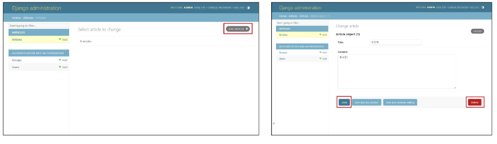

# 03. Django Model
# Model
### Database
- 체계화된 데이터의 모임
- 검색 및 구조화 같은 작업을 보다 쉽게 하기 위해 조직화된 데이터를 수집하는 저장 시스템

데이터 베이스의 기본 구조 
- 스키마
    - 뼈대(Structure)
    - 데이터베이스에서 자료의 구조, 표현 방법, 관계 등을 정의한 구조
    - 
- 테이블(Table)
    - 필드와 레코드를 사용해 조직된 데이터의 요소들의 집합
    - 관계(Relation)라고도 부름
    1. 필드(field) : 속성, 컬럼(Column)
    2. 레코드(record) : 튜플, 행(Row) -> 테이블의 데이터
    
- PK(Primary key)
    - 기본 키
    - 각 레코드의 고유한 값 (식별자로 사용)
    - 기술적으로 **다른 항목과 절대로 중복될 수 없는 단일 값(unique)**
    - 데이터베이스 관리 및 테이블 간 관계 설정 시 주요하게 활용됨
    - 예) 주민번호
- 쿼리(Query)
    - 데이터를 조회하기 위한 명령어
    - 조건에 맞는 데이터를 추출하거나 조작하는 명령어(주로 테이블형 자료구조에서)
    - Query를 날린다 -> 데이터베이스를 조작한다.

### Django Model


DB의 테이블(표)을 정의하고 데이터를 조작(생성, 수정, 삭제)할 수 있는 기능들을 제공 (DB를 관리)
- 사용하는 데이터들의 필수적인 필드들과 동작들을 포함
- 저장된 데이터베이스의 구조(layout)
- 일반적으로 각가의 모델은 하나의 데이터베이스 테이블에 매핑(mapping)
    - 모델 클래스 1개 == 데이터베이스 테이블 1개
- 테이블 구조를 설계하는 청사진(blueprint)


## model 클래스 작성
Article클래스 models 모듈의 Model 클래스, Field 클래스, TextField 클래스 등


## model 클래스 살펴보기
- 작성한 모델 클래스는 최종적으로 DB에 다음과 같은 테이블 구조를 만듦
- 클래스 변수 하나하나가 하나의 컬럼!


- django.db.models 모듈의 Modle이라는 부모 클래스를 상속받음
- Model은 model에 관련된 모든 코드가 이미 작성되어 있는 클래스
- 개발자는 가장 중요한 테이블 구조를 어떻게 설계할지에 대한 코드만 작성하도록 하기 위한 것 (프레임워크의 이점)  


- 클래스 변수명
    - 테이블의 각 "필드(열) 이름"


- model Fiesld 클래스
    - 테이블 필드의 "데이터 타입"  


- model Field 클래스의 키워드 인자 (필드 옵션)
    - 테이블 필드의 "제약조건" 관련 설정


### 제약 조건
데이터가 올바르게 저장되고 관리되도록하기 위한 규칙
- ex) 숫자만 저장되도록, 문자가 100자까지만 저장되도록 하는 등

# Migrations
- 데이터베이스 스키마 정의한 것을 반영하는 방법

model 클래스의 변경사항(필드 생성, 수정 삭제 등)을 DB에 최종 반영하는 방법


### Migrations 핵심 명령어 2가지 ⭐
model class를 기반으로 최종 설계도(migration) 작성
- 모델의 변경 사항에 대한 새로운 migraion을 만들 때 사용
```bash
$ python mange.py makemigrations
```


최종 설계도를 DB에 전달하여 반영
- makemigrations 로 만든 설계도를 실제 데이터베이스에 반영
- 모델의 변경사항과 데이터베이스를 동기화
```bash
$ python manage.py migrate
```

- 우리가 작성한 테이블 + 기본적으로 작성되어 있던 것들


migrate 후 DB내에 생성된 테이블 확인


## 추가 Migrations
이미 생성된 테이블에 필드를 추가해야 한다면?

### 추가 모델 필드 작성


- 이미 기존 테이블이 존재하기 때문에 필드를 추가할 때 필드의 기본 값 설정이 필요
- 1번은 현대 대화를 유지하면서 직접 기본 값을 입력하는 방법 (O)
- 2번은 현재 대화에서 나간 후 models.py 에 기본 값 관련 설정을 하는 방법


- 추가하는 필드의 기본 값울 입력해야 하는 상황
- 날짜 데이터이기 때문에 직접 입력하기 보다 Django가 제안하는 기본 값을 사용하는 것을 권장
- 아무것도 입력하지 않고 enter를 누르면 Djnango가 제안하는 기본 값으로 설정됨


- migrations 과정 종료 후 2전째 migration 파일이 생성됨을 확인
- 이처럼 Django는 설계도를 쌓아가면서 추후 문제가 생겼을 시 복구하거나 되돌릴 수 있도록 함 (마치 git commit)


- migrate 후 테이블 필드 변화 확인


**model class에 변경사항(1)이 생겼다면, 반드시 새로운 설계도를 생성(2)하고, 이를 DB에 반영(3)해야 한다.**  
1. model class 변경
2. makemigrations
3. migrate

## 모델 필드 (Modle Field)
DB 테이블의 필드(열)을 정의하며, 해당 필드에 저장되는 데이터 유형(INT,TEXT)과 제약조건을 정의
- 데이터 유형에 따라 다양한 모델 필드를 제공
    - DataField(), CharField(), IntegerField() 등

### CharField()
길이의 제한이 있는 문자열을 넣을 때 사용  
(필들의 최대 길이를 결정하는 max_length는 필수 인자)

### TextField()
글자의 수가 많을 때 사용
- max_length 옵션 작성 시 사용자 입력 단계에서는 반영되지만, 모델과 데이터베이스 단계에는 적용되지 않음(저장시 유효성 검증 X)

### DateTimeField() ⭐
날짜와 시간을 넣을 때 사용
- auto_now
    - 데이터가 **저장될 때마다** 현재 날짜 시간을 저장 (수정일)

- auto_now_add
    - 데이터가 **처음 생성될 때만** 자동으로 현재 날짜시간을 저장 (작성일)

# Admin site
## Automatic admin interface
Django는 추가 설치 및 설정 없이 자동으로 관리자 인터페이스를 제공
- 데이터 확인 및 테스트 등을 진행하는데 매우 유용

## admin 계정 생성
- email은 선택 사항이기 때문에 입력하지 않고 진행 가능
- 비밀번호 입력 시 보안상 터미널에 출력되지 않으니 무시하고 입력 이어가기
```bash
$ python manage.py createsuperuser
```


admin에 모델 클래스 등록
- admin.py에 작성한 모델 클래스를 등록해야하면 admin site에서 확인 가능


admin site 로그인 후 등록된 모델 클래스 확인


데이터 생성, 수정, 삭제 테스트



테이블 확인


# 참고
## 데이터베이스 초기화


- 폴더 이름을 수정하여도 연관되어 있는 것들에 반영되지 않으므로 그냥 지우고 다시 하는 것이 나음

## Migrations 기타 명령어
```bash
$ 
```
- migrations 파일들이 migrate 됐는지 안됐는지 여부를 확인하는 명령어
- [X] 표시가 있으면 migrate가 완료되었음을 의미

```bash
$ python manage.py sqlmigrated articles 0001
```
- 해당 migrations 파일이 SQL언어(DB에서 사용하는 언어)로 어떻게 번역되어 DB에 전달되는지 확인하는 명령어

## 첫 migrate시 출력 내용이 많은 이유는?
Django 프로젝트가 동작하기 위해 미리 작성되어있는 기본 내장 app들에 대한 migration파일들이 함께 migrate 되기 때문


## SQLite
데이터베이스 관리 시스템 중 하나이며 Django의 기본 데이터베이스로 사용됨(파일로 존재하며 가볍고 호환성이 좋음)

## CRUD
소프트웨어가 가지는 기본적인 데이터 처리 기능
- Create (저장)
- Read (조회)
- Update (갱신)
- Delete (삭제)