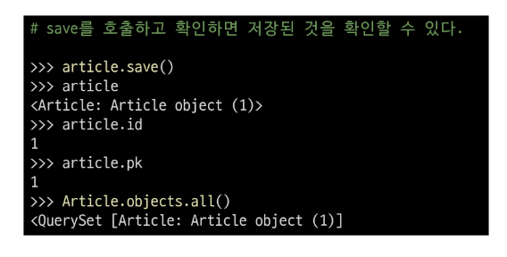

# 04. Django OTM
# ORM(Object-RELATIONAL_Mapping)
객체 지향 프로그래밍 언어를 사용하여 호환되지 않는 유형의 시스템 간에 데이터를 변환하는 기술

ORM의 역할  
- 데이터베이스에 대한 세세한 조작은 어려움
- 러닝커브 높아지는 단점


# QuerySet API
ORM에서 데이터를 검색, 필터링, 정렬 및 그룹화 하는데 사용하는 도구
- API를 사용하여 SQL이 아닌 Python코드로 데이터를 처리


메서드를 사용하기 위해 manager이 필요함

### Query
- 데이터베이스에 특정한 데이터를 보여달라는 요청
- "쿼리문을 작성한다."
    - 원하는 데이터를 얻기 위해 데이터베이스에 요청을 보낼 코드를 작성한다.
- 파이썬으로 작성한 코드가 ORM에 의헤 SQL로 변환되어 데이터 베이스에 전달되며, 데이터베이스의 응답 데이터를 ORM이 QuerySet이라는 자료 형태로 변환하여 우리에게 전달

### QuerySet
- 데이터베이스에게서 전달 받은 객체 목록(데이터 모음)
    - 순회가 가능한 데이터로써 1개 이상의 데이터를 불러와 사용할 수 있음
    - for문으로 처리가 가능
- Django ORM을 통해 만들어진 자료형
- 단, 데이터베이스가 단일한 객체를 반환할 때는 QuerySet이 아닌 모델(class)의 인스턴스로 반환됨 
    - ex) get()

## Python의 모델 클래스와 인스턴스를 활용해 DB에 데이터를 저장(Create), 조회(Read), 수정(Update), 삭제(Delete)하는 것

# QuerySet API 실습
## Creat
QuerySet API 실습 사전 준비
- 외부 라이브러리 설치 및 설정


Django shell
- Django 환경 안에서 실행되는 python shell
- (입력하는 QuerySet API 구문이 Django 프로젝트에 영향을 미침)

Django shell 실행
```bash
$ python manage.py shell_plus
```
나가고 싶다면
```
exit
```

데이터 객체를 만드는 (생성하는) 3가지 방법
- 첫번째 방법  

  
  


- 두번째 방법
- save 메서드를 호출해야 비로소 DB예 뗴이터까 쩌짱뙴
- 테이블에 한 줄(행, 레코드)이 쓰여진 것


- 세번째 방법
- Query Set API중 create() 메서드 활용


### save()
객체를 데이터베이스에 저장하는 메서드

## Read
### all()
전체 데이터 조회


### get()
단일 데이터 조회
- 객체를 찾을 수 없으면 DoesNotExist 예외를 발생시키고, 둘 이상의 객체를 찾으면 MutipleObjectsReturned 예외를 발생시킴
- 위와 같은 특징을 가지고 있기 때문에 **primary key와 같이 고유성(uniqueness)을 보장하는 조회에서 사용해야함**
- Query로 반환한다!


### filter()
특정 조건 데이터 조회 : QuerySet으로 값을 반환
- 해당 조건의 데이터가 없는 경우 <QuerySet []>


## Update
데이터 수정
- 인스턴스 변수를 변경 후 save 메서트 호출


## Delete
데이터 삭제
- 삭제하려는 데이터 조회 후 delete 메서드 호출


# 참고
## Field lookups
- 특정 레코드에 대한 조건을 설정하는 방법
- QuerytSet 메서드 filter(), exclude() 및 get()에 대한 키워드 인자로 지정됨


## ORM, QuerySet API를 사용하는 이유
- 데이터베이스 쿼리를 추상화하여 Django 개발자가 데이터베이스와 직접 상호작용하지 안하도 되도록 함
- 데이터베이스와의 결합도를 낮추고 개발자가 더욱 직관적이고 생산적으로 개발할 수 있도록 도움