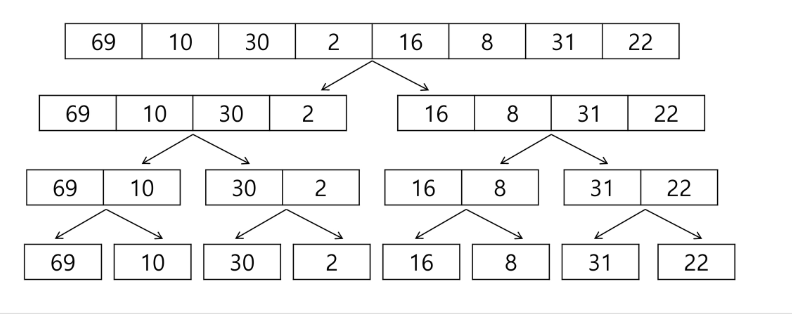

# 01. 분할 정복, 백트래킹
# Warm-up : 알고리즘 설계 기법의 종류
1. 전체를 다 보자 (Brute Force - 완전 탐색)
    - 배열: 반복문을 다 돌리기
    - 그래프 : DFS, BFS
2. 상황마다 좋은 걸 고르자 (Greedy -  탐욕)
    - 규칙을 찾는 것
    - 주의사항 : 항상 좋은 것을 뽑아도, 최종 결과가 제일 좋다는 것이 보장되지 않는다.
3. 하나의 큰 문제를 작은 문제로 나누어 부분적으로 해결하자 (Dynamic Programming)
    - Memoization 기법을 활용
    - 점화식(bottom-up), 재귀(top-down)
4. 큰 문제를 작은 문제로 쪼개서 해결하자 (Divide and Conquer - 분할정복)
5. 전체 중, 가능성 없는 것을 빼고 보자 (Backtracking - 백트래킹)
    - 가지치기
# 분할 정복
설계전략
- 분할(Divide): 해결할 문제를 여러 개의 작은 부분으로 나눈다.
- 정복(Conquer): 나눈 작은 문제를 각각 해결한다.
- 통합(Combine): (필요하다면) 해결된 해답을 모은다.


# 병합 정렬 (Merge sort)
여러 개의 정렬된 자료의 집합을 병합하여 한 개의 정렬된 집합으로 만드는 방식(나눌 수 없을 때까지, 문제를 쉽게 해결할 수 있을 때까지)

분할 정복 알고리즘 활용
- 자료를 최소 단위의 문제가지 나누 후에 차례대로 정렬하여 최종 결과를 얻어냄
- top-down 방식

시간 복잡도
- O(nlogn) : 최악, 최선 모두

## 병합 정렬 과정
- 분할 단계: 전체 자료 집합에 대하여, 최소 크기의 부분집합이 될 때까지 분할 작업을 계속한다.



- 병합 단계 : 2개의 부분집합을 정렬하면서 하나의 집합으로 병합
- 8개의 부분집합이 1개로 병합될 때가지 반복함


분할과정
- 구조가 변하지 않는다면 재귀 호출
- 하나의 정렬된 리스트로 반환
```
merge_sort(List, m)
    if length(m) == 1 : return m

    List left, right
    middle <- length(m)/2
    For x in m before middle
        add x to left
    For x in m after or equal middle
        add x to right
    left <- merge_sort(left)
    right <- merge_sort(right)
    
    Return merge(left, right)
```

병합과정
```
merge(:ist left, List right
    List result
    
    While length(left) > or length(right) > 0
        IF length(left) > 0 AND length(right) > 0
            # 더 작은 것을 result 배열에 넣어라
            If first(left) <= first(right)
                append popfirst(left) to result
            ELSE
                append popfirst(right) to result
        # 둘 중 하나가 비고 나면
        # 남은 데이터를 모두 넣어라
        ELIF length(left) > 0
            append popfirst(left) to result
        ELIF length(right) > 0
            append popfirst(right) to result
    RETURN result
```

# 퀵 정렬
주어진 배열을 두 개로 분할하고, 각각을 정렬한다.

병합정렬과 퀵 정렬의 차이점
1. 병합 정렬은 그냥 두 부분으로 나누는 반면에. 퀵 정렬은 분할할 대, 기준 아이템(pivot item) 중심으로, 이보다 작은 것은 왼편, 큰 것은 오르편에 위치시킨다.
2. 각 부분 정렬이 끝난 후, 병합 정렬은 "병합"이란 후처리 작업이 필요하나, 퀵 정렬은 필요로 하지 않는다.


## Hoare-Partition

## 아이디어
- P(피봇)값들보다 큰 값은 오른족, 작은 값들은 왼쪽 집합에 위치하도록 한다.


  
- 피봇을 두 집합의 가운데에 위치시킨다.


- 피봇 선택


  


## lomuto position 알고리즘


# 이진 검색 (Binary Search) ⭐⭐⭐ 코테 단골
자료의 가운데에 있는 항목의 키 값과 비교하여 다음 검색의 위치를 결정하고 검색을 계속 진행하는 방법
- 목적 키를 찾을 때가지 이진 검색을 순환적으로 반복 수햄함으로서 검색 범위를 반으로 줄여가면서 보다 빠르게 검색을 수행함

이진 검색을 하기 위해서는 자료가 정렬된 상태여야 한다.

시간복잡도 : O(logn)

## 검색 과정
1. 자료의 중앙에 있는 원소를 고른다.
2. 중앙 원소의 값과 찾고자 하는 목표 값을 비교한다.
3. 목표 값이 중앙 원소의 값보다 작으면 오른쪽 반에 대해서 새로 검색을 수행한다.
4. 찾고자 하는 값을 찾을 때가지 1~3 반복


### 분할 정복의 활용
- 병합 정렬은 외부 정렬의 기본이 되는 알고리즘이다. 또한, 멀티코어(Multi-Core) CPU나 다수의 프로세서에서 정렬 알고리즘을 병렬화하기 위해 병합 정렬 알고리즘이 활용된다.
- 퀵 정렬은 매우 큰 입력 데이터에 새대허 좋은 성능을 보이는 알고리즘이다.

내장 라이브러리가 강력!
sort(), sorted()
병합 정렬(멀티 쓰레드)
: 과거에 면접 단골 질문 + 분할 정복 학습에 좋다.
-> 코드를 보기 전에 반드시 손으로 직접해보기

퀵 정렬 
- 직접 구현할 일은 적다.
- 평균적으로 굉장히 좋음 o(nlogn)
- 큰 데이터를 다룰 때 좋다.
- 단점 ; 역순 정렬 등 최악의 경우 O(N^2)
: 과거에 면접 단골 질문 + 분할 정복 학습에 좋다.
-> 코드를 보기 전에 반드시 손으로 직접해보기
  
이진 검색
- 코딩 테스트의 메인 알고리즘 중 하나
- 목적 : "원하는 값 빨리 찾는 것"
- 시간 : O(logN)
- parametric Search
    - lower bound
    - upper bound
    - 여러 개의 데이터 중 2가 처음 나온 시점
    - 2~9 사이의 데이터는 몇개인가?
    