# 02. 분할 정복 & 백트래킹
# 백트래킹
대표적인 문제 : n-queen
- 여러 가지 선택지(옵션)들이 존재하는 상황에서 한가지를 선택한다.
- 선택이 이루어지면 새로운 선택지들의 집합이 생성된다.
- 이런 선택을 반복하면서 최종 상태에 도달한다
    - 올바를 선택을 계속하면 목표 상태(goal state)에 도달한다.

### 예제) 당첨 리프 노드 찾기  
1. 루트에서 갈 수 있는 노드를 선택한다.
2. 꽝 노드가지 도달하면 최근의 선택으로 되돌아와서 다시 시작한다.
3. 더 이상이 선택지가 없다면 이전의 선택지로 돌아가서 다른 선택을 한다.
4. 루트까지 돌아갔을 경우 더 이상 선택지가 없다면 찾는 답이 없다.

### 백트래킹과 깊이 우선 탐색과의 차이
- Prunning(가지치기) : 해결책으로 이어질 것 같지 않으면 더 이상 그 경로를 따라가지 않음으로써 시도 횟수를 줄임
- 깊이 우선 탐색은 모든 경로를 추척하지만, 백트래킹은 불필요한 경로를 조기에 차단한다.
- 깊이 우선 탐색은 경우의 수가 너무 많음.. N!가지의 경우의 수
- **백트래킹을 적용하면 일반적으로 경우의 수가 줄어들디만 이 역시 최악의 경우에는 여전히 지수함수 시간(Exponential Time)을 요하므로 처리 불가능**

### 8-Queens 문제
퀸 8개를 크기의 체스판 안에 서로를 공경할 수 없도록 배치하는 모든 경우를 구하는 문제  
후보 해의 수가 44억 개로 엄청 많은 것에 비해 실제 해의 수는 92개..

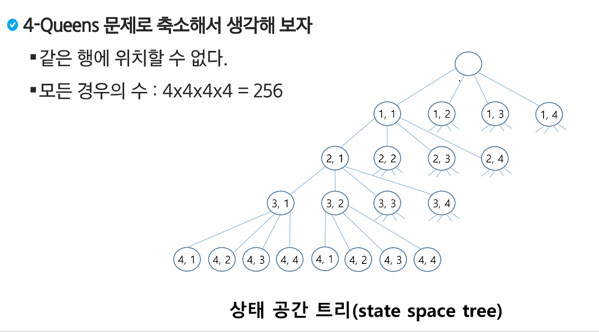

백트래킹 기법  
- 어떤 노드의 유망성을 점검한 후에 유망(promising)하지 않다고 결정되면 그 노드의 부모로 되돌아가(backtracking) 다음 자식 노드로 감
- 어떤 노드를 방문하였을 때 그 노드를 포함한 경로가 해답이 될 수 없으면 그 노드는 유망하지 않다고 하며, 반대로 해답의 가능성이 있으면 유망하다고 한다.
- 가지치기(prunning) : 유망하지 않은 노드가 포함되는 경로를 더 이상 고려하지 않는다.

백트래킹 절차  
1. 상태 공간 트리의 깊이 우선 검색을 실시
2. 각 노드가 유망하지를 점검
3. 만일 그 노드가 유망하지 않으면, 그 노드의 부모 노드로 돌아가서 검색을 계속한다.

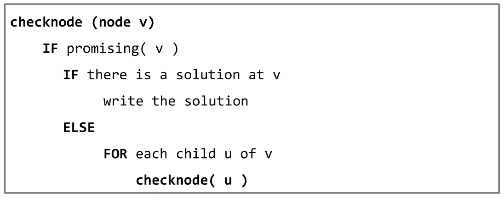

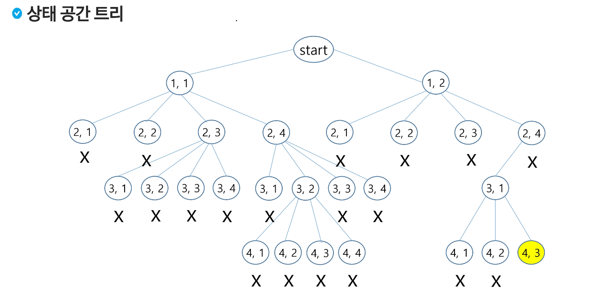

상태공간트리를 구축하여 문제를 해결  

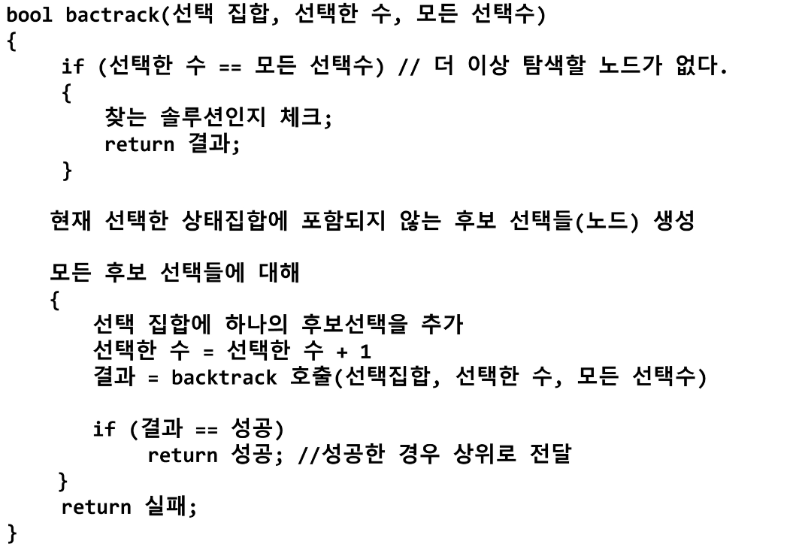

### {1, 2, 3) powerset 구하는 백트래킹 알고리즘
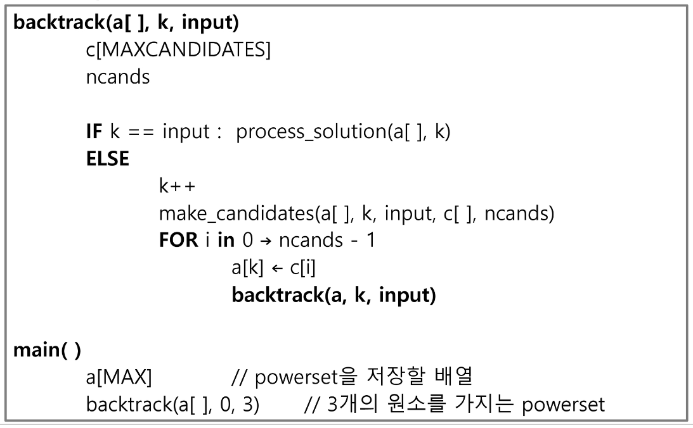
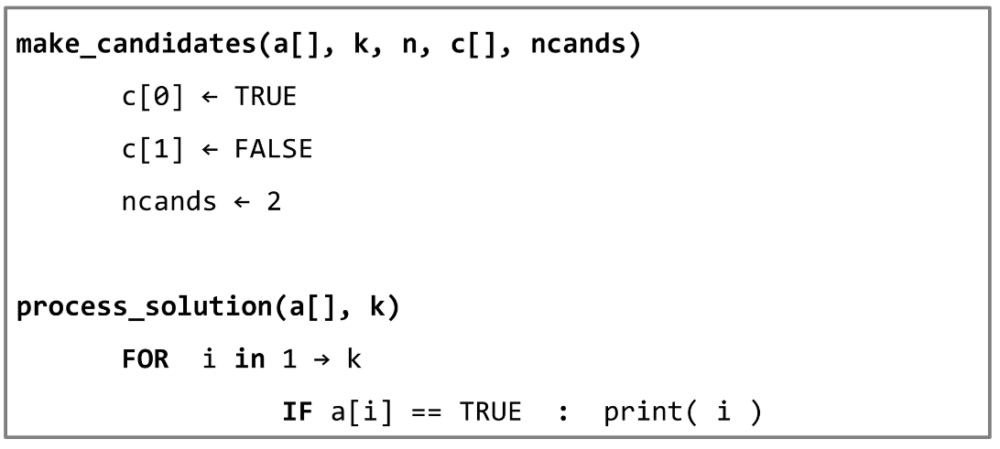

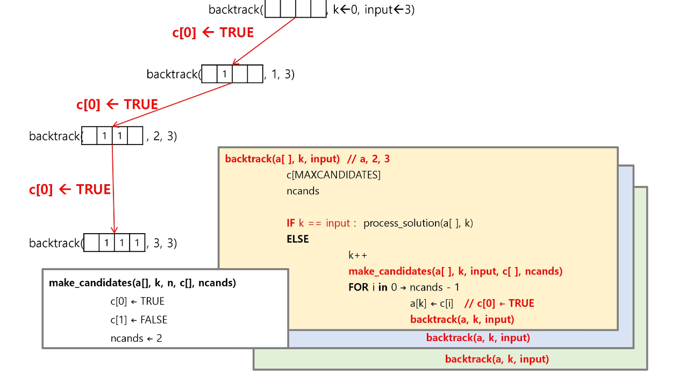
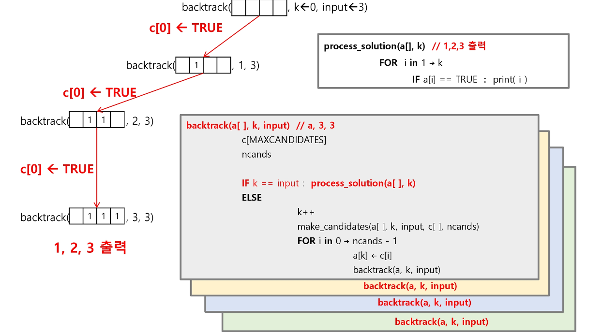
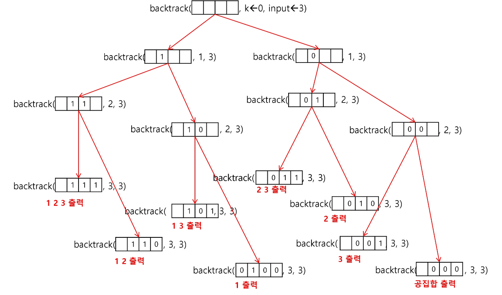

### 백트래킹을 이용하여 순열 구하기
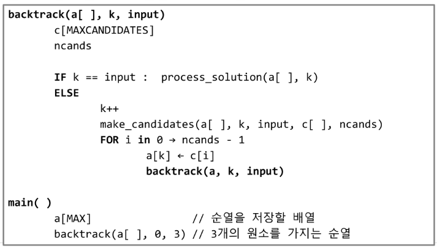
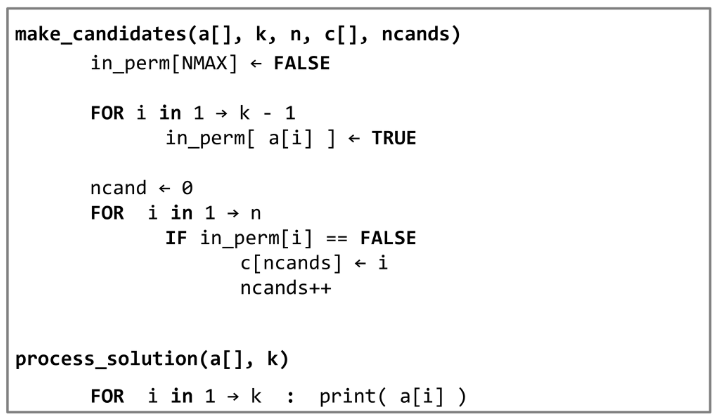
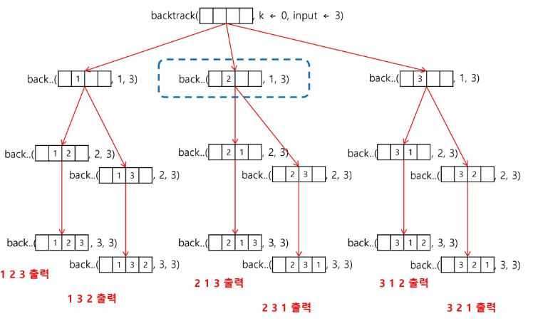

# 트리
트리는 싸이클이 없는 무향 연결 그래프
    - 사이클
    - 연결 그래프: 모든 꼭지점이 서로 갈 수 있다!

- 이진 트리 
  자녀 노드가 둘 이하인 트리
0. 이진 트리 종류
   - 완전 이진 트리
     - 마지막 레벨을 제외한 모든 레벨은 꽉 차있어야 한다.
     - 마지막 레벨 노드는 왼쪽부터 채워져야 한다.
   - 포화 이진 트리
     - 모든 레벨에 노드가 포화상태로 곽 차있는 것 
   - 나머지 이진 트리
1. 순회 방법
   - 전위 순회 VLR
     - 부모-좌-우
   - 중위 순회 LVR
     - 좌-부모-우
   - 후위 순회 LRV
     - 좌-우-부모
2. 트리 저장 방법
배열을 용한 이진 트리의 표현의 잔점을 보안하기 위해 연결리스트를 이용하여 트리를 표옇낳 ㄹ수 잇음