# 03. graphs
# 그래프
- 그래프는 아이템(사물 또는 추상적 개념)들과 이들 사이의 연결 관계를 표현한다.
- 정점(Vertex)들의 집합과 이들을 연결하는 간선(Edge)들의 집합으로 구성된 자료구조
    - |V| : 저점의 개수, |E|: 그래프에 포함된 간선의 개수
    - |V|개의 정점을 가지는 그래프는 최대 |V|(|V|-1)/2 간선이 가능  
    예) 5개 정점을 가지는 그래프는 최대 간선 수는 10(=5*4/2)개이다
- 선형 자료구조나 트리 자료구조로 표현하기 어려운 N:N 관계를 가지는 원소들을 표현하기에 용이하다.

## 그래프의 유형
- 무향 그래프(Undirected Graph)
- 유향 그래프(Diredxted Grap)
- 가중치 그래프(Weighted Graph)
- 사이클 없는 방향 그래프(DAG, Directed Acyclic Graph)

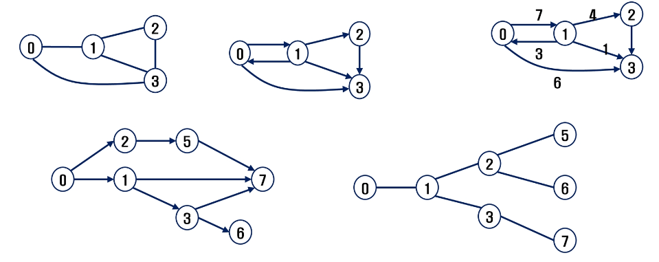

- 완전 그래프
    - 정점들에 대해 가능한 모든 간선들을 가진 그래프
      
- 부분 그래프
    - 원래 그래프에서 일부의 정점이나 간선을 제외한 그래프
    
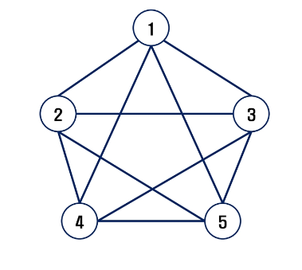

### 인접정점
인접(Adjacency)
- 두 개의 정점에 간선이 존재(연결됨)하면 서로 인접해 있다고 한다.
- 완전 그래프에 속한 임이의 두 정점들은 모두 인접해 있다.

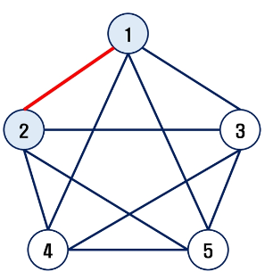

### 그래프 경로
경로란 간선들을 순서대로 나열한 것
- 간선들 : (0, 2), (2, 4), (4, 6)
- 정점들 : 0-2-4-6

경로 중 정점을 최대한 한번만 지나는 경로를 **단순경로**라 한다.
- 0-2-4-6, 0-1-6

시작한 정점에서 끝나는 경로를 **사이클(Cycle)**이라고 한다.
- 1-3-5-1

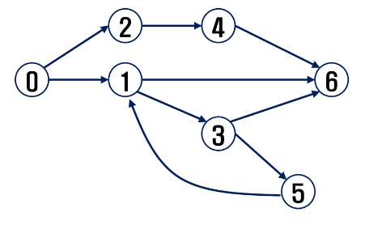

### 그래프 표현
- 간선의 정보를 저장하는 방식. 메모리나 성능을 고려해서 결정
- 인접 행렬 (Adjacent matrix)
    - |V| x |V| 크기의 2차원 배열을 이용해서 간선 정보를 저장
    - 배열의 배열(포인터 배열)
- 인접 리스트 (Adjacent List)
    - 각 정점마다 해당 정점으로 나가는 간선의 정보를 저장
- 간선의 배열
    - 간선(시작 정점, 끝 정점)을 배열에 연속적으로 저장
    
### 인접 행렬
두 정점을 연결하는 간선의 유무를 행렬로 표현
-  |V| x |V| 정방 행렬
- 행 번호와 열 번호는 그래프의 정점에 대응
- 두 정점이 인접되어 있으면 1, 그렇지 않으면 0으로 표현
- 무향 그래프
    - i번째 행의 합 = i번째 열의 합 = Vi의 차수
- 유향 그래프
    - 행 i의 합 = Vi의 진출 차수
    - 열 i의 합 = Vi의 진입 차수
- 장점 : 구현이 쉽다. / 단점 : 메모리 낭비

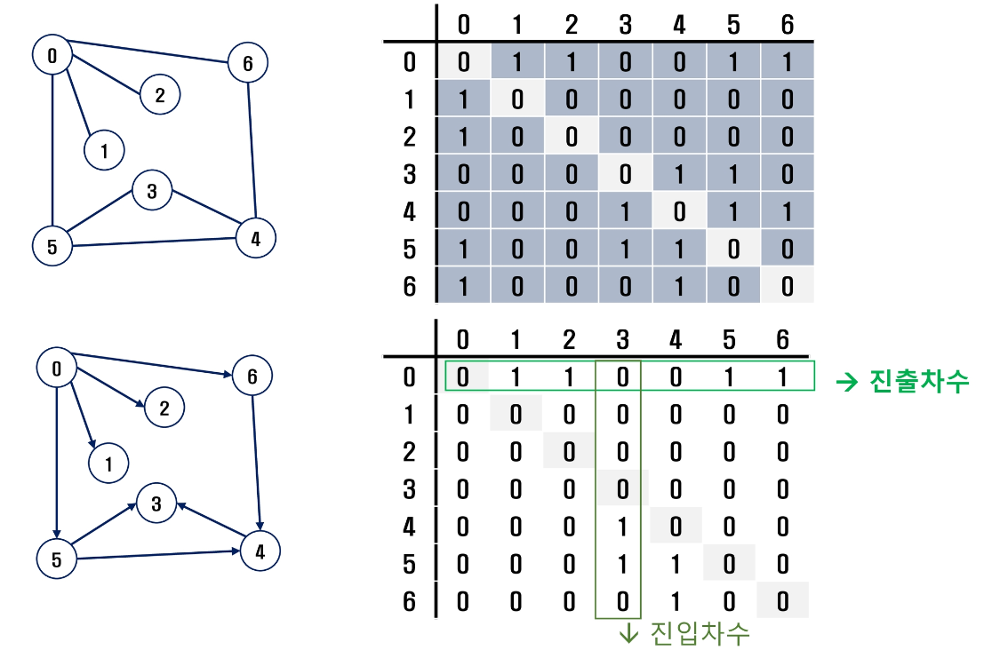

### 인접 리스트
- 각 정점에 대한 인접 정점들을 순차적으로 표현
- 하나의 정점에 대한 인접 정점들을 각각 노드로 하는 연결 리스트로 저장

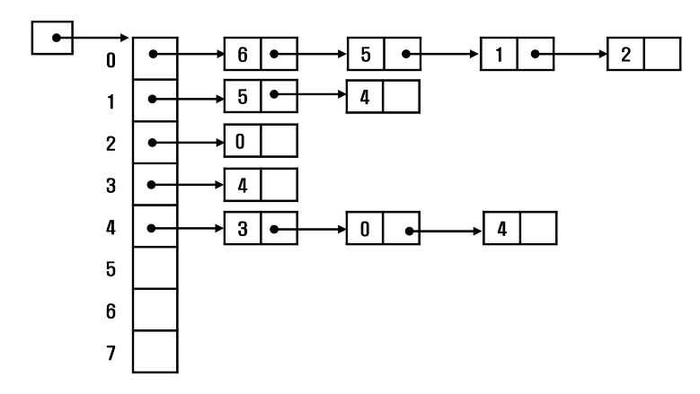  
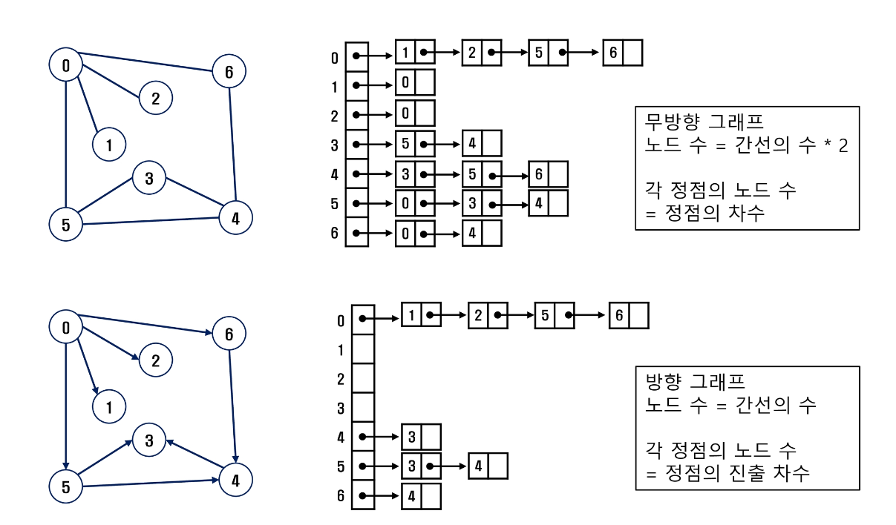

## 그래프 순회(탐색)
그래프 순회는 비선형구조인 그래프로 표현된 모든 자료(정점)를 빠짐없이 탐색하는 것을 의미
- 깊이 우선 탐색(Depth First Search, DFS)
- 너비 우선 탐색(Breadth First Search, BFS)

## DFS(깊이 우선 탐색)
시작 정점의 한 뱡향으로 갈 수 있는 곳 가지 깊이 탐색해 가다가 더 이상 갈곳이 없게 되면, 
가장 마지막에 만났던 갈림길 간선이 있는 정점으로 되돌아와서 다른 방향의 정점으로 
탐색을 계속 반복하여 모든 정점을 방문하는 순회 방법

- 스택 사용

## BFS(너비 우선 탐색)
탐색 시작점의 인접한 정점들을 먼저 모두 차례로 방문한 후에, 방문했던 정점을 시작점으로 하여 다시 인접한 정점들을 차례로 방문하는 방식
- 큐 활용

# 서로소 집합(Disjoin-sets : Union Find 알고리즘)
서로소 또는 상호배타 집합들은 서로 중복 포함된 원소가 없는 집합들이다. (교집합이 없다.)  
집합에 속한 하나의 특정 멤버를 통해 각 집합들을 구분한다. 이를 대표자(representative)라 한다.

상호배타 집합을 표현하는 방법
- 연결 리스트
- 트리

상호배타 집합 연산
- Make-Set(x) : 자기 자신을 나 홀로 있는 그룹으로 초기화 하는 과정
- Find-Set(x) : X라는 요소가 어느 그룹에 속해있는지 찾는 연산
- Union(x, y) : x외 y가 속한 두 그룹을 하나의 그룹으로 만드는 연산 / 대표자 저장(같은 그룹으로 묶기)

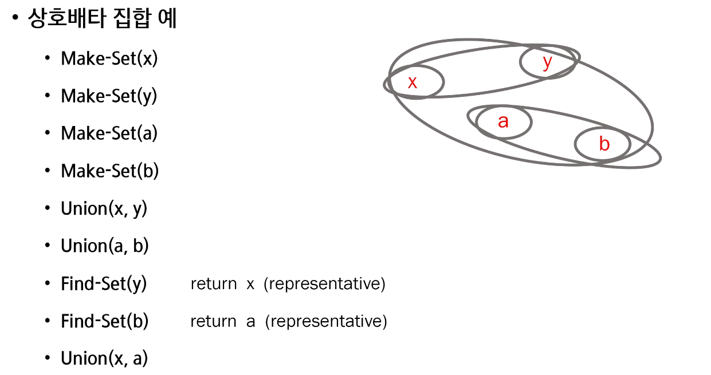

### 상호 배타 집합 표현 - 연결리스트
- 같은 집합의 원소들은 하나의 연결리스트로 관리한다.
- 연결리스트의 맨 앞의 원소를 집합의 대표 원소로 삼는다.
- 각 원소는 집합의 대표원소를 가리키는 링크를 갖는다.

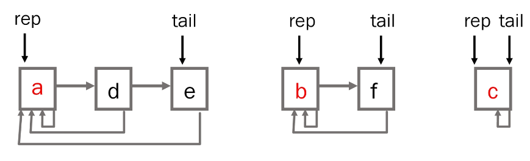

연결리스트 연산 예
- Find-Set(a) return a
- Find-Set(f) return b
- Union(a, b)

### 상호 배타 집합 표현 - 트리
- 하나의 집합 (a disjoint set)을 하나의 트리로 표현한다.
- 자식 노드가 부모 노드를 가리키며 루트 노드가 대표자사 된다.

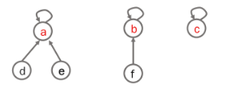

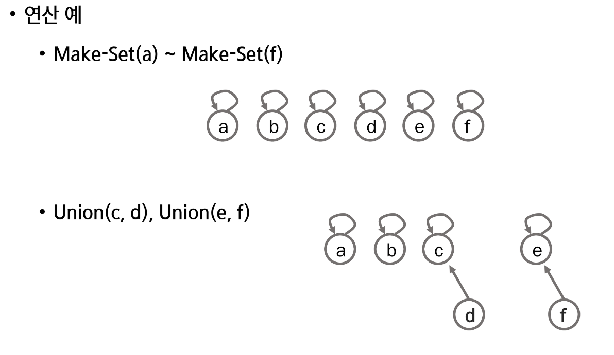
- make로 초기화
- union하여 대표자를 가르키도록..

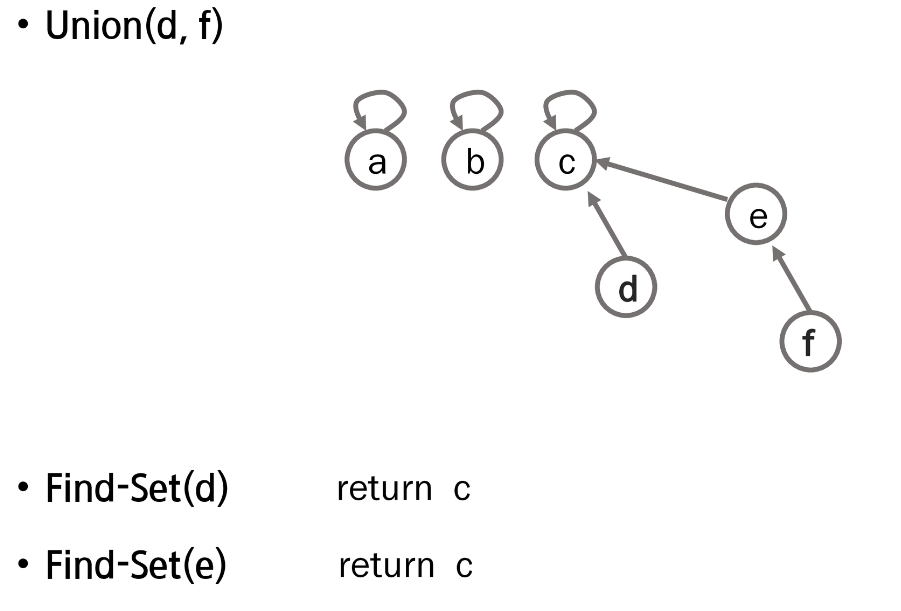
- 대표자 중에 하나를 골라 합치기

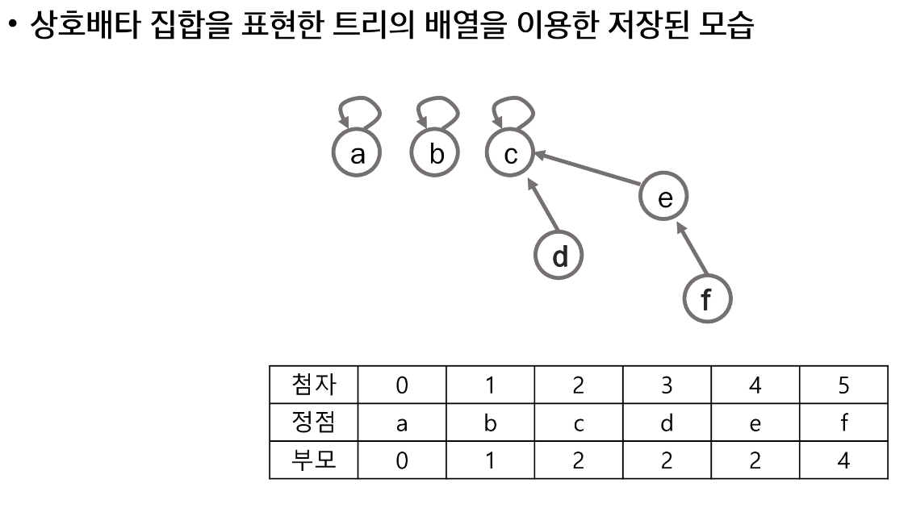
- 조상이 동일하다면 같은 멤버

### 상호배타 집합에 대한 연산
Make-Set(x): 유일한 멤버 x를 포함하는 새로운 집합을 생성하는 연산
```python
def Make_Set(x):
    p[x] = x
```

Find-Set(x): x를 포함하는 집합을 찾는 연산
```python
def Find_Set(x):
    if x == p[x] : return x
    else:          return Find_Set(p[x])
```

Union(x, y): x와 y를 포함하는 두 집합을 통합하는 연산
```python
def Unione(x, y):
    p[Find_Set(y)] = Find_set(x)
```

Find-Set(x): x를 포함하는 집합을 찾는 연산(반복)
```python
def Find_Set(x):
    if x == p[x] : return x
    else:          return Find_Set(p[x])
```

연산의 효율을 높이는 빙법
- Rank를 이용한 Union
    - 각 노드는 자신을 루트로 하는 subtree의 높이를 랭크(rank)라는 이름으로 저장한다.
    - 두 집합을 합칠 때  rank가 낮은 집합을 rank가 높은 집합에 붙인다.
- Path compression
  - Find-Set을 행하는 과정에서 만나는 모든 노드들이 직접 root를 가리키도록 포인터를 바꾸어 준다.