# 01. ORM with view
Django shell에서 연습했던 QuerySet API를 직접 view 함수에서 사용하기

# READ
2가지 조회 진행
1. 전체 게시글 조회
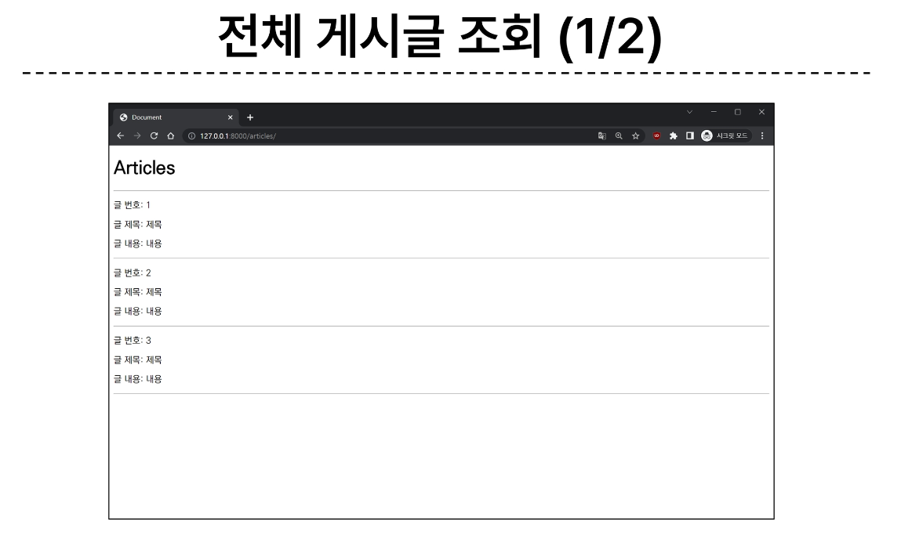  
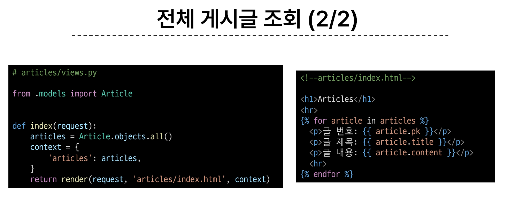

2. 단일 게시글 조회
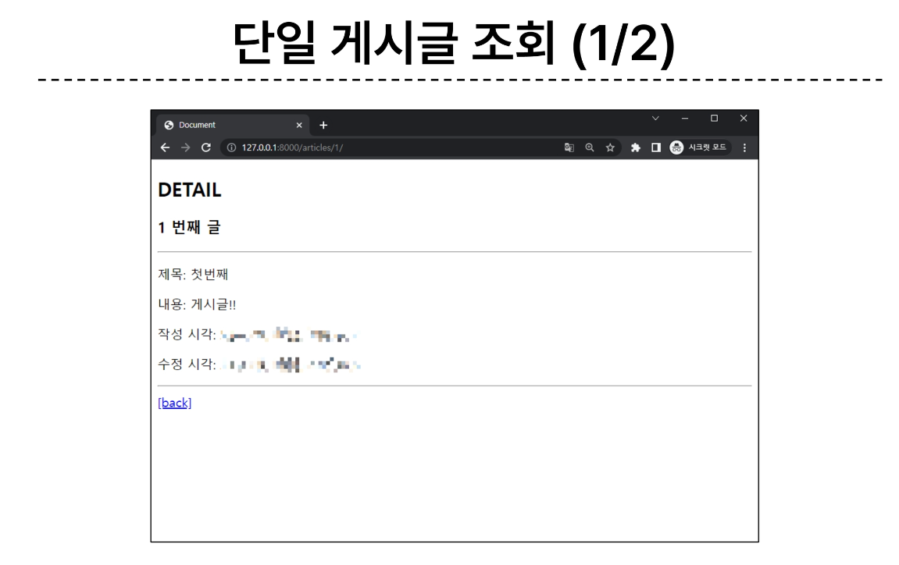  
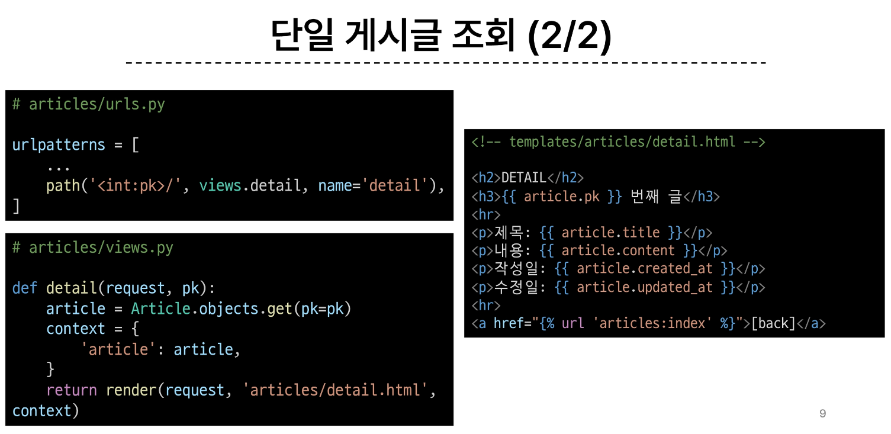

3. 단일 게시글 페이지 링크 작성  
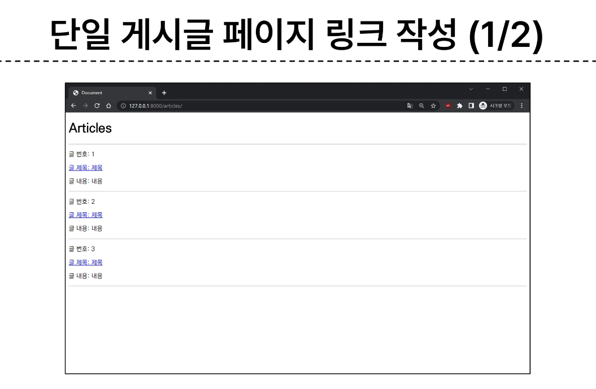
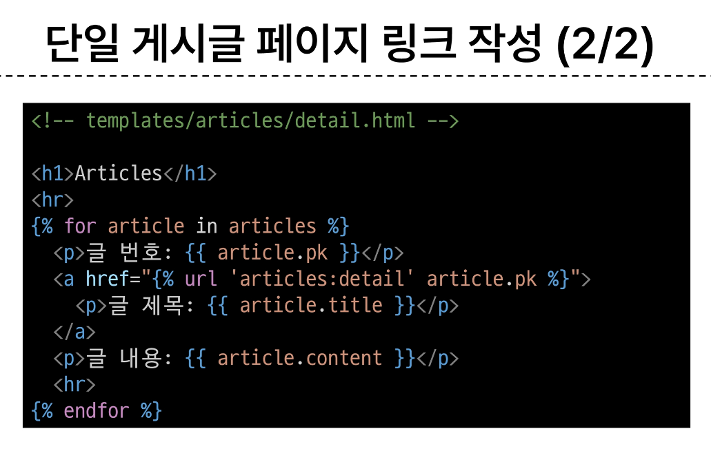

# CREATE
create 로직을 구현하기 위해 필요한 view 함수의 개수는?
1. new : 사용자 입력 데이터를 받을 페이지를 렌더링
2. create : 사용자가 입력한 데이터를 받아 DB에 저장

1. new 기능 구현  
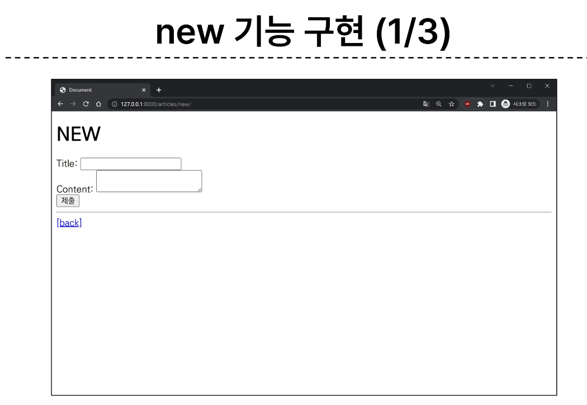  
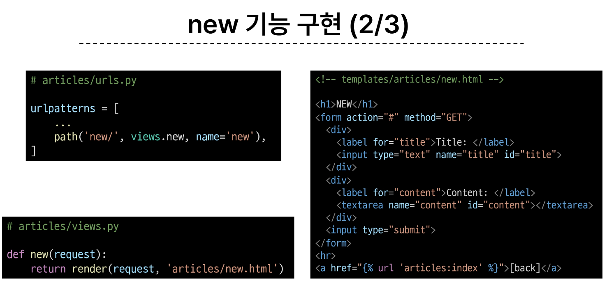  
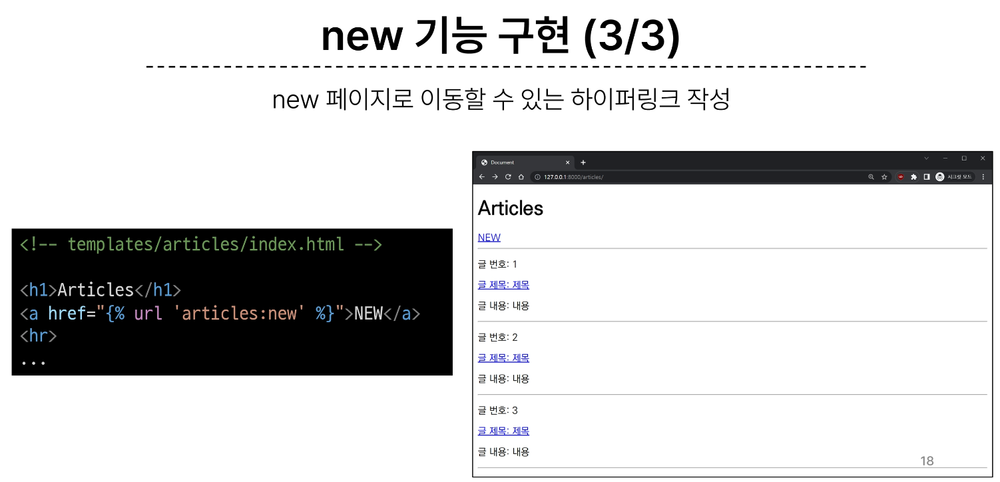

2. create 기능 구현
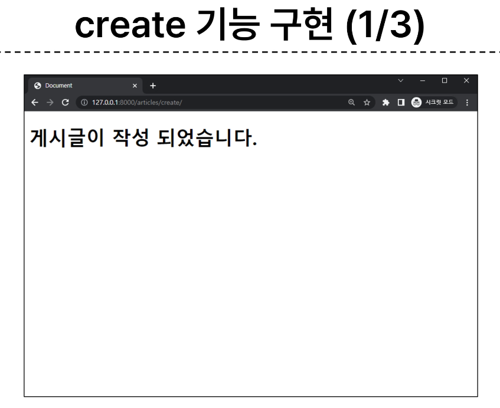
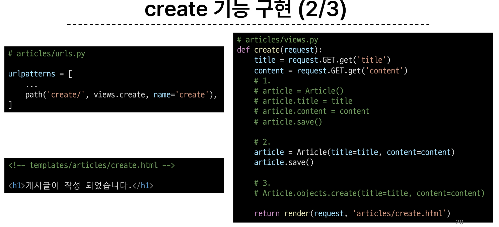
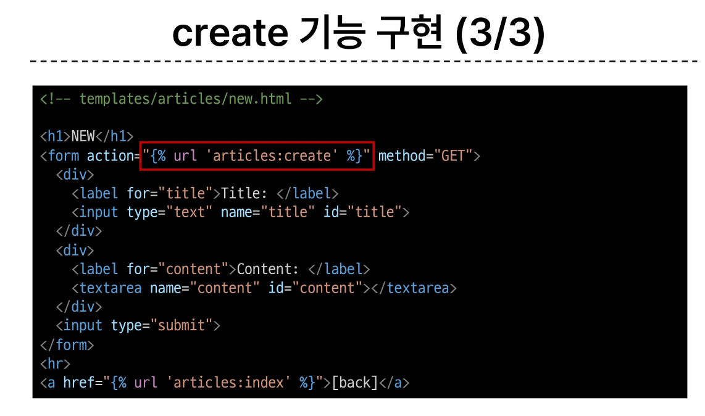

# HTTP request methods
## HTTP
네트워크 상에서 데이터를 주고 받기 위한 약속

## HTTP request methods
데이터(리소스)에 어떤 요청(행동)을 원하는지 나타내는 것

> GET&POST

## 'GET' Method
특정 리소스를 **조회**하는 요청  
(GET으로 데이터를 전달하면 Query STring 형식으로 보내짐)

> http://127.0.0.1:8000/articles/create/?title=제목&content=내용

## 'POST' Method
특정 리소스에 **변경(생성, 수정, 삭제)을 요구하는** 요청  
(POST로 데이터를 전달하명 HTTP Body에 담겨 보내짐)

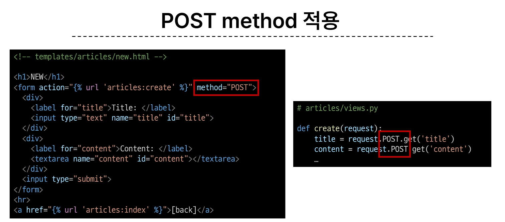
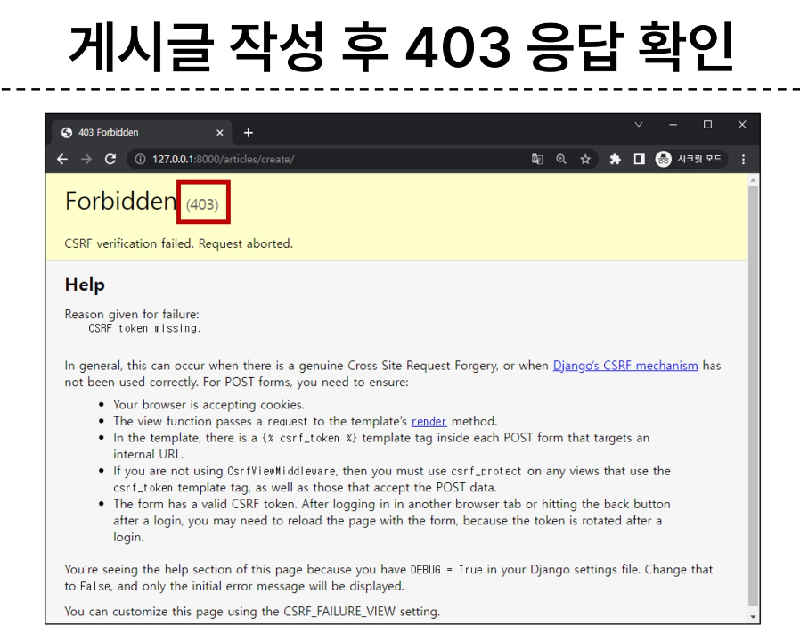

## HTTP response status code
특정 HTTP 요청이 성공적으로 완료되었는지를 3자리 숫자로 표현하기로 약속한 것

## 403 Forbidden
서버에 요청이 전달되었지만, **권환** 때문에 거절되었다는 것을 의미

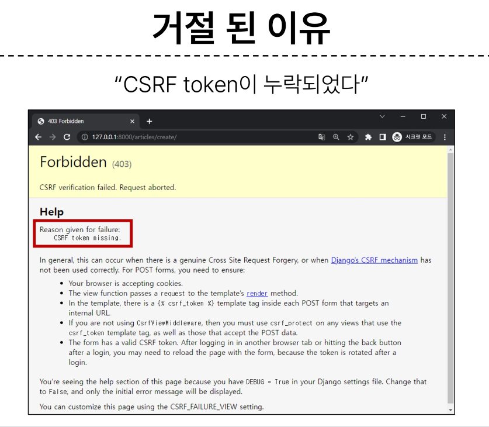

## CSRF : Cross-Site-Request-Forgery
사이트간 요청 위조
- 사용자가 자신의 의지와 무관하게 공격자가 의도한 행동을 하여 특정 웹 페이지를 보안에 취약하게 하거나 수정, 삭제 등의 작업을 하게 만드는 공격 방법

## CSRF Token 적용
- DTL의 crsf_token 태그를 사용해 사용자에게 토큰 값을 부여
- 요청 시 토큰 값도 함께 서버로 전송될 수 있도록 함

### 요청 시 CSRF Token을 함께 보내야 하는 이유
- Django 서버는 해당 요처잉 DB에 데이터를 하나 생성하는 (DB에 영향을 주는) 요청에 대해 **"Django사 직접 제공한 페이지에서 데이터를 작성하고 있는 것인지"**에 대한 확인 수잔이 필요한 것
- 겉모습이 똑같은 위조 사이트나 정상적이지 않은 요청에 대한 방어 수단
- 기존 : 요청 데이터 -> 게시글 작성
- 변경 : 요청 데이터 + 인증토큰 -> 게시글 작성

### 왜 POST일 떄만 Token을 확인할까?
- POST는 단순 조회를 위한 GET과 달리 특정 리소스에 변경   
(생성, 수정, 삭제)을 요구하는 의미와 기술적인 부분을 가지고 있기 때문
- DB에 조작을 가하는 요청은 반드시 인증 수단이 필요
- **데이터베이스에 대한 변경사항을 만드는 요청이기 때문에 토큰을 사용해 최소한의 신원 확인을 하는 것**

## 게시글 작성 결과
- 게시글 생성 후 개발자 도구를 사용해 Form Data가 전송되는 것 확인
- 더 이상 URL에 데이터가 표기되지 않음

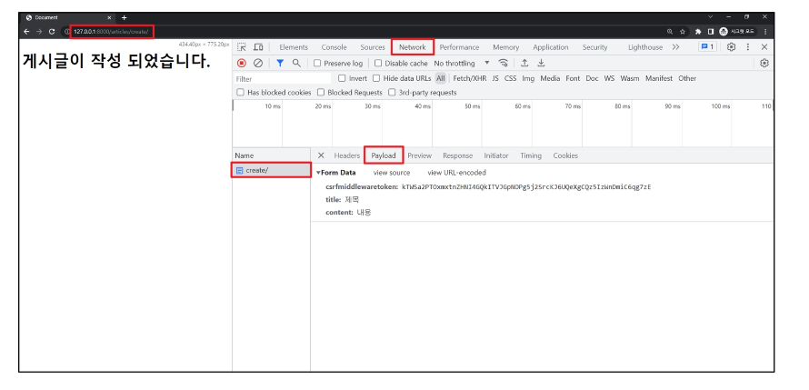

# redirect
게시글 작성 후 완료를 알리는 페이지를 응답하는 것은 적절한 응답이 아님
- 데이터 저장 후 페이지를 주는 것이 아닌 다른 페이지로 사용자를 보내야 한다. 

**사용자를 보낸다 ==  사용자가 GET 요청을 한번 더 보내도록 해야한다**

## redirect()
클라이언트가 인자에 작성한 주소로 다시 요청을 보내도록 하는 함수

redirect() 함수 적용
- create view 함수 개선

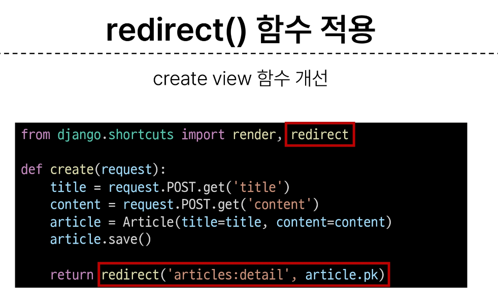

redirect 특징
- 해당 redirect에서 클라이언트는 detail.url로 요청을 다시 보내게 됨
- 결과적으로 detail view 함수가 호출되어 detail view 함수의 반환 결과인 detail 페이지를 응답 받음
- 결국 사용자는 게시글 작성 후 작성된 게시글의 detail 페이지로 이동하는 것으로 느끼게 되는 것

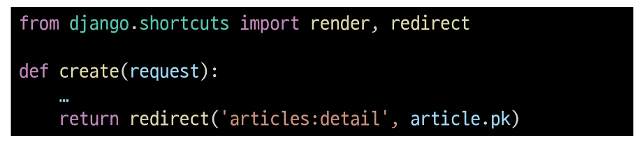

게시글 작성 결과
- 게시글 작성 후 생성된 게시글의 detail 페이지로 redirect 되었는지 확인
- create 요청 이후에 detail로 다시 요청을 보냈다는 것을 알 수 있음

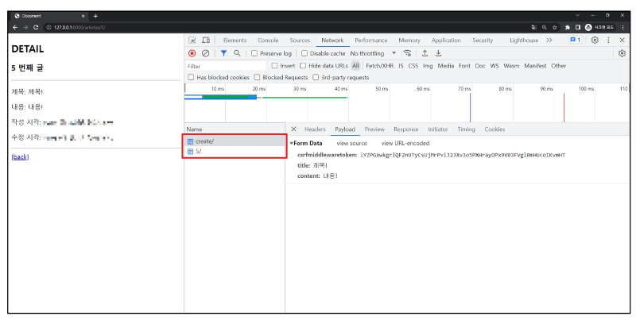

# DELETE
DELETE 기능 구현
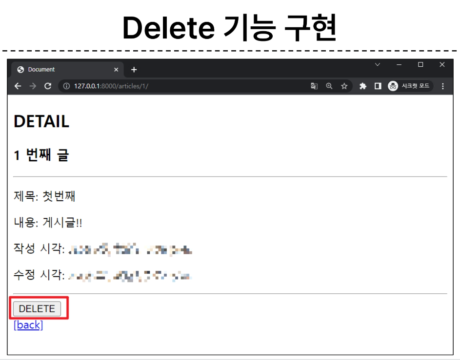  
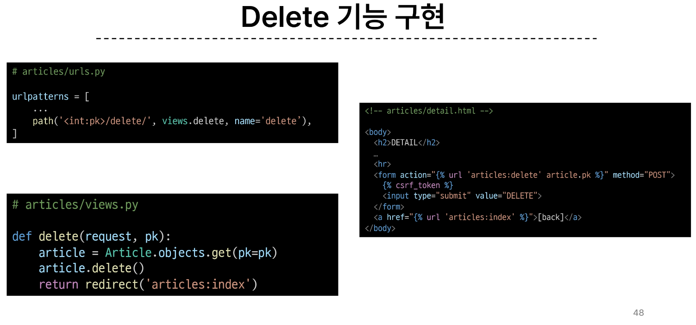 

# UPDATE
Update 로직을 구현하기 위해 필요한 view 함수의 개수
1. edit : 사용자 입력 데이터를 받을 페이지를 렌더링
2. update : 사용자가 입력한 데이터를 받아 DB에 저장

edit 기능 구현  
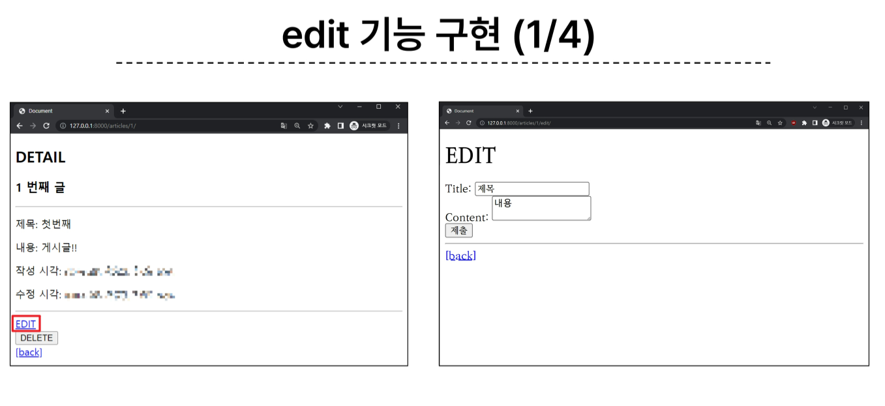  
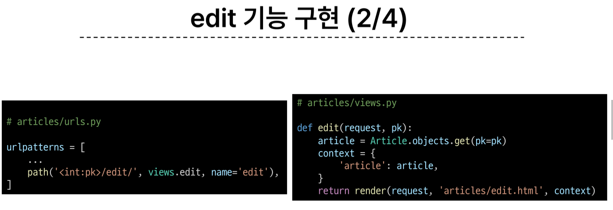  
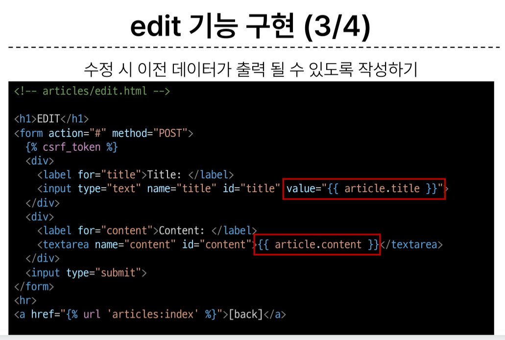
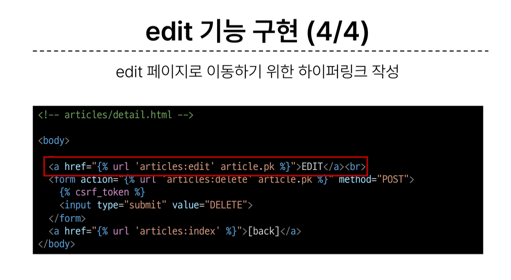

update 기능 구현  
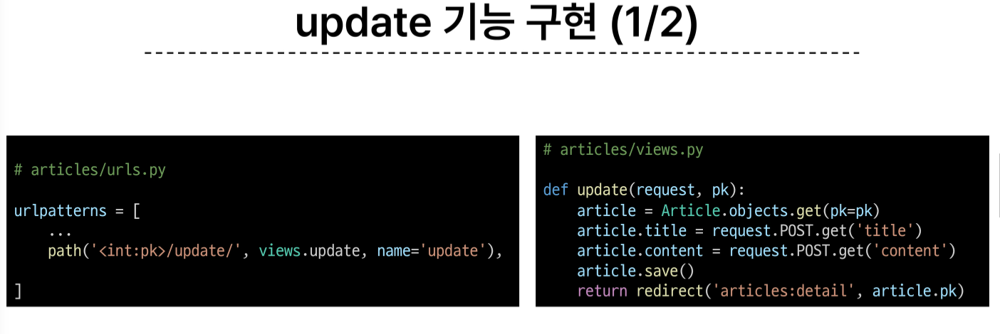  
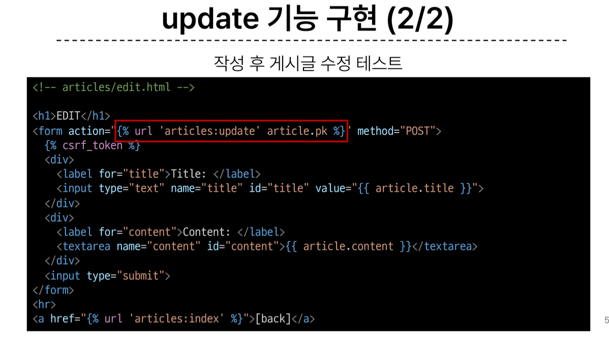

# 참고
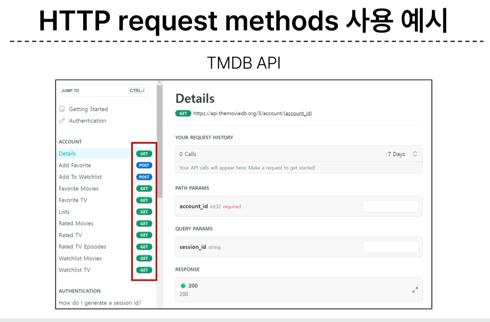  
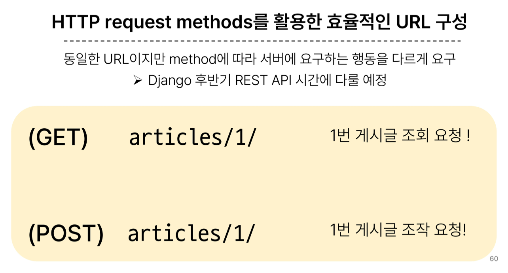

# Article (게시글) CRUD
- 전역 경로 : articles/

뷰 함수 유형
1. 사용자에게 보여줘야할 html 파일을 랜더링  render
2. 사용자로부터 데이터를 받아서 처리

HTTP Method :  GET / POST  
HTTP Method -> 서버가 수행해야할 동작 지정(알려주기 위해)  
- GET : 조회 / 특정 리소스 또는 전체 리소스를 "조회"하기 위해 요청  
- POST : 생성 / 특정 리소스를 수정(생성/수정/삭제)하기 위해  
- PUT / PATCH : 수정
- DELETE : 삭제

                                        경로 <-> 뷰 함수

'R'ead(조회)
- 전체 게시글 조회 :                                <-> index
- 상세 게시글 조회 :                    <int:pk>/   <-> deatil

'C'reate (생성)
- 게시글 생성에 필요한 폼을 사용자에게 제공 :   new/    <-> new // 사용자가 해당 폼을 요청 GET
- 사용자로부터 정보를 받아 게시글 생성 :        create/  <-> create

'U'pdate(생성)
- 게시글 수정에 필요한 폼을 사용자에게 제공 :   <int:pk>/edit <-> eidt
- 사용자로부터 정보를 받아 게시글 수정 :        <int:pk>/update <-> update

'D'elete (삭제)
- 사용자로부터 삭제요청, 게시글을 삭제 :        <int:pk>/delete <-> delete