# 02. FORM
## HTML 'form' 
지금까지 사용자로부터 데이터를 받기 위해 활요한 방법, 그러나 비정상적 혹은 악의적인 요청을 필터링할 수 없음
- 유효한 데이터인지에 대한 확인이 필요

## 유효성 검사
수집한 데이터가 정확하고 유효한지 확인하는 과정

### 유효성 검사 구현
- 유효성 검사를 구현하기 위해서는 입력 값, 형식, 중복, 범위, 보안 등 많은 것들을 고려해야함
- 이런 과정과 기능을 직접 개발하는 것이 아닌 Django가 제공하는 Form을 사용

# Form
## Fomr Class
### Django Form
사용자 입력 데이터를 수집하고, 처리 및 유효성 검사를 수행하기 위한 도구
- 유효성 검사를 단순화하고 자동화할 수 있는 기능을 제공

### Form class 정의
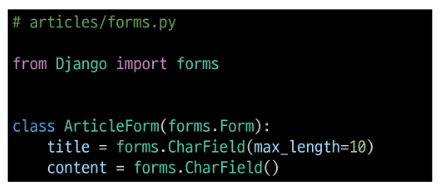

### Form class를 적용한 new 로직   
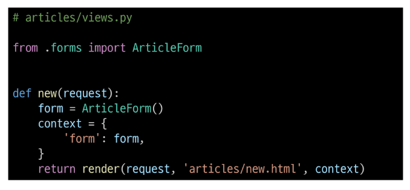  
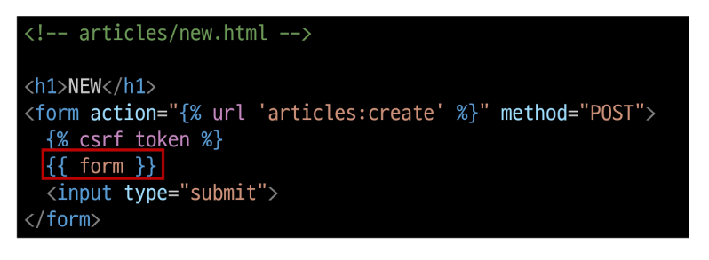  
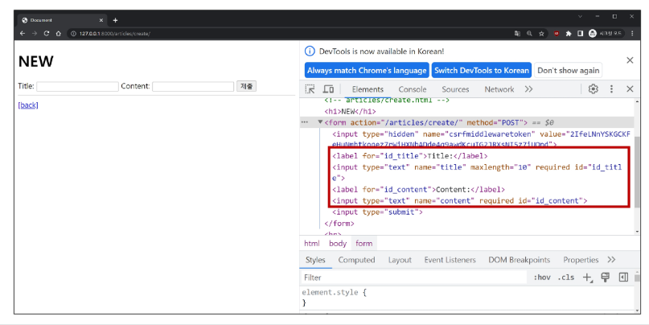

### Form rendering options
label, input 쌍을 특정 Html 태그로 감싸는 옵션 

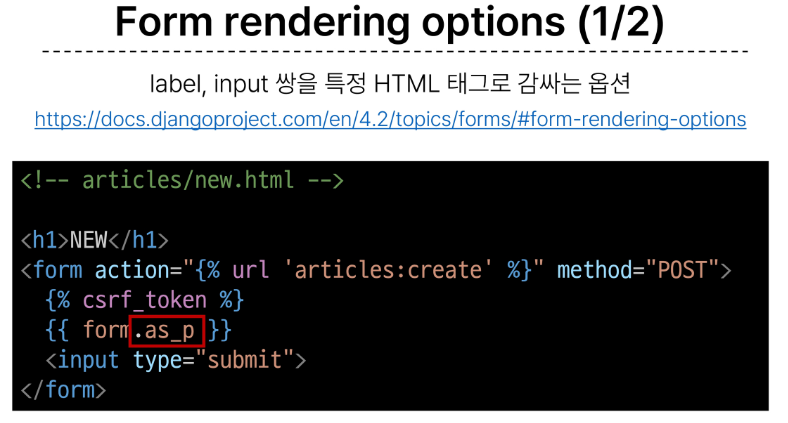  
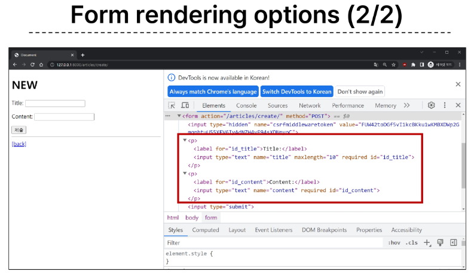

## Widgets
HTML 'input' element의 표현을 담당 : 표현만 ! 바꿈

### Widget 사용
Widget은 단순히 input 요소의 속성 및 출력되는 부분을 변경하는 것

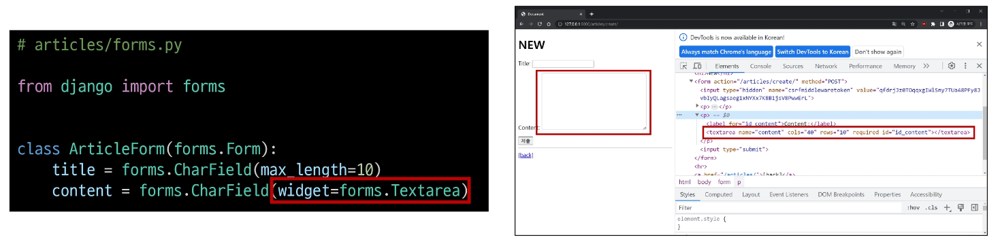

# Django ModleForm
Form
- 사용자 입력 데이터를 DB에 저장하지 않을 때 ex) 로그임

ModleForm
- 사용자 입력 데이터를 DB에 저장해야 할 떄 ex) 게시글, 회원가입

## ModelForm
Model과 연결된 Form을 자동으로 생성해주는 기능을 제공
- Form + Model

### ModelForm class 정의
기존 ArticleForm 클래스 수정

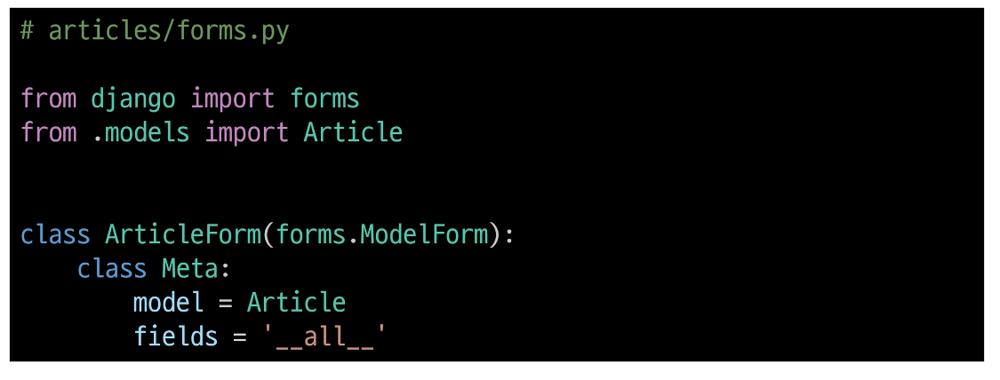
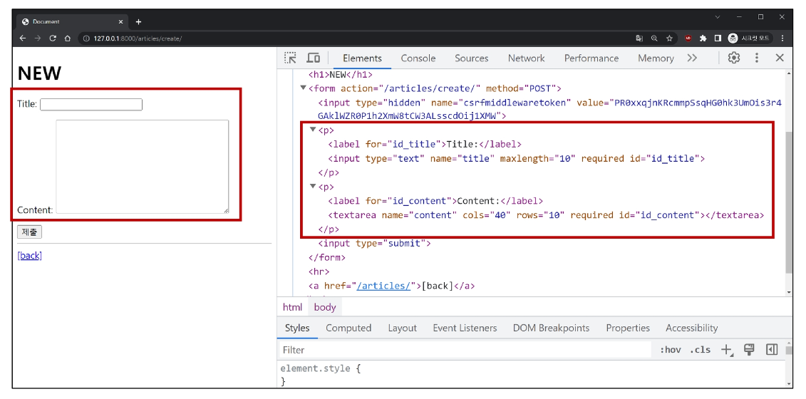
- textfield보고 알아서 textarea 생성해주고, 사용자가 입력하는 것이 아니라면 입력 생성해주지 않음.. 매우 간편

## Meta class
ModelForm의 정보를 작성하는 것
- Meta : 데이터에 대한 데이터

### 'fields' 및 'exclude' 속성
exclude 속성을 사용하여 모델에서 포함하지 않을 필드를 지정할 수도 있음

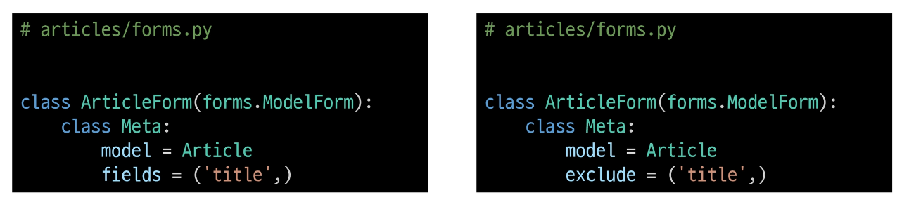

### ModleForm을 적용한 create 로직
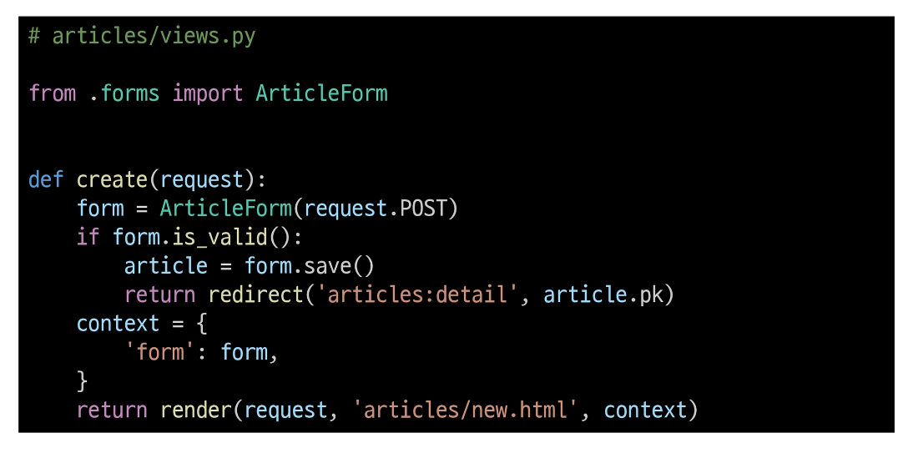

- 제목 input에 공백을 입력 후 에러 메시지 출력 확인(유효성 검사의 결과)
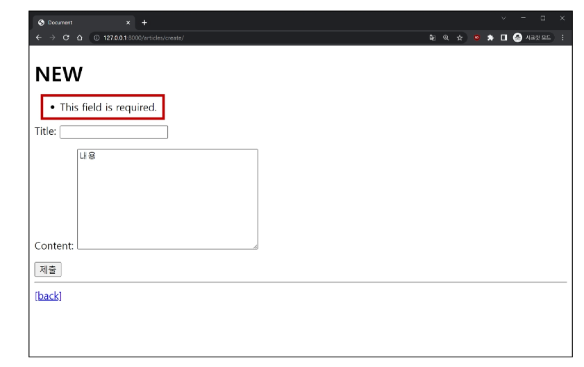

### is_valid()
여러 유효성 검사를 실행하고, 데이터가 유효한지 여부를 Booldean으로 반환

공백 데이터가 유효하지 않은 이유와 에러메시지가 출력되는 과정
1. 별도로 명시하지 않앗찌만, 모델 필드에는 기본적으로 빈 값은 허용되지 않는 제약조건이 설정되어 있음
- 빈 값은 is_valid()에 의해 False로 평가되고 form 객체에는 그에 맞는 에러 메시지가 포함되어 다음 코드로 진행됨

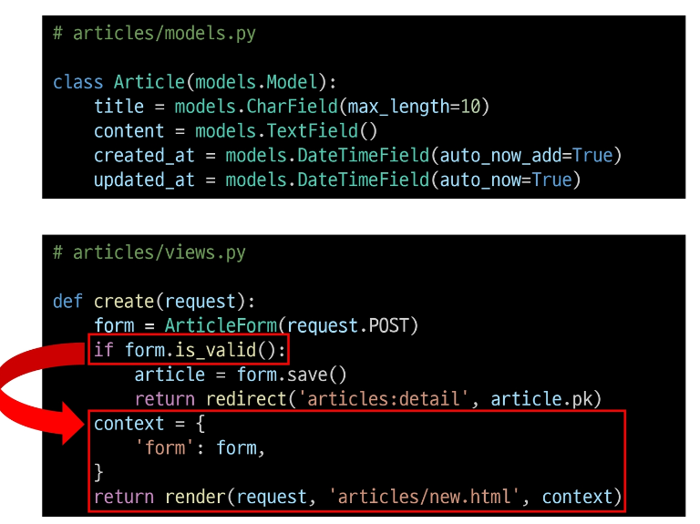

### ModelForm을 적용한 edit 로직
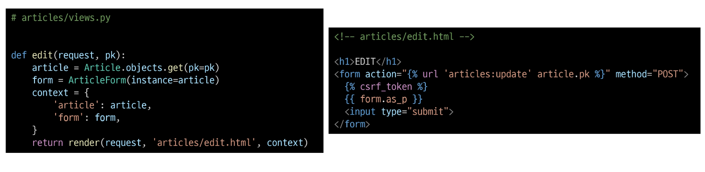

### ModelForm을 적용한 update 로직
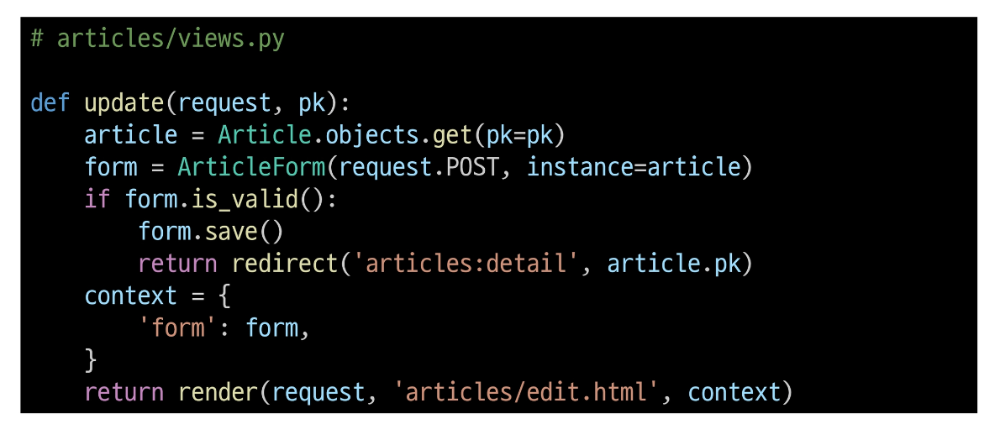

## save()
데이터베이스 객체를 만들고 저장

### save() 메서드가 생성과 수정을  구분하는 법
키워드 인자 **instance**여보룰 통해 생성할 지, 수정할지를 결정 

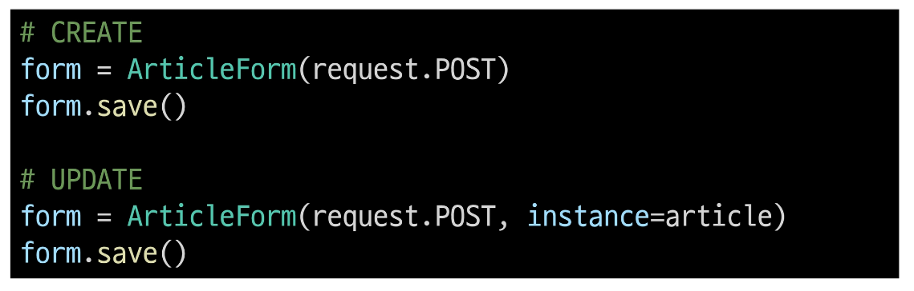

## Django Form 정리
"사용자로부터 데이터를 수집하고 처리하기 위한 강력하고 유연한 도구"  
HTML form의 생성, 데이터 유효성 검사 밑 처리를 쉽게할 수 있도록 도움

# 참고
ModelForm 키워드 인자 data와 instanve 살펴보기  
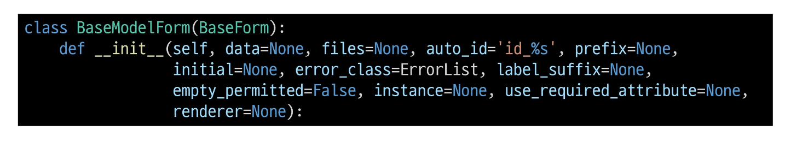

## Widget 응용
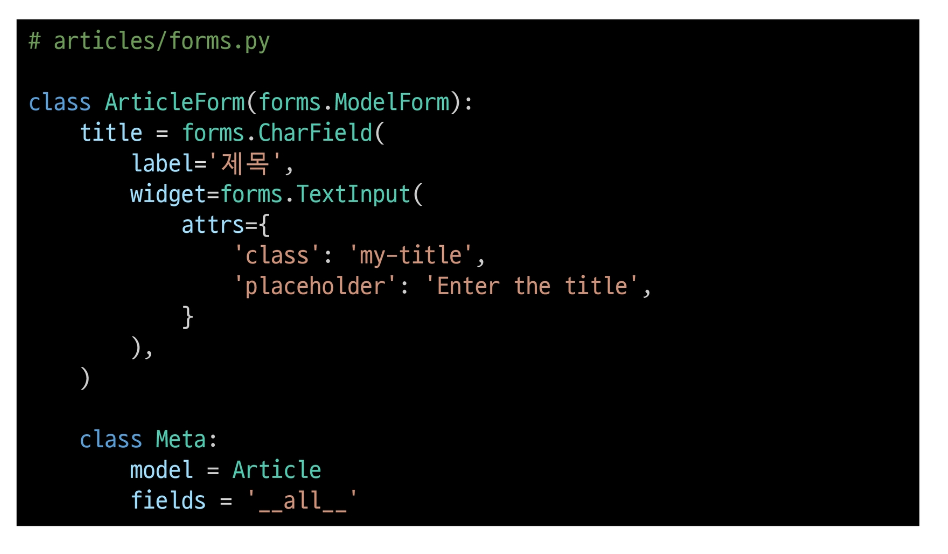
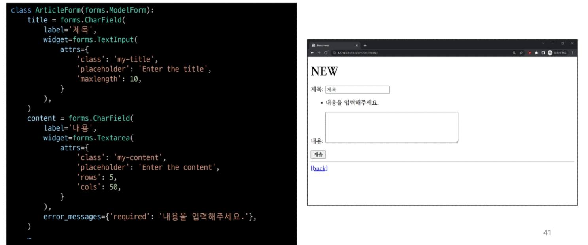

# Handling HTTP requests
## view 함수 구조 변화
new & create view 함수간 공통점과 차이점
- 공통점 : 데이터 생성을 구현하기 위함
- 차이점 : new는 GET method 요청만을, create는 POST methode 요청만을 처리

**HTTP request method 차이점을 활용해 view 함수 구조 변경**

### new & create 함수 결합
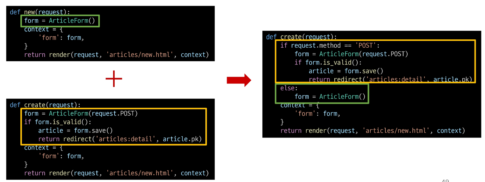

### 새로운 create view 함수
- new와 create view 함수의 공통점과 차이점을 기반으로 하나의 함수로 결합
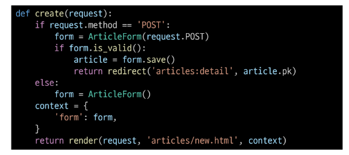

- 두 함수의 유일한 차이점이었던 request method에 따른 분기
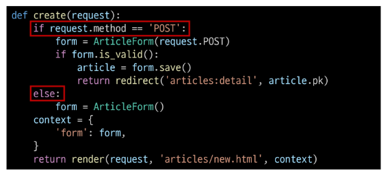

- POST 일 때는과거 create 함수 구조였던 객체 생성 저장 및 로직 처리
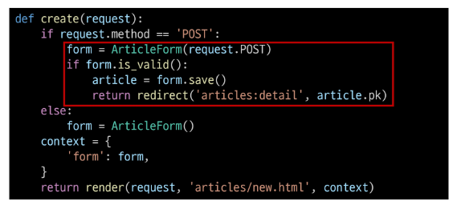

- POST가 아닐 떄는 과거 단순히 form 인스턴스 생성
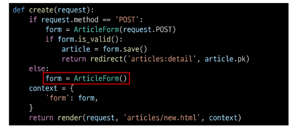

- context에 담기는 form은
1. is_valid를 통과하지 못해 에러메시지를 담은 form이거나
2. else문을 통한 form 인스턴스

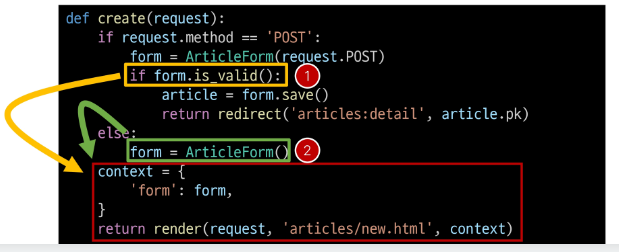

### 기존 new 관련 코드 수정
- 사용하지 않는 new_url 제거!
[Alt text](images/image-25.png)

- new url을 create url로 변경
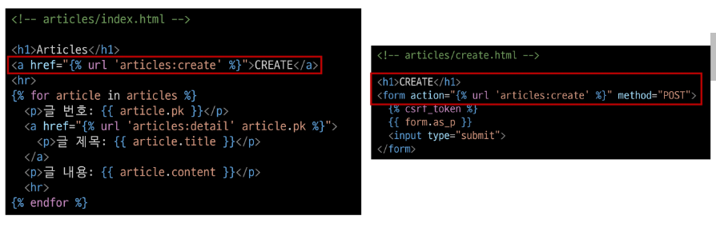

- new 템플릿을 create 템플릿으로 변경
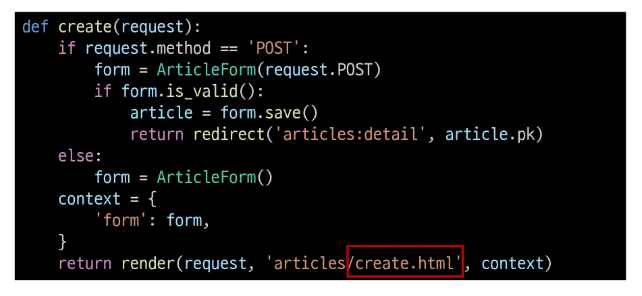

## request method에 따른 요청의 변화
- (GET) articels/create/ : 게시글 생성문서를 줘
- (POST) articles/create/ : 게시글을 생성해줘

### 새로운 update view 함수
기존 edit과 update view 함수 결합  

### 기존 edit 관련 코드 수정
- 사용하지 않는 edit url 제거
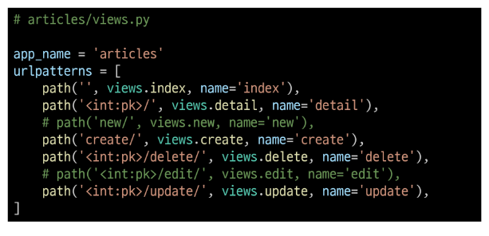

- edit 템플릿을 update 템플릿으로 변경
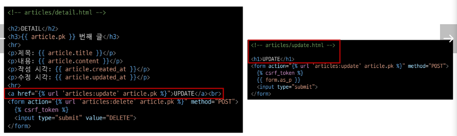