# 03 Static
# Static files : 정적 파일
서버 측에서 변경되지 않고 고정적으로 제공되는 파일 (이미지, JS, CSS파일 등)

### 웹 서버와 정적 파일
웹 서버의 기본 동작은
- **특정 위치(URL)에 있는 자원**을 요청(HTTP request) 받아서
- 응답(HTTP response)을 처리하고 제공(serving)하는 것
    - 이는 "자원에 접근 가능한 주소가 있다."라는 의미
- 웹 서버는 요청 받은 URL로 서버에 존재하는 정적 자원을 제공함
- **정적 파일을 제공하기 위한 경로(URL)**가 있어야 함

## Static files 제공하기
1. 기본 경로에서 제공하기
2. 추가 경로에서 제공하기

### Static files 기본 경로
app폴더/static/

### 기본 경로 static file 제공하기
- articles/static/articles/ 경로에 미지치 파일 배치  
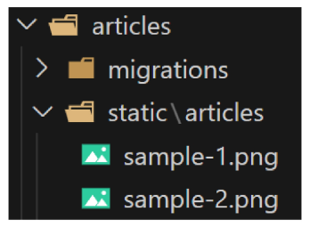

- static tag를 사용해 이미지 파일에 대한 url 제공
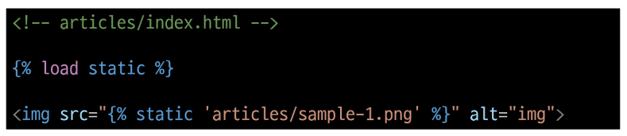

- static_url 확인
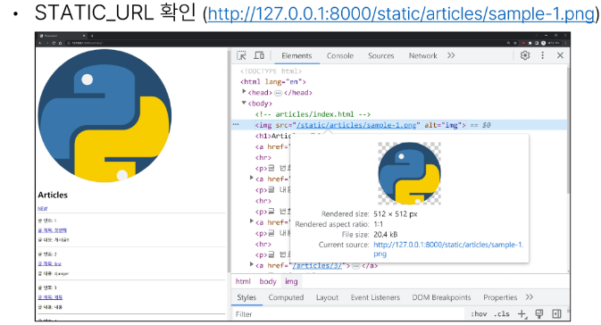

### STATIC_URL
기본 경로 및 추가 경로에 위치한 정적 파일을 참조하기 위한 URL  
실제 파일이나 디렉토리가 아니며 URL로만 존재

URL + STATIC_URL + 정적 파일 경로
> http://127.0.0.1:8000/static/articles/sample-1.png

## Static files 추가 경로
STATICFILES_DIRS에 문자열 값으로 추가 경로 설정

### STATICFILES_DIRS
정적 파일의 기본 경로 외에 추가적인 경로 목록을 정의하는 리스트

### 추가 경로 static file 제공하기
- 임의로 추가 경로 설정 : BASE_DIRdp static까지 추가하고 싶어 ~

- 추가 경로에 이미지 파일 배치
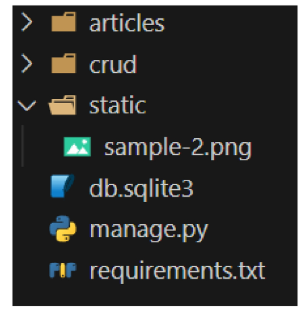

- static tag를 사용해 이미지 파일에 대한 url 제공

- 이미지 출력 및 경로 확인

**정적 파일을 제공하려면 요청에 응답하기 위한 URL이 필요**

# Media files
사용자가 웹에서 업로드하는 정적 파일(user-uploaded)
- static내의 범주 중 하나

## 이미지 업로드
### images/imageField()
이미지 업로드에 사용하는 모델 필드
- 이미지 객체가 직접 저장되는 것이 아닌 **이미지 파일의 경로**가 문자열로 DB에 저장

## 미디어 파일을 제공하기 전 준비
1. setting.py에 **MEDIA_ROOT, MEDIA_URL** 설정
2. 작성한 **MEDIA_ROOT**와 **MEDIA_URL**에 대한 url 지정

### MEDIA_ROOT
미디어 파일들이 위치하는 디렉토리의 절대 경로 : 사용자가 올린 거 어디 둘것이냐?!

### MEDIA_URL
MEDIA_ROOT에서 제공되는 미디어 파일에 대한 주소를 생성(STATIC_URL과 동일한 역할)  

### MEDIA_ROOT와 MEIDA_URL에 대한 url 지정
업로드된 파일을 URL == settings.MEDIA_URL  
위 URL을 통해 참조하는 파일의 실제 위치 == settins.MEDIA_ROOT  
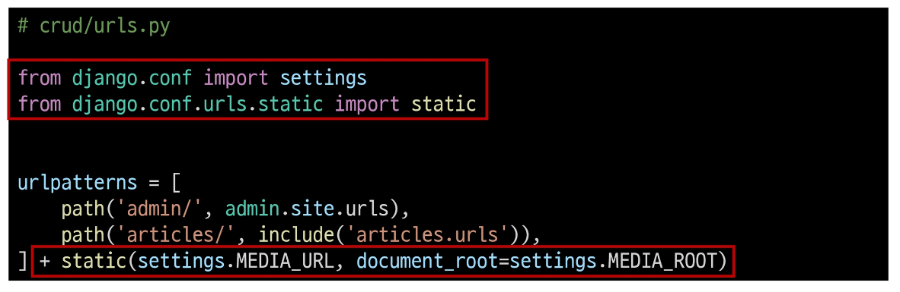

### 이미지 업로드
- blank=True 속성을 작성해 빈 문자열이 저장될 수 있도록 제약 조건 설정
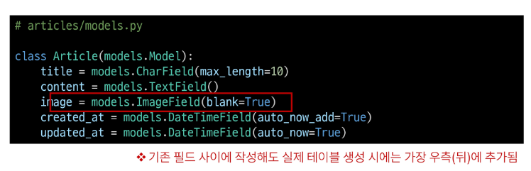

- migration 진행
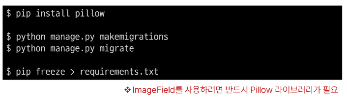

- form 요소의 enctype 속성 추가
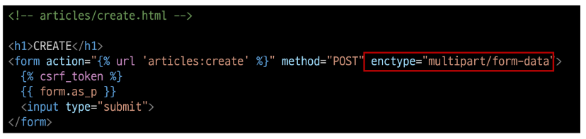

- view 함수에서 업로드 파일에 대한 추가 코드 작성
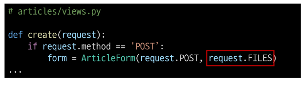

- 이미지 업로드 입력 양식 확인
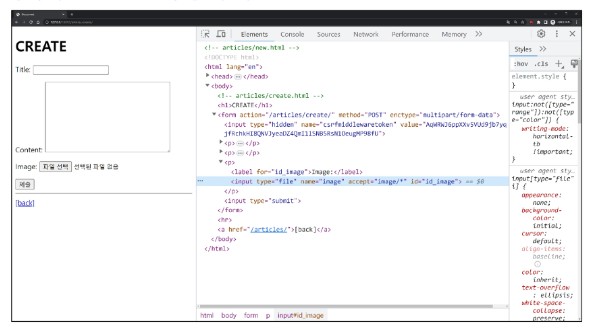

- 이미지 업로드 결과 확인
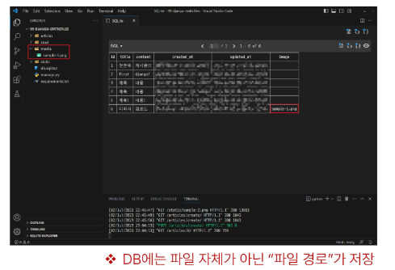

## 업로드 이미지 제공
### 업로드 이미지 제공하기
- 'url' 속성을 통해 업로드 파일의 경로 값의 얻을 수 있음
- article.images/image.url : 업로드 파일의 경로
- article.images/image : 업로드 파일의 파일 이름

- 업로드 이미지 출력 확인 및 MEDIA_URL 확인
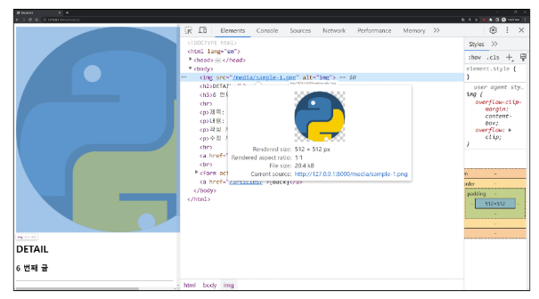

- 이미지를 업로드 하지 않은 게시물은 detail 템플릿을 렌더링 할 수 없음
- 이미지 데이터가 있는 경우만 이미지를 출력할 수 있도록 처리

### 업로드 이미지 수정
- 수정 페이지 form 요소에 enctype 속성 추가
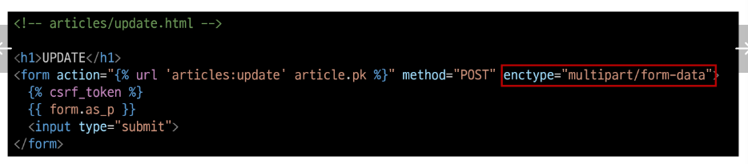
- update view 함수에서 업로드 파일에 대한 추가 코드 작성
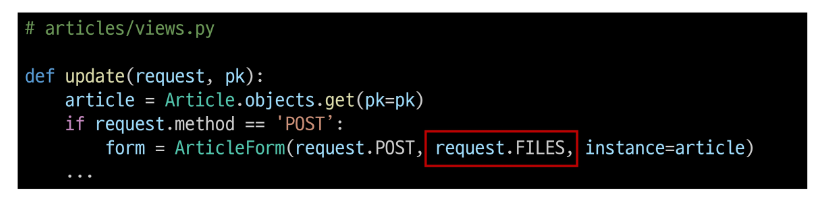

# 참고
## 'upload_to' to argument
- images/imageField()의 upload_to 인자를 사용해 미디어 파일 추가 경로 설정
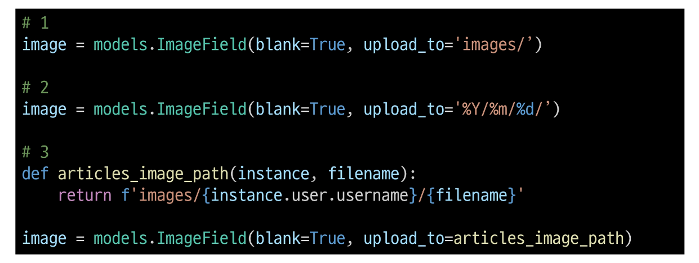

## request.FILES가 두번째 위치 인자인 이유
- ModelForm 상위 클래스 BaseModleForm의 생성자 함수 키워드 인자
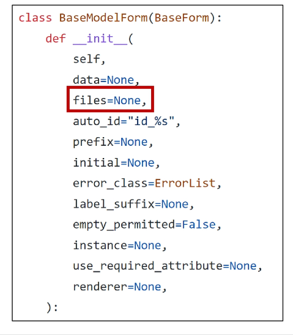

## 파일을 DB에 직접 저장하지 않는 이유
1. 성능 및 DB 최적화
- 직접 파일을 저장하면 DB 크기가 급격하게 증가
    - 성능이 저하
    - 파일 자체는 파일시스템에 별도로 저장
    - DB에는 그 파일에 대한 문자열 경로만
2. 유지 보수 관점
- 만약 db에 직접 파일을 저장해버리면 파일을 변경하거나 업데이트 할 떼 db를 직접 조작해야함
- 그런데 db에 경로만 저장되어있다면 파일시스템에서만 파일을 수정하면 됨