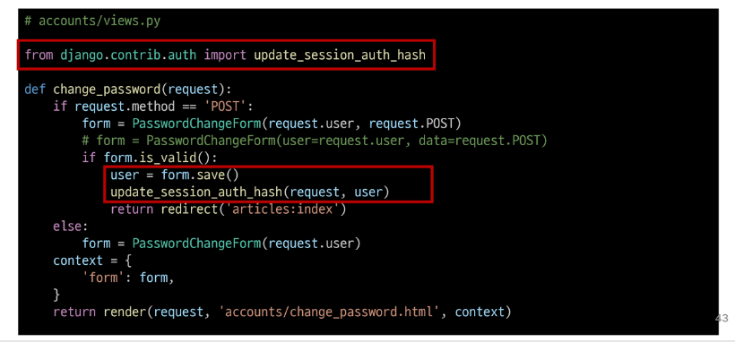
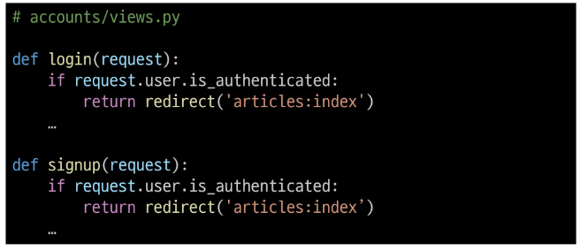

# 09. Authentication System 2
# 회원가입
User 객체를 Create 하는 과정

- 로그인과 로그아웃 : 사용자에 대한 세션을 생성, 삭제하는 것

### USerCreationForm()
회원 가입시 사용자 입력 데이터를 받을 built-in **ModelForm**
- 주어진 username과 password로 권한이 없는 새 user를 생성하는 ModelFrom
- 3개의 필드를 가짐
    - username(form th user model)
    - password1
    - password2

### 회원 가입 페이지 작성
  

### 회원 가입 로직 작성

### 회원 가입 로직 에러
- 회원 가입 진행 후 에러 페이지 확인
> Manager isn't availavle; 'auth.User' has been swapped for 'accounts.User'

- UserCreationForm 이 모델폼이기 때문에 발생하는 오류! 모델과 연결되어서 발생함
- 회원가입에 사용하는 USerCreationFrom이 우리가 대체한 커스텀 유저 모델이 아닌 기존 유저 모델로 인해 작성된 클래스이기 때문
- 상속받아서 재정의(override) 해주면 해결 가능

커스텀 유저 모델을 사용하려면 다시 작성해야 하는 Form
- UserCreationFrom  / UserChangeForm  
두 Form 모두 class Meta : model = User가 작성된 Form 이기 때문

### 회원 가입 로직 작성
- 회원 가입 로직 작성

### get_user_model()
"현재 프로젝트에서 **활성화된 사용자 모델(active user model)**"을 반환하는 함수
- 유지보수 문제로 모델을 직접 참조하지 않음!

### User 모델을 직접 참조하지 않는 이우
- get_user_model()을 사용해 User모델을 참조하면 커스텀 User 모델을 자동으로 반환해주기 때문
- Django User 클래스를 직접 참조하는 대신 get_user_model()을 사용해 참조해야 한다고 필수적으로 강조하고 있음
- USER model 참조에 대한 자세한 내용은 추후 모델 관계에서 다룰 예정

### 회원 가입 로직 작성
- 커스텀 form 적용

# 회원 탈퇴
User 객체를 Delete 하는 과정

### 회원 탈퇴 로직 작성
  

# 회원정보 수정
User 객체를 UPdate 하는 과정

### UserChangeForm()
회원정보 수정 시 사용자 입력 데이터를 받을 built-in ModelForm

### 회원정보 수정 페이지 작성
  
  

### UserChangeFrom 사용시 문제점
- User 모델의 모드 정보들(fields)까지 모두 출력되어 수정이 가능하기 대문에 일반 사용자들이 접근해서는 안되는 정보는 출력하지 않도록 해야함
- CustomUserChangeForm에서 접근 가능한 필드를 조정

### CustomUserChangeForm 출력 필드 재정의
- User Model의 필드 목록 확인
  

### 회원정보 수정 로직 작성

# 비밀번호 변경
인증된 사용자의 Session 데이터를 Update 하는 과정

### PasswordChangeForm()
비밀번호 변경 시 사용자 입력 데이터를 받을 built-in Form

### 비밀번호 변경 페이지 작성
- django는 비밀번호 변경 페이지를 회원정보 수정 form에서 별도 주루소 아낸
- /user_pk/password/
  

### 비밀번호 변경 로직 작성

## 세션 무효화 방지하기
### 암호 변경 시 세션 무효화
- 비밀번호가 변경되면 기존 세견과의 회원 인증 정보가 일치하지 않게 되어 버려 로그인 상태가 유지되지 못하고 로그아웃 처리됨
- 비밀번호가 변경되면서 기존 세션과의 회원 인증 정보가 일치하지 않기 때문

### upsate_session_auth_hash(request, user)
암호 변경 시 세션 무효화를 막아주는 함수
- 암호가 변경되면 새로운 password의 Session Data로 기존 swssion을 자동으로 갱신

### update_session_auth_hash 적용

# 인증된 사용자에 대한 접근 제한
## 로그인 사용자에 대해 접근을 제한하는 2가지 방법
1. is_authenticated 속성
2. login_required 데코레이터

### is_authenticated
사용자가 인증되었는지 여부를 알 수 있는 User model의 속성
- 모든 User 인스턴스에 대해 항상 Ture인 읽기 전용 속성이며, 비인즈 사용자에 대해서는 항상 False

### is_authenticated 적용하기
- 로그인과 비로그인 상태에서 화면에 출력되는 링크를 다르게 설정하기
  

- 인증된 사용자라면 로그인/회원가입 로직을 수행할 수 없도록 하기

### login_required
인증된 사용자에 대해서만 view 함수를 실행시키는 데코레이터
- 비인증 사용자의 경우 /accounts/login/ 주로소 redirect 시킴

### login_required 적용하기
- 인증된 사용자만 게시글을 작성/수정/삭제 할 수 있도록 수정

- 인증된 사용자만 로그아웃/탈퇴/수정/비밀번호 변경할 수 있도록 수정

- settings.py에서 LOGIN_URL 지정해줄 수 있음

# 참고
## is_authenticated 속성 코드

## 회원가입 후 로그인가지 이어서 진행하려면?

## 탈퇴와 함께 기존 사용자의 Session Data 삭제 방법
- 사용자 객체 삭제 이후 로그아웃 함 수 호출
- 단, **탈퇴(1)이후 로그아웃(2)의 순서가 바뀌면 안됨**
- 먼저 로그아웃이 진행되면 해당 요청 객체 정보가 없어지기 때문에 탈퇴에 필요한 유저 정보 또한 없어지기 때문

## PasswordCahngeForm의 순서

+) 데이터베이스를 초기화해야하는데 좀 중요한 데이터인 경우...!
- dumpdate로 받아두기