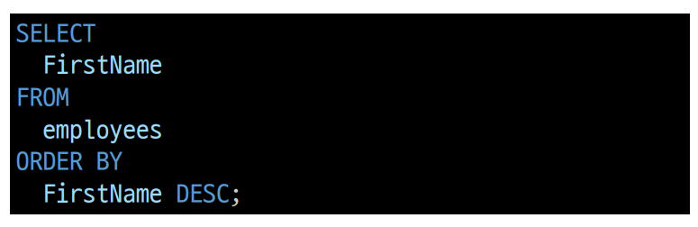
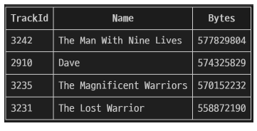
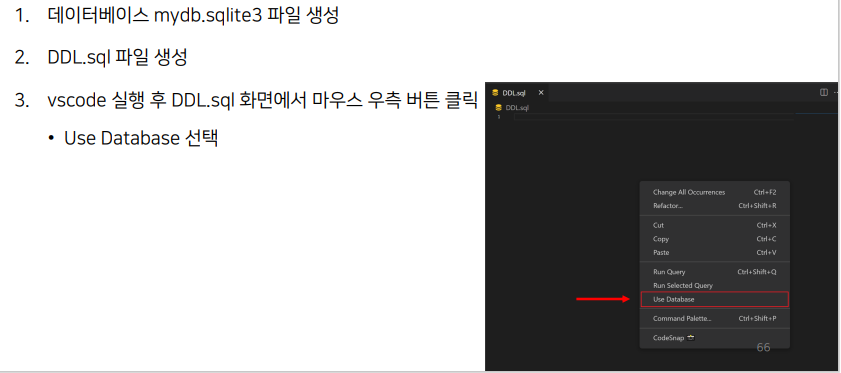
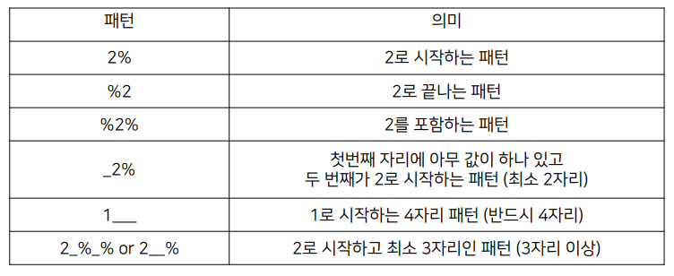
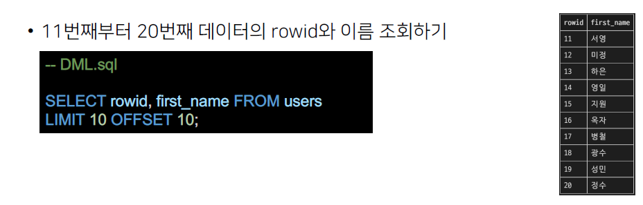

# 01. SQL
# Database
체계적인 데이터 모음

### 데이터
저장이나 처리에 효율적인 형태로 변환된 정보  

증가하는 데이터 사용량
- 매일 초당 2억 개의 메일이 전송되며, 3만명이 넷플릭스를 시청
- 배달의 민족 월평균 주문 약 6천만건 (2020)
- 전세계 모든 데이터의 약 90%는 201년 이후 생산된 것 (IBM)

## 데이터를 저장하고 잘 관리하여 활용할 수 있는 기술이 중요해짐
### 기존의 데이터 저장 방식
1. 파일(File) 이용
- 어디에서나 쉽게 사용 가능
- 데이터를 구조적으로 관리하기 어려움

2. 스프레드 시트(Spreadsheet) 이용
-  테이블의 열과 행을 사용해 데이터를 구조적으로 관리 가능

스프레드 시트의 한계
1. 크기
- 일발적으로 약 100만행까지만 저장 가능

2. 보안
- 단순히 파일이나 링크 소유 여부에 따른 단순한 접근 권한 기능 제공

3. 정확성
- 공식적으로 '강원'의 지명이 '강언'으로 바뀌었다고 가정한다면?
- 이 변경으로 인해 테이블 모든 위치에서 해당 겂을 업데이트 해야함
- 찾기 및 바꾸기 기능을 사용해 바꿀 수 있지만 만약 데이터가 여러 시트에 분산되어 있다면 변경에 누락이 생기거나 추가 문제가 생길 수 있음

## Relational Database
### 데이터베이스의 역할
데이터를 **저장(구조적 저장)**하고 조작 : CRUD

### 관계형 데이터 베이스
데이터 간에 **관계**가 있는 데이터 항목들의 모음

- 테이블, 행, 열의 정보를 구조화하는 방식
- **서로 관련된 데이터 포인터**를 저장하고 이에 대한 **액세스**를 제공

### 관계
여러 테이블 간의 (논리적) 연결

- 이 관계로 인해 두 테이블을 사용하여 데이터를 다양한 형식으로 조회할 수 있음
    - 특정 날짜에 구매한 모든 고객 조회
    - 지난 달에 배송일이 지연된 고객 조회 등

### 관계형 데이터 베이스 예시
- 다음과 같이 고객 데이터가 테이블에 저장되어 있다고 가정
- 고객 데이터 간 비교를 위해서는 어떤 값을 활용해야 할까?
1. 각 데이터에 고유한 식별값을 부여하기 **(기본 키, Primary Key)**

2. 고객의 고유한 식별 값을 저장하자 **(외래 키, 랙댜후 ㅏ됴)**

### 관계형 데이터 베이스 관련 키워드
1. Table (aka Realtion)
- 데이터를 기록하는 곳
2. Field (aka Column, Attribute)
- 각 필드에는 고유한 데이터 형식(타입)이 지정됨
3. Record(aka Row, Tuple)
- 각 레코드에는 구체적인 데이터 값이 저장됨

4. Database (aka Schema)
- 테이블의 집합

5. Primary Key (기본 키)
- 각 레코드의 고유한 값
- 관계형 데이터베이스에서 **레코드의 식별자**로 활용

6. Foreign Key(외래 키)
- 테이블 필드 중 다른 테이블의 레코드를 식별할 수 있는 키
- 다른 테이블의 기본 키를 참조
- 각 레코드에서 서로 다른 테이블 간의 **관계를 만드는 데**시영

## RDBMS
### DBMS(Database Management System)
데이터베이스를 관리하는 소프트웨어 프로그램
- 데이터 저장 및 관리를 용이하게 하는 시스템
- 데이터베이스와 사용자 간의 인터페이스 역할
- 사용자가 데이터 구성, 업데이트, 모니터링, 백업, 복구 등을 할 수 있도록 도움

### RDBMS(Relational Database Management System)
관계형 데이터베이스를 관리하는 소프트웨어 프로그램

- 서비스 종류 : SQLite, MySQL, PostgreSQL, Oracle Database

### SQLite
경량의 오픈 소스 데이터베이스 관리 시스템
- 컴퓨터나 모바일 기기에 내장되어 간단하고 효율적인 데이터 저장 및 관리를 제공

### 데이터베이스 정리
- Table은 데이터가 기록되는 곳
- Table에는 행에서 고유하게 식별 가능한 기본 키라는 속성이 있으며, 외래키를 사용하여 각 행에서 서로 다른 테이블 간의 관계를 만들 수 잇음
- 데이터는 기본 키 또는 외래 키를 통해 결합(join)될 수 있는 여러 테이블에 걸쳐 구조화됨

# SQL (Structure Query Language)
- 테이블 형태로 구조화된 관계형 데이터베이스에게 요청을 질의  
데이터베이스에 정보를 저장하고 처리하기 위한 프로그래밍 언어  
관계형 데이터베이스와의 대화를 위해 사용하는 프로그래밍 언어

### SQL Syntax

- SQL 키워드는 대소문자를 구분하지 않음
    - 하지만 대문자로 작성하는 것을 권장(명시적 구분)
- 각 SQL Statments의 끝에는 세미콜론(;)이 필요
    - 각 세미콜론은 각 SQL Statments을 구분하는 방법 (명령어의 마침표)

## SQL Statments
SQL을 구성하는 가장 기본적인 코드 블록

### SQL Statments 예시

- 해당 예시 코드는 SELECT Stament라 부름
- 이 Stament는 SELECT, FROM 2개의 keyword(Clause)로 구성됨

### 수행 목적에 따른 SQL Stament 4가지 유형
1. DDL - 데이터 정의
2. DQL - 데이터 검색
3. DML - 데이터 조작
4. DCL - 데이터 제어

### SQL 학습
단순히 SQL 문법을 암기하고 상황에따라 실행만 하는 것이 아닌 SQL을 통해 관계형 데이터베이스를 잘 이해하고 다루는 방법을 학습

## 참고
- '데이터베이스로부터 정보를 요청' 하는 것
- 일반적으로 SQL로 작성하는 코드를 쿼리문(SQL문)이라 함

### SQL 표준
- SQL은 미국 국립 표준 협회(ANSI)와 국제 표준화 기구(ISO)에 의해 표준이 채택됨
- 모든 RDBMS에서 SQL 표준을 지원
- 다만 각 RDBMS마다 독자적인 긴응에 따라 표준을 벗어나느 문법이 존재하니 주의

# Single Table Queries

## Querying data
### SELECT statment
테이블에서 데이터를 조회

### SELECT syntax

- SELECT 키워드 이후 데이터를 선택하려는 필드를 하나 이상 지정
- FROM 키워드 이후 데이터를 선택하려는 테이블의 이름을 지정

### SELECT 활용 1
테이블 employees에서 LastNmae 필드의 모든 데이터를 조회  

 

### SELECT 활용 2
테이블 employees에서 LastName 필드의 모든 데이터를 조회

 

### SELECT 활용 3
테이블 employees에서 모든 필드 데이터를 조회

 

### SELECT 활용 4
테이블 employees에서 FirstName 필드의 모든 데이터를 조회  
(단, 조회 시 FirstName이 아닌 ‘이름’ 으로 출력 될 수 있도록 변경)

 

### SELECT 활용 5
테이블 tracks에서 Name, Milliseconds 필드의 모든 데이터 조회  
(단, Milliseconds 필드는 60000으로 나눠 분 단위 값으로 출력)  

 

### SELECT 정리
- SELECT 문을 사용하여 테이블의 데이터를 조회 및 반환
- '*' (asterisk)를 사용하여 모든 필드 선택

## sorting data
### ORDER BY statment
조회 결과의 레코드를 정렬

### ORDER BY syntax
- FROM clause 뒤에 위치
- 하나 이상의 컬럼을 기준으로 결과를 오름차순(ASC, 기본 값), 내린차순(DESC)으로 정렬

### ORDER BY 활용 1
테이블 employees에서 FirstName 필드의 모든 데이터를 오름차순으로 조회

  

### ORDER BY 활용 2
테이블 employees에서 FirstName 필드의 모든 데이터를 내림차순으로 조회

  

### ORDER BY 활용 3
테이블 customers에서 Country 필드를 기준으로 내림차순으로 정렬 한 다음 City 필드 기준으로 오름차순 정렬하여 조회

 

### ORDER BY 활용 4
테이블 tracks에서 Milliseconds 필드를 기준으로 내림차순으로 정렬한 다음 Name, Milliseconds 필드의 모든 데이터를 조회  
(단, Milliseconds 필드는 60000으로 나눠 분 단위 값으로 출력)

  

### 정렬에서의 NULL
NULL 값이 존재하는 경우 오름차순 정렬 시 결과에 NULL이 먼저 출력

### SELECT statment 실행 순서

1. 테이블에서 (FROM)
2. 조회하여 (SELECT)
3. 정렬 (ORDER BY)

## Filtering data
### 관련 키워드
- Clause
    - DISTINCT
    - WHERE
    - LIMIT
- Operator
    - BETWEEN
    - IN
    - LIKE
    - Comparison
    - Logical

### DISTINCT statment
조회 결과에서 중복된 레코드를 제거

### DISTINCT syntax

- SELECT 키워드 바로 뒤에 작성해야함
- SELECT DISTINCT 키워드 다움에 고유한 값을 선택하려는 하나 이상의 필드를 지정

### DISTINCT 활용 1
테이블 customers에서 Country 필드의 모든 데이터를 오름차순 조회

 

### DISTINCT 활용 2
테이블 customers 에서 Country 필드의 모든 데이터를 중복없이 오름차순 조회

 

### WHERE statement
조회 시 특정 검색 조건을 지정

### WHERE syntax

- FROM caluse 뒤에 위치
- search-condition은 비교연산자 및 논리연산자(AND, OR, NOT 등)를 사용하는 구문이 사용됨

### WHERE 활용 1
테이블 customers에서 City 필드 값이 ‘Prague’인 데이터의 LastName, FirstName, City 조회

 

### WHERE 활용 2
테이블 customers에서 City 필드 값이 ‘Prague’가 아닌 데이터의 LastName, FirstName, City 조회

 

### WHERE 활용 3
테이블 customers에서 Company 필드 값이 NULL이고 Country 필드 값이 ‘USA’인 데이터의 LastName, FirstName, Company, Country 조회

  

### WHERE 활용 4
테이블 customers에서 Company 필드 값이 NULL이거나 Country 필드 값이 ‘USA’인 데이터의 LastName, FirstName, Company, Country 조회

  

### WHERE 활용 5
테이블 tracks에서 Bytes 필드 값이 100000 이상 500000 이하인 데이터의 Name, Bytes 조회

  

### WHERE 활용 6
테이블 tracks에서 Bytes 필드 값이 10000 이상 500000 이하인 데이터의 Name, Bytes을 Bytes를 기준으로 오름차순 조회

 

### WHERE 활용 7
테이블 customers에서 Country 필드 값이 ‘Canada’ 또는 ‘Germany’ 또는 ‘France’인 데이터의 LastName, FirstName, Country 조회

  

### WHERE 활용 8
테이블 customers에서 Country 필드 값이 ‘Canada’ 또는 ‘Germany’ 또는 ‘France’가 아닌 데이터의 LastName, FirstName, Country 조회

 

### WHERE 활용 9
테이블 customers에서 LastName 필드 값이 son으로 끝나는 데이터의LastName, FirstName 조회

  

### WHERE 활용 10
테이블 customers 에서 FirstName 필드 값이 4자리면서 ‘a’로 끝나는 데이터의 LastName, FirstName 조회
 

### Operators
### Comparison Operators :  비교 연산자
=, >=, <=, !=, IS, LIKE, IN, BETWEEN...AND

### Logical Operators : 논리 연산자
AND(&&), OR(||), NOT(!)

### IN Operator
값이 특정 목록 안에 있는지 확인

### LIKE Operator
값이 특정 패턴에 일치하는지 확인 (Wildcards와 함께 사용)

- Wildcard Characters
1. '%' : **0개 이상의 문자열**과 일치하는지 확인
2. '_' : **단일 문자**와 일치하는지 확인

### LIMIT clause
조회하는 레코드 수를 제한

### LIMIT syntax

- 하나 또는 두 개의 인자를 사용 (0 또는 양의 정수)
- row_count는 조회하는 최대 레코드 수를 지정

### LIMIT & OFFSET 예시

### LIMIT 활용 1
테이블 tracks에서 TrackId, Name, Bytes 필드 데이터를 Bytes 기준 내림차순으로 7개만 조회

 

### LIMIT 활용 2
테이블 tracks에서 TrackId, Name, Bytes 필드 데이터를 Bytes 기준 내림차순으로 4번째부터 7번째 데이터만 조회

  

## Groupin data
### GROUP BY clause
레코드를 그룹화하여 요약본 생성 ('집계 함수'와 함께 사용)

### Aggregation Function : 집계 함수
값에 대한 계산을 수행하고 단일한 값을 반환하는 함수
- SUM, AVG, MAX, MIN, COUNT

### GROUP BY syntax

- FROM 및 WHERE 절 뒤에 배치
- GROUP BY 절 뒤에 그룹화 할 필드 목록을 작성

### GROUP BY 예시
- Country 필드를 그룹화  

- COUNT 함수가 각 그룹에 대한 집계된 값을 계산

### GROUP BY 활용 1
테이블 tracks에서 Composer 필드를 그룹화하여 각 그룹에 대한 Bytes의 평균 값을 내림차순 조회

### GROUP BY 활용 2
테이블 tracks에서 Composer 필드를 그룹화하여 각 그룹에 대한 Milliseconds의 평균 값이 10 미만인 데이터 조회  
(단, Milliseconds 필드는 60000으로 나눠 분 단위 값의 평균으로 계산)

### Having caluse
- 집계 항목에 대한 세부 조건을 지정
- 주로 GROUP BY와 함꼐 사용되며 GROUP BY가 없다면 WHERE 처럼 동작

### SELECT statment 실행 순서

1. 테이블에서 (FROM)
2. 특정 조건에 맞추어 (WHERE)
3. 그룹화 하고 (GROUP BY)
4. 만약 그룹 중에서 조건이 있다면 맞추고 (HAVING)
5. 조회하여 (SELECT)
6. 정렬하고 (ORDER BY)
7. 특정 위치의 값을 가져옴 (LIMIT)

DDL 사전 준비  

# DDL
- Data definition
- SQL 데이터 정의 언어롤 사용하여 테이블 데이터베이스 개체를 만드는 방법을 학습
- DDL은 데이블 구조를 관리 : CREATE, ALTER, DROP

## CREATE TABLE statement
데이터베이스에 새 테이블을 만듦  

### SQLite Data Types
1. NULL
- NULL value
- 정보가 없거나 알 수 없음을 의미

2. INTEGER
- 정수
- 크기에 따라 0, 1, 2, 3, 4, 6 또는 8바이트와 같은 가변 크기를 가짐

3. REAL
- 실수
- 8바이트 부동 소수점을 사용하는 10진수 값이 있는 실수

4. TEXT
- 문자데이터

5. BLOB(Binary Large Object)
- 입력된 그대로 저장된 데이터 덩어리 (대용 타입 없음)
- 바이너리 등 멀팀디어 파일
- 예시 : 이미지 데이터

참고
1. Boolean type
- SQLite에는 별도의 Boolean이 없음
- 대신 Boolean 값은 정수 0과 1로 저장

2. Date & Time DataType
- 날짜 및 시간을 저장하기 위한 데이터 타입이 없음
- built-in 'data and time functions'으로 TEXT, REAL 또는 INTEGER 값으로 저장할 수 있음

Binary DATA
- 데이터의 저장과 처리를 목적으로 0과 1의 이진 형식으로 인코딩된 파일
- 기본적으로 컴퓨터의 모든 데이터는 binary data
    - 다만, 이를 필요에 따라서 텍스트 타입으로 변형해서 사용하는 것

### Type Affinity : 타입 선호도
특정 컬럼에서 저장된 데이터 타입에 권장되는 타입  

타입 선호도 존재 이우
- 다른 데이터베이스 엔진 간의 호환성을 최대화
- 정적이고 엄격한 타입을 사용하는 데이터베이스의 SQL문을 SQLite에서도 작동하도록 하기 위함

## Constraints : 제약 조건
- 입력하는 자료에 대해 제약을 정함
- 제약에 맞지 않다면 입력이 거부됨
- 사용자가 원하는 조건의 데이터만 유지하기 위한 즉, 데이터의 무결성을 유하지하기 위한 보편적인 방법으로 테이블의 특정 컬럼에 설정하는 제약

### 데이터 무결성
- 데이터 베이스 내의 데이터에 대한 정확성, 일관서을 보장하기 위해 데이터 변경 혹은 수정 시 여러 제한을 두어 데이터의 정확성을 보증하는 것
    - 무결성이랑 데이터의 정확성, 일관성을 나타냄
- 데이터베이스에 저장된 데이터의 무결성을 보장하고 데이터베이스의 상태를 일관되게 유지하는 것이 목적

### 종류
1. NOT NULL
- 컬럼이 NULL 값을 허용하지 않도록 지정
- 기본적으로 테이블의 모든 컬럼은 NOT NULL 제약 조건을 명시적으로 사용하는 경우를 제외하고는 NULL 값을 허용함

2. UNIQUE
- 컬럼의 모든 값이 서로 구별되거나 고유한 값이 되도록함

3. PRIMARY KEY
- 테이블에서 행의 고유성을 식별하는 데 사용되는 컬럼
- 각 테이블에는 하나의 기본 키만 잇음
- 암시적으로 NOT NULL 제약 조건이 포함되어 있음  

4. AUTHOINCREMENT
- 사용되지 않은 값이나 이전에 삭제된 행의 값을 재사용하는 것을 방지
- INTEGER PRIMARY KEY 다음에 작성하면 해당 rowid를 다시 재사용하지 못하도록 함
  
- Django에서 테이블 생성 시 id 컬럼에 기본적으로 사용하는 제약조건

### rowid의 특징
- 테이블을 생성할 때마다 rowid라는 암시적 자동 증카 컬럼이 자동으로 생성됨
- 테이블의 행을 고유하게 식별하는 64비트 부호 있는 정수 값
- 테이블에 새 행을 삽입할 때마다 정수 값을 자동으로 할당
    - 값은 1에서 시작
    - 데이터 삽입 시에 rowid 또는 INTEGER PRIMARY KEY 컬럼에 명시적으로 값이 지정되지 않은 경우, SQLite는 테이블에서 가장 큰 rowid보다 하나 큰 다음 순차 정수를 자동으로 할당(AUTHOINCREMENT와 관계 없이)
- 만약 INTEGER PRIMARY KEY 키워드를 가진 컬럼을 직접 만들면 이 컬럼은 rowid 컬럼의 별칭(Alias)이 됨
    - 즉, 새 컬럼 이름으로 rowid에 액세스 할 수 잇으면 rowid 이름으로도 여전히 약세스 가능
- 만약 SQLite가 사용되지 않은 정수를 찾을 수 없으면 SQLITE_FULL 에러가 발생
    - 또한 일부 행을 삭제하고 새 행을 삽입하면 SQLITE는 삭제된 행에서 rowid 값을 재 사용하려고 시도

### ALTER TABLE
기존 테이블의 구조를 수정(변경)

### ALTER TALBLE statement 예시

1. ALTER TABLE RENAME
테이블명 변경

2. ALTER TABLE RENAME COLUMN
컬럼명 변경

3. ALTER TABLE ADD COLUMN
새 컬럼 추가

현재 과정에서는 일어나지 않지만 만약 테이블에 기존 데이터가 있을 경우
> Cannot add NOT NULL column with default value NULL

- 이전에 이미 저장된 데이터들은 새롭게 추가되는 컬럼에 값이 없기 때문에 NULL 작성 -> NOT NULL 성립되지 않음

DEFAULT 제약조건 활용시 해결 가능  

- 기존에 있는 데이터들에 no address가 들어감

### DEFAULT
- COLUMN 제약조건 중 하나
- 데이터를 추가할 때 값을 생략할 시에 기본 값으로 설정함

4. ALTER TABLE DROP COLUMN
컬럼 삭제

단, 삭제하지 못하는 경우가 있음
- 컬럼이 다른 부분에서 참조되는 경우
    - FOREIGN KEY(외래 키) 제약조건에서 사용되는 경우
- PRIMARY KEY인 경우
- UNIQUE 제약 조건이 있는 경우  

### DROP TABLE
데이터 베이스에 테이블을 제거

존재하지 않는 테이블을 제거하면 오류 발생

### DROP TABLE 특징
- 한 번에 하나의 테이블만 삭제할 수 있음
- 여러 테이블을 제거하려면 여러 DROP TABLE 문을 실행해야 함
- DROP TABLE문은 실행 취소하거나 복구할 수 없음
    - 따라서 각별히 주의하여 수행해야한다.

# DML
- DML 사전 준비  

- CSV 파일을 SQLite 테이블로 가져오기
sqlite3 tool을 사용하여 CSV 파일을 테이블로 가져오는 방법  
  
  

## Simple query
### SELECT statment

특정 테이블에서 데이터를 조회하기 위해 사용  
문법 규칙
1. SELECT 절에서 컬럼 또는 쉼표로 구분된 컬럼 목록을 지정
2. FROM 절(clause)에서 데이터를 가져올 테이블을 지정

- SELECT문은 SQLite에서 가장 복잡한 문
- 다양한 절과 함 께 사용할 수 잇으며 하나씩 학습할 예정
    - ORDER BY, DISTINCT, WHERE, LIMIT, LIKE, GROUP BY

### SELECT 실습

## SORTING ROWS
### ORDER BY clause

- SELECT 문에 추가하여 결과를 정렬
- ORDER BY 절은 FROM 절 뒤에 위치함
- 하나 이상의 컬럼을 기준으로 결과를 오름차순, 내림차순으로 정렬할 수 있음
- 이를 위해 ORDER BY 절 다음에 'ASC' 또는 'DESC' 키워드를 사용
    - ASC: 오름차순(기본ㄱ밧)
    - DESC: 내림차순

### ORDER BY clause 실습
  

 

참고 : Sorting NULLs
- NULL의 정렬 방식
- 정렬과 관련하여 SQLite는 NULL을 다른 값보다 작은 것으로 간주
- 즉, ASC를 사용하는 경우 결과의 시작 부분에 NULL이 표시되고, DESC를 사용하는 경우 결과의 끝에 NULL이 표시됨

## Filtering data
데이터를 필터링하여 중복 제거, 조건 설정 등의 쿼리를 제어하기  

### SELECT DISTINCT caluse
  

- 조회 결과에서 중복된 행을 제거
- DISTINCT 절은 SELECT에서 선택적으로 사용할 수 있는 절
- 문법 규칙
1. DISTINCT 절은 SELECT 키워드 바로 뒤엔 나타나야함
2. DISTINCT 키워드 뒤에 컬럼 또는 컬럼 목록을 작성

### SELECT DISTINCT 실습

  
  

참고 : NULL with DISTINCT
- SQLite는 NULL 값을 중복으로 간추
- NULL 값이 있는 컬럼에 DISTICNCT 절을 사용하여 SQLite는 NULL 값의 한 행을 유지

### WHERE caluse

- 조회 시 특정 검색 조건을 지정
- WHERE절은 SELECT 문에서 선택적으로 사용할 수 있는 절
    - SELECT 문 외에도 UPDATE 및 DELETE 문에서 WHERE 절을 사용할 수 있음
- FROM 절 뒤에 작성

  
  

### WHERE 실습
  

### LIKE operators
- 패턴 일치를 기반으로 데이터를 조회
- SELECT, DELETE, UPDATE문의 WHERE 절에서 사용
- 기본적으로 대소문자를 구분하지 않음
    - 'A' LIKE 'a' : TRUE

wildcards
1. % (percent) : 0개 이상의 문자가 올 수 있음을 의미
    - '영%' : 영으로 시작하는 모든 문자열과 일치 (영, 영미, 영미리)
    - '%도' : 도로 끝나는 모든 문자열과 일치 (도, 수도, 경기도)
    - '%강원%' : 강원을 포함하는 모든 문자열과 일치 (강원, 강원도, 저는 강원도에 살아요)
 2. _ (underscore) : 단일(1개) 문자가 있음을 의미
    - '영_' : 영으로 시작하고 총 2자리인 문자열과 일치(영미, 영수, 영호)
    - '_도' : 도로 끝나고 총 2자리인 문자열과 일치 (수도, 과도)

### LIKE 실습

  
  
  

### IN operator
- 값이 값 목록 결과에 있는 값과 일치하는지 확인
- 표현식이 값 목록의 값과 일치하는지 여부에 따라 true 또는 false 를 반환
- IN 연산자의 결과를 부정하려면 NOT IN 연산자를 사용

### IN 실습
  
  

### BETWEEN operator

- 값이 값 범위에 있는지 테스트
- 값이 지저된 범위에 있으면 true 반환
- SELECT, DELETE 및 UPDATE 문의 WHERE절에서 사용할 수 있음
- BETWEEN 연산자의 결과를 부정하려면 NOT BETWEEN 연산자를 사용

### BETWEEN 실습
  
  

### LIMIT caluse

- 쿼리에서 반환되는 행 수를 제한
- SELECT 문에서 선택적으로 사용할 수 있는 절
- row_count는 반환되는 행수를 지정하는 양의정수를 의미

### LIMIT 실습
  
  

### OFFSET keyword
LIMIT 절을 사용하면 첫 번재 데이터부터 지정한 수 만큼의 데이터를 받아올 수 있지만, OFFSET과 함께 사용하면 특정 지정된 위치에서부터 데이터를 조회할 수 있음

# GROUP BY