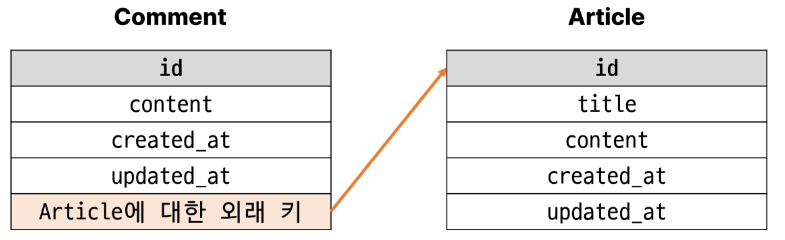

# 02. N:1 (Many to one relationships) 1
Many to one relationships (N:1 or 1:N)
- 한 테이블의 0개 이상의 레코드가 다른 테이블의 레코드 한 개와 관련된 관계

Comment(n)-Article(1)
- 0개 이상의 댓글은 1개의 게시글에 작성될 수 있다.
- 외래키는 n인 Comment에 체크

테이블 관계



ForeignKey()
N:1 관계 설정 모델 필드

# 댓글 모델 구현
## 댓글 모델 정의
- ForeignKey() 클래스의 인스턴스 이름은 참조하는 모델 클래스의 이름의 **단수형**으로 작성하는 것을 권장

- ForeignKey 클래스를 작성하는 위치와 관계없이 외래 키는 테이블 필드 마지막에 생성됨


### ForeignKey(to, on_delete)
- to : 참조하는 모델 class 이름
- on_delete : 외래 키가 참조하는 객체 (1)가 사라졌을 때, 외래 키를 가진 객체(N)를 어떻게 처리할 지를 정의하는 설정(데이터 무결성)
    - on_delete의 CASCADE
    - 부모 객체(참조된 객체)가 삭제됐을 때 이를 참조하는 객체도 삭제
    - PROTECT, SET_NULL, SET_DEFAULT 등 다양한 옵션 존재

Migration
- 댓글 테이블의 article_id 필드 확인
- 참조하는 클래스 이름의 소문자(단수형)로 작성하는 것이 권장되었던 이유
    - 참조 대상 클래스 이름 + _ + 클래스 이름
    


sql문으로 확인하기

```py
python manage.py sqlmigrate aritlces 0002
```


## 댓글 생성 연습
shell_pkus 실행 및 게시글 작성  


댓글 생성  
  
 
shell_plus 실행 및 게시글 작성


comment 인스턴스를 통한 article 값 참조하기  
  

shelll_plus 실행 및 게시글 작성


두번째 댓글 생성  


작성된 댓글 데이터 확인
  

## 관계 모델 참조
N -> 1 (참조)
- 댓글이 어떤 게실글에 작성되었는지를 조회 가능

1 -> N (역참조)
- 해당 게시글에 작성된 모든 댓글을 조회

역참조
- N:1 관계에서 1에서 N을 참조하거나 조회하는 것 1-> N
- **N은 외래키를 가지고 있어 물리적으로 참조가 가능하지만 1은 N에 대한 참조 방법이 존재하지 않아 별돌의 역참조 이름이 필요**

역참조 사용 예시
- article.comment_set.all()
- 모델 인스턴스.realted manger(역참조 이름).QuerySet API

### related manager
- N:1 혹은 M:N 관계에서 역참조 시에 사용하는 매니저
- 'objects' 매니저를 통해 queryset api를 사용했던 것처럼 related manager 를 통해 querysett api를 사용할 수 있게 됨

이름 규칙
- N:1 관계에서 생성되는 related manager의 이름은 참조하는 '모델명_set' 이름 규칙으로 만들어짐
- 해당 댓글의 게시글(Comment -> Article)
    - comment.article
- 게시글의 댓글 목록 (Article -> Comment)
    - article.comment_set.all()

related manager 연습
- shell_plus 실행 및 1번 게시글 조회


- 1번 게시글에 작성된 모든 댓글 조회하기 (역참조)


- 1번 게시글에 작성된 모든 댓글 내용 출력


## 댓글 구현
### 댓글 CREATE
- 사용자로부터 댓글 데이터를 입력 받기 위한 CommentForm 정의


- detail view 함수에서 CommentForm을 사용하여 detail 페이지에 렌더링


- Comment 클래스의 외래 키 필드 article 또한 데이터 입력이 필용한 필드이기 대문에 출력되고 있는 것
- 하지만, 외래키 필드는 **사용자 입력 값으로 받는 것이 아닌 view 함수 내에서 다른 방법으로 전달 받아 저장**되어야 함


- CommentForm의 출력 필드 조정


- 출력에서 제외된 외래 키 데이터는 어디서 받야와야 할까?


- url 작성 및 action 값 작성


- comment_create view 함수 정의
    - article 객체는 언제 저장할 수 있을까?
- 우리는 댓글을 어디서 작성하는가? detail 페이지에서!!


- save(commit=False)
    - DB에 저장하지 않고 인스턴스만 반환  
    - 최종 저장은 하지 않음 !!
    - (Create, but don't save the new instance.)
- save의 commit 인자를 활용해 외래 키 데이터 추가 입력  


- 댓글 작성 후 테이블 확인


### 댓글 READ
- detail view 함수에서 전체 댓글 데이터를 조회


- 전체 댓글 출력 및 확인


### 댓글 DELETE
- 댓글 삭제 url 작성


- 댓글 삭제 view 함수 정의


- 댓글 삭제 버튼 작성


- 댓글 삭제 버튼 출력 확인 및 삭제 테스트
