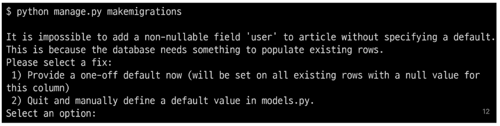
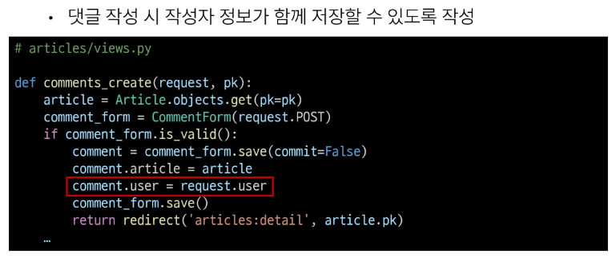

# 02. N:1 (Many to one relationships) 2
Article(N) - User(1)
- 0개 이상의 게시글은 1명의 회원에 의해 작성될 수 있다.

Comment(N) - User(1)
- 0개 이상의 댓글은 1명의 회원에 의해 작성될 수 있다.

# Article & User
## 모델 관계 설정
ARticle - User 모델 관계 설정
- User 외래 키 정의

User 모델을 참조하는 2가지 방법
- django 프로젝트의 '내부적인 구동 순서'와 '반환 값'에 따른 이유
- **우리가 기억할 것은 User 모델은 직접 참조하지 않는다는 것**

|   |get_user_model()|settings.AUTH_USER_MODEL|
|:------:|:---:|:---:|
|반환 값|User Object (객체) |accounts.User (문자열)|
|사용 위치|**models.py가 아닌 다른 모든 위치**|**models.py**|

+)
- get_user_model()
    -  객체 인스턴스를 리턴
    - Django 앱이 로드되는 그 순간에 실행되기 때문에 반드시 유효한 사용자 모델 객체를 리턴한다는 보장 X
    - INSTALLED_APPS가 변경되는 등 캐시에 있는 앱이 다시 로드되는 경우 문제가 생길 확률은 더 높아집니다.

- AUTH_USER_MODEL
    -  외래키 모델을 전달할 때 문자열로 전달합니다.
    - 외래키가 임포트될 때 모델 클래스 탐색에 실패하면 모든 앱이 로드될 때까지 실제 모델 클래스의 탐색을 미룹니다. 
    - 그렇기 때문에 항상 올바른 사용자 모델을 얻을 수 있습니다.

+) 직접 참조인 from accounts.models import User도 가능, 하지만 **직접 참조는 하지말자!!**

### Migration
-  기본적으로 모든 컬럼은 NOT NULL 제약조건이 있기 때문에 데이터가 없이는 새로운 필드가 추가되지 못함
    - 기본값 설정 필요
- 1을 입력하고 Enter 진행 (다음 화면에서 직접 기본 값 입력)

- 추가되는 외래 키 user_id에 어떤 데이터를 넣을 것인지 직접 입력해야함
- 마찬가지로 1 입력하고 Enter 진행
- 그러면 기존에 작성된 게시글이 있다면 모두 1번 회원이 작성한 것으로 처리됨

- migrations 파일 생성 후 migrate 진행

- article 테이블의 user_id 필드 생성 확인

## 게시글 CREATE
- 기존 ArticleForm 출력 변화 확인
- USer 모델에 대한 외래 키 데이터 입력을 위해 불필요한 input이 출력

- ArticleForm 출력 필드 수정

- 게시글 작성 시 에러 발생
- user_id 필드 데이터가 누락되었기 때문

- 게시글 작성 시 작성자 정보가 함께 저장될 수 있도록 save의 commit옵션 활용
- form과 article save 목적은 동일하지만, from.save로 진행해주어야 한다..!

- 게시글 작성 후 테이블 확인

## 게시글 READ
  

## 게시글 UPDATE
- 게시글 수정 요청 사용자와 게시글 작성 사용자를 비교하여 본인의 게시글만 수정할 수 있도록 하기
- .user /.user.username

- 해당 게시글의 작성자가 아니라면, 수정/삭제 버튼을 출력하지 않도록 하기

## 게시글 DELETE
- 삭제를 요청하려는 사람과 게시글을 작성한 사람을 비교하여 본인의 게시글만 삭제할 수 있도록 하기

# Comment & User
## 모델 관계 설정
Comment-User 모델 관계 설정
- User 외래 키 정의

Migration
- 이전 Article - User 모델 관계 설정 때와 동일한 상황
- 기존 Comment 테이블에 새로운 컬림이 빈값으로 추가될 수 없기 때ㅔ문에 기본값 설정과정이 필요

## 댓글 CREATE
  
  

## 댓글 READ

## 댓글 DELETE
  

# 참고
인증된 사용자만 댓글 작성 및 삭제

# DataModeling
데이터베이스 시스템을 시작적으로 표현하는 프로세스
- 데이터 유형, 데이터 간의 관계 및 분석 등을 통해 비즈니스 요구사항을 만들어낼 수 있도록 도움

## ERD(Entity-Relationshup Diagram)
- 다이어그램을 사용하여 데이터베이스의 Entity 간의 관계를 나타내는 방법

ERD 구성요소   

ERD 작성 예시
- Entity 정의

- Attribute 정의

- Releationship 정의

## Relationship 표현 방법
Cardinality(1:1, N:1, N:M) & Optionality(필수&선택)

### Cardinality (기수)
- 1:1 관계

- N:1 관계

### Optionality (선택가능성)
- N:1 관계라면 회원은 '필수' & 글은 '선택'

- 최종 표현

## ERD 작성 마무리

### Cardinality와 Optionality을 조합
- 하나의 회원은 여러 개의 글을 작성할 수 잇고, 하나의 글은 한 명의 회원이 작성할 수 잇다.
- 글과 회원의 관계는 N:1이며, 글은 '필수적'으로 회원과 연결되어야 하지만 회원은 '선택적'으로 글과 연결될 수 있는 관계

## 데이터 모델링의 중요성
- 데이터베이스 소프트웨어 개발 오류 감소
- 데이터베이스 설계 및 생성 속도와 효율성 촉진
- 조직 전체에서 데이터 문서화 및 시스템 설계의 일관성 조성
- 데이터 엔지니어와 비즈니스 팀 간의 커뮤니케이션 촉진