# 04. Many to many relationships 1
# 04. Many to many relationships (N:M or M:N)
한 테이블의 0개 이상의 레코드가 다른 테이블의 0개 이상의 레코드와 관련된 경우
- 양쪽 모두에서 N:! 관계를 가짐

### M:N 관계의 역할과 필요성 이해하기
- '병원 진료 시스템 모델 관계'를 만들며 M:N 관계의 역할과 필요성 이해하기
- 환자와 의사 2개의 모델을 사용하여 모델 구조 구상하기

## N:1의 한계
의사와 환자 간 모델 관계 설정
- 한명의 의사에게 여러 환자가 예약할 수 있다고 설계

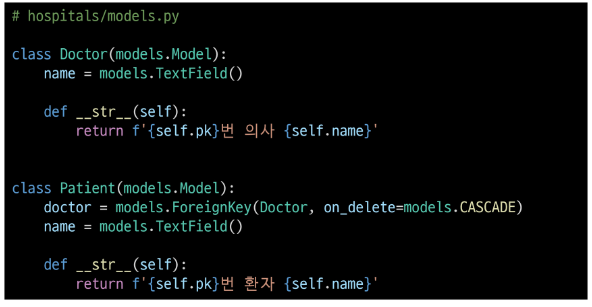

의사와 환자 데이터 생성
- 2명의 의사와 환자를 생성하고 환자는 서로 다른 의사에게 예약

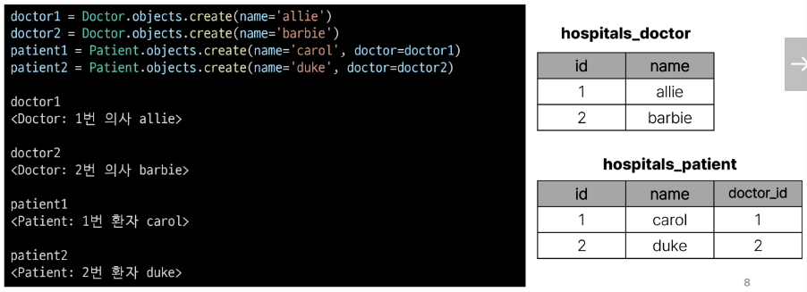

N:1의 한계 상황
- 1번 환자(caol)가 두 의사 모두에게 진료를 받고자 한다면 환자 테이블에 1번 환자 데이터가 중복으로 입력될 수 밖에 없음
- patient 테이블에 동일한 인물인 carol이 중복하여 나타남

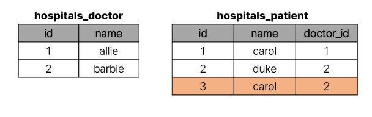

- 동시에 예약을 남길 수는 없을까?

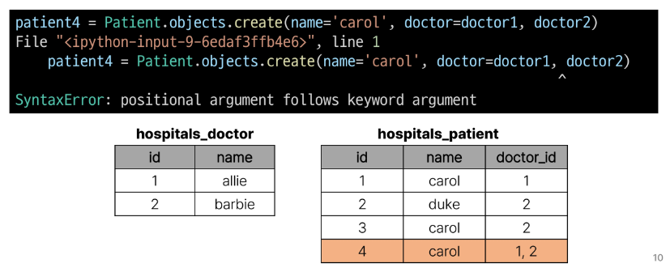

- 동일한 환자지만 다른 의사에게도 진료 받기 위해 예약하기 위해서는 객체를 하나 더 만들어 진행해야 함
- 외래 키 컬럼에 1,2 향태로 저장 및 참조하는 것은 DB 타입 문제로 불가능

-> 예약테이블을 따로 만들지

## 중개 모델
예약 모델 생성
- 환자 모델의 외래 키를 삭제하고 별도의 예약 모델을 새로 생성
- 예약 모델은 의사화 환자에 각각 N:1 관계를 가짐

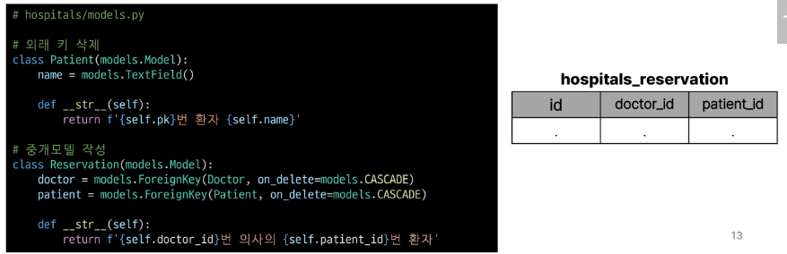

예약 데이터 생성
- 데이터베이스 초기화 후 Mogration 진행 및 shell_plus진행
- 의사와 환자 생성 후 예약 만들기

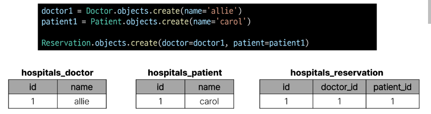

예약 정보 조회
- 의사와 한자가 예약 모델을 통해 각각 본인의 진료 내역 확인

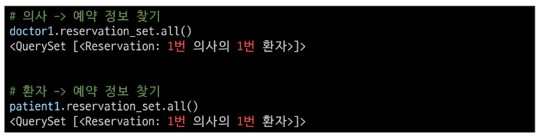

추가 예약 생성
- 1번 의사에게 새로운 환자 예약 생성

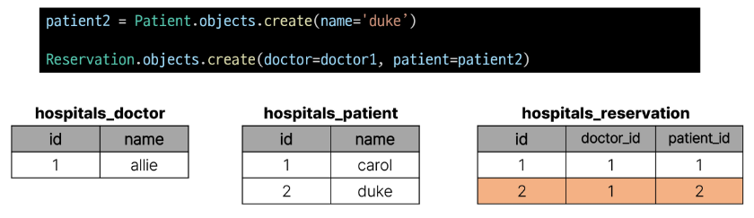

예약 정보 조회
- 1번 의사의 예약 정보 조회

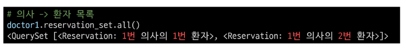

- 객체가 주도적으로 데이터를 생성하기 어려움

**Djnago에서는 'ManyToManyField'로 중개모델을 자동으로 생성**

# ManyToManyField
## DjangoManyToManyField
- 환자 모델에 ManyToManyField 작성

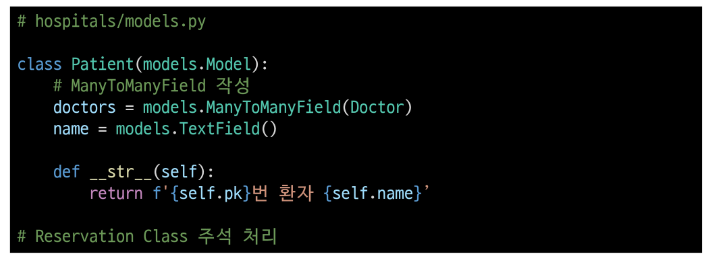

- 데이터베이스 초기화 후 Migration 진행 및 shell_plus 실행
- 생성된 중개 테이블 hospitals_paitent_doctors 확인

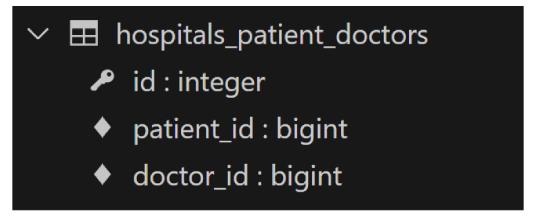

- 의사 1명과 환자 2명 생성

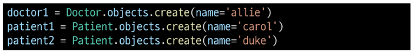

- 예약 생성(환자가 예약)

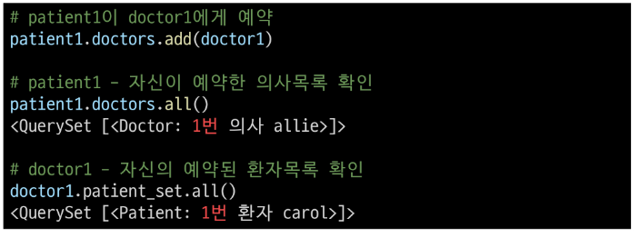

- 예약 생성 (의사가 예약)

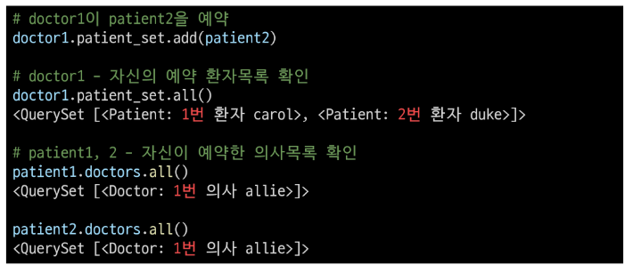

- 중개 테이블에서 예약 현황 확인

- 예약 취소하기(삭제)
- 이전에는 Reservation을 찾아서 지워야 했다면, 이제는 .remove()로 삭제 가능

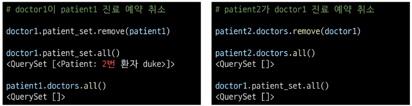

**만약 예약 정보에 증상, 예약일 등 추가 정보가 포함되어야 한다면?**

## 'through' argument
중개 테이블에 **추가 데이터**를 사용해 M:N 관계를 형성하려는 경우에 사용

- through 설정 및 Reservtion Class 수정
- 이제는 예약 정보에 "증상"과 "예약일"이라는 추가 데이터가 생깅

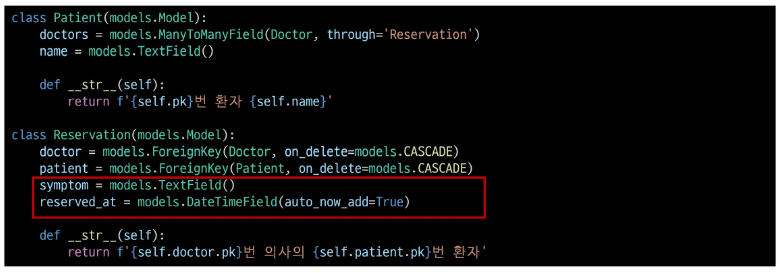

- 데이터베이스 초기화 후 Migration 진행 및 shell_plus 실행
- 의사 1명과 환자 2명 생성

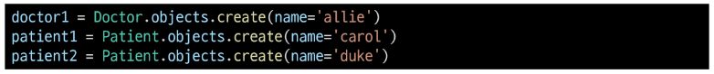

- 예약 생성 방법 -1
- Reservation clas를 통한 예약 생성

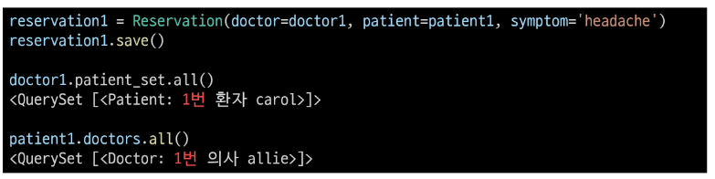

- 예약 생성 방법 - 2
- Patient 객체를 통한 예약 생성(**through_defaults**)

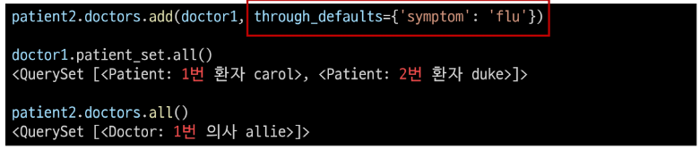

- 생성된 예약 확인

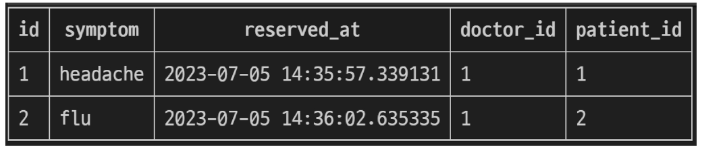

- 의사와 환자가 각각 예약 삭제

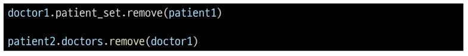

### M:N 관계 주요 사항
- M:N 관계로 맺어진 두 테이블에는 물리적인 변화가 없음
- ManyToManyField는 중개 테이블을 자동으로 생성
- ManyToManyField는 M:N관계를 맺는 두 모델 어디에 이치해도 상관 없음
    - 대신 필드 작성 위치에 따라 참조와 역참조 방향을 주의할 것
- N:1은 완전한 종속의 관계였지만 M:N은 종속적인 관계가 아니며 '의사에게 진찰받는 환자 & 환자를 진찰하는 의사' 이렇게 2가지 형태 모두 표현 가능

## ManyToManyField(to, **options)
Many to many 관계 설정 시 사용하는 모델 필드

### ManyToManyField's Arguments
1. related_name
- 역참조시 사용하는 manager name을 변경

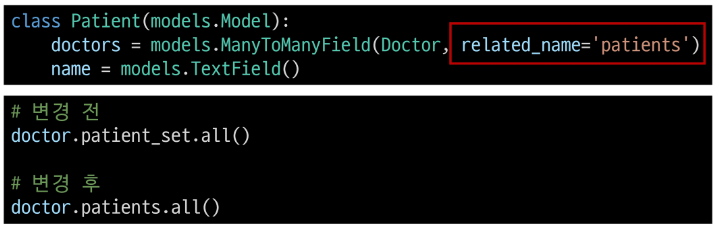

2. symmertrical
- ManyToManyField가 동일한 모델을 가리키는 정의에서만 사용
- 기본 값 : True

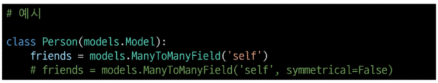

- True일 경우
    - source 모델의 인스턴스가 target 모델의 인스턴스를 참조하면 자동으로 target 모델 인스턴스도 source 모델 인스턴스를 자동으로 참조하도록 함(대칭)
    - 즉, 자동으로 내가 당잇늬 친구라면 당신도 내 친구가 됨
- False일 경우
    - True였을 때와 반대(대칭되지 않음)
3. through

### M:N에서의 methods
add()
- 지정된 객체를 관련 객체 집합에 추가 (이미 존재하는 관계에서 사용하면 관계가 복제되지 않음)

remove()
- 관련 객체 집합에서 지정된 모델 객체를 제거

# 좋아요
## 모델 관계 설정
Article(M) - User(N)
- 0개 이상의 게시글은 0명 이상의 회원과 관련
- 게시글은 회원으로부터 0개 이상의 좋아요를 받을 수 있고, 회원은 0개 이상의 게시글에 좋아요를 누를 수 있음

### 모델 관계 설정
- ManyToManyFoeld 작성

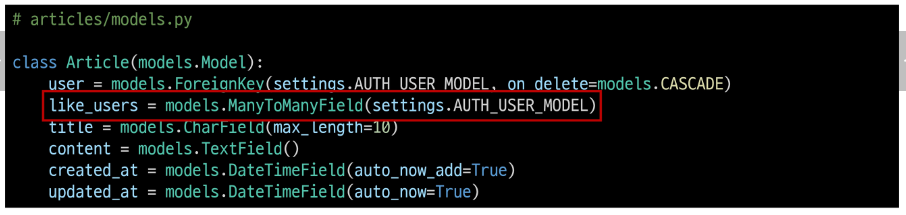

- Migration 진행 후 에러 발생

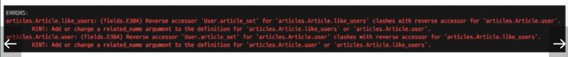

### user.article_set 역참조 매니저 충돌
N:1 : 유저가 작성한 게시글  
M:N :  유저가 좋아요한 게시글  

- like_users 필드 생성 시 자동으로 역참조 .article_set 매니저가 생성됨
- 그러나 이전 N:1(Article-User) 관계에서 이미 같은 이름의 매니저를 사용중
    - user.article_set.all() -> 해당 유저가 작성한 모든 게시글 조회
- user가 작성한 글(user.article_set)과 user가 좋아요를 누른 글(user.article_set)을 구분할 수 없게됨
- user와 관계된 ForeignKey 혹은 ManyToManyField 둘 중 하나에 realted_name 작성 필요

---

- related_name 작성 후 Migration 재진행

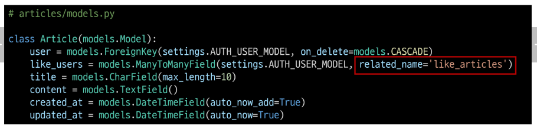

- 생성된 중개 테이블 확인

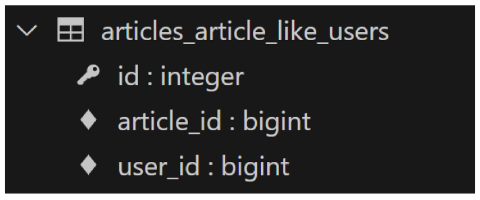

User-Article간 사용 가능한 전체 related manager
- article.user
    - 게시글을 작성한 유저 - N:1
- user.article_set
    - 유저가 작성한 게시글(역참조) - N:1
- article.like_users
    - 게시글을 좋아요 한 유저 - M:N
- user.like_articles
    - 유저가 좋아요한 게시글(역참조) - M:N

## 좋아요 기능 구현
- url 작성

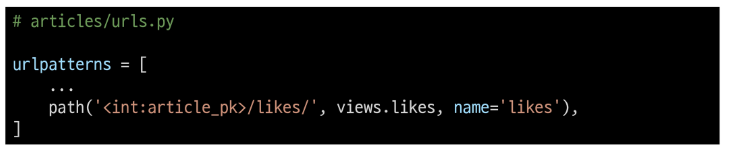

- view 함수 구성

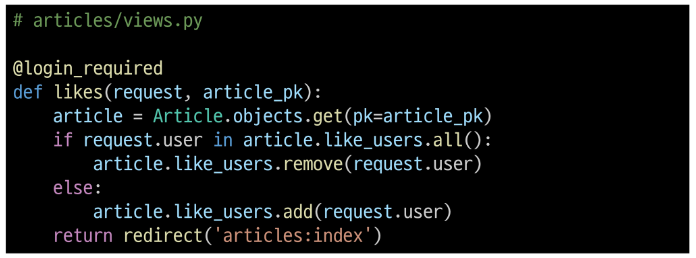

- index 템플릿에서 각 게시글에 좋아요 버튼 출력

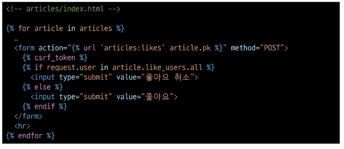

- 좋아요 버튼 출력

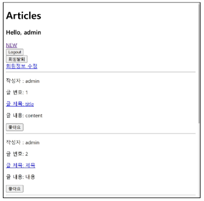

- 좋아요 버튼 클릭 후 테이블 확인

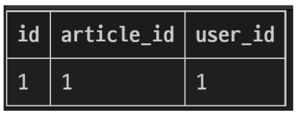

