# 05. Many to many realationships 2
# 팔로우
## 프로필
프로필 페이지
- 각 획원의 개인 프로필 페이지에 팔로우 기능을 구현하기 위해 프로필 페이지를 먼저 구현

프로필 구현
- url 작성

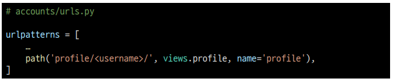

- view 함수 작성

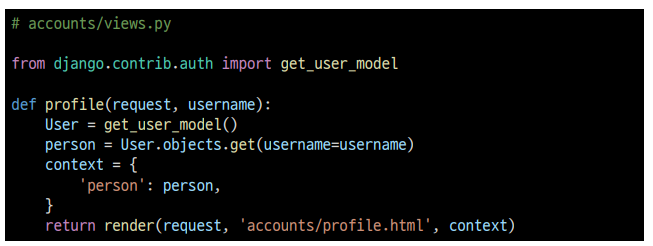

- profile 템플릿 작성

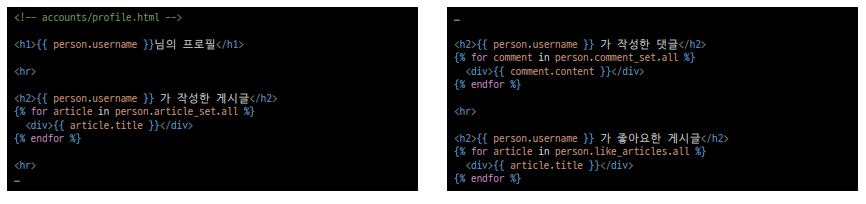

- 프로필 페이지로 이동할 수 있는 링크 작성

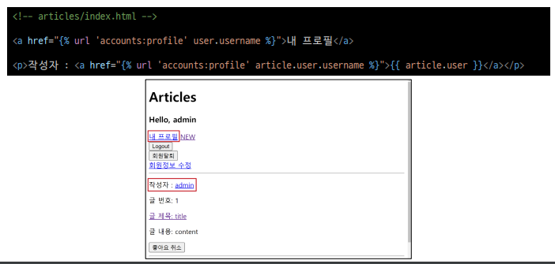

- 프로필 페이지 결과 확인

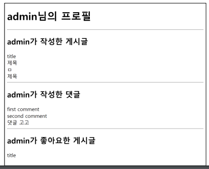

## 팔로우 기능 구현
User(M) - User(N)
- 0명 이상의 회원은 0명 이상의 회원과 관련 : 자기 자신을 참조
- 회원은 0명 이상의 팔로워를 가질 수 있고, 0명 이상의 다른 회원들을 팔로잉 할 수 있음

### 팔로우 기능 구현
- ManyToManyField 작성 : 자기 자신을 참조
- symmertrical(대칭성) False 일방적 팔로잉 가능하도록
- 참조 : 내가 팔로우 하는 사람들 (팔로잉, followings)
- 역참조 : 상대방 입장에서는 나는 팔로워 중 한명(팔로워, folllowers)
- **바뀌어도 상관 없으나 관계 조회 시 생각하기 편한 방향으로 정한 것**

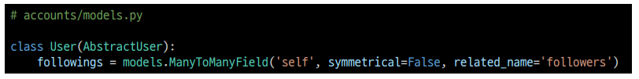

- Migrations 진행 후 중개 테이블 확인

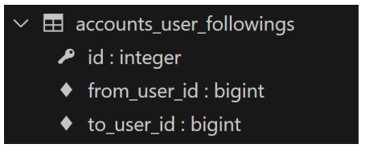

- url 작성

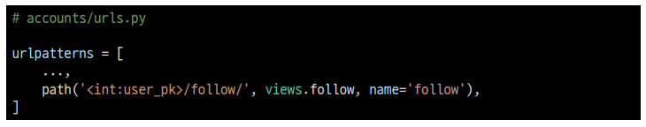

- view 함수 작성

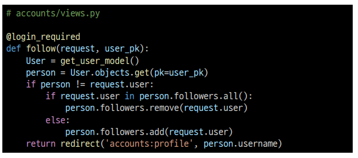

- 프로필 유저의 팔로잉, 팔로워 수 & 팔로우, 언팔로우 버튼 작성

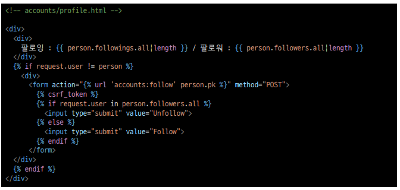

- 팔로우 버튼 클릭 후 팔로우 버튼 변화 및 중개 테이블 데이터 확인

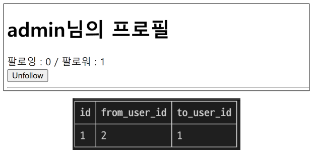

## 참고
.exits()
- QuerySet에 결과가 포함되어 있으면 True를 반환하고 결과가 포함되어 있지 않으면 False를 반환
- 큰 QuerySet에 있는 특정 객체 검색에 유용

### exits 적용 예시
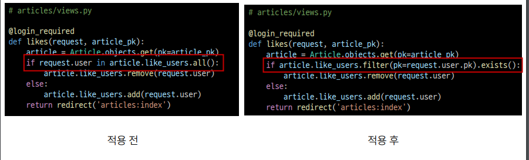  
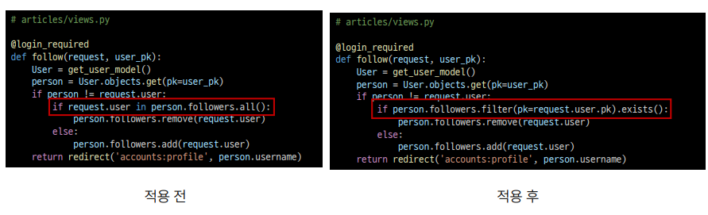

# Django Fixtures
## Fixtures
Django가 데이터베이스로 가져오는 방법을 알고 있는 데이터 모음
- 데이터베이스 구조에 맞추어 작성되어 있음

초기 데이터 제공
- Fixtures의 사용 목적

초기 데이터의 필요성
- 협업하는 유저 A, B가 있다고 생각해보기
1. A가 먼저 프로젝트 작업 후 github에 push
    - gitignore로 인해 DB는 업로드하지 않기 때문에 A가 생성한 데이터도 업로드 X
2. B가 github에서 A가 push한 프로젝트를 pull(혹은 clone)
    - 결과적으로 B는 DB가 없는 프로젝트를 받게 됨
- 이처럼 Django 프로젝트의 앱을 처음 설정할 때 동일하게 준비된 데이터로 데이터베이스를 미래 추으는 것이 필요한 순간이 있음

-> fixtures를 사용해 앱에 초기 데이터(inital data)를 제공

## Fixtures 활용
사전 준비
- M:N까지 모두 작성된 Django 프로젝트에서 유저, 게시글, 댓글 등 각 데이터를 최소 2~3개 이상 생성해두기

fixtures 관련 명령어
- dumpdata : 생성 (데이터 추출)
- loaddata : 로드 (데이터 입력)

### dumpdata
데이터베이스의 모든 데이터를 추출
- 추출한 데이터는 json 형식으로 저장

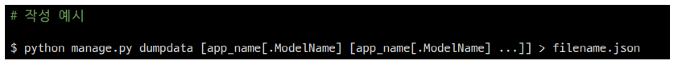

dumpdata 활용  
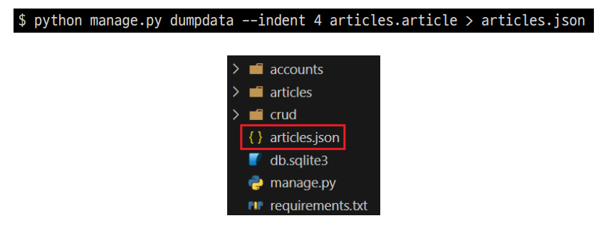  
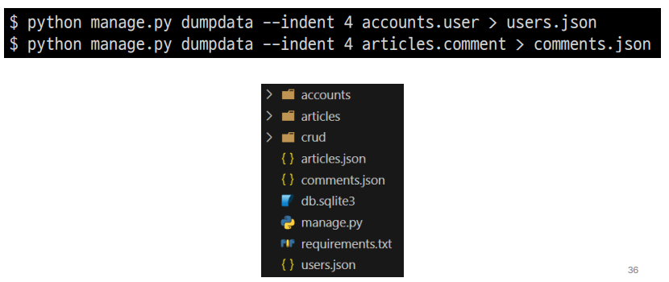

### loaddata
Fixtures 데이터를 데이터 베이스로 불러오기

Fixtures 파일 기본 경로 (app_name/fixtures/)
- Django는 설치된 모든 app의 디렉토리에서 fixtures 폴더 이후의 경로로 fixtures 파일을 찾아 load

loaddata 활용
- db.sqlite3 파일 삭제 후 migrate 진행

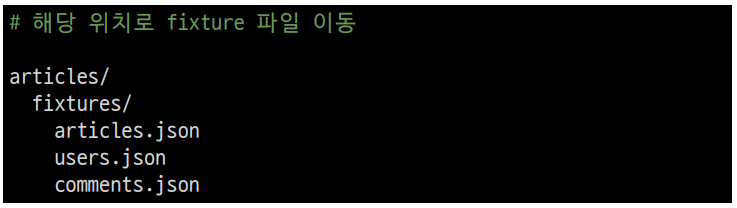

- load 후 데이터가 잘 입력되었는지 확인

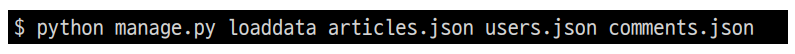

loaddata 순서 주의 사항
- 만약 loaddata를 한번에 실행하지 않고 하나씩 실행한다면 모델 관계에 따라 load 하는 순서가 중요할 수 잇음
    - comment는 article에 대한 key 및 user에 대한 key가 필요
    - article은 user에 대한 key가 필요
- 즉, 현재 모델 관계에서는 user -> article -> comment 순으로 data를 넣어야 오류가 발생하지 않음

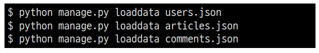

## 참고
모든 모델을 한번에 dumpb  
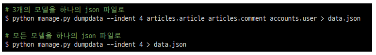

loaddata시 encoding codec 관련 에러가 발생하는 경우
- 2가지 방법 중 택 1
1. dumpdata시 추가 옵션 작성

2. 메모장 활용
    - 1. 메모장으로 json 파일 열기
    - 2. 다른 이름으로 저장 클릭
    - 3. 인코딩을 UTF8로 선택 후 저장

Fixtures 파일을 직접 만들지 말것 
- 반드시 dumpdata 명령어를 사용하여 생성

# Improve query
## 쿼리 개선
django ORM : 데이터를 DB에서 가져올 때

Lazy-Loading(지연로딩) 방식으로 데이터를 불러온다.
- ORM queryset API 명령을 실행!
    - 바로 관련된 데이터를 모두 가져오는 것 X
    - 실제로 데이터를 불러와야 할 시점 마다 ! DB에 쿼리를 실행하는 방식

- Articles.objects.all()
    - comments 필드에 대한 데이터는 필요한 시점에!
        - DB 쿼리를 전송하여 결과
- 불필요한 부분을 한꺼번에 다 가져올 필요가 X 상황
    - 장점: 내가 정말 필요한 시점, 필요한 부분만! 그때 그때 사용할 수  O

문제점 : N + 1 문제  
게시글 + 그 해당 댓글을 조회  
해당 게시글 조회 .get() -> 쿼리 1개  
N개의 댓글 도회 comments -> 쿼리 N개

근본적인 문제 : 지연로딩(Lazy-Loading)의해서 불필요한 쿼리가 추가적으로 발생  
    -> 해당되는 연결 데이터를 즉시 가져올 수 있는 방법  
    -> 즉시로딩 (Eager-Loading)

즉시로딩(Eager_Loading) : 사전에 쓸 데이터를 포함해서 쿼리를 날리는 방식 (N+1 문제 방식)
- annotate 함수 : 내가 필요한 컬럼 또는 데이터를 같이 가져와서 조회
- select_related 메서드 : 쿼리문 JOIN절 을 사용해서 조회 -> 쿼리 1 : 1:1, 1:N 조회 (다대다X)
- prefetch_related 메서드 : 두 개의 테이블을 모두 가져와서 파이썬 내에서 JOIN 진행 -> 쿼리 2 다대다O

### 사전 준비
Improve query
- 같은 결과를 얻기 위해 DB 측에 보내는 쿼리 개수를 점차 줄여 조회하기

사전 준비
- 데이터 : 게시글 10개 / 댓글 100개 / 유저 5개
- 모델 관계
    - N:1 - Article:User / Comment:Article / Comment:Article
    - N:M - Article:User
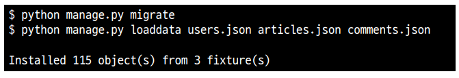

- 서버 확인
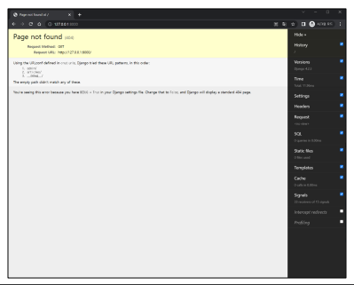

## annotate
SQL의 GROUP BY 쿼리를 사용

문제 상황  
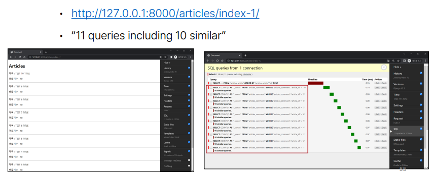
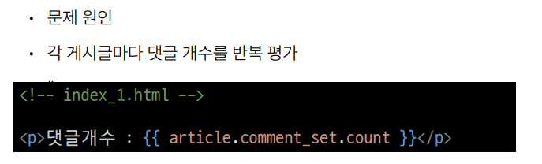

annotate 적용
- 문제 해결
- 게시글을 조회하면서 **댓글 개수까지 한번에 조회**헤서 가져오기

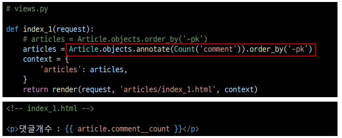
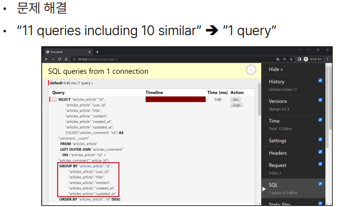

## select_related
SQL의 INNER JOIN 쿼리를 활용
- 1:1 또는 N:1 참조 관계에서 사용

문제 상황  
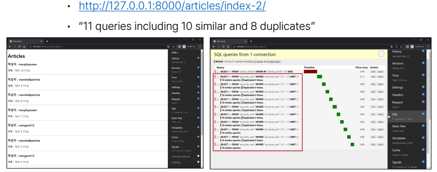
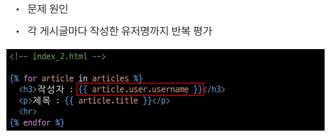

select_related 적용 : 게시글을 조회하면서 유저 정보까지 한번에 조회해서 가져오기  
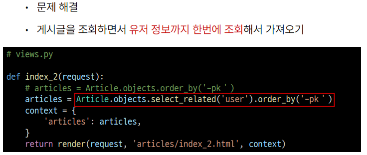
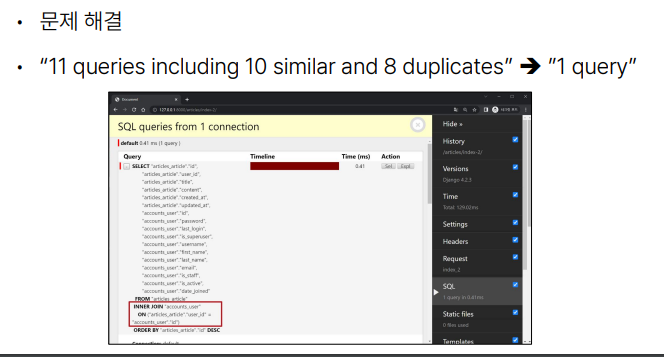

## prefetch_related
M:N 또는 N:1 역참조 관계에서 사용
- SQL이 아닌 Python 을 사용한 JOIN을 진행

문제 상황  
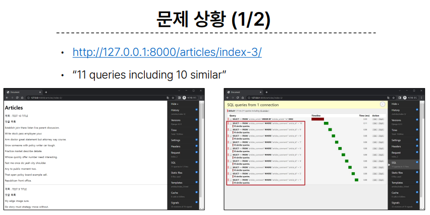
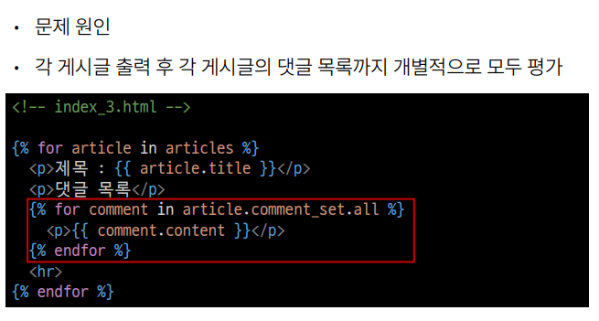

prefetch_realated 적용 : 게시글을 조회하면서 참조된 댓글까지 한번에 조회해서 가져오기  
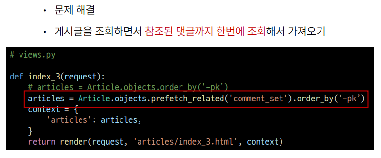
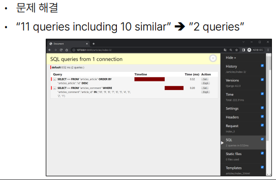

## select_related & prefetch_related
문제 상황
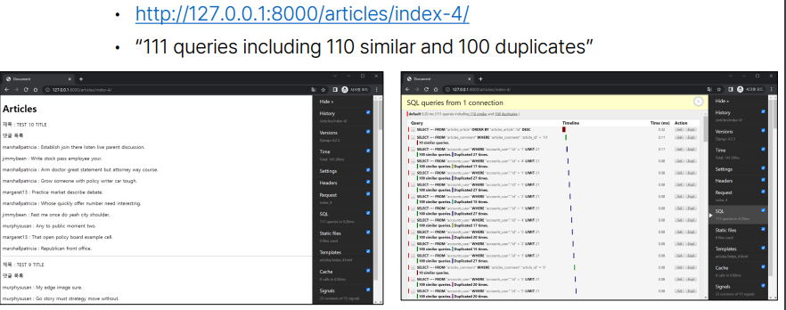
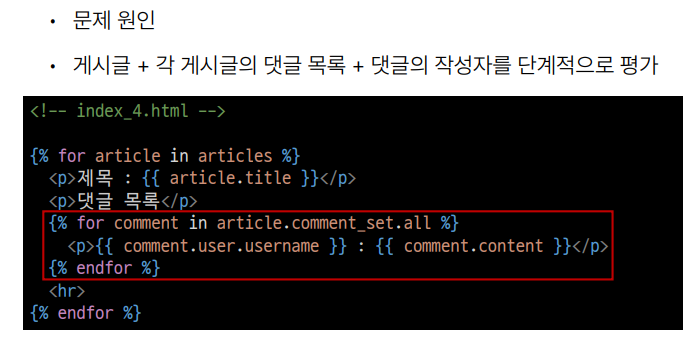

문제 해결 1단계 :  게시글을 조회하면서 참조된 댓글까지 한번에 조회  
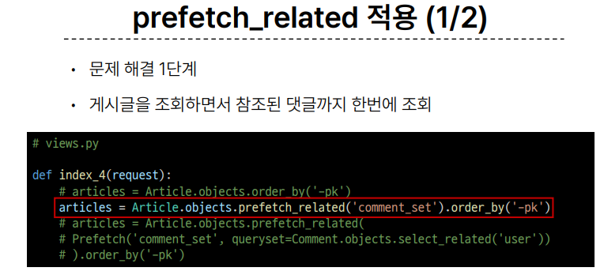
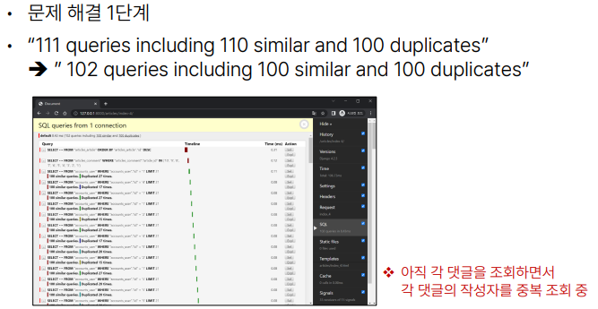

문제 해결 2단계 : 게시글 + 각 게시글의 댓글 목록 + 댓글의 작성자를 한번에 조회
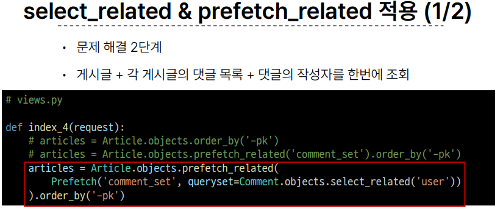
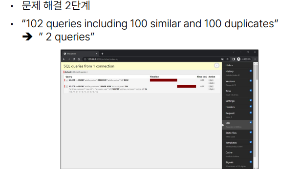

## 참고
섣부를 최적확은 악의 근원!