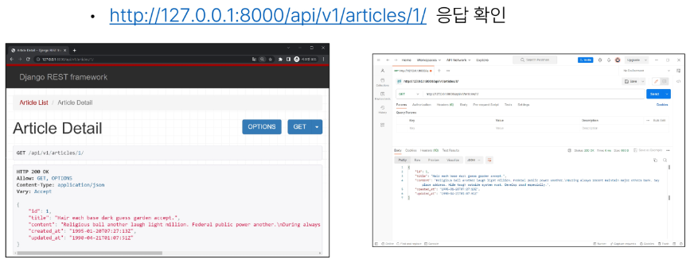
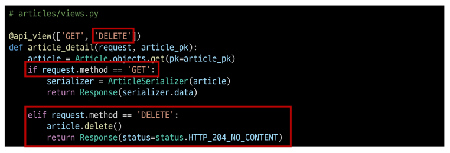
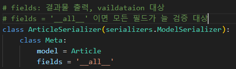

# 10. Django REST framwork 1
# REST API
API(Apllication Programming Interface)
- 애플리케이션과 프로그래밍을소 소통하는 방법
- 클라이언트-서버처럼 서로 다른 프로그램에서 요청과 응답을 받을 수 있도록 만든 체계

API란?  

- 복잡한 코드를 추상화하여 대신 사용할 수 있는 몇가지 더 쉬운 구문을 제공

Web API
- 웹 서버 또는 웹 브라우저를 위한 API
- 현대 웹 개발은 하나부터 열까지 직접개발하기보다 OpenAPI들을 활용하는 추세
- JSON 선호
- 대표적인 Third Party Open API 서비스 목록
    - Youtube API
    - Google Map API
    - Naver Papago API
    - Kakao Map API

### REST : Representational State Transfer
API Server를 개발하기 위한 일종의 소프트웨어 설계 방법론 (약속 : 규칙X)

모든 요청 -> 응답 : REST일 필요는 없다!! 적재 적소에 작성하는게 중요

RESTful API
- REST 원리를 따르는 시스템을 RESTful 하다고 부름
- **자원을 정의**하고 **자원에 대한 주소를 지정**하는 전반적인 방법을 서술
- 각각 API 구조를 작성하는 모습이너무 다르니 약속을 만들어서 다같이 통일해서 쓰자 !

REST API
- REST라는 설계 디자인 약속을 지켜 구현한 API

REST에서 자원을 정의하고 주소를 지정하는 방법
1. 자원의 식별
- URI
2. 자원의 행위
- HTTP Methods (GET: 가져와죠 POST : 생성해죠)
3. 자원의 표현
- JSON 데이터
- 궁극적으로 표햔되는 데이터 결과물

## 자원의 식별
HTTP (HyperTextTransfer Protocol)
- HTML 문서와 같은 리소스(resource, 자원) 들을 가져올 수 있도록 하는 프로토콜(규칙, 약속)
- 웹 상에서 컨텐츠를 전송하기 위한 약속
- 웹에서 이루어지는 모든 데이터 교환의 기초가 됨
- 클라이언트-서버 프로토콜이라고도 부름
- 클라리언트와 서버는 가음와 같은 개별적인 메시지 교환에 의해 통싱
    - 요청(request) : 클라이언트에 의해 전송되는 메시기
    - 응답(response) : 서버에서 응답으로 전송되는 메시지

HTTP 특징
- Stateless (무상태)
    - 동일한 연결(connection)에서 연속적으로 수행되는 두 요청 사이에 링크가 없음
    - 즉, 응답을 마치고 연결을 끊는 순간 클라이언트와 서버 간의 통신이 끝나며 상태 정보가 유지되지 않음
- 이는 특정 페이지와 일관되게 상호작용 하려는 사용자에게 문제가 될 수 있으며, 이를 해결하기 위해 쿠키와 세션을 사용해 서버 상태를 요청과 연결하도록 함

### URI (Uniform Resource Identifier : 통합 자원 식별자)
인터넷에서 리소스(자원)를 식별하는 문자열, 고유한 아이디(식별자)
- 가장 일반적인 URI는 웹 주소 알려진 URL
- URL보다 조금 더 큰 개념
- ex) 주민등록번호, 도서번호 ISBN, 시청각 자료 번호 ISAN
- loacaton : url / 이름 name : urn

### URL (Unfiform Resource Locator : 통합 자원 위치)
웹에서 주어진 리소스의 주소
- 네트워크 상에 리소스가 어디 있는지를 알려주기 위한 약속

**Schema (or Protocol)**
- 브라우저가 리소르를 요청하는 데 사용해야 하는 규약
- URL의 첫 부분을 브라우저가 어떤 규약을 사용하는지를 나타냄
- 기본적으로 웹은 HTTP(S)를 요구하며 메일을 열기 위한 mailto:, 파일을 전송하기 위한 ftp: 등 다른 프로토콜도 존재
- s: secure, 보안적인 측면으로 HTTP는 사용하지 않는 추세

**Authority**
- Scheme 다음은 문자 패턴 ://으로 구분된 Authority(권한)이 작성됨
- Authority는 domain과 port를 모두 포함하며 둘은 :(콜론)으로 구분

**Domain Name**
- 요청 중인 웹 서버를 나타냄
- 어떤 웹 서버가 요구되는 지를 가리켬 직접 IP 주소를 사용하는 것도 가능하지만, 사람이 외우기 어렵기 때문에 주로 Domain Namne으로 사용
- 예를 들어 도메인 google.com의 IP 주소는 142.251.42.142

**Port**
- 웹 서버의 리소스에 접근하는데 사용되는 기술적인 문(Gate)
- HTTP 프로토콜의 표준 포트
    - HTTP - 80
    - HTTPS - 442
- 표준 포트만 생략 가능

**Path**
- 웹 서버의 리소스 경로
- 초기에는 실제 파일이 위치한 물리적 위치를 나타냈지만, 오늘날은 실제 위치가 아닌 추상화된 형태의 구조를 표현
- 예를 들어 /articles/create/ 가 실제 articels 폴더 안에 create 폴더 안을 나타내는 것은 아님

**Parameters**
- 웹 서버에 저공되는 추가적인 데이터
- '&' 기호로 구분되는 key-value 쌍 목록
- 서버는 리소스를 응답하기 전에 이러한 파라미터를 사용하여 추가 작업을 수행할 수 있음

**Anchor**
- 일종의 "북마크"를 나타내며 브라우저에 해당 지점에 있는 콘텐츠를 표시
- fragement identifier(부분 식별자)라고 부르는 '#' 이후 부분은 서버에 전송되지 않음
- 

## 자원의 행위
### HTTTP Request Methods
리소스에 대한 행위(수행하고자 하는 동작)를 정의
- HTTP verbs라고도 함

### 대표 HTTP Request Methods
1. GET
- 서버에 리소스의 표현을 요청
- GET을 사용하는 요청은 데이터만 검색해야 함
2. POST
- 데이터를 지정된 리소스에 제출
- 서버의 상태를 변경
3. PUT
- 요청한 주소의 리소스를 수정
4. DELETE
- 지정된 리소스를 삭제

### HTTP resopnse status codes
특정 HTTP 요청이 성공적으로 완료되었는지 여부를 나타냄
- 면접 빈출... ? 3개 이상은 가뿐하게 말할 수 있도록
- 5개의 응답 그룹
    - Informational response (100-199)
    - **Successful response (200-299)** : 성공
    - Redirection message (300-399)
    - **Client error response (400-499)** : 사용자 실패
    - **Server error responses (500-599)** : 서버 실패

## 자원의 표현
그동안 서버가 응답(자원을 표현)했던 것
- 지금까지 Django 서버는 사용자에게 페이지(html)만 응답하고 있었음
- 하지만 서버가 응답할 수 있는 것은 페이지 뿐만 아니라 다양한 데이터 타입을 응답할 수 있음
- REST API는 이중에서도 **JSON** 타입으로 응답하는 것을 권장

### 응답 데이터 타입의 변화
- 페이지(html)만을 응답하는 서버 : render 함수의 역할  

- 이제는 JSON 데이터를 응답하는 REST API 서버로의 변환

- Django는 더 이상 Template 부분에 대한 역할을 담당하지 않게 되며, Front-end와 Back-end가 분리되어 구성됨

- 이제부터 Django를 사용해 RESTful API 서버를 구축할 것

## 사전준비

### python으로 json 응답 받기
- 준비된 python-request-sample.py 확인

# DRF : Django REST framework
Django에서 Restful API 서버를 쉽게 구축할 수 있도록 도와주는 오프소스 라이브러리

## Serialization : 직렬화
여러 시스템에서 활용하기 위해 데이터 구조나 객체 상태를 나중에 재구성할 수 있는 포맷으로 변환하는 과정
- 어떠한 언어나 환경에서도 **나중에 다시 쉽게 사용할 수 있는 포맷으로 변환하는 과정**
- 변환 포맷은 대표적으로 json, xml 등이 있음...

### Serialization 예시
데이터 구조나 객체 상태를 나중에 재구성할 수 있는 포맷으로 변환하는 과정

# DRF with Single Model
### 프로젝트 준비

### Postman 설치 및 안내

### Postman 화면 구성

### URL과 HTTP requests methods 설계  
게시글 기능 CRUD
- Read 전체 게시글 조회
    - "articles/"
- Read 특정 게시글 조회
    - "articles/<int:article_pk>/"
- Create 게시글 생성
    - "articles/"
- Delete 특정 게시글 삭제
    - "articles/<int:article_pk>/"
- Update 특정 게시글 수정
    - "articles/<int:article_pk>/"

이러한 url을 살펴보고 어떻게 묶을지 파악

댓글 기능 CRUD
- Read (특정 게시글에 대한) 전체 댓글 조회
    - "articles/<int:article_pk>/comments/"

- Read (특정 게시글에 대한) 특정 댓글 조회
    - "articles/<int:article_pk>/comments/<int:comment_pk>/"
- Delete (특정 게시글에 대한) 특정 댓글 삭제
    - "articles/<int:article_pk>/comments/<int:comment_pk>/"
- Update (특정 게시글에 대한) 특정 댓글 수정
    - "articles/<int:article_pk>/comments/<int:comment_pk>/"

## GET
### GET - List
- 게시글 데이터 목록 조회하기
- 게시글 데이터 목록을 제공하는 ArticleListSerializer 정의

Model Serializer
- Django 모델과 연결된 Serializer 클래스

이전 view 함수와의 비교
- 똑같은 데이터를 HTML에 출력되도록 페이지와 함께 응답했던 과거의 view 함수, JSON 데이터로 serialization 하여 페이지 없이 응답하는 현재의 view 함수

'api_view' decorator
- DRF view 함수에서는 필수로 작성되며 view 함수를 실행하기 전 HTTP 메서드를 확인
- 기본적으로 GET 메서드만 허용되며 다른 메서드 요청에 대해서는 405 Method Not Allowed로 응답
- DRF view 함수가 응답해야하는 HTTP  메서드 목록을 작성

### GET - Detail
- 단일 게시글 데이터 조회하기
- 각 게시글의 상세 정보를 제공하는 ArticleSerializer 정의

## POST
- 게시글 데이터 생성하기
- 데이터 생성이 성공했을 경우 201 Created 를 응답
- 데이터 생성이 실패했을 경우 400 Bad request 를 응답

## DELETE
- 게시글 데이터 삭제하기
- 요청에 대한 데이터 삭제가 성공했을 경우는 204 No Content 응답

## PUT
- 게시글 데이터 수정하기
- 요청에 대한 데이터 수정이 성공했을 경우는 200 ok 응답

+) 데이터 일부분만 수정하는 경우 발생하는 이슈
- fields = '__all__'로 설정되어 있기 때문

- prtial = True로 해결

# 참고
## raise_exception
- is_valid()는 유효성 검사 오류가 있는 경우 VaalidationError 예외를 발생시키는 선택적 raise_exception 인자를 사용할 수 잇음
- DRF에서 제공하는 기본 예외 처리기에 의해 자동으로 처리되면 기본적으로 HTTP 400 응답을 반환

### URL 경로
/path/to/A  <- 파일  
/path/to/A/  <- 디렉토리  
(클래식) 물리적인 파일 위치 -> (현재) 추상적인 리소스 위치

서버에서도 이 해당 URL을 처리하는 방식
- 파일 일 때
1. 이 해당 경로에 파일을 먼저 찾아본다! 
2. 파일이 있다면 전달 없다면 딜게토리 경로
3. 해당 디렉토리가 있는지 확인하고, index.html 파일을 찾아서 전달.

- 디렉토리 일 때
1. 이 해당 경로의 디렉토리를 찾는다!
2. index.html 파일을 찾아서 전달

웬만하면 선능상으로는 디렉토리 일 때가 서버에 부담을 준다...   
but..! www.naver.com <-> www.naver.com/
- 디자인적으로, 마케팅적인 측면에서는 끝이 /로 끝나지 않을 때를 더 선호

장고 프레임워크에서는
- 끝이 /로 끝나지 않았을 때! 강제적으로 브라우저에게 리다이렉팅 시도!
- www.naver.com : 브라우저에게 너 '/'를 붙여서 페이지 이동해 !
    - (REDIRECT) www.naver.com/