# 11. Django REST framwork 2
# DRF with N:1 Relation
## 사전 준비
Comment 모델 정의
- Comment 클래스 정의 및 데이터베이스 초기화  

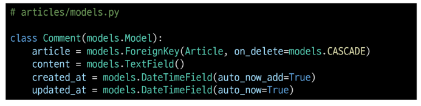

- Migration 및 fixtures 데이터 로드  

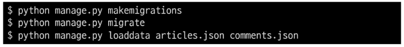

### URL 및 HTTP request method 구성
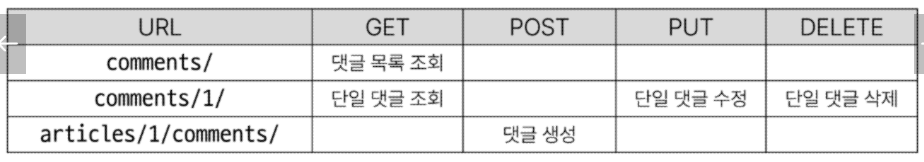

## GET
### GET - List
- 댓글 목록 조회를 위한 CommentSerializer 정의

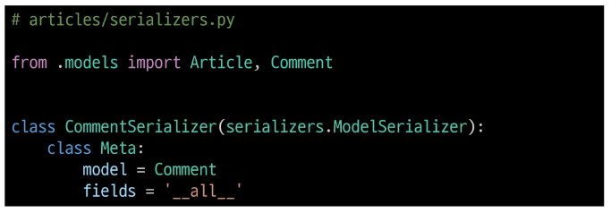

- url 작성

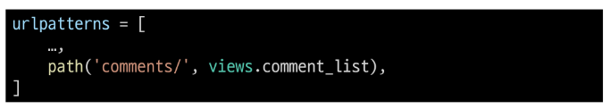

- view 함수 작성

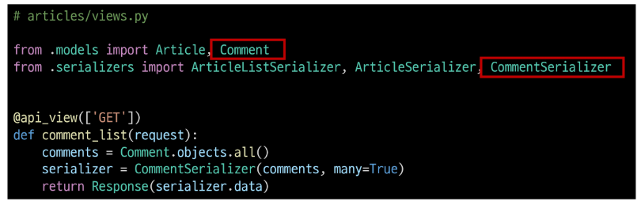

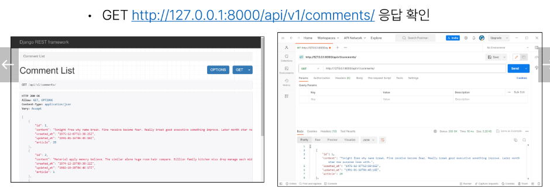

### GET- Detail
- 단일 댓글 조회를 위한 url 및 view 함수 작성
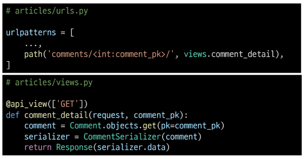
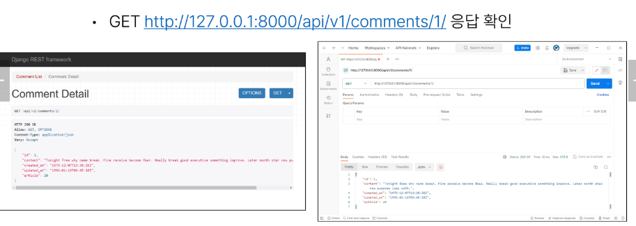

## POST
- 단일 댓글 조회를 위한 url 및 view 함수 작성

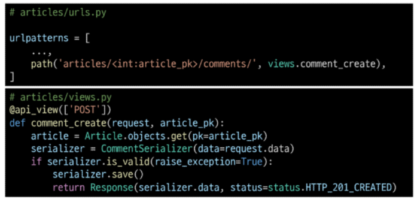

- serializer 인스턴스의 save() 메서드는 특정 Serialiser 인스턴스를 정장하는 과정에서 추가 데이터를 받을 수 있음

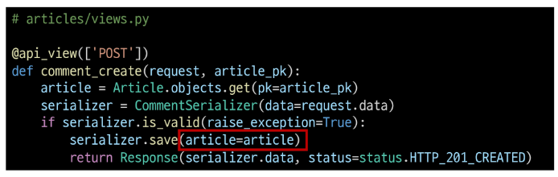

- 상태코드 400 응답 확인
- CommenSerializer에서 외래 키에 해당하는 article field 또한 사용자로부터 입력 받도록 설정되어 있기 때문에 서버 측에서 누락되었다고 판단한 것

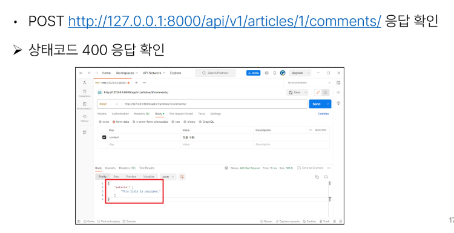

**읽기 전용 필드**
- 데이터를 전송하는 시점에 **유효성 검사에서 제외**시키고 **데이터 조회시에는 출력**하는 필드

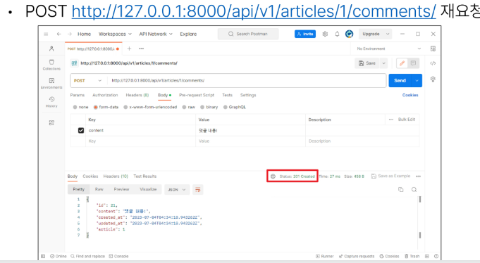

## DELETE & PUT
- 단일 댓글 삭제 및 수정을 위한 view 함수 작성

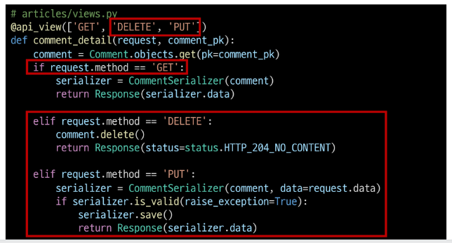
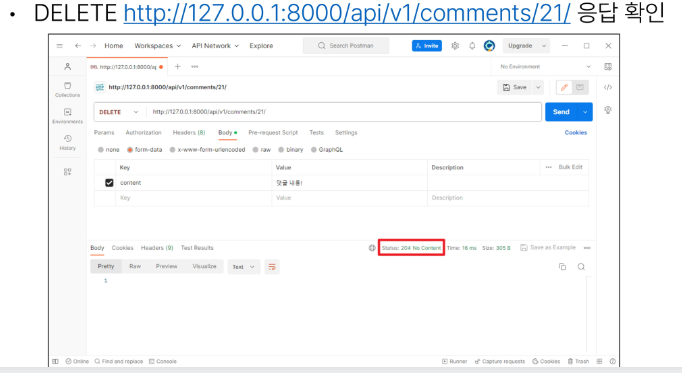
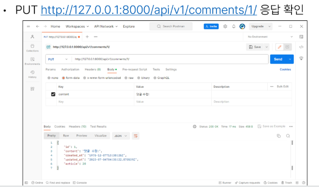

## 응답 데이터 재구성
댓글 조회 시 게시글 출력 내역 변경
- 댓글 조회시 게시글 번호만 제공해주는 것이 아닌 '게시글의 제목'까지 제공하기

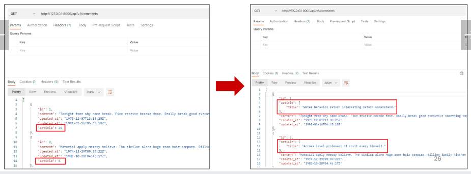

- 필요한 데이터를 만들기 위한 Serializer는 내부에서 추가 선언 가능
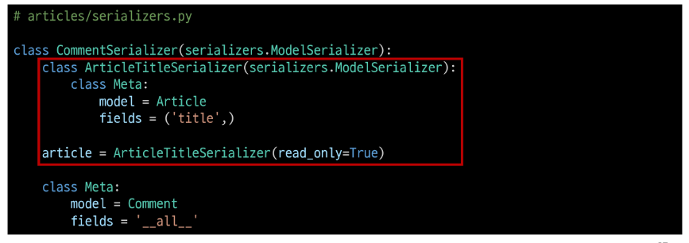

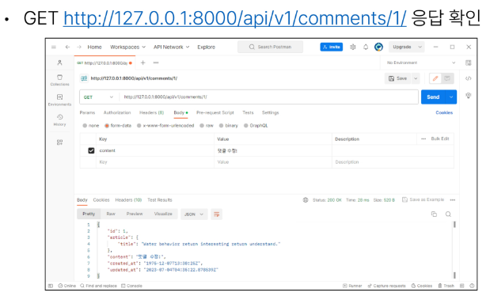

# 역참조 데이터 구성
Article -> Comment 간 역참조 관계를 활용한 JSON 데이터 재구성
- 아래 2가지 사항에 대한 데이터 재구성하기
1. 단일 게시글 조회 시 **해당 게시글에 작성된 댓글 목록 데이터**도 함께 붙여서 응답 
2. 단일 게시글 조회 시 **해당 게시글에 작성된 댓글 개수 데이터**도 함게 붙여서 응답

### 1. 단일 게시글 + 댓글 목록
Nested relationships
- 모델 관계 상으로는 참조하는 대상은 참조되는 대상의 표현에 포함되거나 중첩될 수 있음
- 이러한 중첩된 관계는 serializers를 필드로 사용하여 표현 가능

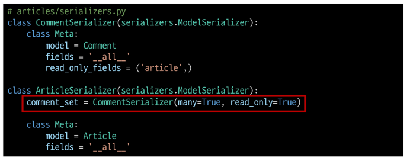
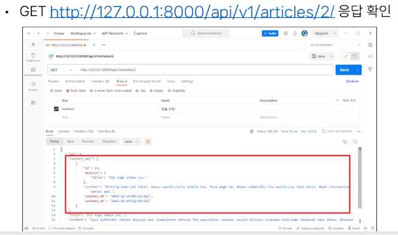

### 2. 단일 게시글 + 댓글 개수
- 댓글 개수에 해당하는 새로운 필드 생성

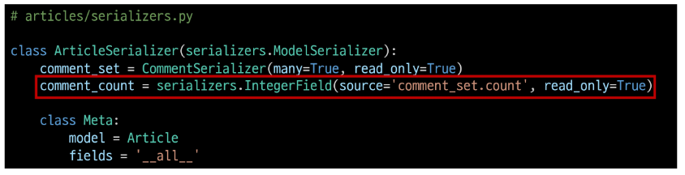

- **source**
    - 필드를 채우는 데 사용할 속성의 이름
    - 점 표기법(dotted notaiton)을 사요하여 속성을 탐색할 수 있음

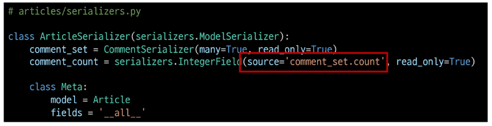
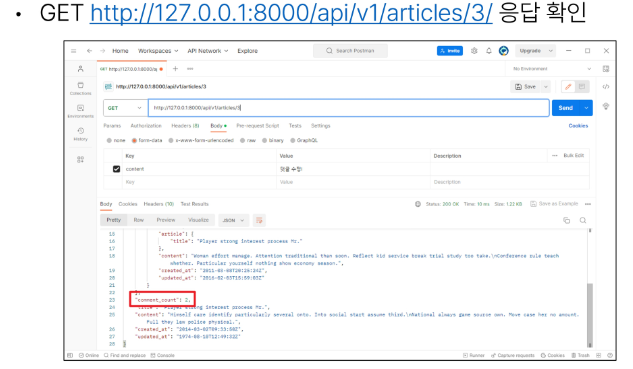

### [주의] 읽기전용 필드 지정 이슈
- 특정 필드를 override 혹은 추가한 경우 read_only_fields는 동작하지 않음
- 해당 필드의 read_only 키워드 인자로 작성해야함

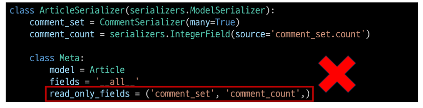

# API 문서화
### OpenAPI Specification : OAS
RESTful API를 설명하고 시각화하는 표준화된 방법
- API에 대한 세부사항을 기술하는 공식 표준

OAS 기반 API에 대한 문서를 생성하는데 도움을 주는 오픈 소스 프레임 워크

### drf-spectacular 라이브러리
- DRF 위한 OpenAPI 3.0 구조 생성을 도와주는 라이브러리

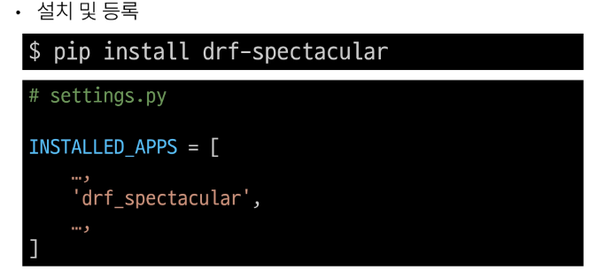

- 관련 설정 코드 입력 (Open API 스키마 자동 생성 코드)

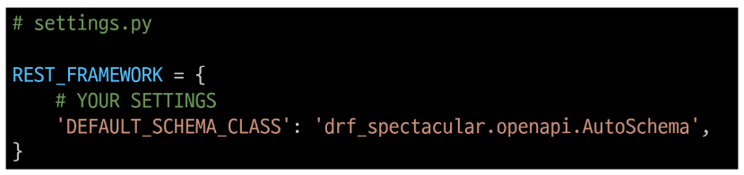

- swagger, redoc 페이지 제공을 위한 url 작성

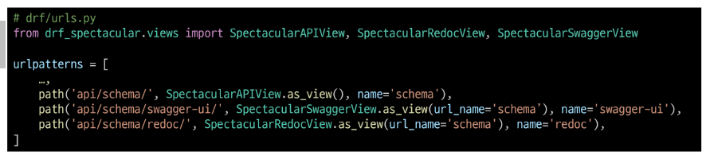

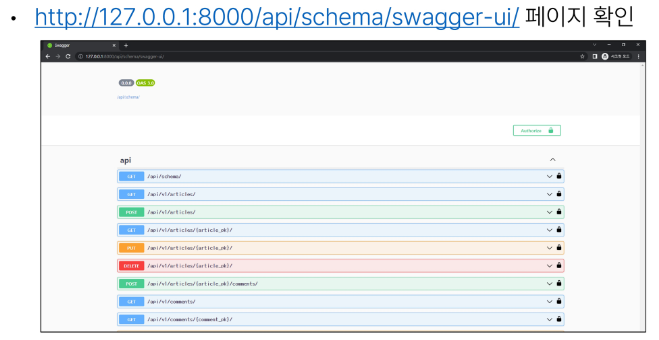

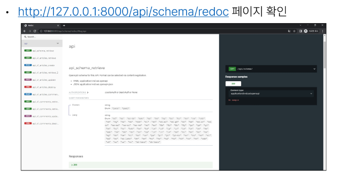

### OAS의 핵심 이점 - "설계 우선" 접근법
- API를 먼저 설계하고 명세를 작성한 후, 이를 기반으로 코드를 구현하는 방식
- API의 일관성을 유지하고, API 사용자는 더 쉽게 API를 이해하고 사용할 수 있음
- 또한, OAS를 사용하는 API가 어떻게 작동하는지를 시각적으로 보여주는 문서를 생성할 수 있으며, 이는 API를 이해하고 테스트를 하는 데 매우 유용
- 이런 목적으로 사용되는 도구가 **Swagger-UI** 또는 **ReDoc**

# 참고
## Django shortcuts functions
render() redirect() get_object_or_404() get_list_or_404()

get_object_or_404()
- 모델 managet objects에서 get()을 호출하지만, 해당 객체가 없을 땐 기존 DoseNotExist 예외 대신 **Http404를 raise**함

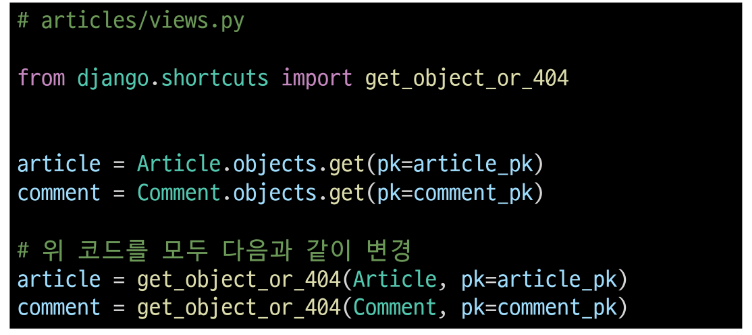

get_list_or_404()
- 모델 managet objects에서 filer()의 결과를 반환하고, 해당 객체 목록이 없을 땐  **Http404를 raise**함

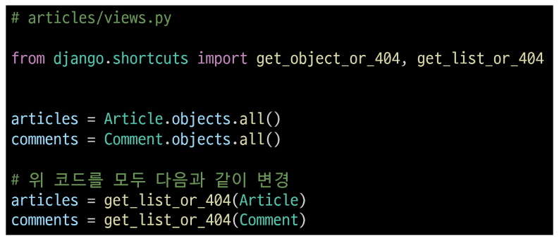

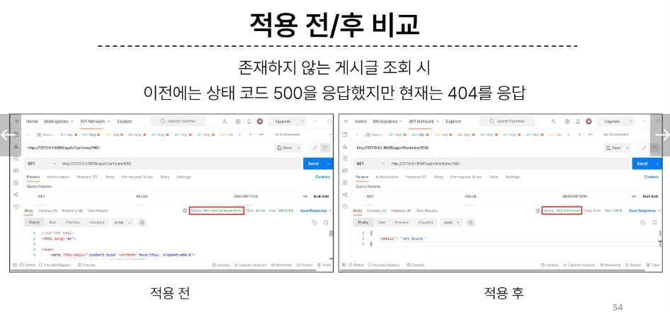

왜 사용해야 할까?
클라이언트에서 '서버에 오류가 발생하여 요청을 수행할 수 없다(500)'라는 원인이 정확하지 않은 에러를 제공하기 보다는, 적절한 예외처리를 통해 클라이언트에게 보다 정확한 에러 현환을 전달하는 것도 매웆 ㅜㅇ요한 개발 요소 중 하나이기 때문