# 01. Introduction of HavaScript
# History of JavaScript
## 웹 브라우저와 JavaSript
  
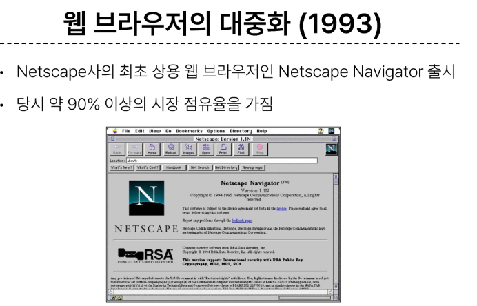  
  
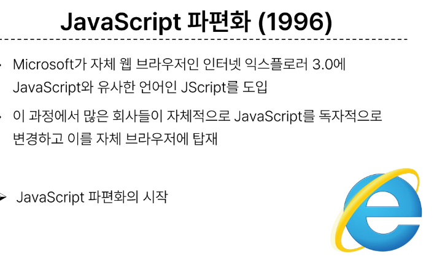  
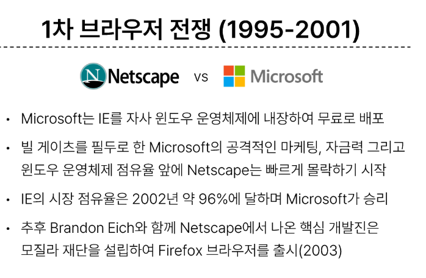  
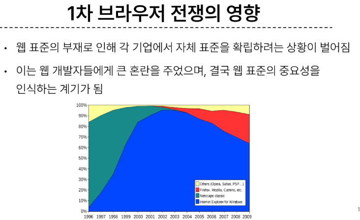  
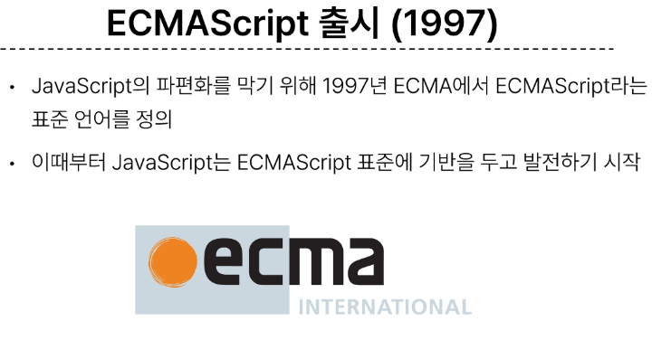  
  
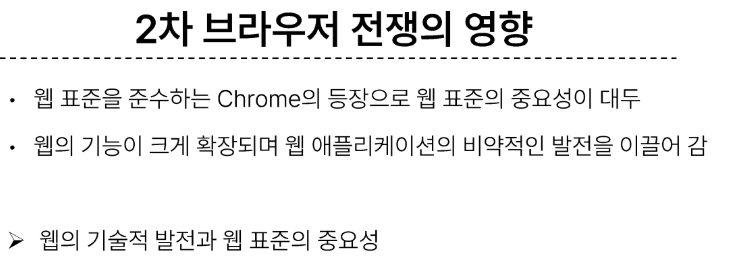  

## ECMAScript
Ecma Internatinal(정보와 통신 시스템을 위한 국제적 표준화 기준)이 정의하고 있는 표준화된 스크립트 프로그래밍 언어 명세
- 스크립트 언어가 준수해야하는 규칙, 세부사항 등을 제공
- 맞춤법

**ECMAScript와 JavaScript**
- JavaScript는 ECMAScript 표준을 구현한 구체적인 프로그래밍 언어
- ECMAScript의 명세를 기반으로 하여 웹 브라우저나 Node.jd와 같은 환경 에서 실행됨

- ECMAScript는 JavaScript의 표준이며, JavaScript는 ECMAScript 표준을 따르는 구체적인 프로그래밍 언어
- ECMAScript는 언어의 핵심을 정의하고, JavaScript는 ECMAScript 표준을 따라 구현된 언어로 사용됨


**ECMAScript의 역사**  
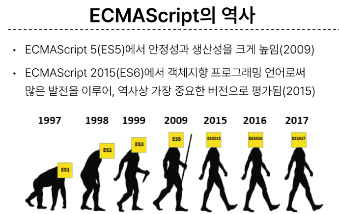  
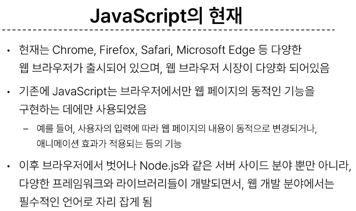

# JavaScript and DOM
## DOM
웹 브라우저에서의 JavaScript : 웹 페이지의 동적인 기능을 구현

JavaScript 실행 환경 종류  

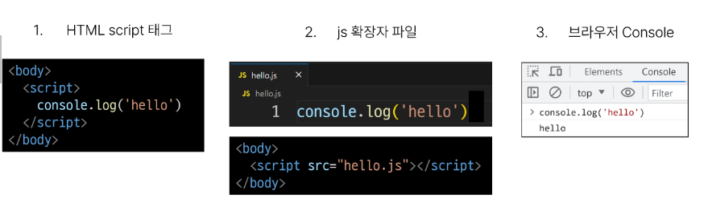
+ V8(node.js)

### DOM : The Documnet Object Model
웹 페이지(Documnet)를 구조화된 객체로 제공하여 프그래밍 언어가 페이지 구조에 접근할 수 있는 방법을 제공
- 조작하려면 요소를 선택할 수 있어야 한다..! 그래서 객체를 제공
- 문서 구조, 스타일, 내용 등을 변경할 수 있도록 함

### DOM 특징
- Dom에서 모든 요소, 속성, 텍스트는 하나의 객체
- 모두 documnet 객체의 자식으로 구성됨

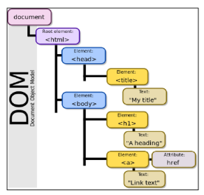

### DOM tree
브라우저는 HTLM 문서를 해석하여 DOM tree 라는 갹채 트리로 구조화 
- 객체 간 상속 구조가 존재

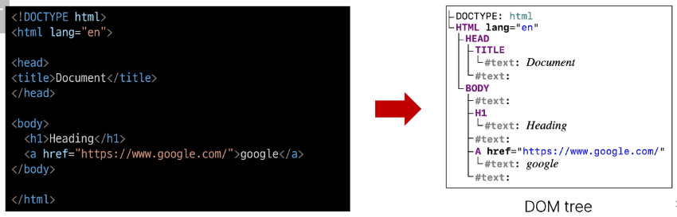

브라우저가 웹 페이지를 불러오는 과정
- 웹 페이지는 웹 브라우저를 통해 해석되어 웹 브라우저 화면에 나타남

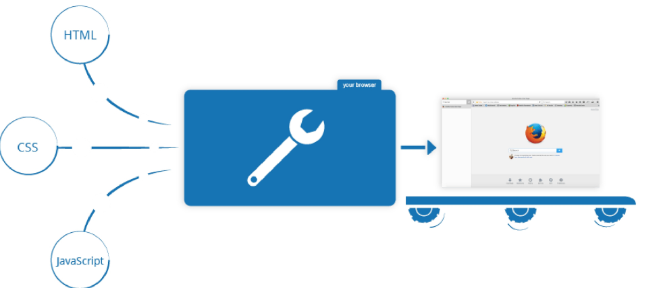

### DOM 핵심
**문서의 요소들을 객체로 제공**하여 다른 프로그래밍 언어에서 **접근**하고 **조작**할 수 있는 방법을 제공하는 APi

## document 객체
- 웹페이지 객체
- DOM Tree의 진입점
- 페이지를 구성하는 모든 객체 요소를 포함
- 가장 최상위 부모 노드

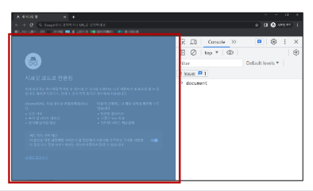

### document 객체 예시
- HTML의 <'title'> 변경하기

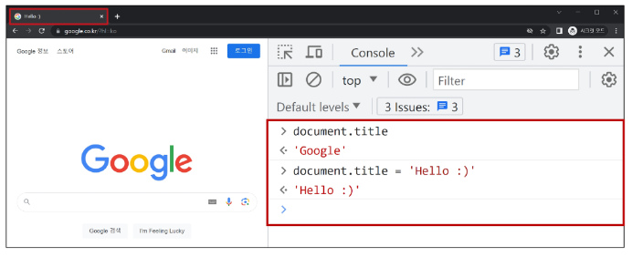

# DOM 선택
**DOM 조작 시 기억해야 할 것**   
웹페이지를 동적으로 만들기 == 웹페이지를 조작하기  

조작순서
1. 조작하고자 하는 요소를 **선택** 또는 탐색
2. 선택된 요소의 콘텐츠 또는 속성을 **조작**

## 선택 메서드
### documnet.querySelector(selector) 
제공한 선택자와 일치하는 element 한 개 선택 : 요소 한 개 선택
- 제공한 CSS slector 를 만족하는 첫 번재 element 객체를 반환(없다면 null 반환)

### document.querySelectorAll(selector) 
제공한 선택자와 일치하는 여러 elemnet를 선택 : 요소 여러 개 선택
- 제공한 CSS selector를 만족하는 NodeList를 반환

DOM 선택 실습  
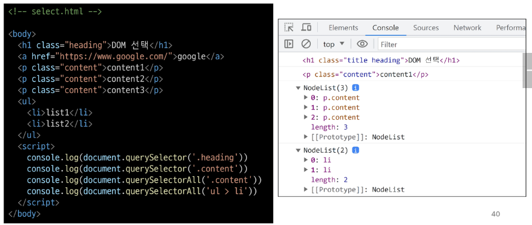

# DOM 조작
## 속성(attribute) 조작
1. 클래스 속성 조작
2. 일반 속성 조작

### 클래스 속성 조작
'classList' property
- 요소의 클래스 목록을 DOMTokenList(유사 배열) 형태로 반환

### classList 메서드
element.classList.**add()**
- 지정한 클래스 값을 추가

element.classList.**reomve()**
- 지정한 클래스 값을 제거

element.classList.**toggle()**
- 클래스가 존재한다면 제거하고 false를 반환 (존재하지 않으면 클래스를 추가하고 true 반환)

### 클래스 속성 조작 실습
add()와 remove 메서드를 사용해 지정한 클래스 값을 추가 혹은 제거

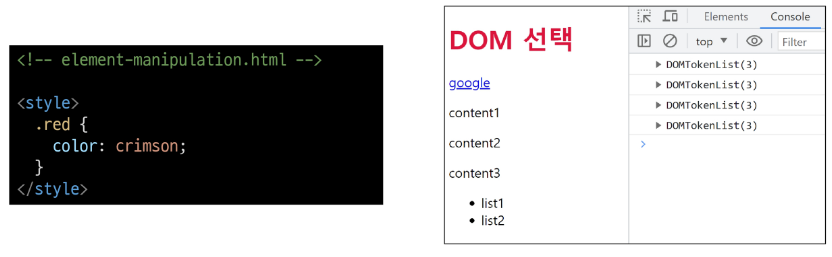  
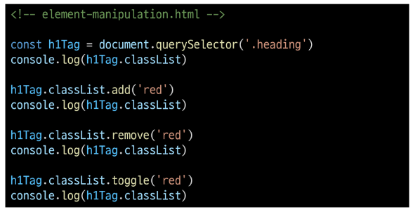  

### 속성 조작 메서드
Element.**getAttribute(name)**
- 해당 요소에 지정된 값을 반환 (조회)

Element.**setAttribute(name, value)**
- 지정된 요소의 속성 값을 설정
- 속성이 이미 있으면 기존 값을 갱신 (그렇지 않으면 지정된 이름과 값으로 새 속성이 추가)

Element.**removeAttribute(name)**
- 요소에 지정된 이름을 가진 속성 제거

### 속성 조작 실습
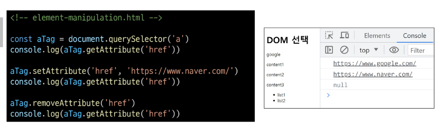

## HTMl 콘텐츠 조작
'textContent' property
- 요소의 텍스트 콘텐츠를 표현 
```html
<p>lorem</p>
```

### HTML 콘텐츠 조작 실습
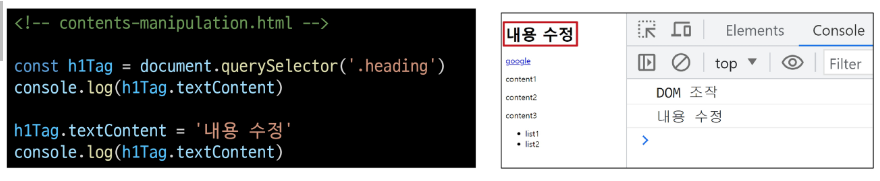

## DOM 요소 조작
document.**createElement(tagName)**
- 작성한 tagName의 HTML 요소를 생성하여 반환

document.**appendChild()**
- 한 Node를 특정 부모 Node의 자식 NodeList 중 마지막 자식으로 삽입
- 추가된 Node 객체를 반환
 
document.**removeChild()**
- DOM이서 자식 Node를 제서
- 제거된 Node를 반환

### DOM 요소 조작 실습
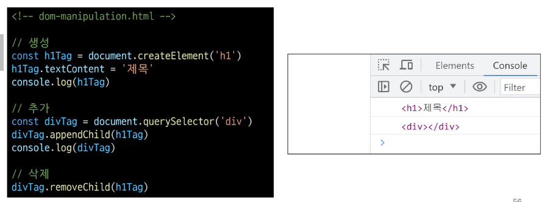

## style 조작
'style' property
- 해당 요소의 모든 style 속성 목록을 포함하는 속성

### style 조작 실습
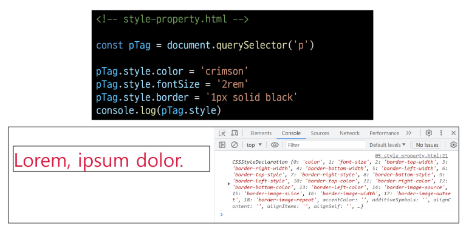

# 참고
### Node
- DOM의 기본 구성 단위
- DOM 트리의 각 부분은 Node라는 객체로 표현됨
    - Document Node -> HTML 문서 전체를 나타내는 노드
    - Element Node -> HTML 요소를 나타내는 노드 ex) <p>
    - Text Node -> HTML 텍스트, Element Node 내의 텍스트 컨텐츠를 나타냄
    - Attrobute Node -> HTML 요소의 속성을 나타내는 노드

### NodeList
- DOM 메서드를 사용해 선택한 Node의 목록
- 배열과 유사한 구조를 가짐
- Index로만 각 항목에 접근 가능
- 다양한 배열 메서드 사용 가능
- querySelectorAll()에 의해 반환되는 NodeList는 DOM의 변경 사항을 실시간으로 반영하지 않음

### Element
- Node의 하위 유형
- Element는 DOM 트리에서 HTML 요소를 나타내는 특별한 유형의 Node
- 예를 들어, <p>, <div>, <span>, <body> 등의 HTML 태그들이 Elemnet 노드를 생성
- Node의 속성과 메서드를 모두 가지고 있으며 추가적으로 요소 특화된 기능 (예: classNAme, innerHTML, id 등)을 가지고 있음

- 모든 Element는 Node이지만, 모든 Node가 Element인 것은 아님

### DOM 속성 확인 Tip
- 개발자 도구 - Elements - Properties
- 해당 요소의 모든 DOM 속성 확인 가능

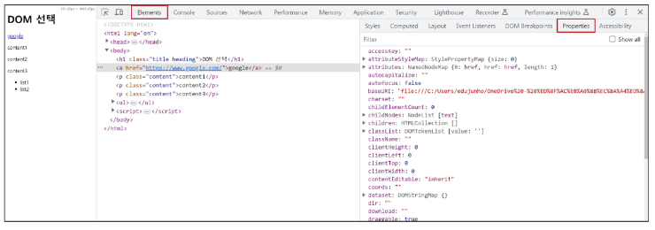

### Parsing (구문 분석, 해석)
브라우저가 문자열을 해석하여 DOM Tree로 만드는 과정

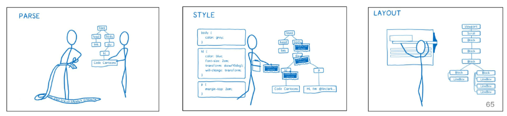

자바스크립트 비동기적 ...