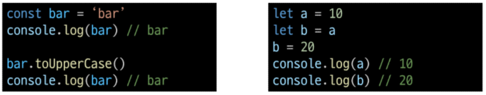
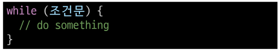
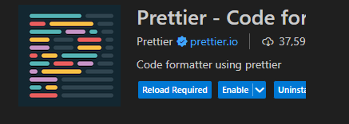

# 02.Basic syntax of JavaScripy

# 변수

### 식별자(변수명) 작성 규칙

- 반드시 문자, 달러($) 또는 밑줄(\_)로 시작
- 대소문자를 구분
- 예약어 사용 불가 : for, if, function
- 카멜 케이스(camelCase)
  - 변수, 객체, 함수에 사용
- 파스칼 케이스(PascalCase)
  - 클래스, 생성자에 사용
- 대문자 스네이크 케이스(SANKE_CASE)
  - 상수(constants)에 사용

### 변수 선언 키워드

1. let

- 블록 스코프(block scope)를 갖는 지역 변수를 선언
- 재할당 가능
- 재선언 불가능
- ES5에서 추가

2. const

- 블록 스코프를 갖는 지역 변수를 선언
- 재할당 불가능
- ES6에서 추가

3. var

**블록 스코프(block scope)**

- if, for, 함수 등의 '중괄호({})내부'를 가리킴
- 블록 스코프를 가지는 변수는 블록 바깥에서 접근 불가능
- 자바스크립트는 중괄호로 영역을 구분

변수 선언 키워드 정리

- 기본적으로 const 사용을 권장
- 재할당이 필요한 변수는 let으로 변경해서 사용

# 데이터 타입

### 원시자료형(Primitive type)

- Number(정수+실수), String(텍스트), Boolean(참/거짓), undefined(값이 할당되지 않은 상태), null(값이 없음)
- 변수에 값이 직접 저장되는 자료형(불변, 값이 복사)
- 변수에 할당될 때 값이 복사됨
  - **변수 간에 서로 영향을 미치지 않음**

### 참조자료형(Reference tyoe)

- Objects(object(key-value 형식, 속성+메서드), Array(순차적 데이터 저장), Function)
- 객체의 주소가 저장되는 자료형(가변, 주소가 복사)
- 객체를 생성하면 객체의 메모리 주소를 변수에 할당
- **변수 간에 서로 영향을 미침**

## 원시 자료형

### Number : 정수 또는 실수형 숫자를 표현하는 자료형

Nan : Not a Number

### String : 텍스트 데이터를 표현하는 자료형

- '+' 연산자를 사용해 문자열끼리 결합
- 곱셈, 나눗셈, 뺄셈 불가능

+)
5 + 7 = 12  
5 + "Hello" = "5Hello"
5 + "13" = "513"
"A" + "BC" = "ABC
5 + Number("13") = 18

### Template literals (템플릿 리터럴)

- 내장된 표현식을 허용하는 문자열 작성방식
- Backtick(``)을 이용하며, 여러 줄에 걸쳐 문자열을 정의할 수도 있고 JavaScripy의 변수를 문자열 안에 바로연결 할 수 있음
- 표현식을 '\$'와 중괄호(${expreesion})로 표기
- ES6+ 부터 지원

### null

변수의 값이 없음을 의도적으로 표현할 때 사용
개발자 의도적으로 값X

### undefined

변수 선언 이후 직접 값을 할당하지 않으면 자동으로 할당됨  
의도적이지 X

### '값이 없음'에 대한 표현이 null과 undefined 2가지인 이유

- 둘 다 원시타입이다!
- JavaScript의 설계 실수
- null이 원시 자료형임에도 불구하고 object로 출력되는 이유는 javaScript 설계 당시의 버그를 해결하지 않은 것
- 해결하지 못하는 이유는 이미 null 타입에 의존성을 띄고 있는 수 많은 프로그램들이 망가질 수 있기 때문 (하위 호환 유지)

### Boolean : true / false

조건문 또는 반복문에서 Boolean이 아닌 데이터 타입은 "자동 형변환 규칙"에 따라 true 또는 false로 변환됨

### 자동 형변환

| 데이터 타입 |   false    |       true       |
| :---------: | :--------: | :--------------: |
|  undefiend  | 항상 false |        X         |
|    null     | 항상 fals  |        X         |
|   Number    | 0, -0, NaN | 나머지 모든 경우 |
|   String    | 빈 문자열  | 나머지 모든 경우 |

# 연산자

### 할당 연산자

- 오른쪽에 잇는 피연산자의 평가 결과를 왼쪽 피연산자에 할당하는 연산자
- 단축 연산자 지원

### 증가 & 감소 연산자

증가 연산자(++)

- 피연산자를 증가(1을 더함)시키고 연산자의 위치에 따라 증가하기 전이나 후의 값을 반환

감소 연산자 (--)

- 피연산자를 감소(1을 뺌)시키고 연산자의 위치에 따라 감소하기 전이나 후의 값을 반환
- += 또는 -=와 같이 더 명시적인 표현으로 작성하는 것을 권장

### 비교 연산자

- 피연산자들(숫자, 문자, Boolean 등)을 비교하고 결과 값을 boolean으로 반환하는 연산자

### 동등 연산자(==)

- 두 피연산자가 같은 값으로 평가되는지 비교 후 boolean 값을 반환
- '암묵적 타입 변환' 통해 타입을 일치시킨 후 같은 값인지 비교
  - 자바스크립트 스스로 타입을 변환하여 비교
- 두 피연산자가 모두 객체일 경우 메모리의 같은 객체를 바라보는지 판별

### 일치 연산자(===) ⭐

- 두 피연산자의 값과 타입이 모두 같은 경우 true를 반환
- 같은 객체를 가리키거나, 같은 타입이면서 같은 값인지를 비교
- **엄격한 비교**가 이뤄지며 암묵적 타입 변환이 발생하지 않음
- 특수한 경우를 제외하고는 동등 연산자가 아닌 **일치 연산자 사용 권장**
- null과 undefined : 일치 연산자에서는 false, 동등 연산자에서는 true

### 논리 연산자

- and 연산 : &&
- or 연산 : ||
- not 연산 : !
- 단죽 평가 지원

# 조건문

### if

조건 표현식의 결과값을 boolean 타입으로 변환 후 참/거짓을 판단

### 조건 (삼항) 연산자

- 세 개의 피연산자를 받는 유잉ㄹ한 연산자
- 앞에서부터 조건문, 물음표(?), 조건문이 참일 경우 실행할 표현식, 콜론(;), 조건문이 거짓일 경우 실행할 표현식이 배치

# 반복문

### while

조건문이 참이면 문장을 계속해서 수행

### for

특정한 조건이 거짓으로 판별될 떄까지 반복

**for 동작 원리**⭐

### for ... in

객체의 열거 가능한 속성(property)에 대해 반복

- key에 대해 반복

### for ... of

반복 가능한 객체(베열, 문자열 등)에 대해 반복

### 배열 반복과 for ... in

- 배열의 인덱스는 정수 이름을 가진 열거 가능한 속성(순서를 가지고 있음)
- for ... in은 정수가 아닌 이름과 속성을 포함하여 **열거 가능한 모든 속성을 반환**, 순서 x
- 내부적으로 for.. in은 배열의 반복자 대신 속성 열거를 사용하기 때믄에 **특정 순서에 따라 인덱스를 반환하는 것을 보장할 수 없음**
- object를 제외한 모든 반복하는 객페

- 인덱스의 순서가 중요한 **배열에서는 사용하지 않음**
- 배열에서는 **for 반복, for ... of 반복을 사용**

### for ... in과 for ... of

- for of에서 객체는 아예 돌아가지도 않음, 반복 간읗나 개체가 아니기 때문!

### 반복문 사용 시 const 사용 여부

for문

- for (let i = 0; i < arr.length; i ++){...}의 경우에는 최초 정의한 i를 "재할당"하면서 사용하기 때문에 **const를 사용하면 에러 발생**

for...in , for... of

- 재할당이 아니라, 매 반복마다 다른 속성 이름이 변수에 지정되는 것이므로 **const를 사용해도 에러가 발생하지 않음**
- 단, const 특징에 따라 블록 내부에서 변수를 수정할 수 없음

### 반복문 총합

|   키워드   |           연관 키워드           |   스코프    |
| :--------: | :-----------------------------: | :---------: |
|   while    |         break, continue         | 블록 스코프 |
|    for     |         break, continue         | 블록 스코프 |
| for ... in |  object 순회, break, continue   | 블록 스코프 |
| for ... of | literable 순회, break, continue | 블록 스코프 |

# 참고

### 세미콜론 (semicolon)

- 자바스크립트는 세미콜론을 선택적으로 사용 가능
- 새미콜론이 없으면 ASI에 의해 자동적으로 세미콜론이 삽입도미
  - ASI : 자동 세미콜론 삽입 규칙
- JAVAScript를 만든 Brendan Elch 또한 세미콜론 작성을 반대

### 변수 선언 키워드 - "var"

- ES5 이전에 변수 선언에 사용했던 키워드
- 재할당 가능 & 재선언 가능
- "호이스팅"되는 특성으로 인해 예기치 못한 문제 발생 가능
  - 따라서 ES6 이후부터는 var 대신 const와 let 사용하는 것을 권장
- 함수 스코프(function scope)를 가짐
- 변수 선언시 var, const, let 키워드 중 하나를 사용하지 않으면 자동으로 var 로 선언됨

### 함수 스코프 (function scope)

- 함수의 중괄호 내부를 가리킴
- 함수 스코프를 가지는 변수는 함수 바깥에서 접근 불가능

### 호이스팅 (hoisting)

- 변수를 선언 이전에 참조할 수 있는 현상
- 변수 선언 이전의 위치에 접근 시 undefined를 반환
- 선언만 끌어 올림..

- JavaScript에서 변수들은 실제 실행시에 코드의 최상단으로 끌어 올려지게 되며(hoisted) 이러한 이유 때문에 var로 선언된 변수는 선언 시에 undefined로 값이 초기화되는 과정이 동시에 발생

### NaN을 반환하는 경우

1. 숫자로서 읽을 수 없음(Number(undefined))
2. 결과가 허수인 수학 계산식 (Math.sqrt(-1))
3. 피연산자가 NaN (7\*\*NaN)
4. 정의할 수 없는 계산식 (0\*Infinity)
5. 문자열을 포함하면서 덧셈이 아닌 계산식('가'/3)

- ) 조금 더 간편한 JS 생활

1. extension 설치
   
   

2. CTRL + , => setting 가서 설정
   
   
   
   
