# 04. Controlling event

# 이벤트

웹에서의 이벤트

- 버튼을 클릭했을 때 팝업 창이 출력되는 것
- 마우스 커서의 위치에 따라 드래그 앤 드롭하는 것
- 사용자의 키보드 입력 값에 따라 새로운 요소를 생성하는 것

> 일상에서의 이벤트처럼 웹에서도 **이벤트를 통해 특정 동작을 수행**한다.

## evnet

무언가 일어났다는 신호, 사건

- 모든 DOM 요소는 이러한 event를 만들어냄

### evnet object

- DOM에서 이벤트가 발생했을 때 생성되는 개체
- 이벤트 종류
  - mouse(클릭, 올리거나, 스크롤...), input, keyboard, touch

**DOM 요소는 event를 받고 받은 event를 '처리'(evnent hanler:이벤트처리기) 할 수 있음**

## event handler

이벤트가 발생했을 때 실행되는 함수

- 사용자의 해동에 어떻게 반응할지를 JavaScript 코드로 표현한 것
- 이벤트를 받아서 처리하는 함수

### .addEventListener()

대표적인 이벤트 핸들러 중 하나

- 특정 이벤트를 DOM 요소가 수신할 때마다 콜백 함수를 호출
- dom 객체dp 이 요소를 붙인다!

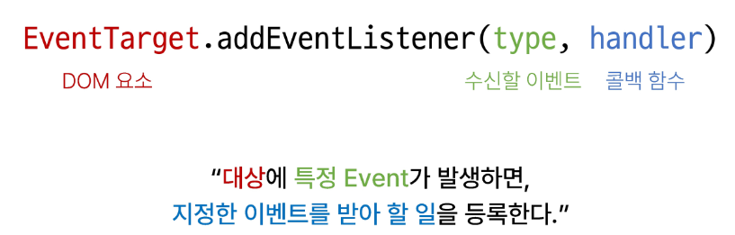

**.addEventListener(type, handler)**

type

- 수신할 이벤트 이름
- 문자열로 작성 (ex. 'click')
- 정해진 이름이 존재! 맞춰서 작성해주어야 함

handler

- 발생한 이벤트 객체를 수신하는 콜백 함수
- 콜백 함수는 발생한 Event object를 유일한 매개 변수로 받음

### addEventListener 활용

- 버튼을 클릭하면 버튼 요소 출력하기
- 버튼에 이벤트 처리기를 부착하여 클릭 이벤트가 발생하면 이벤트가 발생한 버튼 정보를 출력

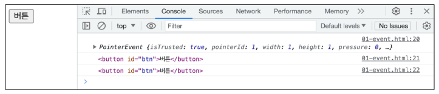

- 요소에 addEventListener를 부착하게 되면 내부의 this 값은 대상 요소를 가리키게 됨 (evnet 객체의 currentTarget 속성값과 동일)

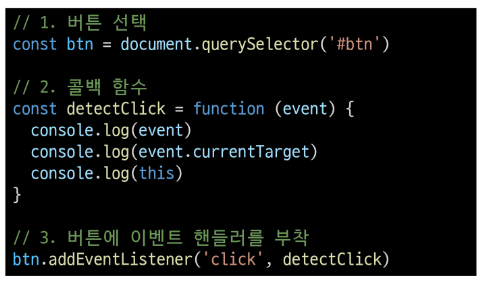

### addEventListener 특징

- 발생한 이벤트를 나타내는 Event 객체를 유일한 매개변수로 받음
- 아무것도 반환하지 않음

## 버블링

핸들러는 form 요소에 할당되어 있지만 div나 p 요소 같은 중첩된 요소를 클릭해도 동ㄱ작함

- 왜 div나 p를 클릭했는데 form에 할당된 핸들러가 동작할까?

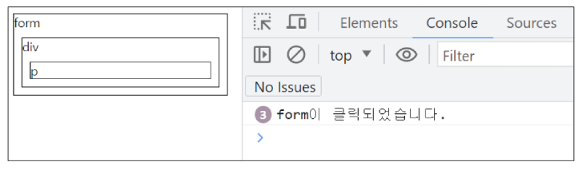  
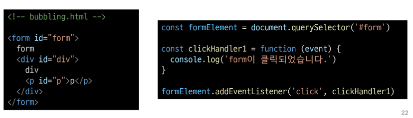

### 버블링 (Bubbling)

- 한 요소에 이벤트가 발생하면, 이 요소에 할당된 핸들러가 동작하고, 이어서 부모요소의 핸들러가 동작하는 현상
- 가장 최상단의 조상 요소(document)를 만날 때갖 이 과정이 반복되며넛 요소 각각에 할당된 핸들러가 동작
- 이벤트가 제일 깊은 곳에 있는 요소에서 시작해 부모 요소를 거슬러 올라가면 발생하는 것이 마치 물속 거픔과 닮았기 때문
- 캡쳐링을 통해서 target을 찾고 버블링을 통해 실행

### 버블링 예시

- 가장 안쪽의 
 요소를 클릭하면 p -> div -> form 순서로 3개의 이벤트 핸들러가 동작

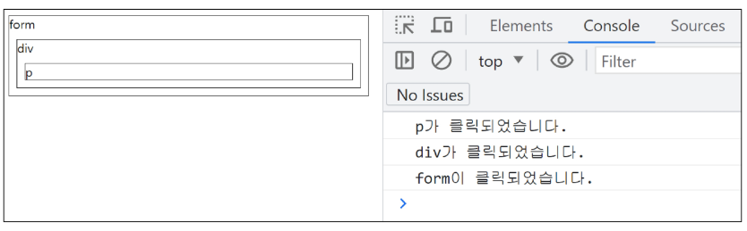
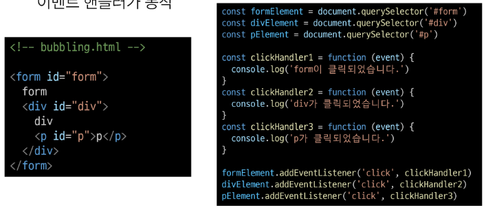

**이벤트가 정확히 어디서 발생했는지 접근할 수 있는 방법**

- event **.target**
- event **.currenttarget**

### target & currentTarget 속성

target 속성

- 이벤트가 발생한 가장 안쪽의 요소(target)를 참조하는 속성
- 실제 이벤트가 시작된 target 요소
- 버블링이 진행되어도 변하지 않음

currentTarget 속성

- '현재' 요소
- 항상 이벤트 핸들러가 연결된 요소만을 참조하는 속성
- this와 같음

### target & currentTarget 예시

- 세 요소 중 가장 최상위 요소인 outerouter 요소에만 이벤트 핸들러가 부착
- 각 요소를 클릭했을 때 event의 target과 currentTarget의 차이 비교

---

- target : 실제 이벤트가 발생하는 요소를 가리팀
- currentTarget : 핸들러가 연결된 outerouter 요소만을 가리킴!

---

- 핸들러는 outerouter에 하나밖에 없디만, 이 핸들러에서 outerouter의 내부 모든 하위 요소에서 발생하는 클릭 이벤트를 잡아내고 있음
- 클릭 이벤트가 어디서 발생했든 상관없이 outerouter까지 이벤트가 버블링 되어 핸들러를 실행시키기 때문

[Alt text](images/image-7.png)
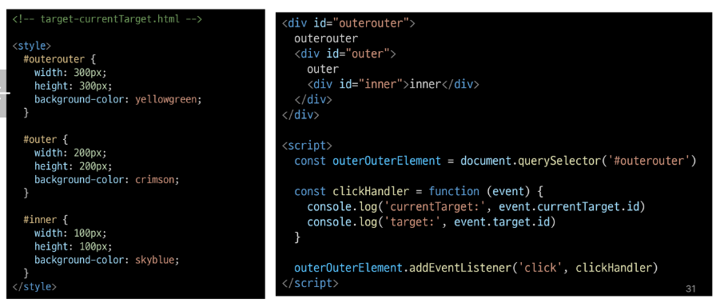

# evnent handler 활용

1. 버튼을 클릭하면 숫자를 1씩 증가해서 출력하기
2. 사용자의 입력 값을 실시간으로 출력하기
3. 사용자의 입력 값을 실시간으로 출력  
   '+' 버튼을 클릭하면 출력한 값의 CSS 스타일을 변경하기
4. todo 프로그램 구현
5. 로또 번호 생성기 구현

6. click 이벤트 실습

- 버튼을 클릭하면 숫자를 1씩 증가

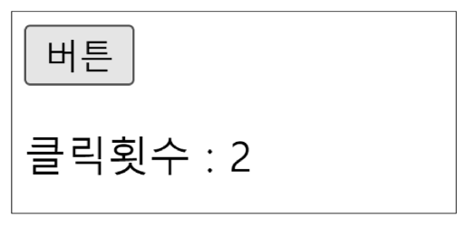
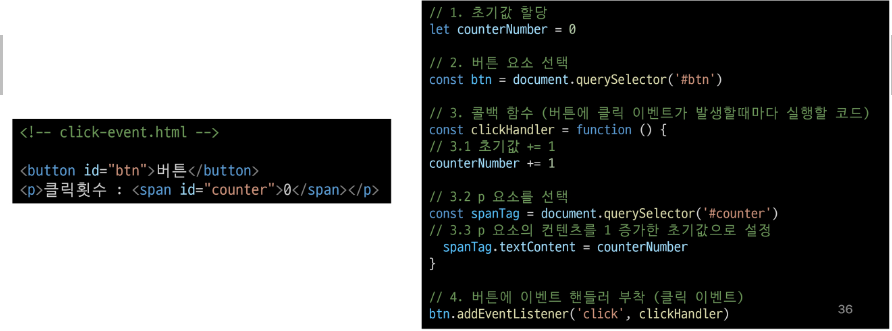

2. input 이벤트 실습

- 사용자의 입력 값을 실시간으로 출력하기

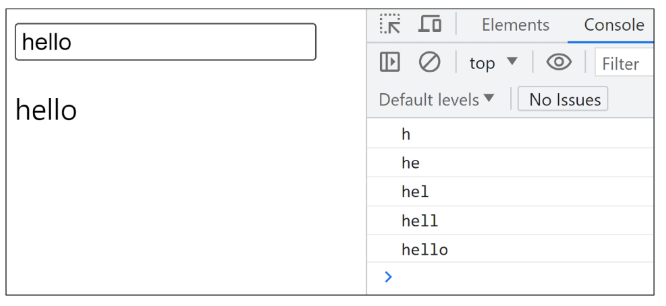

### currentTarget 주의사항

- console.log()로 event 객체를 출력할 경우 currentTarget 키의 값은 null을 가짐
- currentTarget은 이벤트가 처리되는 동아에만 사용할 수 있기 때문
- 대신 console.log(eventTarget)을 사용하여 콘솔에서 확인 가능
  > currentTarget 이후의 속성 값들은 **target을 참고해서 사용하기**

3. click & input 이벤트 실습

- 시용자 입력 값을 실시간으로 출력 + 버튼을 클릭하면 출력한 값의 CSS 스타일을 변경하기

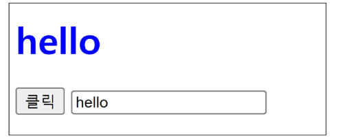
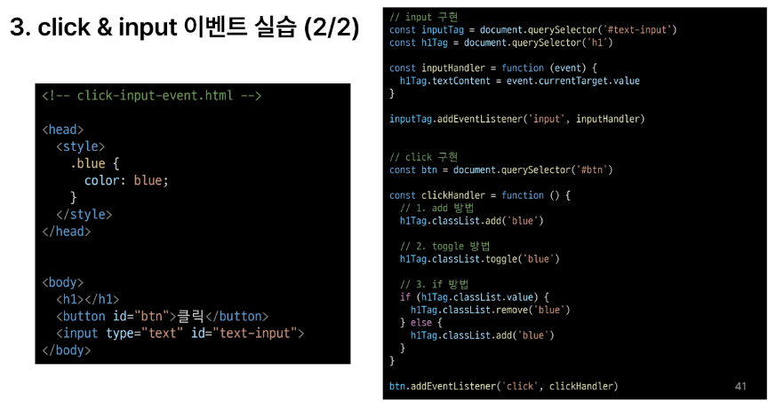

4. todo 실습

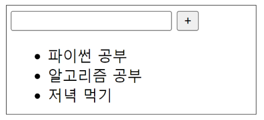
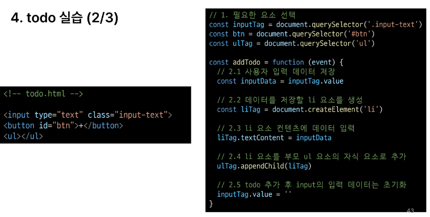

- todo 기능 추가
  - 1. 빈 문자열 입력 방지
  - 2. 입력이 없을 경우 경고 대화상자를 띄움

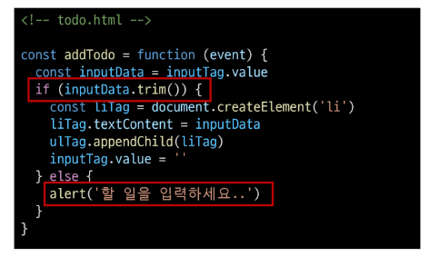

5. 로또 번호 생성기 실습

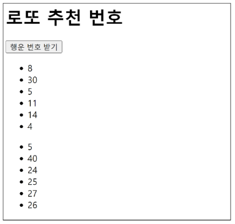
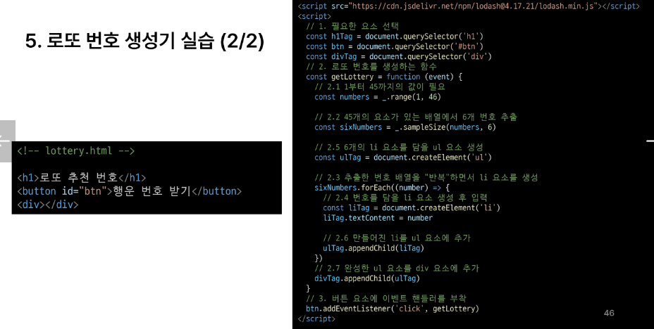

### lodash

- 모듈성, 성능 및 추가 기능을 제공하는 JavaScript 유틸리티 라이브러리
- array, object 등 자료구조를 다룰 때 사용하는 유용하고 간편한 함수들을 제공

## 이벤트 기본 동작 취소

### .preventDefault()

해당 이벤트에 대한 기본 동작을 실행하지 않도록 지정

- 이벤트 동작을 실행하지 않을 수 있게 하는 것이지 버블링 자체를 막지는 않음!

- 해당 태그?가 기본적으로 수행하는 기능을 제어할 수 있음!
- event.preventDefault();
  - form 제출 시 action 지정 값으로 submit되는 default 기능을 막아준다.
  - 이벤트를 실행하지만, 웹 브라우저는 이동하지 말라는 뜻

### 이벤트 동작 취소 실습

- copy 이벤트 동작 취소

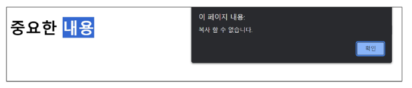
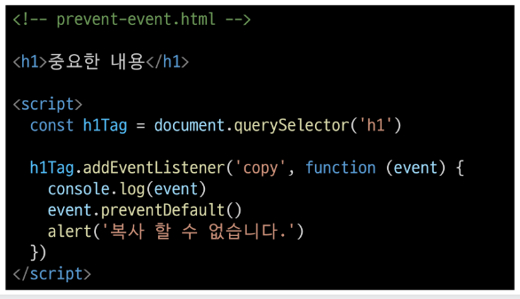

- form 제출 시 새로고침 동작 취소

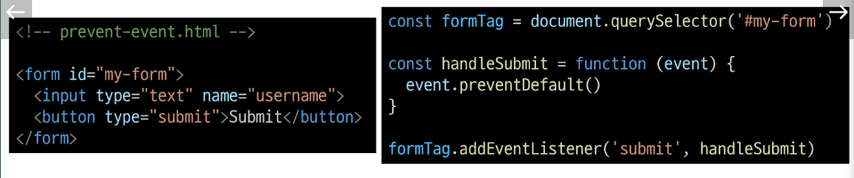

# 참고

### addEventListener에서의 화살표 함수 주의 사항

- 화살표 함수는 자신만의 this를 가지지 않기 때문에 자신을 포함하고 있는 함수의 this를 상속 받음

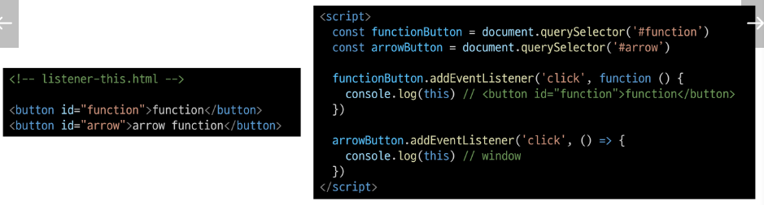
