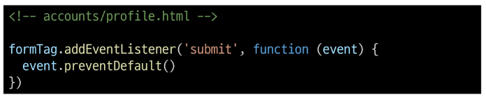

# 06. AJAX with Django

# AJAX와 서버

### AJAX : Asynchronous JavaScript + XML

JavaScript의 비동기 구조와 XML 객체를 활용해 비동기적으로 서버와 통신하여 웹페이지의 일부분만을 업데이트 하는 웹 개발 기술

### AJAX를 활용한 클라이언트 서버 간 동작

- 클라이언트 / 서버
- 이벤크 발생 -> XML 객체 생성 및 요청 -> Ajax 요청 처리 -> 응답 데이터 생성 -> JSON 데이터 응답 -> 응답 데이터를 활용해 DOM 조작 (웹 페이지의 일부분만을 다시 로딩)

- 버튼 하나를 위해서 전체 페이지를 다시 받고 있음

# AJAX with follow

사전 준비

1. M:N까지 진행한 Djnago 포르젝트 준비
2. 가상 환경 생성 및 활성화, 패키지 설치

### Ajax 적용

- 프로필 페이지에 axios CDN 작성

- form 요소 선택을 위해 id 속성 지정 및 선택
- action과 method 속성은 삭제(요청은 axios로 대체되기 때문)

- form 요소에 이벤트 핸들러 작성 및 submit 이벤트의 기본 동작 취소

- axios 요청 작성

1. url 작성할 user pk는 어떻게 작성해야 할까?
2. csrftoken은 어떻게 보내야 할까?
   [참고](https://axios-http.com/kr/docs/req_config)

- url에 작성할 user pk 가져오기 (HTML -> JavaScript)

### 'data-\*' 속성 [(참고)](https://developer.mozilla.org/ko/docs/Learn/HTML/Howto/Use_data_attributes)

사용자 지정 데이터 특성을 만들어 임의의 데이터를 HTML과 DOM사이에서 교환할 수 있는 방법

- 표준이 아닌 속성이나 DOM 조작을 지원하기 위해 HTML에서 공식적으로 제공하는 속성

- 요청 url 작성 마무리

- 문서상 hidden 타입으로 존재하는 csrf 데이터를 이제는 axios로 전송해야 함

- csrf값을 가진 input 요소를 직접 선택 후 axios에 작성하기

- 팔로우 버튼을 토글하기 위해서는 현재 팔로우가 상태인지 언팔로우 상태인지에 대한 상태에 확인이 필요
- Djnago의 view 함수에 팔로우 여부를 파악할 수 있는 변수를 추가로 생성해 JSON 타입으로 응답하기
- 팔로우 상태 여부를 JavaScript에게 전달할 데이터 작성
- 응답은 더이상 HTMl 문서가 아닌 JSON 데이터 응답
  - 문서 덩어리가 아닌 JSON 데이터 응답

- 팔로우 요청 후 Django 서버로 부터 받은 데이터 확인하기

- 응답 데이터 is_followed 에 따라 팔로우 버튼을 토글하기

- 클라이언트와 서버 간 XHR 객체가 주고 받는 것을 확인하기

- 팔로인 수와 팔로워 수 비동기적용
- 해당 요소를 선택할 수 있도록 span 태그와 id 속성 작성

- 각 span 태그를 선택

- Django view 함수에서 팔로워, 팔로잉 인원 수 연산을 진행하여 결과를 응답으로 전달

- 응답 데이터의 연산 결과를 각 태그의 인원수 값 변겨에 적용

# AJAX with likes

- Ajax 적용은 팔로우와 모두 동일
- 단, 팔로우와 달리 좋아요 버튼은 **한 페이지에 여러 개**가 존재

1. forEach()
2. querySelectorAll()

### Ajax 적용

  
  

