# 01. Introduction of Vue

# Front-end Development

## Client-side frameworks

Front-end Development

- 웹사이트와 웹 애플리케이션의 사용자 인터페이스(UI)와 사용자경험(UX)을 만들고 디자인하는 것
- HTML, CSS, JavaScripy 등을 활용하여 사용자가 직접 상호작용하는 부분을 개발

Client-side frameworks

- 클라리언트 측에서 UI와 상호작용을 개발하기 위해 사용되는 JavaScript 기반 프레임워크

### Client-side frameworks가 필요한 이유 - 1

웹에서 하는 일이 많아졌다.

- 단순히 무언가를 읽는 곳 -> 무언가를 하는 곳

---

- 사용자는 이제 웹에서 문서만을 읽는 것이 아닌 음악을 스트리밍하고, 영화를 보고, 원거리에 있는 사람들과 텍스트 및 영상 채팅을 통해 즉시 통신하고 있음
- 이처럼 현대적이고 복잡한 대화형을 웹 사이트를 **웹 애플리케이션(web applications)**이라 부름
- JAvaScript Client-side frameworks의 출현으로 매우 동적인 대화형 애플리케이션을 훨씬 더 쉽게 구축할 수 있게 됨

### Client-side frameworks가 필요한 이유 - 2

- 다루는 데이터가 많아졌다.

---

- 만약 친구가 이름을 변경했다면?
- 친구 목록, 타임라인, 스토리 등 친구 이름이 출력되는 모든 곳이 함께 변경되어야 함
- 애플리케이션의 기본 데이터를 안정적으로 추적하고 업데이트(렌더링, 추가, 삭제 등)하는 도구가 필요
- **애플리케이션의 상태를 변경할 때마다 일치하도로 UI를 업데이트헤야 한다는 것**

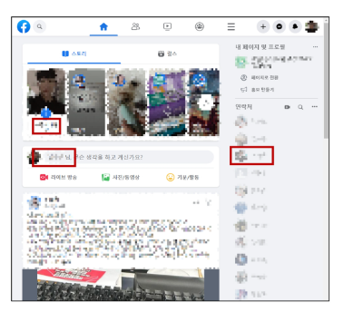

## SPA : Single Page Application

페이지 한 개로 구성된 웹 애플리케이션

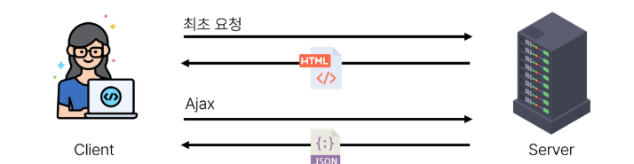

1. 서버로부터 필요한 모든 정적 HTML을 처음에 한번 가져옴
2. 브라우저가 페이지를 로드하면 Vue 프레임워크는 각 HTML 요소에 적절한 JavaScript 코드를 실행 (이벤트에 응답, 데이터 요청 후 UI 업데이트 등)
   - ex) 페이지 간 이동 시, 페이지 갱신에 필요한 데이터만을 JSON으로 전달받아 페이지를 일부 갱신
   - Google Maps, 인스타그램 등의 서비스에 갱신 시 새로고침이 없는 이유

### Single Page Application (SPA)

웹 애플리케이션의 초기 로딩 후 새로운 페이지 요청 없이 동적으로 화면ㅇ르 갱시하며 사용자와 상호자굥하는 웹 애플리케이션

- CSR 방식

### Client-side Rendering (CSR)

클라이언트에서화면을 렌더링 하는 방식

1. 브라우저는 페이지에 필요한 최소한의 HTML 페이지와 JavaScript를 다운로드
2. 그런 다음 JavaScript를 사용하여 DOM을 업데이트하고 페이지를 렌더링

- <-> SSR(Server-side-Redering) : 우리가 장고에서 그려나가던 방식
  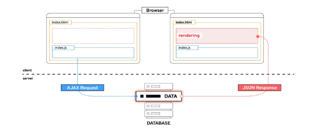

### Client-side Rendering 장점

1. 빠른 속도

- 페이지의 일부를 다시 렌더링할 수 잇으므로 동일한 웹사이트의 다른 페이지로 이동하는 것이 일반적으로 더 빠름
- 서버로 전송되는데이터 양을 최소화

2. 사용자 경험

- 새로고침이 발생하지 않아 네이티브 앱과 유사한 사용자 경험을 제공

3. Front-end와 Back-end의 명확한 분리

- Front-end는 UI 렌더링 및 사용사 상호 작용 처리를 담당 & Back-end는 데이터 및 API 제공을 담당
- 대규모 애플리케이션을 더 쉽게 개발하고 유지 관리 가능

### Client-side Rendering 단점

1. 초기 구동속도가 느림

- 전체 페이지를 보기 전에 약간의 지연을 느낄 수 있음
- JavaScript가 다운로드, 구문 분석 및 실행될 때까지 페이지가 완전히 렌더링 되지 않기 때문

2. SEO(검색 엔진 최전화)문제

- 페이지를 나중에 그려 나가는 것이기 대문에 검색에 잘 노출되지 않을 수 있음

# Vue

## What is Vue?

- 사용자 인터페이스를 구축하기 위한 JavaSeript 프레임워크
- 2023년 기준 최신 버전은 Vue 3

### Vue를 학습하는 이유

1. 쉬운 학습 곡선 및 간편한 문법

- 새로운 개발자들도 빠르게 학습할 수 있음

2. 반응성 시스템

- 데이터 변경에 따라 자동으로 화면이 업데이트되는 기능을 제공

3. 모듈화 및 유연한 구조

- 애플리케이션을 컴포넌트 조각으로 나눌 수 있음
- 코드의 재사용성을 높이고 유지보수를 용이하게 함

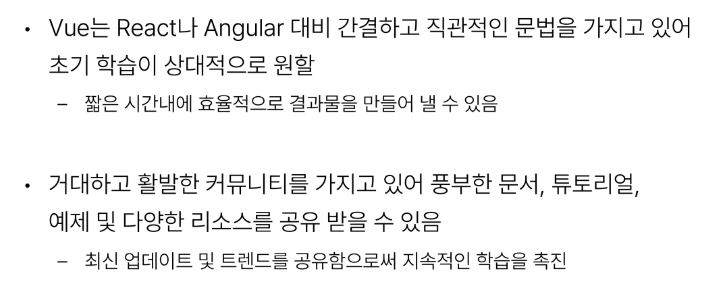

### Vuw의 2가지 핵심 기능

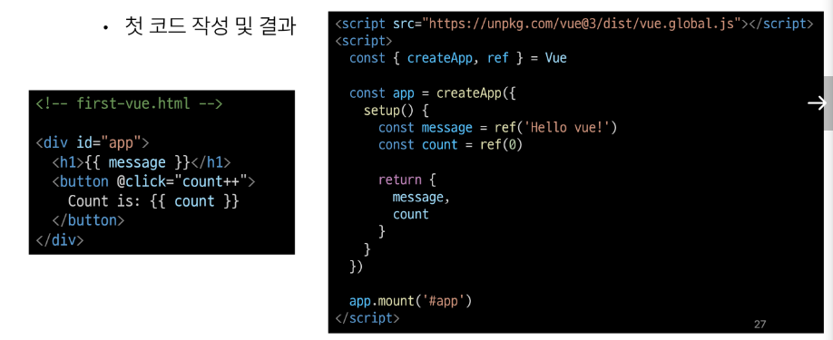  
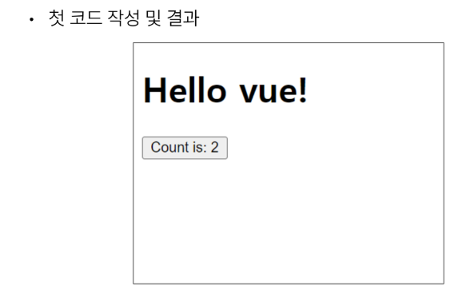

1. 선언적 렌더링 (Declaratice Rendering)

- HTML을 확장하는 템플릿 구문을 사용하여 HTML이 JavaScript 데이터를 기반으로 어떻게 보이는지 설명할 수 있음
- Vue 자체에서 제공하는 HTML 기반의 템플릿 문법을 제공하여 선언하는 것. 선언적으로 DOM을 렌더링 한다.
  - 개발자로서는 비즈니스 로직 구현에 집중해서 작업을 수앻라 수 있도록 도와준다.

2. 반응형 (Reactivity)

- JavaScript 상태 변경사항을 자동으로 추적하고 변경사항이 발생할 때 DOM을 효율적으로 업데이트
- 데이터의 값이 변결될 때, 화면을 자동으로 덥데이트 해주는 것을 의미한다.
  - 개발자가 수동적으로 DOM 요소를 조작할 필요가 X
  - 데이터 값에 대한 변화처리 및 화면 업데이트를 위한 코드가 간소화 = 버그 감소

3. 가상 DOM (Virtual DOM)을 사용하여서 빠른 렌더링 구형
   - 가상 DOM (Virtual DOM): 자바스크립트 단에서 실제 DOM을 가변겍 만든 **복사본**
   - node.parentNdoe.innerText="" <- webapu 브라우저 환경단에서 제공하는 API
     - 이 해당 노드를 탐색하는 것만 해도 성능사으이 이슈가 발생할 수 있습니다.

- (장점) 가상 DOm에서 변경을 수행해보고 그 DOM의 업데이트가 발생된 부분만 최소한으로 또는 효율적으로 업데이트를 수행할 수가 있다.

## Vue Tutorial

### Vue를 사용하는 방법

1. CDN 방식
2. NPM 방식 - 앱이 더 커지면 사용

### 첫번재 Vue 작성하기

- CDN 및 Application instance 작성

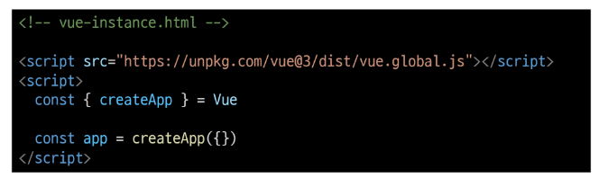

- Application instance
  - 모든 Vue 애플리케이션은 createApp 함수로 새 Application instance를 생성하는 것으로 시작

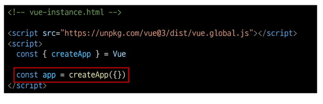

- app.mount()
  - 컨테이서 요소에 애플리케이션 인스턴스를 탑재(연결)
  - 각 앱 인스턴스에 대해 mount()는 한 번만 호출할 수 있음

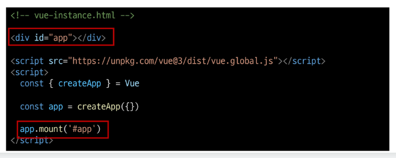

### ref()

반응형 상태(데이터)를 선언하는 함수 (Declaring Reactive State)

- 반응형을 가지는 참조 변수를 만드는 것

  > (ref === reactive reference)

- 인자를 받아 .value 속성이 있는 ref 객체로 래핑(wrapping)하여 반환
- ref로 선언된 변수의 값이 변경되면, 해당 값을 사용하는 템플릿에서 자동으로업데이트
- 인자는 어떠한 타입도 가능

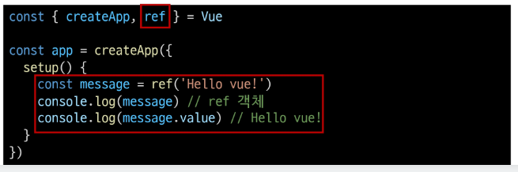

- 템플릿의 참조에 접근하려면 setip 함수에서 선언 및 반환 필요
- 템플릿에서 ref를 사용할 때는 .value를 작성할 필요 없음 (automatically upwrapped)

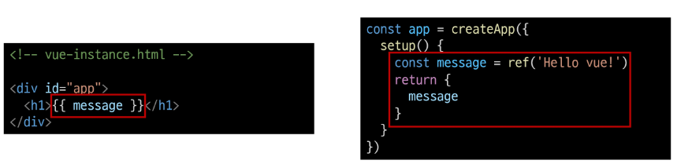

### ref, reactive 사용법

Vue2에서는 ref와 reative를 사용하여서 데이터를 반응형으로 만들고 관리를 수행

- setip 함수내에서 정의하도록 진행 (vue3)

1. red
2. reactive

### Vue 기본 구조

- createApp()에 전달되는 객체는 Vue 컴포넌트(Component) : 기능 하나를 조각으로 만든 것
- 컴포넌트의 상태는 setup() 함수 내에서 선언되어야 하며 **객체를 반환해야 함**

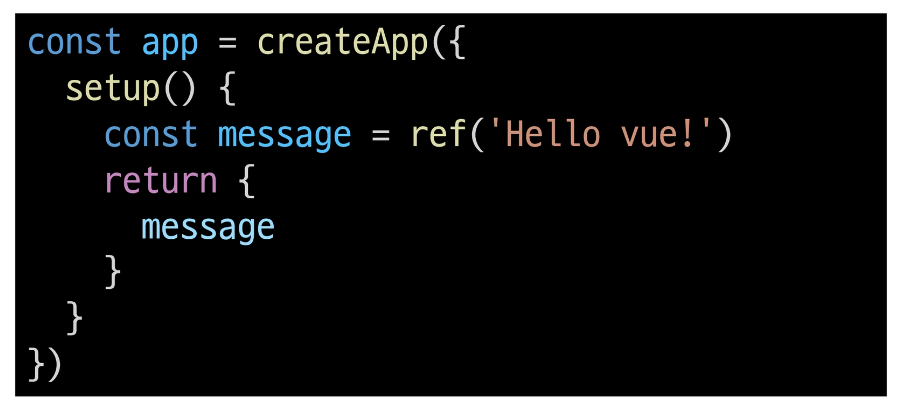

### 템플릿 렌더링

- 반환된 객체의 속성은 템플릿에서 사용할 수 있음
- Mustache syntax(콧수염 구문)를 사용하여 메시지 값을 기반으로 동적 텍스트를 렌더링

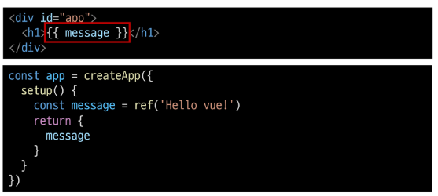

- 콘텐츠는 식별자나 경로에만 국한되지 않으며 유요한 JavaScript 표현식을 사용할 수 있음

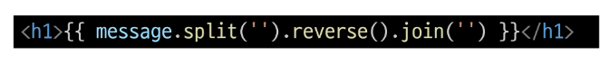

### Event Listeners in Vue

- 'v-on' directive를 사용하여 DOM 이벤트를 수신할 수 있음
- 함수 내에서 refs를 변경하여 구성 요소 상태를 업데이트
- click 발생하는 이벤트의 이름

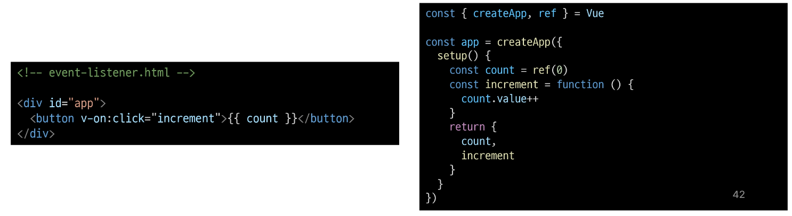

# 참고

## Ref Unwrap 주의사항

### 템플릿에서의 unwrap시 주의사항

- 템플릿에서의 unwrap은 ref가 최상위 속성인 경우에만 적용 가능
- 다음 표현식은 어떻게 출력될까?

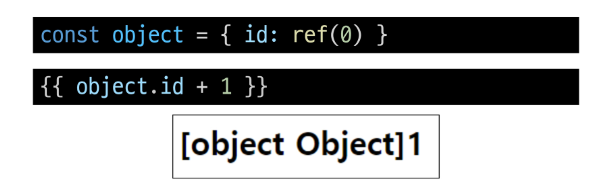

> - object는 최상위 속성이지만 object.id는 그렇지 않음
> - 표현식을 평가할 때 object.id가 unwrap되지 않고 ref 객체로 남아 있기 때문

- 이 문제를 해결하기 위해서는 id를 최상위 속성으로 분해해야 함(풀어내야 한다! )

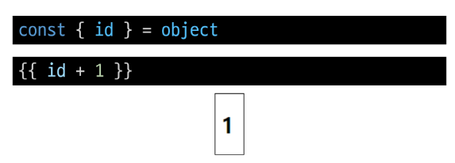

- 단, ref가 {{ }}의 최종 평가 값인 경우듣 unwrap 가능

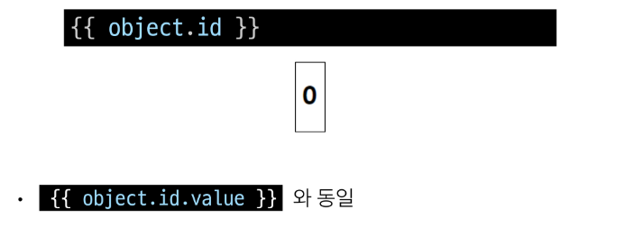

### Why Ref?

- 일반 변수 대신 굳이 .value가 포함된 ref 가 필요한 이유는?
- Vue는 템플릿에서 ref를 사용하고 나중에 ref의 값을 변경하면 자동으로 변경 사항을 감지하고 그에 따라 DOM을 업데이트함 (의존성 추적 기반의 반응형 시스템)
- Vue는 렌더링 중에 사용된 모든 ref를 추적하며, 나중에 ref가 변경되면 이를 추적하는 구성 요소에 대해 다시 렌더링
- JavaScript에서는 일반 변수의 접근 또는 변형을 감지할 방법이 없기 때문

### SEO (Search Engine Optimization)

- google, bing과 같은 검색 엔진 등에 내 서비스나 제품 등이 효율적으로 검색 엔지에 노출되도록 개선하는 과정을 일컫는 작업
- 정보의 대상은 주로 HTML에 작성된 내용
- 검색
  - 각 사이트가 운용하는 검색 엔진에 의해 이루어지는 작업
- 검색 엔진
  - 웹 상에 존재하는 가능한 모든 정보들을 긁어 모으는 방식으로 동작
- 최근에는 SPA, 즉 CSR로 구성된 서비스의 비중이 증가
- SPA 서비스도 검색 대상으로 넓히기 이해 JS를 지원하는 방식으로 발전하는 중

### CSR & SSR

- CSR과 SSR은 흑과 백이 아님
  - 내 서비스에 적합한 렌더링 방식을 적절하게 활용할 수 있어야 함
- SPA 서비스에서도 SSR을 제원하는 Framework가 발전하고 잇음
  - Vue의 Nuxt.js
  - React의 Next.js
  - Angilar Universal
