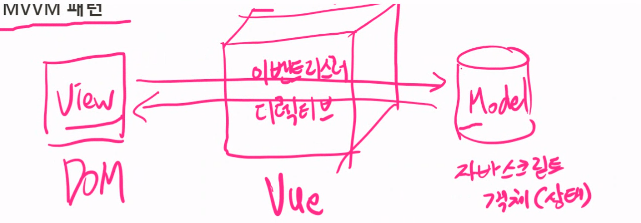
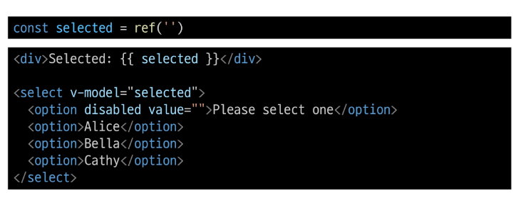

# 02. Basic Syntax 1

뷰모델(ViewModel)에 해당되는 Vue 프레임워크가 View(DOM)와 Model(JS객체) 사이의 중계 역할(=데이터 동기화)

데이터 바인딩(Data Binding)

- 뷰와 모델 사이에서 데이터 동기화를 의미한다,.
- 뷰 -> 모델 / 모델 -> 뷰

### MVVM 패턴

1. Model : 데이터와 비즈니스 로직 담당
2. View: 유저 인터페이스를 담당(=사용자 상호작용하는 모든 요소)
3. ViewModel: 뷰 <-> 모델 사이의 중간 역할 수행. 뷰(view)d에 표시될 데이터 가공. 모댈(Model)에서 변경된 데이터를 뷰와 데이터 바인딩 처리를 진행

# Template Syntax

DOM을 기본 구성 요소 인스턴스의 데이터에 선언적으로 바인딩(Vue Instance와 DOM을 연결)할 수 있는 HTML기반 템플릿 구문(확장된 문법 제공) 구문을 사용

### Template Syntax 종류

1. Text Interpolation
2. Raw HTML
3. Attribute Bindings
4. JavaScript Expressions

### 1. Text Interpolation

- 데이터 바인딩의 가장 기본적인 형태
- 이중 중괄호 구문(콧수염 구문)을 사용
- 콧수염 구문은 해당 구성 요소 인스턴스의 msg 속성 값으로 대체
- msg 속성이 변경될 때마다 업데이트 됨

### 2. Raw HTML

- 콧수염 구문은 데이터를 일반 텍스트로 해석하기 때문에 실제 HTMl을 출력하려면 v-html을 사용해야 함

### 3. Attribute Bindings

- 콧수염 구문은 HTML 속성 내에서 사용할 수 없기 때문에 v-bind를 사용
- HTML의 id 속성 값을 vue의 dynamicID 속성과 동기화 되도록 함
- 바인딩 값이 null이나 undefind인 경우 렌더링 요소에서 제거됨

### 4. JavaScript Expressions

- Vue는 모든 데이터 바인딩 내에서 JavaScript 표현식의 모든 기능을 지원
- Vue 템플릿에서 JavaScript 표현식을 사용할 수 있는 위치

1. 콧수염 구문 내부
2. 모든 directive의 속성 값 (v-로 시작하는 특수 속성)

### Expressions 주의사항

- 각 바인딩에는 하나의 단일 표현식만 포함될 수 있음
  - 표현식은 값으로 평가할 수 있는 코드 조각(return 뒤에 사용할 수 있는 코드여야 함)
- 작동하지 않는 경우

## Directive

'v-' 접두사가 있는 특수 속성

- Vue 프레임워크에서 HTML 요소에 추가적인 동작을 부여하는 특별한 속성이다.
- 

1. v-bind: HTML 요소에 대한 속성을 바인딩하는 directive. v-bind:속성명 형식으로 사용, 지정 값이 변경이 될 대마다 자동으로 속성이 업데이트 된다. (shortcut: :속성명)
2. v-on: 이벤트 리스너를 등록하는 directive. v-on:이벤트명 형식으로 사용. 지정된 이벤트가 발생하면 지정 메서드를 실행한다. (shortcut:@이벤트명)
3. v-model: 양방향 데이터 바인딩을 지원하는 directive. 양방향 바인딩(=사용자가 입력한 데이터-> 모델에 바로 반영. 모델 변경 -> DOM 변경)
4. v_text: HTML 요소에 데이터를 동적으로 바인딩하는데, 요소의 내용(content)의 값으로 대체하게끔 해준다. (={{data}})
5. v_html: HTML 요소에 데이터를 동적으로 바인딩하는데, 해당 요소 내부의 HTML 요소로 해석되어 재랜더링된다. (단, 신뢰할 수 있는 데이터만 활용해야 된다. XSS inject 보안 관련)
6. v-if: 조건부 렌더링을 수행하는 directive, 해당 값이 참이라면 아예 해당 엘리먼트를 렌더링한다. <a>...</a> -> <!-- -->
7. v-show: 조건부 렌더링을 수행하는 directive. 해당 HTML 요소에 숨김 속성을 지정한다. visibility="hidden"
8. v-for: 리스트 렌더링을 수행할 때 사용하는 directive 배열의 각 항목을 순회해서 반복된 템플릿을 생성하여 렌더링을 한다.

### Directive 특징

- Directive의 속성 값은 단일 JavaScript 표현식이어야 함 (v-for, v-on 제외)
- 표현식 값이 변경될 때 DOM에 반응적으로 업데이트를 적용
- 예시
  - v-if는 seem 표현식 값의 T/F를 기반으로 
 요소를 제거/삽입

### Directive 전체 구문

> Name:Argument.Modifier="Value"

- Name(이름) : Directive 이름으로 v- 으로 시작한다.
- Argument(인자): 해당 Directive의 인자값으로 속성명 이벤트명과 같은 인자를 사용할 수 있다.
- Modifier(수식어) : 해당 인자의 추가적인 제약조건을 추가해줄 수 있다.
  - 이벤트와 같은 경우에는 전파를 취소, 기본 동작을 막게끔하거나, 특정 키가 눌린 조건을 상세히 명시가 가능
- Value(값) : Directive를 통해서 전달되는 값으로 자바스크립트 형태의 표현식으로 작성이 가능하다. (동적으로 값을 바인딩 할 때에 사용)

### Directive - Arguments

- 일부 Directive는 Directive 뒤에 콜론(:)으로 표시되는 인자를 사용할 수 있음

### Directive - Modifiers

- .(dot)로 표시되는 특수 접미사로, directive가 특별한 방식으로 바인딩 되어야 함을 나타냄

# Dynamically data binding

### v-bind

하나 이상의 속성 또는 컴포넌트 데이터를 표현식으로 동적으로 바인딩

### v-bind 사용처

1. Attribute Bindings
2. Class and Style Bindings

## Attribute Bindings

- HTML의 속성 값을 Vue의 상태 속성 값과 동기화 되도록 함

- v-bind shorthand (약어)
  - ':' (colon)

- Dynamic attribute name (동적 인자 이름)
  - 대괄호로 감싸서 directive argument에 JavaScript 표현식을 사용할 수도 있음
  - JavaScript 표현식에 따라 동적으로 펴가된 값이 최종 argument 값으로 사용됨

### Attribute Bindings 예시

## Class and Style Bindings

- 클래스와 스타일은 모두 속성이므로 v-bind를 사용하여 다른 속성과 마찬가지로 동적으로 문자열 값을 할당할 수 있음
- 그러나 단순히 문자열 연결을 사용하여 이러한 값을 생성하는 것은 번거롭고 오류가 발생하기가 쉬움
- Vue는 클래스 및 스타일과 함께 v-bind를 사용할 대 객체 또는 배열을 활용한 개선 사항을 제공

### Class and Style Bindings가 가능한 경우

1. Binding HTML Classes
   1.1. Binding to Objects  
   1.2. Binding to Arrays

2. Binding inline Styles
   2.1. Binding to Objects  
   2.2. Binding to Arrays

### 1.1 Binding HTML Classes - Binding to Objects

- 객체를 :class에 전달하여 클래스를 동적으로 전환할 수 있음

- 객체를 더 많은 필드를 포함하여 여러 클래스를 전환할 수 있음

- 반드시 inline 방식으로 작성하지 않아도 됨

### 1.2 Binding HTML Classes - Binding to Arrays

- :class를 배여에 바인딩하여 클래스 목록을 적용할 수 잇음

- 배열 구문 내에서 객체 구문 사용

### 2.1 Binding inline Styles - Binding to Objects

- :style은 JavaScript 객체 값에 대한 바인딩을 지원 (HTML style 속성에 해당)

- 실제 CSS에서 사용하는 것처럼 : style은 kebab-cased 키 문자열도 지원 (단, camelCase 작성을 권장)

- 템플릿을 더 깔끔하게 작성하려면 스타일 객체에 직접 바인딩 하는 것을 권장

### 2.1 Binding inline Styles - Binding to Arrays

- 여러 스타일 객체의 배열에 :style을 바인딩할 수 있음
- 작성한 객체는 변합되어 동일한 요소에 적용

# Event Handling

### v-on

DOM 요소에 이벤트 리스너를 연결 및 수신

### v-on 구성

- handler 종류

1. Inline handlers : 컴포넌트에 정의된 메서드 이름
2. Method handlers: 컴포넌트에 정의된 메서드 이름

- v-on shorthand(약어)
  - '@'

### 1. Inline handlers

Inline handlers는 주로 간단한 상황에 사용

### 2. Method handlers

Inline handlers로는 불가능한 대부분의 상황에서 사용

- Method handlers는 이를 트리거하는 기본 DOM Event 객체를 자동으로 수신

### Inline Handlers에서의 메서드호출

- 메서드 이름에 직접 바인딩하는 대신 Inline Handlers 에서 메서드를 호출할 수도 있음
- 이렇게 하면 기본 이벤트 대신 사용자 지정 인자를 전달할 수 있음

### Inline Handlers에서의 event 인자에 접근하기

- Inline Handlers에서 원래 DOM 이벤트에 접근하기
- $event 변수를 사용하여 메서드에 전달

### Event Modifiers

- Vue는 v-on에 대한 Event Modifiers를 제공해 event.preventDefault()와 같은 구문을 메서드에서 작성되지 않도록 함
- stop. premet, self 등 다양한 modifiers를 제공
- 메서드는 DOM 이벤트에 대한 처리보다는 데이터에 관한 논리를 작성하는 것에 집중할 것

### Key Modifiers

- Vue는 키보드 이벤트를 수신할 때 특정 키에 관한 별도 modifiers를 사용할 수 잇음

# Form Input Bindings

- form을 처리할 때 사용자가 input에 입력하는 값을 실시간으로 JavaScript 상태에 동기화해야하는 경우(**양방향 바인딩**)

- 양방향 바인딩 방법

1. v-bind와 v-on을 함께 사용
2. v-model 사용

### 1. v-bind와 v-on을 함께 사용

- v-bind를 사용하여 input 요소의 value 속성 값을 입력 값으로 사용
- v-on을 사용하여 input 이벤트가 발생할 때마다 input 요소의 value 값을 별도 반응형 변수에 저장하는 핸들러를 호출

### v-model

form input 요소 또는 컴포넌트에서 양방향 바인딩을 만듦

### 2. v-model 사용

- v-model을 사용하여 사용자 입력 데이터와 반응형 변수를 실시간 동기화

- v-model을 사용하여 사용자 입력 데이터와 반응형 변수를 실시간 동기화
- IME가 필요한 언어(한국어, 중국어, 일본어 등)의 경우 v-model이 제대로 업데이트 되지 않음
- 해당 언어에 대해 올바르게 응답하려면 v-bind와 v-on 방법을 사용해야 함

## v-model 활용

### v-model과 다양한 입력(input) 양식

- v-model은 단순 text input뿐만 아니라 Checkbox, Radio, Select 등 다양한 타입의 사용자 입력 방식과 함께 사용 가능

### Checkbox 활용

1. 단일 체크박스와 boolean 값 활용

2. 여러 체크박스와 배열 활용

- 해당 배열에는 현재 선택된 체크박스의 값이 포함됨

### Select 활용

- select에서 v-model 표현식의 초기 값이 어떤 option과도 일치하지 않는 경우 select 요소는 "선택되지 않은(unselected)" 상태로 렌더링 됨

# 참고

### IME(Input Method Editor)

- 사용자가 입력 장치에서 기본적으로 사용할 수 없는 문자(비영어권 언어)를 입력할 수 있도록 하는 운영 체제 구성 프로그램
- 일반적으로 키보드 키보다 자모가 더 많은 언어에서 사용해야 함
- IME가 동작하는 방식과 Vue의 양방향 바인딩(v-model) 동작 방식이 상충하기 대문에 한국어 입력 시 예상대로 동작하지 않았던 것
