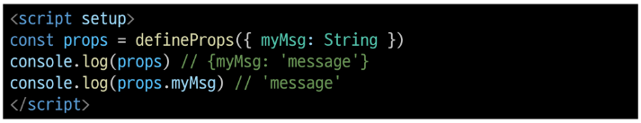
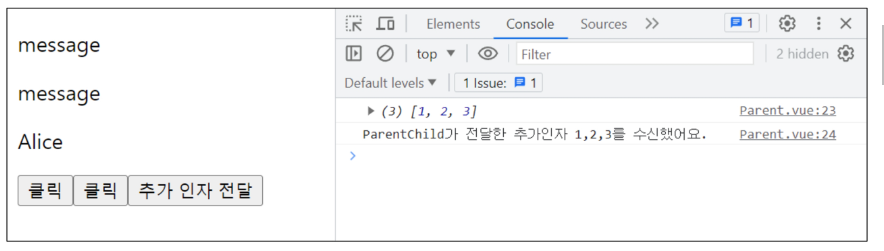
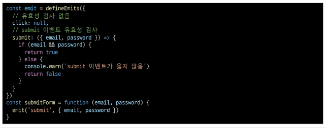

# 05. Component State Flow

# Passing Props

같은 데이터 하지만 다른 컴포넌트

- 동일한 사진 데이터가 한 화면에 다양한 위치에서 여러 번 출력되고 있음
- 하지만 해당 페이지를 구성하는 컴포넌트가 여러 개라면 동일한 데이터를 관리해야 할까?
- 그렇다면 사진을 변경해야할 때 모든 컴포넌트에 대해 변경 요청을 해야 함
- 공통된 부모 컴포넌트에서 관리 하자

- 부모는 자식에게 데이터를 전달(Pass Props)하며, 자식은 자신에게 일어난 일을 부모에게 알림 (Emit event)

### Props

부모 컴포넌트로부터 자식 컴포넌트로 데이터를 전달하는데 사용되는 특성

- 부모 컴포넌트에서 자식 컴포넌트로 전달되는 속성, 이를 통해 부모는 자식 컴포넌트에게 상태, 값을 설정할 수 있다.

### One-Way Data Flow

모든 Props는 자식 속성과 부모 속성 사이에 **하향식 단방향 바인딩**을 형성 (one-way-down binding)

- 데이터는 상위 컴포넌트에서 하위 컴포넌트로만 절달될 수 있음
- 하위 컴포넌트는 직접 상위 컴포넌트의 데이터를 수정할 수 없음(readonly)

이렇게 제한을 줌으로써 데이터 흐름을 예측하거나 추측하는데 용이해진다.

- 상태 변경에 대한 실수, 복잡성을 상당히 줄일 수 있는 장점이 있다!
- 데이터 흐름도 명확, 디버깅-테스트가 상당히 수월해진다.

### Props 특징

- 부모 속성이 업데이트되면 자식으로 흐르지만 그 반대는 안됨
- 즉, 자식 컴포넌트 내부에서 props를 변경하려고 시도해서는 안되며 불가능
- 또한 부모 컴포넌트가 업데이트될 때마다 자식 컴포넌트의 모든 props가 최신 값으로 업데이트 됨
- 부모 컴포넌트에서만 변경하고 이를 내려 받는 자식 컴포넌트는 자연스럽게 갱신

### 단방향인 이유

- 하위 컴포넌트가 실수로 상위 컴포넌트의 상태를 변경하여 앱에서의 데이터 흐름을 이해하기 어렵게 만드는 것을 방지하기 위함

### 요약

props는 부모에서 자식으로 데이터를 속성값을 통해서 전달을 수행히 가능 (부모 -> 자식 데이터업데이트는 가능하지만, **그 반대는 불가능하다!**)

- 자식 컴포넌트에서는 props에 대한 변경이 불가능 (warging이 발생)
- 부모 컴포넌트가 업데이트 될 대마다, 자식 컴포넌트의 props도 최신 데이터로 변경

## 사전 준비

1. vue 프로젝트 생성
2. 초기 생성된 컴포넌트 모두 삭제 (App.vue) 제외
3. src/assets 내부 파일 모두 삭제
4. main.js 해당 코드 삭제

### App < Parent < ParentChild 컴포넌트 관계 작성

- App 컴포넌트 작성

- Parent 컴포넌트 작성

- ParentChild 컴포넌트 작성

## Props 선언

부모 컴포넌트에서 보낸 props를 사용하기 위해서는 자식 컴포넌트에서 명시적인 props 선언이 필요

### Props 작성

- 부모 컴포넌트 Parent에서 자식 컴포넌트 ParentChild에 보낼 props 작성

### Props 선언 2가지 방식

- vue에서는 케밥케이스를 사용하나 자바스크립트에서는 사용하지 않으므로 하이픈 -> 대문자로 변경

1. 문자열 배열을 사용한 선언

- defineProps()를 사용하여 props 를 선언

2. 객체를 사용한 선언

- 객체 선언 문법의 각 객체 속성의 키는 props의 이름이 되며, 객체 속성의 값은 값이 될 데이터의 타임에 해당하는 생성자 함수(Number, String..)여야함
- 객체 선언 문법 사용 권장

### Prop 데이터 사용

- 템플릿에서 반응형 변수와 같은 방식으로 활용

- props를 객체로 반환하므로 필요한 경우 JavaScript에서 접근 가능

- prop 출력 결과 확인

### 한 단계 더 prop 내려보내기

- ParentChild 컴포넌트를 부모로 갖는 ParentGrandChild 컴포넌트 생성 및 등록

- ParentChild 컴포넌트에서 Parent로 부터 받은 prop인 myMsg를 ParentGrandChild에게 전달

- 출력 결과 확인
- ParentGrandChild가 받아서 출력하는 prop은 Parent에 정의되어 있는 prop이며 Parent가 prop을 변경할 경우 이를 전달받고 있는 ParentChild, ParentGrandChild에서 모두 업데이트 됨

## Props 세부 사항

1. Props Name Casing (Props 이름 컨벤션)

- 선언 및 템플릿 참조시(-> camelCase)

- 자식 컴포넌트로 전달시 (->kebab-case)

2. Static Props & Dynamic Props

- 지금까지 작성한 것은 Static(정적) props
- v-bind를 사용하여 **동적으로 할당된 props**를 사용할 수 잇음

1. Dynamic props 정의

2. Dynamic props 선언 및 출력

3. Dynamin props 출력 확인

# Componet Events

부모는 자식에게 데이터를 전달(Pass Props)하며, 자식은 자신에게 일어난 일을 부모에게 알림 (Emit evnet)

- **부모가 prop 데이터를 변경하도록 소리쳐야 한다**

# Emit

### $emit()

자식 컴포넌트가 이벤트를 발생시켜 부모 컴포넌트로 데이터를 전달하는 역할의 메서드

- 자식 컴포넌트에게서 본인이게 일어난 일을 부모 컴포넌트에게 알리는 이벤트를 발생(emit)시키는 것
- 하위에서 바로 상위
- $ 표기는 Vue 인스턴스나 컴포넌트 내에서 제공되는 전역 속성이나 메서드를 식별하기 위한 접두어
- **emit는 버블링이 발생하지 않는다.**

### emit 메서드 구조

> $emit(evnet, ...args)

- event : 커스텀 이벤트 이름
- args : 추가 인자

## Event 발신 및 수신

### 이벤트 발신 및 수신 (Emitting and Listening to Events)

- $emit을 사용하여 템플릿 표현식에서 직접 사용자 정의 이벤트를 발신

- 그러면 부모는 v-on울 사용하여 수신할 수 잇음

### 이벤트 발신 및 수신 하기

- ParentChild에서 someEvent라는 이름의 사용자 정의 이벤트를 발신

- ParentChild의 부모 Parent는 v-on을 사용하여 발실된 이벤트를 수신
- 수신 후 처리할 로직 및 콜백함수 호출

- 이벤트 수신 결과

## 'emit' Event 선언

### emit 이벤트 선언

- defineEmits()를 사용하여 명시적으로 발신할 이벤트를 선언할 수 잇음
- script에서 $emit 메서드를 접근할 수 없기 때문에 definEmits()는 $emit 대신 사용할 수 있는 동등한 함수를 반환

### 이벤트 선언하기

- 이벤트 선언 방시긍로 추가 버튼 작성 및 결과 확인

## Event 인자 (Event Arguments)

이벤트 발신 시 추가 인자를 전달하여 값을 제공할 수 있음

### 이벤트 인자 전달하기

- ParentChild에서 이벤트를 발신하며 Parent 로 추가 인자 전달하기

- ParentChild에서 발신한 이벤트를 Parent에서 수신

- 추가 인자 전달 확인

## Evnet 세부사항

### Event Name Casgin

- 선언 및 발신 시 (-> camelCase)

- 부모 컴포넌트에서 수신 시 (-> kebab-case)

## emit Event 실습

- 최하단 컴포넌트 ParentGrandChild에서 Parent 컴포넌트의 name 변수 변경 요청하기

### emit Event 실습 구현

- parentGrandChild에서 이름 변경을 요청하는 이벤트 발신

- 이벤트 수신 후 이름 변경을 요청하는 이벤트 발신

- 이벤트 수신 후 이름 변수 변경 및 메서드 호출
- 해당 변수를 prop으로 받는 모든 곳에서 자동 업데이트

- 버튼 클릭 후 결과 확인

# 참고

### 정적 & 동적 props 주의사항

- 첫 번째는 정적 props로 문자열로써의 "1"을 전달
- 두 번째는 동0적 props로 숫자로써의 "1"을 전달

### Prop 선언을 객체 선언 문법으로 권장하는 이유

- prop에 타입을 지정하는 것은 컴포넌트를 가독성이 좋게 문서화하는데 도움이 되며, 다른 개발자가 잘못된 유형을 전달할 때에 브라우저 콘솔에 경고를 출력하도록 함
- 추가로 prop에 대한 **유효성 검사**로써 활용 가능

### 유효성 검사

- 데이터 타입이 string으로 지정해주었는데, 동적으로 숫자를 전달한 경우 오류 발생
    
    
  

- 데이터 누락인 경우
    
  

### emit 이벤트도 객체 선언 문법으로 작성 가능

- props 타입 유효성 검사와 유사하게 emit 이벤트 또한 객체 구문으로 선언된 경우 유효성을 검사할 수 있음

