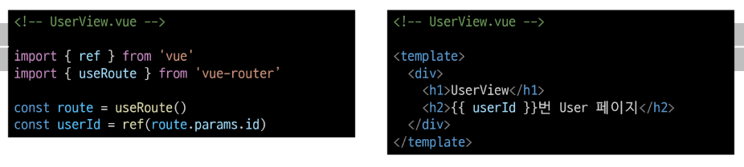

# 06. Router

# Routing

네트워크서 경로를 선택하는 프로세스

- 웹 어플리케이션에서 다른 페이지 간의 전환과 경로를 관리하는 기술


### SSR(ServerSideRendering) 에서의 Routing

- 서버가 사용자가 방문한 URL 경로를 기반으로 응답을 전송
- 링크를 클릭하면 브라우저는 서버로부터 HTML 응답을 수신하고 새 HTML로 전체 페이지를 다시 로드

### CSR/SPA에서의 Routing

- SPA에서의 routing은 브라우저의 **클라이언트 측**에서 수행
- 클라이언트 측 JavaScript가 새 데이터를 동적으로 가져와 전체 페이지를 다시 로드 하지 않음
- 페이지는 1개이지만, 링크에 띠ㅏ라 여러 컴포넌트를 렌더링 하여 마치 여러 페이지를 사용하는 것처럼 보이도록 해야 함

### 만약 routing이 없다면

- 유저가 URL을 통한 페이지의 변화를 감지할 수 없음
- 페이지가 무엇을 렌더링 중인지에 대한 상태를 알 수 없음
  - URL이 1개이기 때문에 새로고침 시 처음 페이지로 되돌아감
  - 링크를 공유할 시 첫 페이지만 공유 가능
- 브라우저의 뒤로 가기 기능을 사용할 수 없음

# Vue Router

Vue 공식 라우터 (The official Router for Vue.js)

- vue js에서 페이지 간의 이동을 위한 공식 라이브러리
- SPA 기반의 페이지를 이동한 것처럼(=페이지 전환) 동작
- how? 페이지를 이동하게 되면 변경된 요소의 영역에 컴포넌트만 갱신하도록 동작!
- 이러한 화명 이동에 대한 도작을 위해 라우팅에 대한 다양한 기능을 제공 (일반/중첩/동적 라우팅)

라우팅(routing) : 네트워크 상에서 경로를 선택하는 과정(process)
-> Web app 상에서는 다른 페이지 간의 전환 / 경로 관리하는 방법&기술을 총칭

## Web app에서 히스토리 관리

1. 해시 모드로 관리하는 방법 : URL에다가 해시(#)를 사용하여서 경로를 표기하게 된다. 서버에서 해당되는 path에 대해서 별도의 추가 처리가 필요하지 않게 된다!
2. history API를 사용해서 관리하는 방법 : 서버단에서 path에 대한 별도 추가처리가 필요합니다. SEO(검색)에 대한 처리가 더 원활해진다.

### 일반 라우팅

정적인 경로를 사용하여 라우팅 구성하는 방법
exc) /about 경로에는 About 컴포넌트를 맵핑하고, /conatact 경로에서는 contact 컴포넌트를 맵핑처리할 수 잇다. 이러한 경로에 접근하게 되면 단순하게 해당 컴포넌트를 렌더링

### 동적 라우팅

### Vur Router 추가

- Vite로 프로젝트 생성시 Router 추가


- 서버 실행 후 Route로 인한 프로젝트 변화 확인
- Home, Aboute 링크에 따라 변경되는 URL과 새로 렌더링 되는 화면


### Vue 프로젝트 구조 변환

1. App.vue 코드 변화
2. router 폴더 생성
3. views 폴더 생성


RouterLink

- 페이지를 다시 로드 하지 않고 URL을 변경하고 URL 생성 및 관련 로직을 처리
- HTML의 a 태그를 렌더링


RouterView

- URL에 해당하는 컴포넌트를 표시
- 어디에나 배치하여 레이아웃에 맞출 수 잇음


router/index.js

- 라우팅에 관련된 정보 및 설정이 작성되는 곳
- router에 URL과 컴포넌트를 매핑


views

- RouterView 위치에 렌더링 할 컴포넌트를 배치
- 기존 componets 폴더와 기능적으로 다른 것은 없으며 단순 분류의 의미로 구성됨
- **일반 컴포넌트와 구분하기위해 커포넌트 이름을 View로 끛나도록 작성하는 것을 권장**

## Basic Routing

### 라우팅 기본

1. index.js에 라우터 관련 설정 작성(주소, 이름, 컴포넌트)
2. RouterLink의 'to' 속성으로 index.js 애서 정의한 주소 속성 값(path)을 사용


## Named Routes

경로에 이름을 지정하는 라우팅

### Named Routes 예시

- name 속성 값에 경로에 대한 이름을 지정
- 경로에 연결하려면 RouterLink에 v-bind를 사용해 'to' prop 객체로 전달


### Named Routes

- 하드 코딩된 URL을 사용하지 않아도됨
- URL 입력시 오타 방지
- URL 변경되어도 유지된다

## Dynamic Route Matchind with Params

매개 변수를 사용한 동적 경로 매칭

- 주어진 패턴 경로를 동일한 컴포넌트에 매핑 해야 하는 경우 활요
- 예를 들어 모든 사용자의 ID를 활용하여 프로필 페이지 URL을 설계한다면?
  - user/1
  - user/2
  - user/3
  - 일정한 패턴의 URL 작성을 반복해야함

### 매개 변수를 사용한 동적 경로 매칭 활요

- UserView 컴포넌트 작성


- UserView 컴포넌트 라우트 등록
- 매개변수는 콜론(:)dmfh vyrl


- 라우트의 매개변수는 컴포넌트에서 $route.params 참조 가능


- 다만 다음과 같이 Compositon API 방시긍로 작성하는 것을 권장



## Programmatic Navigation

### 프로그래밍 방식 네비게이션

- router의 인스턴스메서드를 사용해 RouterLink 로 aㅌ 태그를 만드는 것처럼 프로그래밍으로 네비게이션 고나련 작업을 수행할 수 있음

1. 다른 위치로 이동하기 : router.push()
2. 현재 위치 바꾸기 : router.replace()

### router.push

다른 위치로 이동하기 : Navigate to ad difffenet location

- 다른 URL로 이동하는 메서드
- 새 항목을 history stack에 push하므로 사용자가 브라웆 뒤로 가기 버튼을 클릭하면 이전 URL로 이동할 수 잇음
- RouterLink를 클릭했을 때 내부적으로 호출되는 메서드이므로 RouterLink를 클릭하는 것은 router.push()를 호출하는 것과 같음


### router.push 활용

- UserView 컴포넌트에서 HomeView 컴포넌트로 이동하는 버튼 만들기


- UserView 컴포넌트에서 HomeView 컴포넌트로 이동하는 버튼 만들기


router.push 인자 활용 참고


### router.replace()

현재 위치 바꾸기 : Replace current location

- push 메서드와 달리 history stack에 새로운 항목을 push 하지 않도 다른 URL로 이동 (=== 이동전 URL로 두뒤로 가기 불가)


# Navigation Guard

Vue router를 통해 특정 URL에 접근할 때 다른 URL로 redirect를 하거나 취소하여 네비게이션을 보호

- ex) 인증 정보가 없으면 특정 페이지에 접근하지 못하게 함

### Navigation Guard 종류

1. Globally (전역 가드)

- 애플리케이션 전역에서 동작
- Index.js에서의 정의

2. Per-route (라우터 가드)

- 특정 route에서만 정의
- Index.js의 각 routes 에 정의

3. In-component(컴포넌트 가드)

- 특정 컴포넌트 내에서만 동작
- 컴포넌트 Script에 정의

## Globally Gurard

전체 애플리케이션의 라우트 전환에 대해 적용되는 가드

1. beforeEach : 각 라우트 전환 직전에 실행되는 가드
2. beforeResolve : 각 라우트 전환 후, 컴포넌트 내에서 데이터가 완전히 로드되기 저에 실행되는 가드
3. afterEach : 각 라우트 전환 후에 실행되는 마지막 가드

### router.beforeEach()

다른 URL로 이동하기 직전에 실행되는 함수

- Global Before Guards

### router.beforeEach() 구조


- to : 이동 할 URL 정보가 담긴 Route 객체
- from : 현재 URL 정보가 담긴 Route 객체
- 선택적 반환(return) 값

1. false
2. Route Location

- false
  - 현재 내비게이션을 취소
  - 브라우저 URL이 변경된 경우(사용자가 수동으로 또는 뒤로 버튼을 통해) from 경로의 URL로 재설정


- Route Location
  - router.push()를 호출하는 것처럼 경로 위치를 전달하여 다른 위치로 redirect
- **return이 없다면 'to' URL Route 객체로 이동**

### router.beforeEach() 예시

1. 전역 가드 beforeEach 작성
2. HomeView에서 UserView로 이동 후 각 인자 값 출력 확인하기


- to에는 이동할 URL인 user 라우트에 대한 정보가, from에는 현재 URL인 home 라우트에 대한 정보가 들어잇음


### router.beforeEach() 활용

- 사전 준비 : LogindView 컴포넌트 작성 및 라우트 등록


- Login이 되어있지 않다면 페이지 집입을 막고 Login 페이지로 이동시키기
- 어떤 RouterLink를 클릭해도 LongView 컴포넌트만 볼 수 있음


- 만약 로그인이 되어 있지 않고(1), 이동하는 주소 이름이 login이 아니라면(2) login 페이지로 redirect


## Per-route Gurad

### router.beforeEnter()

route에 진입했을 때만 실해되는 함수

- 매개변수, 쿼리 값이 변경될 때는 실행되지 않고 다른 경로에서 탐색할 때만 실행됨

### router.beforeEnter 구조


- routes 객체에서 정의
- 함수의 to, form, 선택 반환 인자는 beforeEach와 동일

### router.beforeEnter 예사

1. 라우터 가드 beforeEnder 작성
2. HomeView에서 UserView로 이동 후 각 인자 값 출력 확인하기


- to에는 이동할 URL인 user 라우트에 대한 정보가, from에는 현재 URL인 home 라우트에 대한 정보가 들어잇음
- 다른 경로에서 user 라우트를 탐색했을 때 실행된 것


### router.beforeEnter 활용

- 이미 로그인한 상태라면 LogindView 진입을 막고 HomeView로 이동시키기 (전역 가드 활용 코드는 주석 처리 후 진행)

- 이미 로그인 상태라면 HomeView로 이동
- 로그인 상태가 아니라면 Loginview로 이동


## In-component Guard

### 컴포넌트 가드 종류

onBeforeRouteLeave

- 현재 라우트에서 다른 라우트로 이동하기 전에 실행
- 사용자가 현재 페이지를 떠나는 동작에 대한 로직을 처리

onBeforeRouteUpdate

- 이미 렌더링된 컴포넌트가 같은 라우트 내에서 업데이트되기 전에 실행
- 라우트 업데이트 시 추가적인 로직을 처리

### onBeforeRouteLeave 활용

- 사용자가 UserView를 떠날 시 팝업 창 출력하기


- 사용자가 UserView 를 떠날 시 팝업 창 출력하기<template>
  <div>
    <!-- Vue Router 사용하는 대표적인 템플릿 -->
    <!-- 1. router-link 태그 -->
    <!-- 페이지간의 링크를 생성하는데 사용하는 태그
      기본적으로는 a 태그로 렌더링(*실질적 페이지x, 
      내부 페이지 전환은 javascript 기반으로 전환이 수행된다! = 
      페이지 전환은 컴포넌트의 변경으로 이루어진다!)
    -->
    <!-- <RouterLink to="/">Home</RouterLink> -->
    <RouterLink :to="{naem:'home'}">Home</RouterLink>
    <router-link to="/about" >About</router-link>
    <router-link to="/users/1" >User 1</router-link>
    <router-link to="/users/2" >User 2</router-link>
    <router-link :to="{name: 'profile', params: {id : 1}}">User1</router-link>
    <router-link :to="{name: 'profile', params: {id : 2}}">User1</router-link>
    <!-- 2. router-view 태그 -->
    <!-- 현재 경로에 따라서 동적으로 컴포넌트를 렌더링하는 역할을 수행...-->
    <RouterView />
  </div>
</template>

<script setup>

</script>

<style scoped>

</style>


### onBeforeRouteUpdate 활용

- USerView 페이지에서 다른 id를 가진 User의 UserView 페이지로 이동하기


- UserView 페이지에서 다른 id를 가진 User의 UserView 페이지로 이동하기


### 만약 onBeforeRouteUpdate를 사용하지 않았다면

- onBeforeRouteUpdate에서 userid를 변경하지 않으면 userId는 갱신되지 않음
- 컴포넌트가 재사용되었기 때문


# 참고

## Lazy Loading Routes


- 첫 빌드시 해당 컴포넌트를 로드하지 안혹, **해당 경로를 처음으로 방문할 때만 컴포넌트를 로드** 하는 것
  - 앱을 빌드할 때 앱의 크기에 따라 페이지 로드 시간이 길어질 수 있기 대문
- 기존에 정적 가져오기 방식을 도적 가져오기 방식으로 변경하는 것과 같음

# 추가

router를 추가하지 않고 프로젝트를 생성해주었을 때

- 추가적으로 설치
- router/index.js나 views는 스스로 추가해주어야 한다.


- main


- index.js

```js
import {
  createRouter,
  createWebHistory,
  createWebHashHistory,
} from "vue-router";

const router = createRouter({
  history: createWebHistory(),
  routes: [
    {
      path: "/",
      name: "home", // 라우트에 이름을 지정
      component: HomeView,
    },
  ],
});

// 생성한 라우터 인스턴스를 내보내서 다른 파일에서 사용할 수 있도록 한다.
export default router;
```
