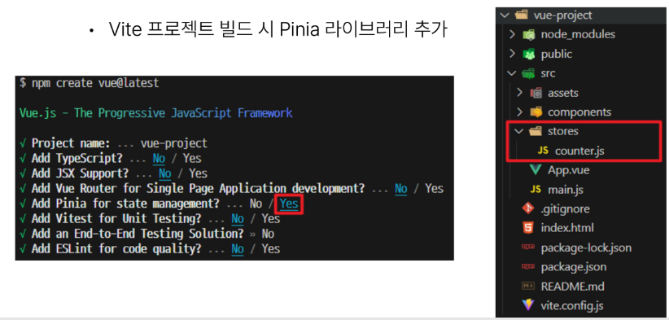
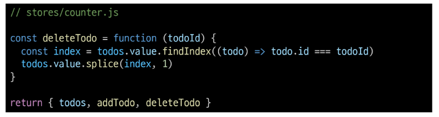
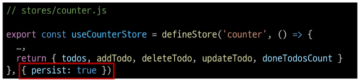

# 07. State Managemnet : 상태 관리
- Vue 컴포넌트는 이미 반응형 상태를 관리하고 있음
- 상태 === 데이터

### 컴포넌트 구조의 단순화
- 상태(State)
    - 앱 구종에 필요한 기본 데이터
-  뷰 (View)
    - 상태를 선언적으로 매핑하여 시각화
- 기능 (Actions)
    - 뷰에서 사용자 입력에 대해 반응적으로 상태를 변경할 수 있게 정의된 동작

- 단방향 데이터 흐름의 간단한 표현

  


### 상태 관리의 단순성이 무너지는 시점
- 여러 컴포넌트가 상태를 공유할 때
1. 여러 뷰가 동일한 상태에 종속되는 경우
- 공유 상태를 공통 조상 컴포넌트로 끌어올린 다음 props로 전달하는 것
- 하지만 계층 구조가 깊어질 경우 비효적, 관리가 어려워 짐


2. 서로 다른 뷰의 기능이 동일한 상태를 변경시켜야 하는 경우
- 발신(emit)된 이벤트를 통해 상태의 여러 복사본을 벼경 및 동기화 하는 것
- 마찬가지로 관리의 패턴이 개지기 쉽고 유지 관리할 수 없는 코드가 됨


### 해결책
- 각 컴포넌트의 공유 상태를 추출하여, 전역에서 참조할 수 있는 저장소에서 관리


- 각 컴포넌트의 공유 상태를 추출하여, 전역에서 참조할 수 있는 저장소에서 관리


- 컴포넌트 트리는 하나의 큰  "뷰"가 되고 모큰 컴포넌트는 트리 계ㅡㅇ 구조에 관계 없이 상태에 접근하거나 기능을 사용할 수 잇음
- Vue의 공식 상태 관리 라이브러리 === "Pinia"


# State management library (Pinia)
## Pinia
Vue 공식 상태 관리 라이브러리

### Pinia 설치
- Vite 프로젝트 빌드 시 Pinia 라이브러리 추가



## Pinia 구조
### Pinia 구성 요소
1. store
2. state
3. getters
4. actions
5. plugin

### Pinia 구성 요소 - store
- 중앙 저장소
- 모든 컴포넌트가 공유하는 상태, 기능 등이 작성됨
- define 이름 변경 가능(저장소 이름)


### Pinia 구성 요소 - state
- 반응형 상태(데이터)
- ref() === state


### Pinia 구성 요소 - getters
- 계산된 값
- computed() === getters


### Pinia 구성 요소 - actions
- 메서드
- fuction() === actions


### Pinia 구성 요소 - pligon
- 애플리케이션의 상태 관리에 필요한 추가 기능을 제공하거나확장하는 도구나 모듈
- 애플리케이션의 상태 관리를 더욱 간편하고 유여한게 만들어주며 패키지 매니저로 설치 이후 별도 설정을 통해 추가 됨

### Pinia 구성 요소 종합
- Pinia는 store라는 저장소를 가짐
- store는 state, getters, actions으로 이루어지며 각각 ref(). computed(), functions()과 동일함
- 이름만 달라진 것이다 !!

## Pinia 구성 요소 활용
### State
- store 인스턴스로 state에 접근하여 직접 읽고 쓸 수 잇음
    - 하지만 직접적으로 접근하는 것은 좋지 않다 !!
    - 가져올 수는 있으나 생성은 불가능 ~~
- 만약 store에 state를 정의하지 않았다면 컴포넌트에서 새로 추가할 수 없음


### Getters
- store의 모든 getters를 state처럼 직접 접근할 수 있음


### Actions
- store의 모든 actiond를 직접 접근 및 호출할 수 잇음
- getters와 달리 state 조작, 비동기, API호출이나 다른 로직을 진행할 수 잇음


### Vue devtools로 Pinia 구성 요소 확인하기


# Pinia 실습
### Pinia를 활용한 Todo 프로젝트 구현
- Todo CRUD : add, delete, update  (actions)
- Todo 개수 계산
    - 전체 Todo
    - 완료된 Todo
    - 미완료된 Todo

### 컴포넌트 구성


## 사전 준비
- 초기 생성된 컴포넌트 모두 삭제(App.vue 제외)
- src/assets 내부 파일 모두 삭제
- main.js 해당 코드 삭제


- TodoListItem 컴포넌트 작성


- TodoList 컴포넌트 작성
- TodoListItem 컴포넌트 등록


- TodoForm 컴포넌트 작성


- App 컴포넌트에 TodoList, TodoForm 컴포넌트 등록


- 컴포넌트 구성 확인


## Read Todo
### Todo 조회
- store에 임시 todos 목록 상태를 정의


- store의 todos 상태를 참조
- 하위 컴포넌트인 TodolistItem을 반복하면서 개별 todo를 props 로 전달


- props 정의 후 데이터 출력 확인


## Create Todo
### Todo 생성
- todos 목록에 todo를 생성 및 추가하느 addTodo 액션 정의


- TodoFrom 에서 실시간으로 입력되는 사용자 데이터를 양방향 바인딩하여 반응형 변수로 할당


- submit 이벤트가 발생했을 대 사용자 입력 텍스트를 인자로 전달하여 store에 정의한 addTodo 액션 메서드를 호출


- form 요소를 선택하여 todo 입력 후 input 데이터를 초기화할 수 있도록 처리


- 결과 확인


## Delete Todo
### Todo 삭제
- todos 목록에서 특정 todo를 삭제하는 deleTodo 역션 정의


- 각 todo에 삭제 버튼을 작성
- 버튼을 클릭하면 선택된 todo의 id를 인자로 전달해 deleteTodo 메서드 호출


- 전달받은 todo의 id 값을 활용해 선택된 todo의 인덱스를 구함
- 특정 인덱스 todo를 삭제 후 todos 배열을 재설정



- 결과 확인


## Update Todo
- 각 todo 상태의 isDone 속성을 변경하여 todo의 완료 유무 처리하기
- 완료된 toido에는 취소선 스타일 적용하기
- todos 목록에서 특정 todo의 isDone 속성을 변경하는 UpdateTodo 액션 정의


- todo 내용을 클릭하면 선택된 todo의 id를 인자로 전달해 updateTodo 메서드를 호출


- 전달받은 todo의 id 값을 활용해 선택 todo와 동이라 todo를 목록에서 겸색
- 일치하는 todo 데이터의 isDone 속성 값을 반대로 재할당 후 새로운 todo 목록 반환


- todo 객체의 isDone 속성 값에 따라 스타일 바이딩 적용하기


- 결과 확인


## Computed Todo
### 완료된 todo 개수 계산
- todos 배열의 길이 값을 반환하는 함수 doneTodosCount 작성 (getters)


- App 컴포넌트에서 doneTodosCount getter를 참조


## Local Storage
브라우저 내에 key-value 싸을 저장하는 웹 스토리지 객체

### Local Storage 특징
- 페이지를 새로 고침하고 브라우저를 다시 실행해도 데이터가 유지
- 쿠키와 다르게 네트워크 요청 시 서버로 전송되지 않음
- 여러 탭이나 창 간에 데이터를 공유할 수 있음

### Local Storage 사용 목적
- 웹 애플리케이션에서 사용자 설정, 상태 정보, 캐시 데이터 등을 클라이언트 축으세 보관하여 웹 사이트의 성능을 향상시키고 사용자 경험을 개선하기 위함

### pinia-plugin-persistedstate
- pinia의 플러그인(plugin)중 하나
- 웹 어플리케이션의 상태(state)를 브라우저의 local storage나 session storage에 영구적으로 저장하고 복원하는 기능을 제공

### pinia-plugin-persistedstate 설정
- 설치 및 등록


- 활용 : definStore의 3번재 인자로 관련 객체 추가



- 적용 결과
    - 브라우저의 Local Storage에 저장되는 todos 상태


# 참고
## 그럼 이제 모든 데이터를 store에서 관리해야 할까?
- Pinia를 사용한다고해서 모든 데이터를 state에 넣어야 하는 것은 아님
- 필요한 경우 pass prop, emit event를 사용하여 상태를 관리할 수 잇음
- 상황에 따라 적절하게 사용하는 것이 필요

## Pinia 언제 사용해야할까?
- Pinia는 공유된 상태를 관리하는 데 유용하지만, 개념에 대한 이해와 시작하는 비용이 큼
- 애플리케이션이 단순하다면 Pinia가 없는 것이 더 효율적일 수있음
- 그러나 중대형 규모의 SPA를 구축하는 경우 Pinia는 자렵스럽게 선택할 수 있는 단계가 오게 됨
- 결과적으로 역할에 적절한 상황에서 활용했을 때 Pinia 효용을 극대화할 수 있음


---
# 상태 관리 ( State Management )

상태 관리, 애플리케이션의 데이터를 효율적으로 관리하고 상호작용하는 데 사용하는 기술 → 여러 컴포넌트 간의 **데이터 동기화**, 큰 프로젝트를 진행할 때에는 동기화의 기술적인 부분이 특히나 중요

### 컴포넌트의 구조 단순화

- **상태 ( State )** : 컴포넌트에서 사용되는 데이터 ( 앱 구동에 필요한 데이터 )
- **뷰 ( View )** : 상태를 기반으로 컴포넌트의 화면 표시를 담당 ( 상태를 선언적으로 매핑 시각화하는 템플릿 구조 )
- **기능 ( Actions )** : 뷰에서 발생하는 이벤트 / 사용자의 입력에 대한 응답으로 **상태를 변경**하는 함수

⇒ 위 3가지 구조를 통해 컴포넌트 간의 **데이터 동기화를 단순화** ( 코드의 가독성 ▲ ) ⇒ **단방향 데이터 흐름**에 대한 간단한 구조로 작성이 가능하다.

### 단순화된 구조에 따라서 문제 발생
두가지 사례로 인해서 단순성이 무너진다.
-> 1. 중복되는 props
-> 2. 중복 emits 구조

예 1) 여러 뷰가 동일한 상태(데이터)가 중복되는 경우
-> 상태값(데이터)를 하위로 계속해서 모두 전달 (prop 중복)

예 2) 서로 다른 뷰의 기능에 대해 동일한 상태(데이터)를 변경해야하는 겨웅
-> 상태값(데이터)을 변화하기 위한 이벤트를 상위 전달(emit 중복하여 전달)

이것을 어떠한 반식으로 해결할 수 있는가?
-> 해당 상태값(데이터)를 전역에서 관리할 수 있는 저장소(store)dptj rhksfl
-> 이러한 공유 상태값에 대한 저장소 정의 및 사용을 pinia라는 상태 관리 라이브러리를 사용해서 진행해보자

++) 이렇게도 처리 가능하다  
(= 결과적으로 전역에서 관리할 수 있는 저장소가 따로 있으면 되잖아?) 
이렇게 사용해도 된다 ~~~

```javascript
export const store = ref({
    count:0
})
```

- why? 왜 Pinia 라는 라이브러리를 사용해서 관리를 해줘야할까?  
(SPA, CSR, 클라이언트 서버 렌더링 형태의 Web Apps)에서는 위와 같이 관리해줘도 큰 문제가 X!
- SSR (서버 사이드 렌더링)기능을 사용하는 Nuxt.js 같은 엡 프레임워크를 사용하여 웹페이지를 만드는 겨웅에 해당되는 데이터가 다른 유저에게도 공유되버린다는 문제!(싱글콘 패턴으로 구현이 되었기 때문)

> 싱글톤(singleton) : SW디자인 패턴 중 하나, 새로운 객체를 생성해도 기존에 있던 인스턴스가 참조됨. 특정 클래스에 대해 인스턴스가 오직 하나만 생성되도록 보장!

- devtools 지원: 웨에처럼 직접 구현한 경우에는 devtools에 의한 상태(데이터) 추적에 대한 지원을 받지 못함


## Pinia(피니아)
- Vue의 공식 상태 관리 라이브러리 (-> 예전 Vuex)
- 상태를 중앙 집중화된 저장소(store)에서 관리
- composition API와 함꼐 사용 가능
- 상태 변경 추적을 통한 디버깅 지원(+Vue Devtools)
- Typescript의 대한 높은 호환성

## Pinia 구성요소
- Store: 상태를 관리하는 저장소
    - State: Store 내에서 관리되는 데이터, 컴포넌트에서 사용하는 상태(데이터)를 저장하려고 업데이터 (== ref)
    - Getters: store 내에 상태를 계산하고 반환하는 함수, 다른 상태에 기반한 데이터를 연산 수행하거나 필터링할 때 사용 (==computed)
    - Actions: store내에서 사용할 때에 변경하거나(사용자 입력.아밴투애 웅덥), 비동기 작업을 수행하는 함수(== functions)
- Plugin: store에 대한 기능을 확장 (+사용자 정의 로직을 추가할 때에 사용)


## Pinina 플러그인
Pinia에 대한 기능 확장을 위한 추가적인 플러그인 기능을 제공  
상태 관리에 따른 상태값(데이터)를 Local Storage에 저장소를 연결하는 기능
-> Pinia-plugin-persistedstate
이 플러그인을 사용하면 Local Storage를 사용해서 상태(데이터)를 유지하고 복원하는 기능
-> 새로고침 또는 브라우저를 다시 시작하더라고 상태(데이터)를 유지할 수 있게끔 한다.

### 설치
1. 패키지를 설치한다.
> Pinia-plugin-persistedstate

2.
```bash
import { createApp } from "vue";
import { createPinia } from "pinia";
import PiniaPluginPersistedstate from "pinia-plugin-persistedstate";
import App from "./App.vue";

const app = createApp(App);

const pinia = createPinia();
pinia.use(PiniaPluginPersistedstate);

app.use(pinia);

app.mount("#app");
```
3.
```bash
import { defineStore } from "pinia";
import { ref, computed } from "vue";

// 카운터 상태 관리
export const useCounterStore = defineStore(
  "counter",
    return {
      ...,
      persist: true, // 현 store의 상태값(데이터)들을 Local Storage에 저장/복원
    };
  }
);
```

 Pinia-plugin-persistedstate를 사용하면 상태(데이터) 값이 유지되어서, 페잊 새로고침 또는 브라우저 재시작을 해도 복원 및 유지가 진행된다.