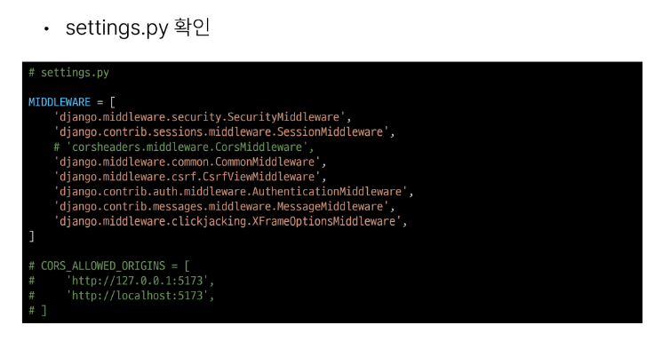
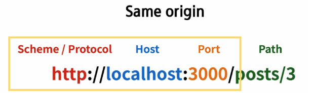

# 08. Vue with DRF 1

# 프로젝트 개요

## Skeleton code 살펴보기

- Model 클래스 확인

- URL 확인

  
  
  
  
  
  
  
  
  

## Vue 프로젝트 안내

- 프로젝트 구조
  

- 살펴보기

  
  
  
  
  
  
  

# 메인페이지 구현

- front와 back 간의 요청과 응답을 통해 하나의 웹 애플리케이션 서비스를 구현하는 과정에 집중할 것

## state 참조 및 출력

- AritcleView 컴포넌트에 ArticleList 컴포넌트와 AritcleListItem 컴포넌트 등록 및 출력하기
- ArticleList와 ArticleListItem은 각각 게시글 출력을 담당

### State 참조 및 출력

- ArticleView route 관련 코드 주석 해제

- App 컴포넌트에 ArticleView 컴포넌트로 이동하는 RouterLink 작성

- ArticleView 컴포넌트에 AritcleList 컴포넌트 등록

- store에 임시 데이터 articles 배열 작성하기

- ArticleList 컴포넌트에서 게시글 목록 출력
- store의 articles 데이터 참조
- v-for를 활용하여 하위 컴포넌트에서 사용할 article 단일 객체 정보를 props로 저달

- ArticleListItem 컴포넌트는 내려 받은 props를 정의 후 출력

- 메인 페이지 게시굴 목록 출력 확인

## state with DRF

DRF 서버에 직접 요청하여 데이터를 응답 받아 store에 저장 후 출력하기

- DRF 서버로 AJAX 요청을 위한 axios 설치 및 관련 코드 작성

- DRF 서버로 요청을 보내고 응답 데이터를 처리하는 getArticles 함수 작성

- ArticleView 컴포넌트가 마운트 될 때 getArticles 함수가 실행되도록 함
- 해당 컴포넌트가 레더링 될 대 항상 최신 게시글 목록을 불러오기 위함

- Vue와 DRF 서버를 모두 실행한 후 응답 데이터 확인
- 에러 발생

- 그런데 DRF 서버 측에서는 문제 없이 응답 했음(200 OK)
- 서버는 응답했으나 브라우저 측에서 거절한 것

- 브라우저가 거절한 이유

# CORS Policy

## CORS

### SOP(Same-origin policy) :

출처 정책

- 어떤 출처(Origin)에서 불러온 문서나 스크립트가 다른 출처에서 가져온 리소스와 상호 작용하는 것을 제한하는 보안 방식
- 웹 애플리케이션의 동메인이 다른 도메인의 리소스에 접그하는 것을 제어하여 사용자의 개인 정보와 데이터의 보안을 보호화고, 잠재적인 보안 위협을 방지
- 잠재적으로 해로울 수 있는 문서를 분리함으로써 공격받을 수 있는 경로를 줄임

### Origin(출처)

- URL의 Protocol, Host, Port를 모두 포함하여 "출처"라고 부름
- Same Origin예시
  - 아래 **세 영역이 일치하는 경우에만 동일 출처(Same-origin)**로 인전

## 동일출처 정책 ( SOP, Same Origin Policy )

출처 ( Origin ) 는 프로토콜 ( http, https ) + 호스트 ( ex. www.naver.com ) + 포트 번호 ( :80 )
이 출처가 다른 경우 -> 다른 출처의 리소스를 요청하는 경우 -> 기본적으로 차단

ex)

1. 웹 사이트에서 자바스크립트를 사용해서 기상청 홈페이지에 있는 날씨 정보를 가져와서 쓰게끔 만들었다.
2. 네이버에 있는 사용자 유저 정보를 자바스크립트를 사용해서 가져오도록 시도
   -> 애초에 **출처 ( Origin ) 이 다른 경우**에는 특정한 요청에 따라서만 가능하도록 정책을 설정
   **교차 출처 ( Cross-Origin ) : 출처가 서로 다른 경우에 대한 통신이 이루어지는 경우를 뜻함**

### CORS plicy의 등장

- 기본적으로 웹 브라우저는 같은 출처(same-origub)에서만 요청하는 것을 허용하며, 다른 출처로의 요청은 보안상의 이유로 차단됨
  - SOP에 의해 다른 출처의 리소스와 상호작용 하는 것이 기본적으로 제한되기 때문
- 하지만 현대 웹 애플리케이션은 다양한 출처로부터 리소스를 요청하는 경우가 많기 때문에 CORS 정책이 필용하게 되었음
- CORS는 웹 서버가 리소스에 대한 서로 다른 출처 간 접근을 허용하도록 선택할 수 잇는 기능을 제공

### CORS (Cross-Origin Resource Sharing) : 교차 출처 리소스 공유

- 특정 출처(Origin)에서 실행중인 웹 애플리케이션이 **다른 출처의 자원에 접근할 수 잇는 권한을 부여**하도록 브라우저에 알려주는 체제
- 만약 다른 출처의 리소스를 가져오기 위해서는 이를 제공하는 서버가 브라우저에게 다른 출처지만 접근해도 된다는 사실을 알려야 함
- CORS policy (교차 출처 리소스 공유 정책)

### CORS policy (교차 출처 리소스 공유 정책)

- 다른 출처에서 온 리소스를 공유하는 것에 대한 정책
- 서버에서 설정되며, 브라우저가 해당 정책을 확인하여 요청이 허용되는지 여부를 결정
- 다른 출처의 리소스를 불러오려면 그 출처에서 올바른 **CORS header를 포함한 응답을 반환**해야 함

기본적으로 동일한 출처(same-origin)의 경우에는 기본적인 통신이 잘 수행되도록 처리  
교차 출처(Cross-Origin)에 대해서는 추가적인 보안 정책을 따라야만 통신이 가능
=> 서버 측에서 추가적인 설정

1. Access-Contol-Allow-Origin 헤더 설정 : 해당 헤더에 허용할 출처(Origin)을 명시 (단, 모두 허락하는 경우에는 \* 로 작성)
2. Access-Control-Allows-Methods 헤더 설정 : 해당 헤더에 허용할 HTTP 메소드(Methods) 명시
3. perflight 요청에 대한 추가 처리 : HEAD 메소드를 총해서 해당 요청을 처리할 수 잇는지 미리 확인을 하는 요청을 브라우저에서 서버로 확인을 보낸다.

-> 결과적으로 해당되는 페이지가 개발 서버를 통해서 전달이 되기 대문에 출처(Origin)

- 백엔드 서버 : Origin:http://127.0.0.1:8000
- 프론트 dev 개발 Origin:http:/localhost:5173
  -> 백엔드와 프론트엔드 사이에 중계자 역할을 수행할 수 있는 무언가를 추가하면 되겠구나!

## Proxy 프록시

- proxy는 네트워크에 대해서 요청/응답을 주고 받을 때 클라이언트 <-> 서버 사이의 중계하는 중계자 역할을 수행
- proxy를 사용하게 되면 요청을 보내거나 응답을 받을 때 origin

### CORS 적용 방법

## CORS Headers 설정

- Django에서는 diango-cors-headers 라이브러리를 활용
- 손쉽게 응답 객체에 CORS header를 추가해주는 라이브러리

### diango-cors-headers 사용하기

- 설치

- 관련 코드 주석 해제

- CORS를 허용할 Vue 프로젝트의 Domain 등록

### CORS 처리 결과

- 메인 페이지에서 DRF 응답 데이터 재확인

- 응답 객체에서 'Access-Control-Allow-Origin' Header 확인

# Article CR 구현

## 전체 게시글 조회

### 전체 게시글 목록 저장 및 출력

- 응답 받은 데이터에서 각 게시글의 구조 확인(id, title, content)

- store에 게시글 목록 데이터 저장

- store에 저장된 게시글 목록 출력 확인
- pinina-plugin-persistedstate에 의해 브라우저의 Local Storage에 저장도미

## 단일 게시글 조회

### 단일 게시글 데이터 출력

- DetailVue 관련 route 주석 해제

- ArticleListItem에 DetailView 컴포넌트로 가기 위한 RouterLink 작성

- DetailView가 마운트 될 때 특정 게시글을 조회하는 AJAX 요청 진행

- 응답 데이터 확인

- 응답 데이터 저장 후 출력

- 결과 확인

## 게시글 작성

- CreateView 관련 route 주석 해제

- ArticleView에 CreateView 컴포넌트로 가기 위한 RouterLink 작성

- v-model을 사용해 사용자 입력 데이터를 양방향 바인딩
- v-modle의 trim 수식어를 사용해 사용자 입력 데이터의 공백을 제거

- 양방햔 바인딩 데이터 입력 확인

- 게시글 생성 요청을 담당하는 createArticle 함수 작성
- 게시글 생성이 성공한다면 Article View 컴포넌트로 이동

- submit 이벤트가 발생하면 createArticle 함수를 호출
- v-on의 prevent 수식어를 사용해 submit 이벤트의 기본 동작 (새로고침) 취소

- 게시글 생성 결과 확인

- 서버 측 DB 확인

