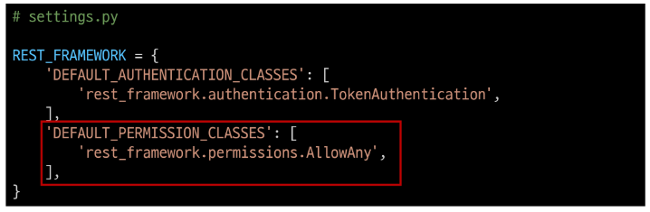
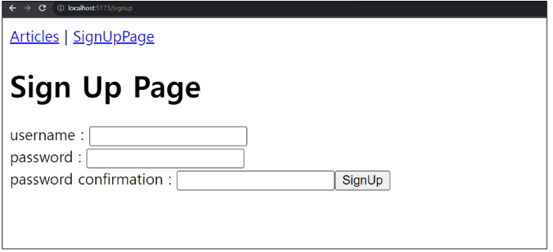
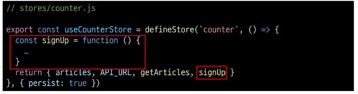

# 09. Vue with DRF

# DRF Authentication

### 사전 준비

- 인증 로직 진행을 위해 User 모델 관련 코드 활성화
- user ForeiginKey 주석 해제

  

1. DB 초기화
   - db.sqlite3 삭제
   - migrations 파일 삭제
2. Migration 과정 재진행

## Authentication : 인증

- 수신된 요청을 해당 요청의 사용자 또는 자격 증명과 연결하는 메커니즘
- 누구인지를 확인하는 과정

### Permeissions : 권한

- 요청에 대한 접근 허용 또는 거부 여부를 결정

### 인증과 권한

- 인증이 먼저 진행되며 수신 요청을 해당 요청의 사용자 또는 해당 요청이 서명된 토큰(token)과 같은 일련의 자격 증명과 연결
- 그런 다음 권한 및 제한 정책(Throttling policies)은 인증이 완료된 해당 자격 증명을 사용하여 요청울 허용해야 하는 지를 결정

### DRF 에서의 인증

- 인증은 항상 view 함수 시작시, 권한 및 제한 확인이 발생하기 전, 다른 코드의 진행히 허용되기 전에 실행됨
- 인증 자체로는 들어오는 요청을 허용하거나 거부할 수 없으며, 단순히 요청에 사용된 자격 증면만 식별한다는 점에 유의

### 승인되지 않은 응답 및 금지된 응답

- 인증되지 않은 요청이 권한ㅇ르 거부하는 경우 해당되는 두 가지 오류 코드가 응답

1. HTTP 401 Unauthorized

- 요청된 리소스에 대한 유효한 인증 자격 증명이 없기 때문에 클라이언트 요청이 완료되지 않았음을 나타냄

2. HTTP 403 Forbidden(Permission Denied)

- 서버에 요청이 전달되었지만, 권한 때문에 거절되었다는 것을 의미
- 401과 다른 점은 서버는 클라이어트가 누구인지 알고 있음

## 인증 체계 설정

### 인증 체계 설정 방법

1. 전역 설정

- DEFAULT_AUTHENTICATION_CLASSES를 사용
- 사용 예시

2. View 함수 별 설정

- authentication_classes 데코레이터를 사용
- 사용 예시

### DRF가 제공하는 인증 체계

1. BasicAuthentication
2. **TokencAuthentication**
3. SessioncAuthentication
4. RemoteUsercAuthentication

### TokencAuthentication

- 간단한 token 기반 HTTP 인증 체계
- 기본 테스크톱 및 모바일 클라이언트와 같은 클라이언트-서버 서절에 적합
- 서버가 사용자에게 토큰을 발급하여 사용자는 매 요청마다 발급받은 토큰을 요청과 함께 보내 인증 과정을 거침

## TokencAuthentication 설정

### TokencAuthentication 적용 과정

1. 인증 클래스 설정

- TokencAuthentication 활성화 코드 주석 해제
- 기본적으로 모든 view 함수가 토큰 기반 인증이 진행될 수 있도록 설정하는 것

2. INSTALED_APPS 추가

- rest_framework.authtoken 주석 해제

3. Migrate 진행

- Migrate

4. 토큰 생성 코드 작성

- accounts/signals.py 주석 해제
- 모든 사용자가 자동으로 생성된 토큰을 가지도록 하는 역할

## Dj-Rest-Auth 라이브러

- 회원가입, 인증(소셜미디어 인증 포함), 비밀번호 재설정, 사용자 세부 정보 검색, 회원 정보 수정 등 다양한 인증 관련 기능을 제공하는 라이브러리

### Dj-Rest-Auth 설치 및 적용

- 설치

- 추가 App 주석 해제

- 추가 URL 주석 해제

### Dj-Rest-Auth

1. 패키지 추가 설치
2. 추가 App 등록
3. 추가 URL 등록
4. Migrate

### Registration 기능 추가

1. 패키지 추가 설치

2. 추가 App 등록

3. 추가 URL 등록

4. Migrate

## Token 발급 및 활용

### Token 발급

- 회원 가입 및 로그인을 진행하여 토큰 발급 테스트하기
- 라이브러리 추가로 인해 작성된 URL 목록 확인

- 회원 가입 진행(하단 회원 가입 form 사용)

- 로그인 진행 (하다 로그인 form 사용)

- 로그인 성공 후 DRF로 부터 발급 받은 Token 확인
- **이제 이 Token을 Vue에서 별도로 저장하여 매 요청마다 함께 보내야 인증됨**

### Token 활용

- 게시글 가정 솨정을 토앻 Token 사용 방법 익히기
- Postman을 활용해 게시글 작성 요청

- Body에 게기글 제목과 내용 입력

- Headers 발급받은 Token 작성 후 요청 성공 확인
  - Key:'Authorization'
  - Value: 'Token 토큰 값'

### 클라이언트가 Token으로 인증 받는 방법

1. '**Authorization**' HTTP Header에 포함
2. 키 앞에는 문자열 '**Token**'이 와야 하며 **공백으로 두 문자열을 구분해야 함**

**발급 받은 Token을 인증이 필요한 요청맏 함께 보내야 함**

## 권한 정책 설정

1. 전역 설정

- DEFAULT_PERMISSONS_CLASSES를 사용
- 사용 예시

- 지정하지 않을 경우 이 설정은 기본적으로 무제한 액세스를 활용

2. View 함수 별 설정

- permission_classes 데코레이터를 사용
- 사용 예시

### DRF가 제공하는 권한 정책

1. **IsAuthenticated**
2. IsAdminUser
3. IsAuthenticatedOrReadOnly

### IsAuthenticated 권한

- 인증되지 않은 사용자에 대한 권한을 거부하고 그렇지 않은 경우 권한을 허용
- 등록된 사용자만 API에 액세스할 수 있도록 하려는 경우에 적합

## IsAuthenticated 권한 설정

### 권한 설정

- DEFAULT_PERMISSION_CLASSES 주석 해제
- 기본적으로 모든 View 함수에 대한 접근을 허용

- permission_classes 관련 코드 주석 해제
- 전체 게시글 조회 및 생성시에만 인증된 사용자만 진행할 수 있도록 권한 설정

### 권한 활용

- 만약 관리자만 전체 게시글 조회가 가능한 권한이 설정되었을 때, 인증된 일반 사용자가 조회 요청을 할 경우 응답 확인하기
- 테스트를 위해 임시르고 관리자 관련 권한 클래스로 변경

- 전체 게시글 조회 요청
- 403 Forbidden

- IsAuthenticated 권한으로 복구

# Authentication with Vue

### 사전 준비

- 정상 작동하던 게시글 전체 조회가 작동하지 않음
- 401 status code 확인
- 게시글 조회 요청 시 인증에 필요한 수단(token)을 보내지 않고 있으므로 게시글 조회가 불가능해진 것

## 회원가입

### 회원가입 로직 구현

- SignUpView route 관련 코드 주석 해제

- App 컴포넌트에 SingUpView 컴포넌트로 이동하는 RouterLink 작성

- 회원가입 form 작성

- 사용자 입력 데이터와 바인딩 될 반응형 변수 작성

- SignUpView 컴포넌트 출력 확인

- 회원가입 요청을 보내기 위한 signUp 함수가 해야 할 일

1. 사용자 입력 데이터를 받아
2. 서버로 회원가입 요청을 보냄

- 컴포넌트에 사용자 입력 데이터를 저장 후 store의 SignUP 함수를 호출하는 함수 작성

- 실제 회원가입 요청을 보내는 store의 signUp 함수 작성

- 회원가입 테스트

- DB 확인

## 로그인

### 로그인 로직 구현

- LoginView route 관련 코드 주석 해제

- App 컴포넌트에 LoginView 컴포넌트로 이동하는 RouterLink 작성

- 로그인 form 작성

- 사용자 입력 데이터와 바인딩 될 반응형 변수 작성

- LoginView 컴포넌트 출력 확인

- 로그인 요청을 보내기 위한 login 함수가 해야할 일

1. 사용자 입력 데이터를 받아
2. 서버로 로그인 요청 및 응답 받는 **토큰 저장**

- 컴포넌트에 사용자 입력 데이터를 저장 후 store의 login 함수를 호출하는 함수 작성

- 실제 로그인 요청을 보내는 store의 login 함수 작성

- 로그인 테스트
- 응답 객체에 발급된 token이 함께 온 것을 확인

## 요청과 토큰

**Token을 store 저장하여 인즈이 필요한 요청마다 함께 보낸다.**

## 토큰 저장 로직 수현

- 반응형 변수 선언 및 토큰 저장

- 다시 로그인 요청 후 저장된 토큰 확인

### 토큰이 필요한 요청

1. 게시글 전체 목록 조회
2. 게시글 작성

### 게시글 전체 목록 조회 with token

- 게시글 전체 목록 조회 요청 함수 getArticles에 token 추가

- 401 응답 메시지가 사라지고 게시글이 출력되는 것을 확인

### 게시글 작성 with token

- 게시글 전체 목록 조회 요청 함수 getArticles에 token 추가

- 게시글 작성 확인

## 인증 여부 확인

### 사용자의 인증(로그인) 여부에 따른 추가 기능 구현

1. 인증되지 않은 사용자 - 메인 페이지 접근 제한
2. 인증된 사용자 - 회원가입 및 로그인 페이지에 접근 제한

### 인증 상태 여부를 나타낼 속성 값 지정

- token 여부에 따라 로그인 상태를 Boolean 값으로 나타낼 isLogin 변수 작성
- computed를 활용해 token 값이 변할 때만 계산하도록 함

### 1. 인증 되지 않은 사용자는 메인 페이지 접근 제한

- 전역 네비게이션 가드 beforeEach를 활용해 다른 주소에서 메인 페이지로 이동 시 인증 되지 않은 사용자라면 로그인 페이지로 이동시키기

- 브라우저 local storage에서 token을 삭제 후 메인 페이지 접속 시도

### 2. 인증된 사용자는 회원가입과 로그인 페이지에 접근 제한

- 다른 주소에서 회원가입 또는 로그인 페이지로 이동 시 이미 인증된 사용자라면 메인 페이지로 이동시키기

- 로그인 후 회원가입, 로그인 페이지 접속 시도

## 기타 기능 구현

### 자연스러운 애플리케이션을 위한 기타 기능 구현

1. 로그인 성공 후 자동으로 메인 페이지로 이동하기

2. 회원가입 성공 후 자동으로 로그인까지 진행하기

# 참고

### Dinagi Signals

- 이벤트 알림 시스템
- 애플리케이션 내에서 특정 이벤트가 발생할 때, 다른 부분에게 신호를 보내어 이벤트가 발생했음을 알릴 수 있음
- 주로 모델의 데이터 변경 또는 저장, 삭제와 같은 작업에 반응하여 추가적인 로직을 실행하고자 할 때 사용
  - 예를 들어, 사용자가 새로운 게시글을 작성할 때마다 특정 작업(예: 이메일 알림 보내기)을 수행하려는 경우

### Vite에서 환경변수를 사용하는 법

**환경 변수 (environment variable)**

- 애플리케이션의 설정이나 동작을 제어하기 위해 사용되는 변수

### 환경 변수의 목적

- 개발, 테스트 및 프로적션 환경에서 다르게 설정되어야 하는 설정 값이나 민감한 정보(ex. API Key)를 포함
- 환경 변수를 사용하여 애플리케이션의 설정을 관리하면, 다양한 환경에서 일관된 동작을 유지하면서 필요에 따라 변수를 쉽게 변경할 수 있음
- 보안적인 이슈를 피하고, 애플리케이션을 다양한 환경에 대응하기 쉽게 만들어줌

### 참고 자료

- Awesome Vue.js
- [https://github.com/vuejs/awesome-vue](https://github.com/vuejs/awesome-vue)
- [https://awesome-vue.js.org/](https://awesome-vue.js.org/)

- Vuetify
- [https://vuetifyjs.com/en/](https://vuetifyjs.com/en/)
