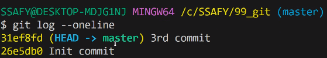
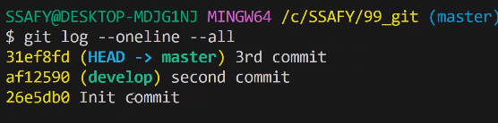
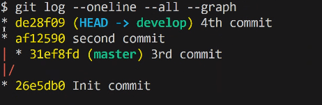
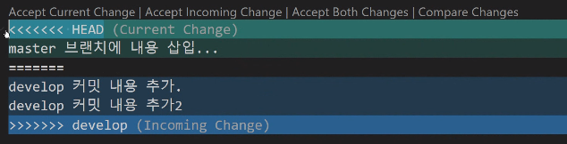
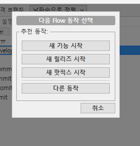
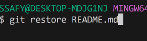
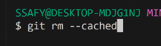
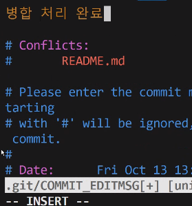
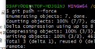

# Git

Branch (나뭇가지)
1. 브랜치는 독립 공간을 형성해주는 역할
2. 브랜치마다 독립적으로 체계적인 개발을 할 수 있음
3. 브랜치를 옮겨가면서 개발할 수 있다는 장점이 있음

깃 브랜치 확인하는 명령어
> git branch

> git branch -r : remote 에서도 구할 수 잇음

> git switch : 브랜치를 옮길 수 잇음

master 브랜치에 내용 삽입

ㅁ모든 브랜치

마스터 브랜치랑 합하고 싶음

Merge(병ㅇ합)
분기 브랜치를 하나로 병합
* 합칠 메인 브랜치로 switch를 먼저하고 그 후에 병합

git merge develop

helo

깃플로우 - 확인 : 초기화 하고나면

이런 화면 뜸

파일명을 쓰면 그것만 되돌리고
안적으면 다 날라감

unstaged 한 파일들 날려버려 ~

insert키누르면 수정해서 변경할 수 잇음

esc 누르면 ionsert 모드에서 나올 수 잇음
:wq

git push -- force
강제로 덮어쓰기해서 올려버림

이전 커밋으로 돌아가기

reset : 특정 커밋 위치로 내용을 되돌린다.
-> 특정 커밋으로 되돌아가는데, 기존 커밋들은 모두 사라진다.

1. --soft: //, 이후 기존 commit된 파일들은 staging area로 보낸다.

2. --mixed: //, 기존 commit된 파일들은  working directoy로 보낸다,

3. --hard: // , 기존 commiut 모두 같이 삭제(되돌)린다.